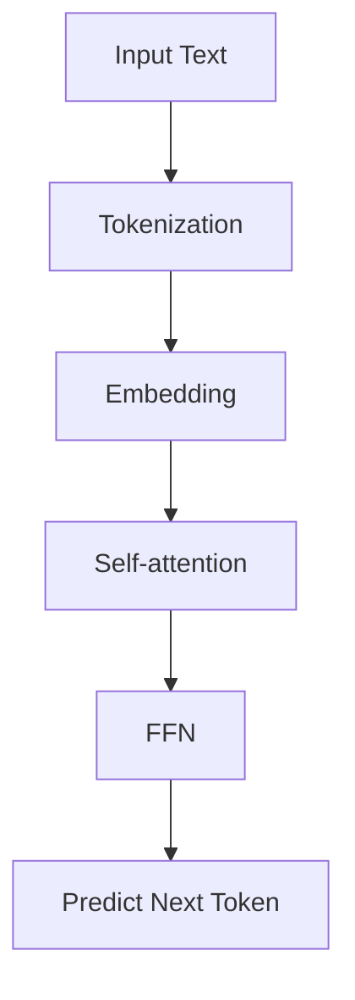
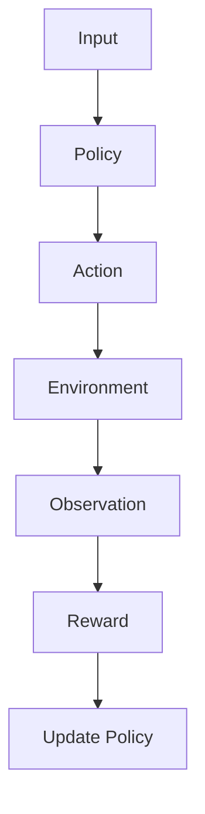
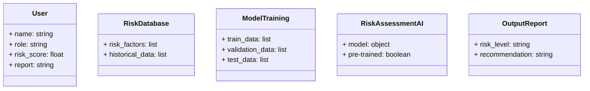
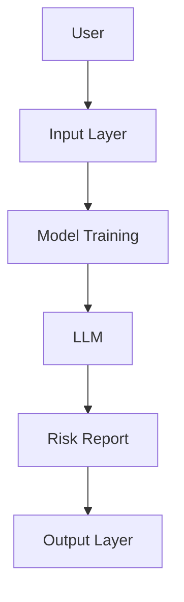
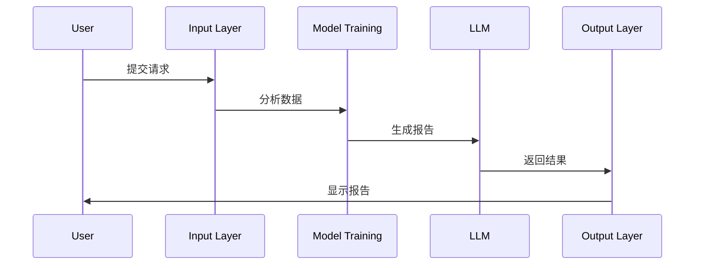

                 


# 智能风险评估AI Agent：LLM在复杂决策中的应用

## 关键词：智能风险评估，AI Agent，大语言模型，复杂决策，LLM

## 摘要：本文探讨了智能风险评估AI Agent在复杂决策中的应用，详细介绍了其背景、核心概念、算法原理、系统架构设计及项目实战。通过分析LLM在风险评估中的优势，结合实际案例，展示如何利用AI技术提升决策的准确性和效率。文章还提供了最佳实践和未来研究方向的建议。

---

# 第一部分: 智能风险评估AI Agent的背景与核心概念

## 第1章: 智能风险评估AI Agent的背景与问题描述

### 1.1 智能风险评估的背景介绍

#### 1.1.1 风险评估的传统方法与局限性
传统风险评估方法依赖人工分析，存在效率低、主观性强、覆盖范围有限等问题。例如，银行贷款审批中，传统方法依赖信贷员的经验判断，容易受到主观因素影响，且难以处理海量数据。

#### 1.1.2 AI技术在风险评估中的应用潜力
AI技术，特别是大语言模型（LLM），能够快速处理大量非结构化数据，提供自动化、个性化的风险评估。例如，在金融领域，LLM可以分析新闻、社交媒体数据，预测市场风险。

#### 1.1.3 大语言模型（LLM）的独特优势
LLM具备强大的文本理解和生成能力，能够从海量文本数据中提取关键信息，生成风险评估报告。例如，医疗领域中，LLM可以分析病历数据，辅助医生进行风险评估。

### 1.2 问题背景与问题描述

#### 1.2.1 复杂决策场景中的风险评估需求
在金融、医疗、法律等领域，复杂决策场景中存在大量不确定性，传统方法难以应对。例如，投资决策中需要考虑市场波动、政策变化等多因素。

#### 1.2.2 LLM在复杂决策中的角色定位
LLM作为智能风险评估AI Agent，能够提供实时、动态的风险评估，帮助决策者做出更明智的决策。例如，在法律领域，LLM可以分析precedent案例，预测案件风险。

#### 1.2.3 智能风险评估AI Agent的目标与意义
目标是通过AI技术提升风险评估的效率和准确性，降低决策风险。意义在于推动智能化决策支持系统的发展，提高各行业的决策能力。

### 1.3 问题解决与边界定义

#### 1.3.1 智能风险评估AI Agent的核心问题解决
解决传统风险评估方法的效率低、主观性强等问题，提供自动化、动态化、个性化的风险评估服务。

#### 1.3.2 问题的边界与外延
边界包括仅处理文本数据，不涉及图像或视频数据；外延包括扩展到多模态数据处理。

#### 1.3.3 核心要素与组成结构
核心要素包括LLM模型、风险评估算法、数据处理模块等。

### 1.4 本章小结

---

## 第2章: 智能风险评估AI Agent的核心概念与联系

### 2.1 智能风险评估AI Agent的原理

#### 2.1.1 LLM的基本原理与工作机制
LLM通过预训练和微调，能够理解上下文并生成相关文本。例如，使用Transformer架构，通过自注意力机制捕捉文本中的关键信息。

#### 2.1.2 智能风险评估的核心算法
包括文本相似度计算、情感分析、实体识别等技术。例如，使用余弦相似度计算风险事件的相关性。

#### 2.1.3 AI Agent的决策逻辑
基于LLM生成的风险报告，结合实时数据，生成最终的风险评估结果。例如，动态调整风险等级。

### 2.2 核心概念对比与ER实体关系图

#### 2.2.1 不同风险评估方法的对比分析
| 方法 | 优点 | 缺点 |
|------|------|------|
| 传统统计方法 | 简单易懂 | 易受主观因素影响 |
| LLM驱动方法 | 高效准确 | 需要大量数据训练 |

#### 2.2.2 实体关系图（ER图）展示

```mermaid
erDiagram
    actor User
    actor DecisionMaker
    actor RiskDatabase
    actor ExternalData
    actor ModelTraining
    actor RiskAssessmentAI
    actor OutputReport
    actor FinalDecision
    actor Review
    actor Feedback
    actor PerformanceTracking
    actor Optimization
```


---

# 第二部分: 智能风险评估AI Agent的算法原理

## 第3章: 大语言模型（LLM）的算法原理

### 3.1 LLM的基本算法流程

#### 3.1.1 监督微调（Supervised Fine-tuning）


#### 3.1.2 强化学习（Reinforcement Learning）


#### 3.1.3 混合策略（Hybrid Strategies）
结合监督微调和强化学习，优化模型性能。

### 3.2 风险评估模型的构建

#### 3.2.1 数据预处理
```python
import pandas as pd
data = pd.read_csv('risk_data.csv')
data.dropna(inplace=True)
```

#### 3.2.2 特征提取
```python
from transformers import AutoTokenizer, AutoModel
tokenizer = AutoTokenizer.from_pretrained('bert-base-uncased')
model = AutoModel.from_pretrained('bert-base-uncased')
```

#### 3.2.3 模型训练
```python
from torch import nn
class RiskModel(nn.Module):
    def __init__(self):
        super().__init__()
        self.bert = AutoModel.from_pretrained('bert-base-uncased')
        self.dropout = nn.Dropout(0.1)
        self.classifier = nn.Linear(768, 1)
```

### 3.3 数学模型与公式

#### 3.3.1 概率分布
$$P(y|x) = \frac{\exp(s)}{\sum \exp(s)}$$

#### 3.3.2 损失函数
$$\text{Loss} = -\sum y \log p(y|x)$$

---

## 第4章: 智能风险评估AI Agent的数学模型与公式

### 4.1 LLM的数学基础

#### 4.1.1 概率分布
$$P(y|x) = \frac{\exp(s)}{\sum \exp(s)}$$

#### 4.1.2 损失函数
$$\text{Loss} = -\sum y \log p(y|x)$$

#### 4.1.3 注意力机制
$$\text{Attention}(Q,K,V) = \text{softmax}\left(\frac{QK^T}{\sqrt{d_k}}\right)V$$

### 4.2 风险评估模型的数学公式

#### 4.2.1 风险评分计算
$$R(x) = \sum \alpha_i x_i + \beta$$

#### 4.2.2 风险等级划分
$$\text{Level}_k = \begin{cases}
    \text{低风险} & k=1 \\
    \text{中风险} & k=2 \\
    \text{高风险} & k=3
\end{cases}$$

---

# 第三部分: 智能风险评估AI Agent的系统分析与架构设计

## 第5章: 系统分析与架构设计方案

### 5.1 问题场景介绍

#### 5.1.1 金融投资领域
例如，分析市场趋势，评估投资风险。

#### 5.1.2 医疗诊断领域
例如，分析病历数据，评估治疗风险。

### 5.2 项目介绍

#### 5.2.1 项目目标
构建一个基于LLM的智能风险评估系统。

#### 5.2.2 项目范围
涵盖数据采集、模型训练、系统部署等环节。

### 5.3 系统功能设计

#### 5.3.1 领域模型


#### 5.3.2 系统架构设计


#### 5.3.3 系统接口设计


---

## 第6章: 项目实战

### 6.1 环境安装

#### 6.1.1 安装Python
```bash
python --version
pip install --upgrade pip
```

#### 6.1.2 安装依赖库
```bash
pip install numpy pandas scikit-learn transformers torch
```

### 6.2 系统核心实现

#### 6.2.1 数据加载与预处理
```python
import pandas as pd
data = pd.read_csv('risk_data.csv')
data = data.dropna()
```

#### 6.2.2 模型训练
```python
from transformers import AutoTokenizer, AutoModel
tokenizer = AutoTokenizer.from_pretrained('bert-base-uncased')
model = AutoModel.from_pretrained('bert-base-uncased')
```

#### 6.2.3 风险评估
```python
def assess_risk(text):
    inputs = tokenizer(text, return_tensors='np')
    outputs = model(**inputs)
    return outputs
```

### 6.3 实际案例分析

#### 6.3.1 金融领域案例
分析市场新闻，评估投资风险。

#### 6.3.2 医疗领域案例
分析病历数据，评估治疗风险。

### 6.4 项目小结

---

## 第7章: 最佳实践与未来展望

### 7.1 最佳实践

#### 7.1.1 数据质量
确保数据的准确性和完整性。

#### 7.1.2 模型解释性
提高模型的可解释性，便于用户理解。

#### 7.1.3 伦理问题
确保AI决策的透明性和公平性。

### 7.2 小结

### 7.3 注意事项

### 7.4 拓展阅读

---

# 作者：AI天才研究院 & 禅与计算机程序设计艺术

