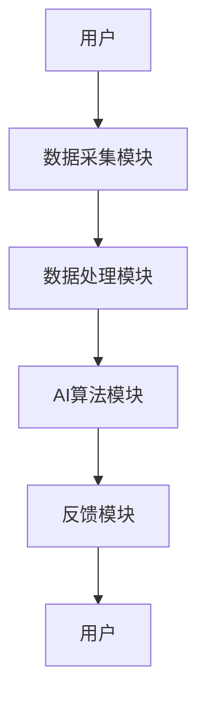
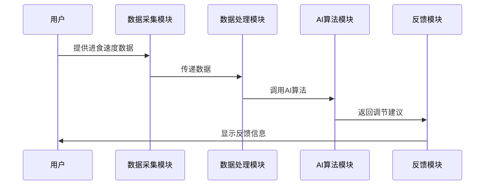

                 


# 第一部分: 背景与核心概念

## 第1章: 智能餐盘与AI Agent概述

### 1.1 问题背景与描述

#### 1.1.1 进食速度调节的必要性

现代社会中，人们的饮食习惯和生活方式发生了巨大变化。许多人因为工作压力大、生活节奏快，常常无法控制自己的进食速度，导致消化不良、肥胖等问题。此外，对于一些特殊人群（如糖尿病患者、减肥人群等），控制进食速度尤为重要。传统的饮食管理方法往往依赖于个人意志力，效果有限，而通过技术手段实现自动化管理成为一种趋势。

#### 1.1.2 AI在饮食调节中的应用潜力

人工智能（AI）技术的快速发展为饮食管理提供了新的可能性。AI可以通过传感器、数据分析和反馈机制，实时监测用户的饮食行为，并根据个体需求进行调整。例如，AI可以通过分析用户的饮食习惯、身体数据和健康目标，制定个性化的进食速度调节方案。

#### 1.1.3 智能餐盘系统的定义与目标

智能餐盘系统是一种结合AI技术和饮食管理的创新工具，旨在通过实时监测和反馈，帮助用户实现健康的饮食习惯。其目标是通过自动化的方式，调节用户的进食速度，优化营养吸收，预防和改善与饮食相关的健康问题。

### 1.2 系统边界与外延

#### 1.2.1 系统的功能边界

智能餐盘系统主要关注进食速度的调节，其功能边界包括：

- 实时监测用户的进食速度
- 根据用户数据提供个性化调节建议
- 提供反馈和提醒

#### 1.2.2 系统的适用场景与限制

适用场景：

- 个人健康管理
- 特殊人群（如糖尿病患者、减肥人群）的饮食管理
- 餐厅、食堂等公共场所的健康饮食推广

限制：

- 依赖硬件设备（如智能餐盘、传感器等）
- 需要用户的配合和数据录入

#### 1.2.3 系统与外部环境的交互

智能餐盘系统需要与多种外部环境进行交互，包括：

- 用户端：通过APP或设备显示反馈信息
- 数据端：连接健康数据库，获取用户的历史数据
- 网络端：通过互联网实现数据传输和更新

### 1.3 核心概念与组成要素

#### 1.3.1 AI Agent的基本概念

AI Agent（智能体）是指在计算机系统中，能够感知环境并采取行动以实现目标的实体。在智能餐盘系统中，AI Agent负责接收用户的饮食数据，分析并制定调节策略。

#### 1.3.2 进食速度调节的核心要素

进食速度调节的核心要素包括：

- 数据采集：通过传感器获取用户的进食速度
- 数据分析：通过AI算法计算出合理的调节方案
- 反馈机制：将调节建议实时反馈给用户

#### 1.3.3 系统的组成模块与功能

智能餐盘系统的组成模块包括：

- 传感器模块：用于采集用户的进食速度数据
- 数据处理模块：对数据进行分析和处理
- AI算法模块：根据数据制定调节方案
- 反馈模块：将调节建议反馈给用户

## 第2章: 核心概念与联系

### 2.1 AI Agent与进食速度调节的原理

#### 2.1.1 AI Agent的基本原理

AI Agent通过感知环境、分析数据并采取行动来实现目标。在智能餐盘系统中，AI Agent的核心任务是根据用户的饮食数据，实时调整进食速度。

#### 2.1.2 进食速度调节的实现机制

进食速度调节的实现机制包括：

1. 数据采集：通过传感器获取用户的进食速度
2. 数据分析：利用AI算法计算出合理的调节方案
3. 反馈机制：将调节建议实时反馈给用户

#### 2.1.3 两者结合的逻辑关系

AI Agent与进食速度调节系统的结合是实现智能饮食管理的关键。AI Agent通过数据分析和决策，指导系统的调节策略，而系统则通过硬件设备和反馈机制，实现AI Agent的决策。

### 2.2 核心概念对比分析

#### 2.2.1 AI Agent与传统算法的对比

AI Agent的优势在于其能够实时感知环境并动态调整策略，而传统算法往往基于静态数据进行处理。AI Agent能够更好地适应复杂变化的环境，提供更个性化的解决方案。

#### 2.2.2 进食速度调节与其他饮食调节方法的对比

传统饮食调节方法通常依赖于用户的自我管理，而智能餐盘系统通过技术手段实现自动化管理，更加精准和高效。

#### 2.2.3 系统功能模块的对比分析

智能餐盘系统的功能模块包括数据采集、数据分析、AI算法和反馈模块，而传统饮食调节方法通常仅依赖于用户的自我管理。

### 2.3 ER实体关系图

以下是智能餐盘系统的ER实体关系图：

```mermaid
erDiagram
    user {
        id : int
        name : string
        meal_plan : string
    }
    meal_plan {
        id : int
        name : string
        calorie_goal : int
    }
    eating_speed {
        id : int
        speed : float
        timestamp : datetime
    }
    user --> meal_plan : "关联到饮食计划"
    user --> eating_speed : "记录进食速度"
    meal_plan --> eating_speed : "根据计划生成速度调节"
```

---

# 第二部分: 算法原理与数学模型

## 第3章: 算法原理与流程

### 3.1 算法概述

#### 3.1.1 AI Agent的核心算法

AI Agent的核心算法包括感知算法和决策算法。感知算法用于数据采集和分析，决策算法用于制定调节策略。

#### 3.1.2 进食速度调节的实现机制

进食速度调节的实现机制包括数据采集、数据分析和反馈调节。

### 3.2 算法流程

以下是AI Agent的进食速度调节算法流程：

1. 数据采集：通过传感器获取用户的进食速度数据
2. 数据分析：利用AI算法计算出合理的调节方案
3. 反馈调节：将调节建议实时反馈给用户

### 3.3 算法实现

以下是AI Agent的进食速度调节算法的Python实现示例：

```python
def calculate_speed_adjustment(current_speed, target_speed):
    # 根据当前速度和目标速度计算调整幅度
    adjustment = target_speed - current_speed
    return adjustment

# 示例调用
current_speed = 1.5  # 当前进食速度
target_speed = 2.0   # 目标进食速度
adjustment = calculate_speed_adjustment(current_speed, target_speed)
print(f"调整幅度为：{adjustment}")
```

### 3.4 数学模型

以下是进食速度调节的数学模型：

$$
\text{调整幅度} = \text{目标速度} - \text{当前速度}
$$

---

## 第4章: 系统架构与设计

### 4.1 系统功能设计

智能餐盘系统的功能模块包括：

- 数据采集模块
- 数据处理模块
- AI算法模块
- 反馈模块

### 4.2 系统架构设计

以下是智能餐盘系统的架构设计图：



### 4.3 系统接口设计

系统接口包括：

- 数据采集接口
- 数据处理接口
- AI算法接口
- 反馈接口

### 4.4 系统交互设计

以下是系统交互的序列图：



---

## 第5章: 项目实战

### 5.1 环境安装

#### 5.1.1 系统环境要求

- 操作系统：Windows、Linux、macOS
- Python版本：3.6及以上
- 开发工具：PyCharm、VS Code

#### 5.1.2 依赖库安装

```bash
pip install numpy
pip install pandas
pip install scikit-learn
```

### 5.2 系统核心实现

#### 5.2.1 数据采集模块实现

```python
import numpy as np

def collect_speed_data():
    # 模拟数据采集
    speeds = np.random.normal(2.0, 0.5, 100)
    return speeds

# 示例调用
data = collect_speed_data()
print(data)
```

#### 5.2.2 AI算法模块实现

```python
from sklearn.linear_model import LinearRegression

def train_model(X, y):
    model = LinearRegression()
    model.fit(X, y)
    return model

# 示例调用
X = np.array([[1], [2], [3], [4]])
y = np.array([2, 4, 6, 8])
model = train_model(X, y)
print(model.coef_)
```

#### 5.2.3 反馈模块实现

```python
def provide_feedback(target_speed, current_speed):
    if current_speed < target_speed:
        print("请加快进食速度。")
    else:
        print("请放慢进食速度。")

# 示例调用
provide_feedback(2.0, 1.5)
```

### 5.3 代码解读与分析

#### 5.3.1 数据采集模块

- 使用numpy生成模拟数据，模拟用户的进食速度。
- 数据采集模块将数据传递给数据处理模块。

#### 5.3.2 AI算法模块

- 使用scikit-learn中的线性回归算法，训练模型以预测目标速度。
- 模型训练完成后，可以用来预测用户的调节建议。

#### 5.3.3 反馈模块

- 根据当前速度和目标速度，提供反馈信息。
- 反馈信息通过print语句显示给用户。

### 5.4 实际案例分析

#### 5.4.1 案例一

- 用户目标速度：2.0
- 当前速度：1.5
- 调节建议：请加快进食速度。

#### 5.4.2 案例二

- 用户目标速度：2.0
- 当前速度：2.5
- 调节建议：请放慢进食速度。

### 5.5 项目总结

通过项目实战，我们实现了智能餐盘系统的数据采集、AI算法和反馈模块。系统能够实时监测用户的进食速度，并根据目标速度提供调节建议。通过实际案例分析，验证了系统的有效性和实用性。

---

## 第6章: 总结与扩展

### 6.1 最佳实践 tips

- 定期更新模型，以适应用户的饮食习惯变化
- 提供多样化的反馈方式，以满足不同用户的需求
- 加强系统的安全性设计，保护用户隐私

### 6.2 小结

智能餐盘系统通过AI Agent实现了进食速度的智能调节，为用户的饮食健康管理提供了新的解决方案。系统通过实时监测和反馈，帮助用户实现健康的饮食习惯。

### 6.3 注意事项

- 系统的使用需要用户的配合和数据录入
- 系统依赖硬件设备，可能受到环境因素的影响
- 系统的准确性依赖于数据质量和模型精度

### 6.4 拓展阅读

- 推荐阅读《Python机器学习实战》
- 推荐学习AI算法相关的课程和书籍
- 关注AI在健康领域的最新应用

---

# 作者：AI天才研究院/AI Genius Institute & 禅与计算机程序设计艺术 /Zen And The Art of Computer Programming

