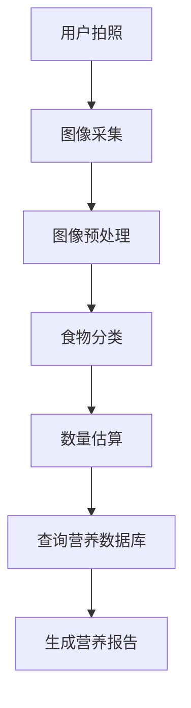
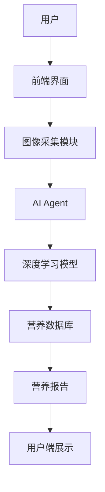
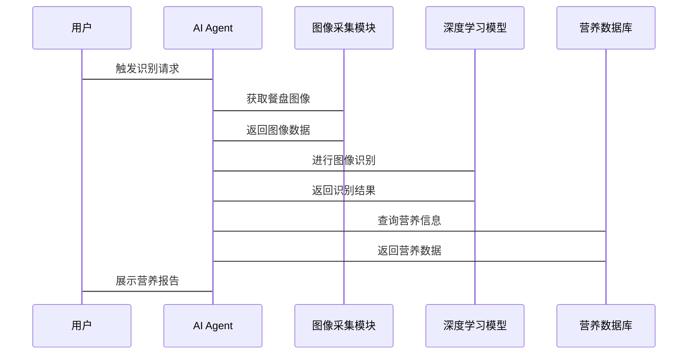

                 


# 智能餐盘：AI Agent的食物识别与营养分析

---

## 关键词  
AI Agent, 食物识别, 营养分析, 图像识别, 深度学习, 系统架构  

---

## 摘要  
本文详细探讨了智能餐盘系统中AI Agent在食物识别与营养分析中的应用。通过背景介绍、核心概念分析、算法原理阐述、系统架构设计以及项目实战，全面解析了智能餐盘的技术实现路径。文章结合理论与实践，为读者提供了一套完整的解决方案，并展望了未来的发展方向。

---

## 正文  

---

## 第一部分：背景与核心概念  

### 第1章：智能餐盘的背景与问题描述  

#### 1.1 智能餐盘的背景  
随着人工智能技术的快速发展，智能餐饮设备逐渐成为现代生活中不可或缺的一部分。智能餐盘作为一种创新的餐饮辅助工具，通过AI技术实现了对食物的自动识别与营养分析，为用户提供了智能化的餐饮体验。  

#### 1.2 问题描述  
传统餐饮过程中，用户需要手动记录食物摄入情况，这种方式不仅效率低下，而且容易出错。此外，营养分析需要专业知识，普通用户难以自行完成。因此，如何利用AI技术实现食物的自动识别与营养分析，成为智能餐盘设计的核心问题。  

#### 1.3 问题解决与边界  
AI Agent（人工智能代理）通过图像识别和深度学习技术，能够自动识别餐盘中的食物种类和数量，并结合营养数据库进行分析，为用户提供个性化的饮食建议。智能餐盘的设计边界包括食物种类的识别范围、营养分析的精度以及系统的稳定性等。  

---

### 第2章：AI Agent与食物识别的核心概念  

#### 2.1 AI Agent的基本原理  
AI Agent是一种能够感知环境并执行任务的智能实体。在智能餐盘中，AI Agent负责图像采集、特征提取、分类识别以及营养分析等任务。  

#### 2.2 食物识别的核心原理  
食物识别是基于图像识别技术，通过深度学习模型对餐盘中的食物进行分类和数量估算。AI Agent通过摄像头采集图像，利用预训练的模型实现食物的自动识别。  

#### 2.3 核心概念对比与ER图  
以下是AI Agent与传统图像识别的对比：  

| **对比维度** | **AI Agent**                | **传统图像识别**             |  
|---------------|------------------------------|-----------------------------|  
| **核心功能** | 自动识别与营养分析          | 图像分类与目标检测          |  
| **应用场景** | 智能餐盘、健康管理          | 工业检测、安防监控          |  
| **优势**     | 高精度、实时性强           | 成本低、易于部署            |  

以下是系统实体关系图：  

```mermaid
erd
    左键点击餐盘       -> AI Agent：触发识别请求
    AI Agent          -> 图像采集模块：获取餐盘图像
    图像采集模块      -> 图像预处理模块：调整图像大小、归一化
    图像预处理模块    -> 深度学习模型：识别食物种类和数量
    深度学习模型      -> 营养数据库：查询食物的营养信息
    营养数据库        -> AI Agent：生成营养分析报告
    AI Agent          -> 用户端：展示结果
```

---

## 第二部分：核心技术与原理  

### 第3章：算法原理与数学模型  

#### 3.1 图像识别算法原理  
图像识别是智能餐盘的核心技术之一。基于深度学习的图像识别算法，尤其是卷积神经网络（CNN），能够高效地实现食物分类与识别。  

以下是CNN的前向传播过程：  

$$ y = f(Wx + b) $$  

其中，$W$ 是权重矩阵，$x$ 是输入图像，$b$ 是偏置项，$f$ 是激活函数（如ReLU）。  

#### 3.2 营养分析算法原理  
营养分析基于食物种类和数量的识别结果，结合营养数据库进行计算。以下是营养分析的流程图：  



#### 3.3 核心代码实现  
以下是基于TensorFlow的图像识别代码示例：  

```python
import tensorflow as tf
from tensorflow.keras import layers

# 数据预处理
def preprocess_image(image_path):
    image = tf.io.read_file(image_path)
    image = tf.image.decode_jpeg(image, channels=3)
    image = tf.image.resize(image, (224, 224))
    image = tf.keras.applications.mobilenet_v2.preprocess_input(image)
    return image

# 模型定义
model = tf.keras.Sequential([
    layers.Conv2D(32, (3,3), activation='relu', input_shape=(224, 224, 3)),
    layers.MaxPooling2D((2,2)),
    layers.Conv2D(64, (3,3), activation='relu'),
    layers.MaxPooling2D((2,2)),
    layers.Flatten(),
    layers.Dense(128, activation='relu'),
    layers.Dense(10, activation='softmax')
])

# 模型训练
model.compile(optimizer='adam', loss='sparse_categorical_crossentropy', metrics=['accuracy'])
model.fit(x_train, y_train, epochs=5, batch_size=32)
```

---

### 第4章：系统分析与架构设计  

#### 4.1 系统架构设计  
以下是智能餐盘系统的架构图：  



#### 4.2 接口设计与交互流程  
以下是系统交互流程图：  



---

## 第三部分：项目实战  

### 第5章：项目实战  

#### 5.1 环境搭建  
以下是项目环境搭建步骤：  
1. 安装Python 3.8及以上版本  
2. 安装TensorFlow、Keras、OpenCV等依赖库  
3. 下载并准备食物图像数据集  
4. 安装Mermaid和LaTeX工具  

#### 5.2 核心代码实现  
以下是核心代码实现：  

```python
import cv2
import numpy as np
from tensorflow.keras.models import load_model

# 加载预训练模型
model = load_model('food_classifier.h5')

# 图像预处理
def preprocess_image(image_path):
    image = cv2.imread(image_path)
    image = cv2.resize(image, (224, 224))
    image = image / 255.0
    return image

# 食物识别
def recognize_food(image_path):
    preprocessed_image = preprocess_image(image_path)
    prediction = model.predict(np.array([preprocessed_image]))
    predicted_class = np.argmax(prediction[0])
    return predicted_class

# 营养分析
def analyze_nutrition(food_class):
    # 查询营养数据库
    # 返回营养报告
    pass
```

#### 5.3 实际案例分析  
以下是实际案例分析：  
假设用户上传了一张包含鸡胸肉、西兰花和米饭的餐盘图像，系统会自动识别出三种食物，并计算出每种食物的热量、蛋白质、碳水化合物等营养成分，生成个性化的饮食建议。  

---

## 第四部分：最佳实践  

### 第6章：最佳实践  

#### 6.1 小结  
智能餐盘通过AI Agent实现了食物识别与营养分析的智能化，为用户提供了高效、便捷的饮食管理工具。  

#### 6.2 注意事项  
- 数据隐私保护：确保用户数据的安全性  
- 模型优化：提高识别精度和运行效率  
- 系统稳定性：确保在复杂环境下稳定运行  

#### 6.3 拓展阅读  
- 《深度学习入门：基于Python》  
- 《AI系统设计与实现》  

---

## 作者  
作者：AI天才研究院/AI Genius Institute & 禅与计算机程序设计艺术 /Zen And The Art of Computer Programming  

---

**全文完。**

