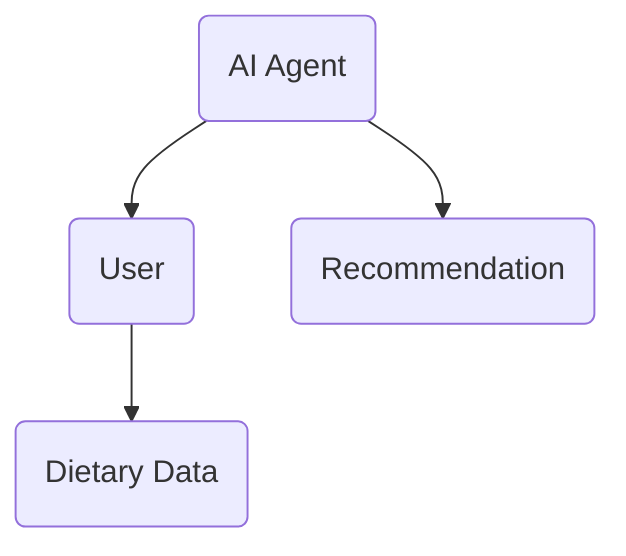
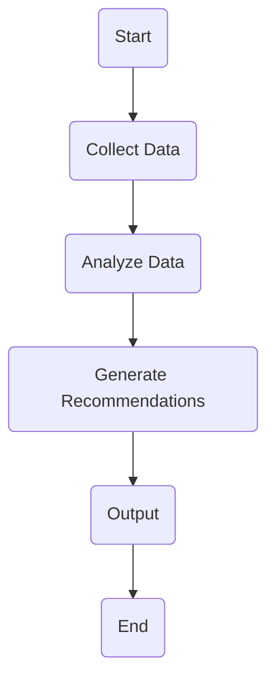
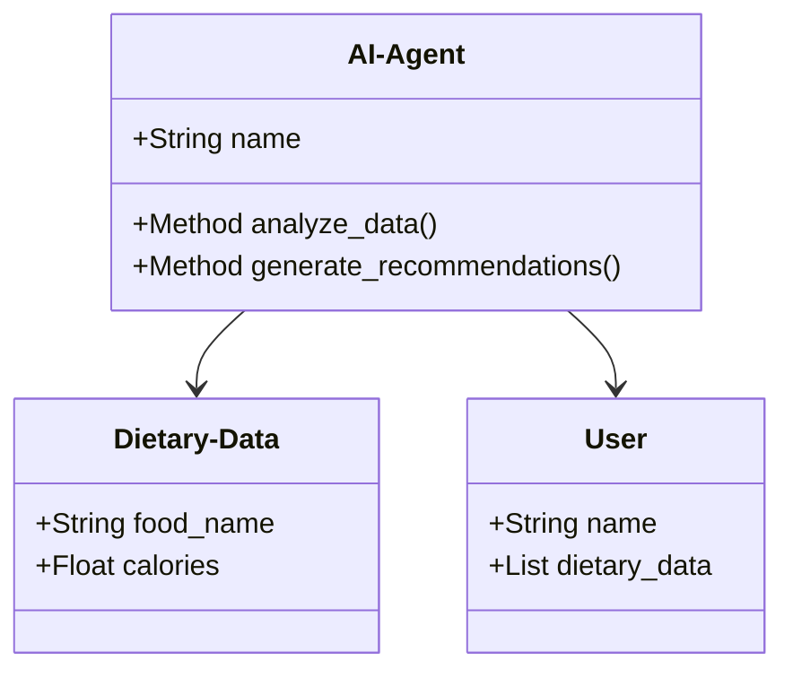
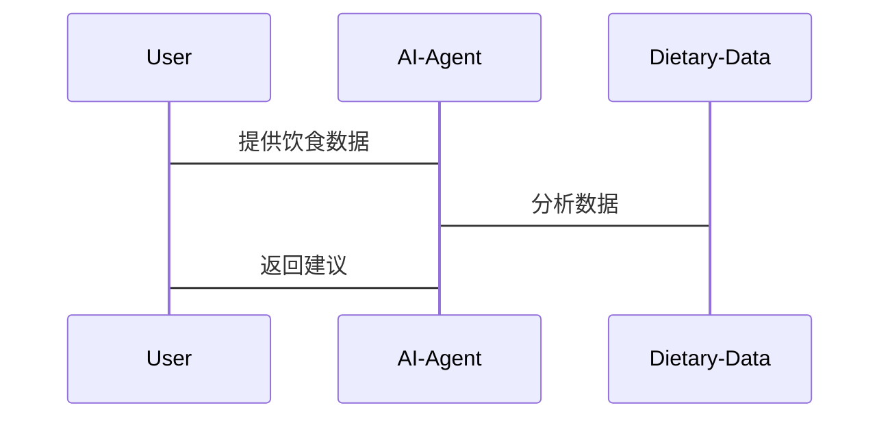

                 


# 智能餐盘：AI Agent的饮食平衡建议

## 关键词：智能餐盘, AI Agent, 饮食平衡, 人工智能, 健康管理

## 摘要：本文探讨AI Agent在饮食管理中的应用，详细介绍智能餐盘的设计与实现，涵盖背景、原理、算法、系统架构及项目实战，为读者提供全面的技术解析。

---

## 目录

1. **背景介绍**
   - 1.1 问题背景
   - 1.2 问题描述
   - 1.3 问题解决
   - 1.4 概念结构与核心要素

2. **核心概念与联系**
   - 2.1 AI Agent的核心原理
   - 2.2 核心概念对比表
   - 2.3 实体关系图

3. **算法原理**
   - 3.1 算法概述
   - 3.2 算法流程图
   - 3.3 算法代码实现

4. **系统分析与架构设计**
   - 4.1 问题场景
   - 4.2 系统功能设计
   - 4.3 系统架构图
   - 4.4 系统接口设计
   - 4.5 系统交互流程

5. **项目实战**
   - 5.1 环境安装
   - 5.2 核心代码实现
   - 5.3 代码解读与分析
   - 5.4 案例分析

6. **最佳实践**
   - 6.1 小结
   - 6.2 注意事项
   - 6.3 拓展阅读

7. **附录**
   - 7.1 参考文献
   - 7.2 工具资源

---

## 1. 背景介绍

### 1.1 问题背景

随着生活节奏的加快，人们的饮食习惯逐渐不规律，导致健康问题频发。AI技术在健康管理中的应用为解决这一问题提供了新思路。

### 1.2 问题描述

饮食失衡导致肥胖、糖尿病等问题，传统管理方法依赖手动记录或营养师，效率低且不够个性化。

### 1.3 问题解决

AI Agent通过智能餐盘实时监测饮食，分析数据并提供建议，实现个性化管理。

### 1.4 概念结构与核心要素

智能餐盘由数据采集、分析、推荐模块组成，AI Agent负责数据处理和决策。

---

## 2. 核心概念与联系

### 2.1 AI Agent的核心原理

AI Agent通过感知、决策和执行帮助用户实现饮食平衡。

### 2.2 核心概念对比表

| 特性 | AI Agent | 传统软件 |
|------|-----------|-----------|
| 感知 | 数据采集 | 无 |
| 决策 | 机器学习 | 硬编码 |
| 执行 | 自动化操作 | 无 |

### 2.3 实体关系图



---

## 3. 算法原理

### 3.1 算法概述

AI Agent使用强化学习和推荐算法优化饮食建议。

### 3.2 算法流程图



### 3.3 算法代码实现

```python
# 示例代码：基于强化学习的推荐系统
class AI-Agent:
    def __init__(self):
        self.data = []
    
    def collect_data(self):
        # 数据采集逻辑
        pass

    def analyze_data(self):
        # 数据分析逻辑
        pass

    def generate_recommendations(self):
        # 推荐逻辑
        pass

# 使用强化学习算法
import numpy as np
from sklearn.metrics.pairwise import cosine_similarity

def recommendation_algorithm(user_input, food_data):
    # 计算相似度
    similarities = cosine_similarity(user_input, food_data)
    # 返回推荐结果
    return np.argmax(similarities, axis=1)

# 示例公式：计算卡路里摄入
$$\text{总卡路里} = \sum (\text{食物热量} \times \text{摄入量})$$
```

---

## 4. 系统分析与架构设计

### 4.1 问题场景

用户使用智能餐盘监测饮食，AI Agent提供个性化建议。

### 4.2 系统功能设计

- 数据采集模块：收集饮食数据。
- 分析引擎：分析数据。
- 推荐引擎：生成建议。
- 用户界面：展示结果。

### 4.3 系统架构图



### 4.4 系统接口设计

- 数据接口：采集和传输饮食数据。
- 用户接口：显示建议和操作菜单。

### 4.5 系统交互流程



---

## 5. 项目实战

### 5.1 环境安装

安装必要的库，如TensorFlow、Keras、Scikit-learn。

### 5.2 核心代码实现

```python
import numpy as np
from sklearn.metrics.pairwise import cosine_similarity

def collect_data(user_id):
    # 示例数据采集
    return np.array([[400, 300, 200], [300, 200, 100]])

def analyze_data(data):
    # 示例分析
    return np.mean(data, axis=0)

def generate_recommendations(data, user_input):
    similarities = cosine_similarity(user_input, data)
    return np.argmax(similarities, axis=1)

# 示例使用
user_input = collect_data(1)
rec = generate_recommendations(data, user_input)
print(rec)
```

### 5.3 代码解读与分析

解释代码功能，展示AI Agent如何处理数据。

### 5.4 案例分析

分析实际案例，展示智能餐盘如何优化用户的饮食结构。

---

## 6. 最佳实践

### 6.1 小结

总结智能餐盘的优势和应用场景。

### 6.2 注意事项

提醒读者在实际应用中的注意事项，如数据隐私保护。

### 6.3 拓展阅读

推荐进一步学习的资源。

---

## 7. 附录

### 7.1 参考文献

列出参考文献。

### 7.2 工具资源

推荐相关工具和技术资源。

---

## 作者

作者：AI天才研究院 & 禅与计算机程序设计艺术

---

通过以上内容，我系统地介绍了智能餐盘的设计与实现，从背景到技术细节，再到项目实战，帮助读者全面理解AI Agent在饮食管理中的应用。

