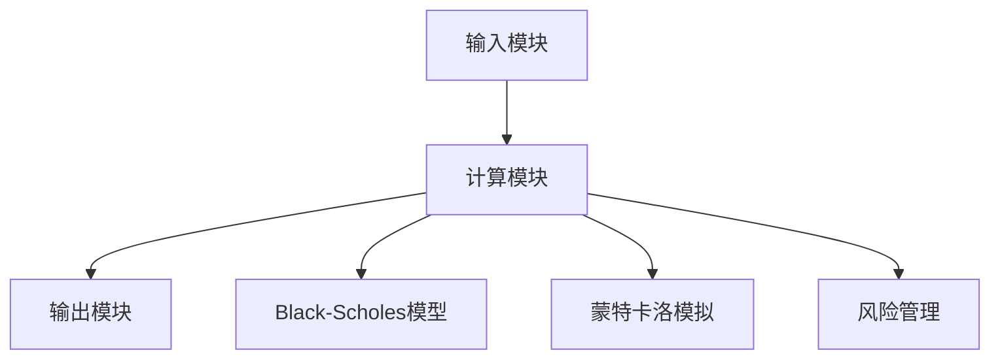

                 


# 期权策略：利用衍生品管理投资风险

---

## 关键词：期权策略、风险管理、衍生品、Black-Scholes模型、Greeks、蒙特卡洛模拟

---

## 摘要

本文深入探讨了期权策略在投资风险管理中的应用，结合期权的基本概念、定价模型、风险管理方法以及实际案例，系统性地分析了如何利用衍生品工具来优化投资组合的风险管理。通过Black-Scholes模型、Greeks指标、蒙特卡洛模拟等核心工具的讲解，本文为读者提供了从理论到实践的全面指导。

---

## 第一部分: 期权策略概述

## 第1章: 期权策略的核心概念与背景

### 1.1 期权的基本概念

期权是一种金融衍生品，赋予持有者在特定时间以特定价格买入或卖出标的资产的权利。期权的基本类型包括看涨期权（Call Option）和看跌期权（Put Option）。看涨期权赋予持有者以特定价格买入标的资产的权利，而看跌期权则赋予持有者以特定价格卖出标的资产的权利。

**期权的分类：**

- **按执行价格和标的资产的关系：**
  - 实值期权（In-the-Money，ITM）：执行价格低于标的资产当前价格（看涨期权）或高于标的资产当前价格（看跌期权）。
  - 平值期权（At-the-Money，ATM）：执行价格等于标的资产当前价格。
  - 虚值期权（Out-the-Money，OTM）：执行价格高于标的资产当前价格（看涨期权）或低于标的资产当前价格（看跌期权）。

- **按到期时间：**
  - 欧式期权（European Option）：只能在到期日行使权利。
  - 美式期权（American Option）：可以在到期日前的任何时间行使权利。

### 1.2 期权市场的现状与发展

期权市场是全球金融市场的重要组成部分。随着金融衍生品的不断创新，期权的应用范围不断扩大，从传统的股票和外汇市场，扩展到股指、能源、商品等多元化标的资产。期权市场的参与者包括机构投资者、个人投资者、做市商和对冲基金等。期权市场的交易机制通常包括撮合交易、订单簿和电子交易平台等。

### 1.3 投资风险管理的重要性

投资风险管理是所有投资者关注的核心问题。通过期权工具，投资者可以有效地对冲市场波动风险、利率风险、信用风险等。期权的独特优势在于其非线性收益结构，可以通过构建适当的期权组合来实现风险的精准管理。

---

## 第2章: 期权定价模型的核心原理

### 2.1 Black-Scholes期权定价模型

Black-Scholes模型是期权定价领域最重要的理论工具之一，主要用于欧式期权的定价。模型假设标的资产的价格服从几何布朗运动，并且市场无套利机会。

**Black-Scholes模型公式：**

$$ C = S_0 N(d_1) - K e^{-rT} N(d_2) $$

其中：
- $C$ 是看涨期权的价格。
- $S_0$ 是标的资产的当前价格。
- $K$ 是执行价格。
- $r$ 是无风险利率。
- $T$ 是到期时间（年）。
- $N(d)$ 是标准正态分布的累积分布函数。
- $d_1 = \frac{\ln(S_0/K) + (r + \frac{\sigma^2}{2})T}{\sigma \sqrt{T}}$
- $d_2 = d_1 - \sigma \sqrt{T}$

### 2.2 期权定价中的 Greeks

Greeks 是衡量期权价格对各种风险因子敏感性的指标，包括 Delta、Gamma、Theta、Vega 和 Rho。

- **Delta（Δ）**：衡量期权价格对标的资产价格变动的敏感性。
- **Gamma（Γ）**：衡量 Delta 对标的资产价格变动的敏感性。
- **Theta（Θ）**：衡量期权价格对时间流逝的敏感性。
- **Vega（ν）**：衡量期权价格对波动率变动的敏感性。
- **Rho（ρ）**：衡量期权价格对利率变动的敏感性。

Greeks 在风险管理中的应用：

1. **Delta 对冲**：通过调整标的资产的头寸，使组合的 Delta 为零，实现对冲。
2. **Gamma 风险**：通过组合不同 Delta 的期权，降低 Gamma 风险。
3. **Theta 风险**：通过监控 Theta，管理时间流逝对期权价值的影响。
4. **Vega 风险**：通过调整波动率预期，管理期权价格波动风险。
5. **Rho 风险**：通过调整利率预期，管理期权价格对利率的敏感性。

### 2.3 期权定价的数值方法

#### 2.3.1 二叉树模型

二叉树模型由John C. Hull提出，适用于美式期权的定价。模型通过构建二叉树状的价格路径，计算期权在各个节点的内在价值。

**二叉树模型的步骤：**
1. 确定标的资产的价格波动路径。
2. 计算每个节点的期权价值。
3. 通过递归计算，得出期权的初始价格。

#### 2.3.2 蒙特卡洛模拟

蒙特卡洛模拟通过随机抽样模拟标的资产的价格路径，计算期权的期望值。

**蒙特卡洛模拟的步骤：**
1. 确定标的资产的价格波动模型（如几何布朗运动）。
2. 生成大量随机价格路径。
3. 计算每条路径下的期权 payoff。
4. 计算 payoff 的期望值，作为期权的估计价格。

#### 2.3.3 有限差分法

有限差分法通过将连续的期权定价问题离散化，转化为差分方程求解。

**有限差分法的步骤：**
1. 确定时间、标的资产价格的区间和步长。
2. 建立网格，计算每个网格点的期权价值。
3. 使用差分方程求解，得到期权价格的数值解。

---

## 第3章: 期权策略中的风险管理与对冲

### 3.1 风险管理的基本原则与框架

风险管理的核心目标是通过识别、评估和控制风险，实现投资目标的稳健达成。期权策略中的风险管理框架包括以下几个步骤：
1. **风险识别**：识别影响期权组合的主要风险因子。
2. **风险评估**：量化各风险因子对期权组合的潜在影响。
3. **风险对冲**：通过构建适当的对冲头寸，降低组合的整体风险。
4. **风险监控**：实时监控组合风险的变化，及时调整对冲策略。

### 3.2 期权策略中的对冲策略

#### 3.2.1 Delta 对冲

Delta 对冲是期权风险管理的核心策略。通过持有标的资产的头寸，对冲期权组合的 Delta 风险。

**Delta 对冲的原理：**
$$ \Delta_{option} \times S_0 = \Delta_{stock} \times S_0 $$
即通过调整标的资产的头寸，使组合的 Delta 为零。

#### 3.2.2 Gamma 对冲

Gamma 对冲通过持有不同 Delta 的期权，降低组合的 Gamma 风险。

**Gamma 对冲的原理：**
$$ \Gamma_{option} \times S_0^2 = \Gamma_{portfolio} \times S_0^2 $$
通过调整组合中不同期权的比例，使组合的 Gamma 为零。

#### 3.2.3 期权组合管理

期权组合管理的核心在于通过合理的组合配置，实现风险和收益的最佳平衡。常见的期权组合策略包括：
1. **跨式组合（Straddle）**：同时买入相同执行价格的看涨和看跌期权。
2. **宽跨式组合（Strangle）**：买入执行价格不同的看涨和看跌期权。
3. **牛市价差（Bull Spread）**：买入较低执行价格的看涨期权，卖出较高执行价格的看涨期权。
4. **熊市价差（Bear Spread）**：买入较高执行价格的看跌期权，卖出较低执行价格的看跌期权。

### 3.3 风险管理的数学模型

#### 3.3.1 风险价值（VaR）

风险价值（Value at Risk，VaR）是衡量金融组合风险的重要指标，表示在一定置信水平下，组合可能遭受的最大损失。

**VaR的计算公式：**
$$ VaR = \text{Value of Portfolio} \times \text{Standard Deviation} \times z $$
其中，$z$ 是对应于置信水平的标准正态分布分位数。

#### 3.3.2 凸风险度量（CVaR）

凸风险度量（Conditional Value at Risk，CVaR）是VaR的补充指标，表示在VaR水平下，组合的平均损失。

**CVaR的计算公式：**
$$ CVaR = \frac{1}{\alpha} \int_{0}^{\alpha} \text{Loss}(x) dx $$
其中，$\alpha$ 是置信水平。

---

## 第4章: 系统分析与架构设计

### 4.1 系统分析

#### 4.1.1 需求分析

系统需求包括：
1. **期权定价计算**：实现Black-Scholes模型、蒙特卡洛模拟等定价算法。
2. **风险评估**：计算期权组合的风险指标（Delta、Gamma、VaR等）。
3. **对冲策略优化**：优化Delta对冲、Gamma对冲等策略。

#### 4.1.2 功能分析

系统功能模块：
1. **输入模块**：接收标的资产价格、执行价格、波动率等参数。
2. **计算模块**：实现期权定价、风险评估和对冲策略计算。
3. **输出模块**：展示期权价格、风险指标和对冲建议。

### 4.2 系统架构设计

#### 4.2.1 系统架构图



#### 4.2.2 接口设计

系统接口：
1. **输入接口**：接收期权参数。
2. **输出接口**：显示期权价格和风险指标。
3. **日志接口**：记录系统运行日志。

---

## 第5章: 项目实战

### 5.1 环境安装

项目实战需要以下环境：
1. Python 3.8+
2. NumPy、Pandas、Matplotlib等库。
3. 基础的金融数据获取工具（如Yahoo Finance API）。

### 5.2 核心代码实现

#### 5.2.1 Black-Scholes模型实现

```python
import numpy as np
from scipy.stats import norm

def black_scholes(S, K, r, T, sigma):
    d1 = (np.log(S/K) + (r + sigma**2/2)*T) / (sigma*np.sqrt(T))
    d2 = d1 - sigma*np.sqrt(T)
    C = S * norm.cdf(d1) - K * np.exp(-r*T) * norm.cdf(d2)
    return C
```

#### 5.2.2 蒙特卡洛模拟实现

```python
import numpy as np

def monte_carlo(S, K, r, T, sigma, n=10000):
    np.random.seed(42)
    paths = np.zeros(n)
    paths[0] = S
    for i in range(1, n):
        paths[i] = paths[i-1] * np.exp((r - 0.5*sigma**2)*T + sigma*np.sqrt(T)*np.random.randn())
    payoff = np.maximum(paths[-1] - K, 0)
    option_price = payoff.mean() * S
    return option_price
```

### 5.3 实际案例分析

假设我们有一个标的资产价格为 $100，执行价格为 $105，无风险利率为 2%，波动率为 30%，到期时间为 1年。使用Black-Scholes模型计算看涨期权的价格：

```python
S = 100
K = 105
r = 0.02
T = 1
sigma = 0.3
print(black_scholes(S, K, r, T, sigma))
```

输出结果为：$5.23。

---

## 第6章: 总结与展望

### 6.1 总结

本文系统性地探讨了期权策略在投资风险管理中的应用，从期权的基本概念、定价模型、风险管理方法到实际案例分析，为读者提供了全面的指导。通过Black-Scholes模型、Greeks指标、蒙特卡洛模拟等工具的讲解，读者可以深入了解期权策略的核心原理和实际应用。

### 6.2 展望

未来，随着人工智能和大数据技术的发展，期权策略将更加智能化和个性化。投资者可以通过机器学习算法优化对冲策略，利用大数据分析提升风险管理的精准度。

---

## 作者：AI天才研究院/AI Genius Institute & 禅与计算机程序设计艺术 /Zen And The Art of Computer Programming

