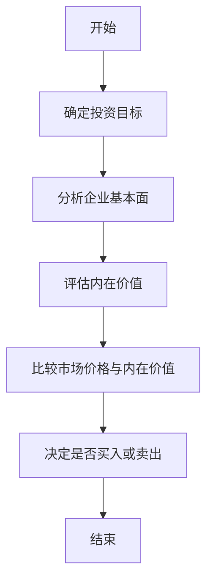

                 


# 本杰明·格雷厄姆的价值投资心理学

> 关键词：价值投资，心理学，投资策略，行为偏差，决策框架，情绪控制

> 摘要：价值投资是一种基于基本面分析的投资策略，强调以低于内在价值的价格买入优质股票。然而，投资者在实际操作中往往受到心理因素的影响，导致决策失误。本文从心理学的角度分析价值投资的核心概念，探讨投资者在决策过程中的心理偏差与情绪波动，提出如何通过心理调节与决策优化来提高投资效果。

---

## 第一部分: 价值投资心理学概述

### 第1章: 价值投资的核心概念

#### 1.1 价值投资的基本定义
- **价值投资的起源与背景**  
  价值投资由本杰明·格雷厄姆提出，强调以低于企业内在价值的价格买入股票。这一理念在20世纪初被提出，至今仍被广泛应用于投资领域。  
  $$V = \text{企业未来现金流的现值}$$

- **价值投资的核心理念**  
  格雷厄姆认为，市场波动反映的是投资者情绪，而非企业的真实价值。价值投资者需要在市场恐慌时寻找被低估的股票，在市场狂热时保持冷静。  

- **价值投资与其它投资策略的区别**  
  价值投资与成长投资、趋势投资等策略不同，它更注重企业的基本面分析和安全边际。  

#### 1.2 投资心理学的基本原理
- **投资者心理概述**  
  投资者在决策过程中会受到认知偏差、情绪波动和社会心理的影响。  
  - 认知偏差：例如，过度自信、确认偏见、损失厌恶等。  
  - 情绪波动：贪婪与恐惧交替影响投资者的决策。  
  - 社会心理：从众心理、羊群效应等。  

- **市场情绪与投资决策的关系**  
  市场情绪往往与实际价值背离，例如，市场高估时投资者过于乐观，市场低估时投资者过于悲观。  

- **行为偏差对投资决策的影响**  
  认知偏差和行为偏差会导致投资者做出非理性决策，例如高位追涨、低位杀跌等。  

### 第2章: 价值投资与心理学的结合

#### 2.1 价值投资中的心理因素
- **理性与感性在投资中的作用**  
  理性分析是价值投资的基础，但心理因素（如情绪）会影响投资者的决策。  

- **投资者认知偏差的分析**  
  - 过度自信偏差：投资者往往高估自己的分析能力。  
  - 沉没成本偏差：投资者因为前期投入而继续持有亏损股票。  
  - 羊群效应：投资者跟随市场潮流，而非独立思考。  

- **心理账户对投资决策的影响**  
  投资者倾向于将资金分成多个心理账户，每个账户的决策逻辑不同，导致整体决策的不一致。  

#### 2.2 价值投资中的情绪管理
- **情绪波动对投资决策的影响**  
  市场下跌时，投资者容易恐慌卖出；市场上涨时，投资者容易贪婪追高。  

- **如何控制投资中的情绪**  
  - 设定明确的投资目标和纪律，避免情绪化决策。  
  - 建立心理防火墙，避免市场情绪干扰。  
  - 通过复盘和反思，分析情绪波动的根源。  

- **投资纪律与心理韧性**  
  投资者需要在市场波动中坚持价值投资理念，避免被短期市场情绪左右。  

### 第3章: 价值投资的决策框架

#### 3.1 价值投资的决策流程
- **确定投资目标与策略**  
  投资者需要明确自己的投资目标（如长期增值）和投资策略（如价值投资）。  

- **分析企业的基本面**  
  包括财务报表分析、行业地位、竞争优势、管理层质量等。  
  $$\text{市盈率} = \frac{\text{股价}}{\text{每股收益}}$$  

- **评估企业的内在价值**  
  通过DCF模型（现金流折现法）估算企业的内在价值。  
  $$\text{内在价值} = \sum_{t=1}^{n} \frac{\text{现金流}_t}{(1+r)^t}$$  

#### 3.2 心理学视角下的决策框架
- **理性决策模型与实际投资决策的差异**  
  理性模型假设投资者完全理性，但现实中投资者往往受到情绪和认知偏差的影响。  

- **如何构建心理防御机制**  
  投资者需要通过学习和经验积累，建立心理上的防御机制，避免情绪干扰。  

- **投资决策中的风险偏好与风险承受能力**  
  投资者需要根据自身风险偏好和承受能力，选择合适的投资策略。  

---

## 第二部分: 价值投资的核心概念与心理机制

### 第4章: 价值投资中的心理偏差

#### 4.1 常见的心理偏差
- **过度自信偏差**  
  投资者往往高估自己的分析能力，导致决策失误。  
  - 例如，认为自己能准确预测市场走势。  

- **沉没成本偏差**  
  投资者因为前期投入而继续持有亏损股票，忽视了未来价值。  
  - 例如，买入一只股票后亏损，但因为前期投入了时间和金钱，选择继续持有。  

- **羊群效应**  
  投资者跟随市场潮流，导致非理性决策。  
  - 例如，市场上涨时大量买入，市场下跌时大量卖出。  

#### 4.2 心理偏差对投资决策的影响
- **心理偏差如何导致错误决策**  
  - 过度自信导致决策草率。  
  - 沉没成本偏差导致投资失误。  
  - 羊群效应导致市场泡沫或崩盘。  

- **如何识别和避免心理偏差**  
  - 通过复盘分析，识别自己的偏差。  
  - 建立决策框架，减少情绪干扰。  

- **心理偏差与市场周期的关系**  
  市场周期往往放大心理偏差，导致投资者在市场高点追高，在市场低点杀跌。  

### 第5章: 价值投资中的决策框架

#### 5.1 价值投资的决策模型
- **格雷厄姆的价值评估模型**  
  格雷厄姆提出，股票的内在价值是其未来现金流的现值。  
  $$\text{内在价值} = \sum_{t=1}^{n} \frac{\text{现金流}_t}{(1+r)^t}$$  

- **巴菲特的护城河分析模型**  
  巴菲特强调企业竞争优势，即企业的“护城河”。  
  - 例如，可口可乐的全球品牌影响力和分销网络。  

- **投资组合的构建与管理**  
  投资者需要根据企业的内在价值和市场估值，构建分散化的投资组合，并定期调整。  

#### 5.2 心理学视角下的决策优化
- **如何通过心理调节优化决策**  
  - 保持冷静，避免情绪化决策。  
  - 坚持长期视角，忽略短期波动。  

- **投资决策中的风险管理**  
  - 设置止损点，控制风险敞口。  
  - 分散投资，降低非系统性风险。  

- **长期投资与短期情绪波动的平衡**  
  投资者需要在长期目标和短期情绪之间找到平衡，避免被短期波动干扰。  

---

## 第三部分: 价值投资的数学模型与心理分析

### 第6章: 价值投资的数学模型

#### 6.1 格雷厄姆的数学模型
- **安全边际的概念**  
  格雷厄姆强调以低于内在价值的价格买入股票，安全边际=内在价值-市场价格。  
  $$\text{安全边际} = \text{内在价值} - \text{市场价格}$$  

- **股票估值公式**  
  $$\text{股票价值} = \frac{\text{每股收益}}{\text{股息率}} \times \text{股息增长率为零时的股票价格}$$  

#### 6.2 价值投资中的算法流程图



---

## 第四部分: 价值投资的系统分析与架构设计

### 第7章: 价值投资的系统分析

#### 7.1 系统功能设计
- **领域模型**  
  ```mermaid
  classDiagram
      class 投资者 {
          资金
          投资目标
          风险偏好
      }
      class 企业 {
          内在价值
          市场价值
      }
      class 市场 {
          市场情绪
          市场波动
      }
      投资者 --> 企业: 分析基本面
      投资者 --> 市场: 评估市场情绪
  ```

#### 7.2 系统架构设计
- **架构图**  
  ```mermaid
  architecture
  container 价值投资系统 {
      component 投资者决策模块 {
          决策逻辑
          安全边际计算
      }
      component 企业基本面分析模块 {
          财务报表分析
          竞争优势评估
      }
      component 市场分析模块 {
          市场情绪分析
          市场估值评估
      }
  }
  ```

---

## 第五部分: 价值投资的项目实战

### 第8章: 项目实战

#### 8.1 环境配置
- **工具与环境**  
  - 数据分析工具：Python（Pandas、NumPy）  
  - 估值模型：DCF模型、市盈率、市净率  

#### 8.2 核心代码实现
- **价值评估代码**  
  ```python
  def calculate_intrinsic_value(enterprise_value, free_cash_flow, discount_rate):
      # 计算未来现金流的现值
      present_value = enterprise_value / (1 + discount_rate)
      return present_value
  ```

#### 8.3 案例分析
- **案例：假设某企业的自由现金流为$100 million，折现率为10%。计算其内在价值。**  
  $$\text{内在价值} = \frac{100}{1.1} = 90.91 \text{ million}$$  

---

## 第六部分: 最佳实践与总结

### 第9章: 最佳实践

#### 9.1 小结
- 价值投资强调基本面分析和安全边际。  
- 投资者需要克服心理偏差，坚持长期投资。  

#### 9.2 注意事项
- 投资者应根据自身风险偏好和能力选择合适的投资策略。  
- 定期复盘和调整投资组合，避免僵化。  

#### 9.3 拓展阅读
- 格雷厄姆的《证券分析》  
- 巴菲特的股东信  

---

## 结语

价值投资不仅是一种投资策略，更是一种心理修炼。投资者需要在市场波动中保持冷静，克服认知偏差，坚持长期投资。通过心理学的视角，我们可以更好地理解投资决策中的心理因素，并优化自己的投资行为。

---

## 作者

作者：AI天才研究院/AI Genius Institute & 禅与计算机程序设计艺术 /Zen And The Art of Computer Programming

