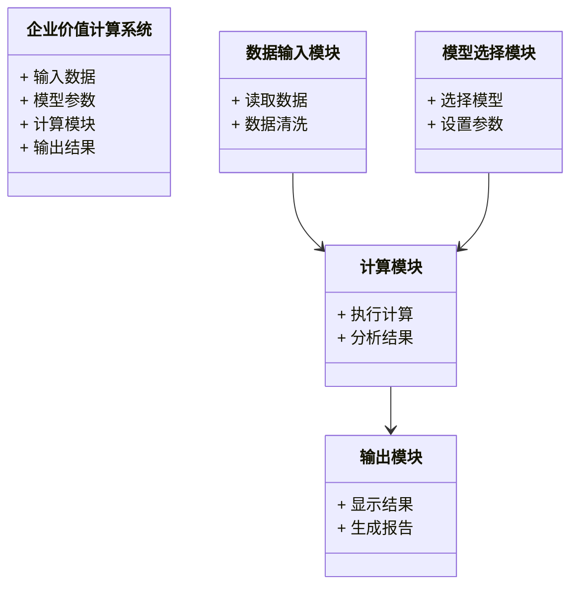
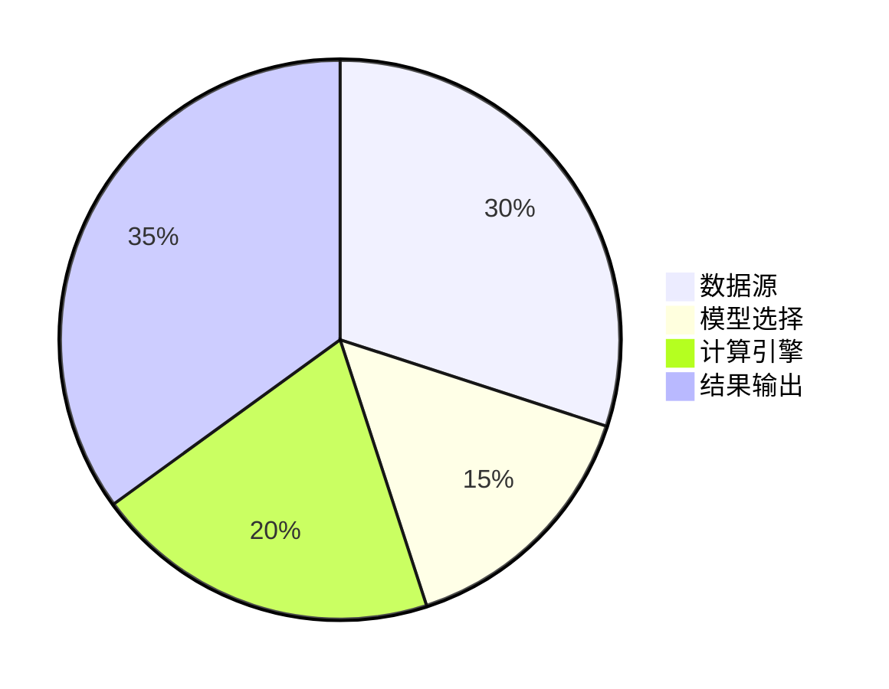
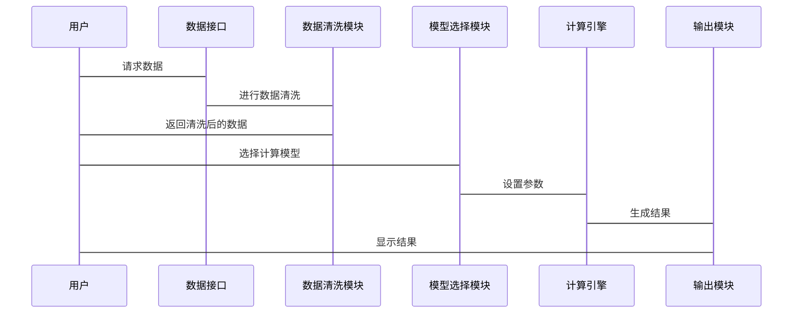

                 


# 本杰明·格雷厄姆的企业价值计算方法现代化

> 关键词：企业价值计算，价值投资，本杰明·格雷厄姆，现代投资方法，投资策略

> 摘要：本文探讨了本杰明·格雷厄姆的经典企业价值计算方法，并分析其在现代投资环境中的适用性与改进方向。通过结合现代财务模型和数据驱动技术，提出了一种更高效、更准确的企业价值计算方法。本文还详细讲解了算法原理、系统架构设计以及实际案例分析，为投资专业人士提供了实用的现代化投资策略。

---

## 第一部分: 企业价值计算方法的背景与演变

### 第1章: 企业价值计算方法的历史演变

#### 1.1 本杰明·格雷厄姆的基本方法

##### 1.1.1 价值投资的核心理念

价值投资是一种以基本面分析为基础的投资策略，其核心理念是寻找市场价低于其内在价值的股票。本杰明·格雷厄姆是这一理念的鼻祖，他提出了“安全边际”的概念，即在购买股票时，价格应远低于其内在价值，以降低风险。

##### 1.1.2 格雷厄姆的企业价值定义

格雷厄姆将企业价值定义为未来现金流的现值。他认为，企业的内在价值主要取决于其未来现金流的折现值。他提出的核心公式为：

$$
\text{企业价值} = \sum_{t=1}^{n} \frac{\text{现金流}_t}{(1 + r)^t}
$$

其中，\( r \) 是折现率，\( n \) 是预测的现金流期限。

##### 1.1.3 格雷厄姆投资策略的局限性

尽管格雷厄姆的方法在当时具有开创性，但在现代市场环境下，其方法存在一些局限性。例如，其假设条件过于简化，未充分考虑企业增长潜力和市场波动性。此外，传统的现金流折现模型（DCF）计算较为复杂，难以快速应用于大规模数据。

---

#### 1.2 现代企业价值计算方法的发展

##### 1.2.1 现代企业价值计算的背景

随着金融市场的复杂化和数据技术的进步，现代企业价值计算方法逐渐从传统的会计分析转向更动态的模型。现代方法更注重企业的成长性、竞争优势和市场定位。

##### 1.2.2 技术进步对企业价值计算的影响

技术的进步，尤其是大数据和人工智能的应用，使得企业价值计算更加精准和高效。现代方法利用机器学习算法优化预测模型，并通过实时数据分析提高决策的及时性。

##### 1.2.3 数据驱动的企业价值计算方法

数据驱动的方法利用海量数据和高级算法，构建更精确的企业价值模型。例如，通过自然语言处理技术分析企业财报，利用时间序列模型预测未来现金流。

---

### 第2章: 企业价值计算的核心概念与方法论

#### 2.1 企业价值的核心要素

##### 2.1.1 收益能力

收益能力是企业价值的核心要素之一。企业的盈利能力直接影响其现金流，进而影响其内在价值。常用的收益指标包括净利润、息税前利润（EBIT）和自由现金流（FCF）。

##### 2.1.2 资产质量

资产质量反映了企业资产的盈利能力。高质量的资产通常具有较高的周转率和较低的折旧率。企业可以通过优化资产结构和提升资产利用率来提高整体价值。

##### 2.1.3 财务健康状况

财务健康状况是评估企业价值的重要指标。健康的财务状况包括合理的负债结构、充足的流动资金和稳定的现金流。

---

#### 2.2 格雷厄姆企业价值计算的基本框架

##### 2.2.1 核心公式

格雷厄姆的核心公式是现金流折现模型（DCF）。DCF模型将未来现金流折现为现值，以评估企业价值。公式如下：

$$
\text{企业价值} = \frac{\text{未来现金流}}{(1 + r)^n}
$$

其中，\( r \) 是折现率，\( n \) 是预测期限。

##### 2.2.2 核心假设

格雷厄姆的DCF模型基于以下假设：

1. 企业的未来现金流可以合理预测。
2. 折现率是稳定的。
3. 企业可以在合理时间内实现其价值。

##### 2.2.3 计算步骤

1. 预测未来现金流。
2. 确定合适的折现率。
3. 计算未来现金流的现值。
4. 求和并得出企业价值。

---

#### 2.3 现代企业价值计算方法的改进

##### 2.3.1 现代企业价值计算的创新点

现代方法在DCF模型的基础上进行了改进，例如引入增长模型（如永续增长模型）和调整折现率以反映市场风险。

##### 2.3.2 现金流折现模型的优化

现代DCF模型通常采用分阶段折现法，将企业的现金流分为初始阶段和永续阶段。例如：

1. 初始阶段：预测未来5年的现金流。
2. 永续阶段：假设企业以固定增长率增长。

##### 2.3.3 资产负债表分析的改进

现代方法结合资产负债表分析，评估企业的偿债能力和财务健康状况。例如，计算债务与股权比率（D/E）和利息覆盖倍数（ Interest Coverage Ratio）。

##### 2.3.4 收益预测的现代化

现代收益预测利用大数据和机器学习技术，通过分析历史数据和市场趋势，提高预测的准确性。

---

## 第三部分: 现代化的企业价值计算方法

## 第3章: 企业价值计算的系统分析与架构设计

### 3.1 系统分析

#### 3.1.1 问题场景介绍

在现代投资环境中，企业价值计算需要考虑更多复杂因素，如宏观经济环境、行业趋势和企业战略。传统的DCF模型难以应对这些复杂性。

#### 3.1.2 项目介绍

本项目旨在构建一个现代化的企业价值计算系统，结合多种模型和数据源，提供更精准的价值评估。

#### 3.1.3 系统功能设计（领域模型）

系统功能包括：

1. 数据输入与处理。
2. 模型选择与参数设置。
3. 计算与分析。
4. 结果输出与可视化。

领域模型（Mermaid 类图）如下：



---

#### 3.2 系统架构设计

##### 3.2.1 系统架构图（Mermaid）



##### 3.2.2 系统接口设计

系统主要接口包括：

1. 数据接口：与数据库和API对接。
2. 用户界面：供用户输入参数和查看结果。
3. 报告生成接口：输出分析报告。

##### 3.2.3 系统交互流程（Mermaid 序列图）



---

## 第4章: 现代化的企业价值计算方法的实现

### 4.1 算法原理讲解

#### 4.1.1 现金流折现模型的实现

现金流折现模型的Python实现如下：

```python
import numpy as np

def discounted_cash_flow(cash_flows, discount_rate, periods):
    """
    计算现金流的现值
    """
    return np.npv(discount_rate, cash_flows, periods)

# 示例
cash_flows = [100, 200, 300]
discount_rate = 0.08
periods = len(cash_flows)

value = discounted_cash_flow(cash_flows, discount_rate, periods)
print(f"企业价值现值为：{value}")
```

#### 4.1.2 股权自由现金流模型的实现

股权自由现金流模型的Python代码如下：

```python
def equity_free_cash_flow(enterprise_value, debt):
    """
    计算股权自由现金流
    """
    return enterprise_value + debt

# 示例
enterprise_value = 500
debt = 200

equity_cash_flow = equity_free_cash_flow(enterprise_value, debt)
print(f"股权自由现金流为：{equity_cash_flow}")
```

---

### 4.2 项目实战

#### 4.2.1 环境安装

需要安装以下Python库：

- numpy
- pandas
- matplotlib
- scipy

安装命令：

```bash
pip install numpy pandas matplotlib scipy
```

---

#### 4.2.2 核心实现源代码

以下是企业价值计算的Python源代码：

```python
import numpy as np
import pandas as pd
import matplotlib.pyplot as plt

def calculate_enterprise_value(fcf, discount_rate, periods):
    """
    计算企业价值
    """
    present_value = np.npv(discount_rate, fcf, periods)
    return present_value

# 示例数据
fcf = [100, 200, 300, 400, 500]
discount_rate = 0.08
periods = 5

value = calculate_enterprise_value(fcf, discount_rate, periods)
print(f"企业价值现值为：{value}")

# 可视化
plt.plot(range(periods), fcf)
plt.title('自由现金流')
plt.xlabel('年份')
plt.ylabel('现金流')
plt.show()
```

---

## 第五部分: 总结与展望

### 5.1 最佳实践 tips

- 结合多种模型进行交叉验证。
- 定期更新模型参数以反映市场变化。
- 利用技术工具提高计算效率。

### 5.2 小结

本杰明·格雷厄姆的企业价值计算方法在现代投资环境中的应用需要结合新的技术和数据源。通过优化模型和引入新技术，我们可以更准确地评估企业价值。

### 5.3 注意事项

- 投资者应根据实际情况调整模型参数。
- 需要持续关注市场变化和企业动态。
- 投资决策应基于多方面的信息和分析。

### 5.4 拓展阅读

- 《投资学》（教材）
- 现代投资组合理论
- 数据驱动的投资策略

---

作者：AI天才研究院/AI Genius Institute & 禅与计算机程序设计艺术 /Zen And The Art of Computer Programming

---

感谢您的阅读！希望这篇文章能为您提供有价值的投资方法和见解。

