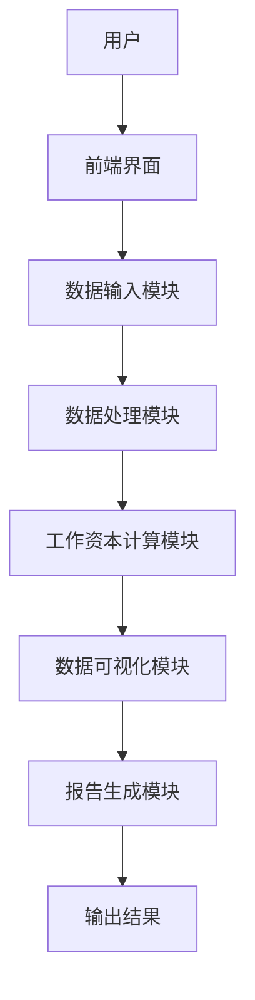
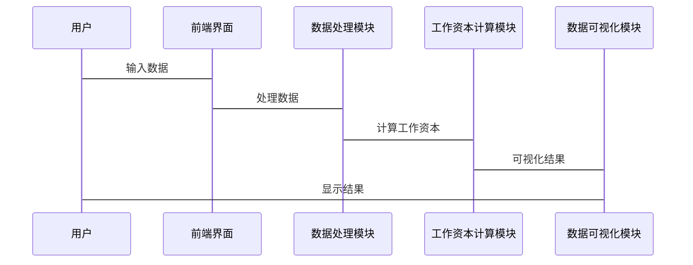

                 


# 本杰明·格雷厄姆的工作资本分析技巧

> 关键词：本杰明·格雷厄姆，工作资本分析，价值投资，财务报表分析，投资策略

> 摘要：本杰明·格雷厄姆是价值投资的鼻祖，其工作资本分析技巧是投资分析中的经典方法。本文从本杰明·格雷厄姆的投资理念出发，详细讲解工作资本分析的核心概念、数学模型、系统设计以及实际应用，帮助读者掌握这一经典的投资分析技巧。

---

## 第1章: 本杰明·格雷厄姆与工作资本分析概述

### 1.1 本杰明·格雷厄姆的生平与投资理念

#### 1.1.1 本杰明·格雷厄姆的生平简介
本杰明·格雷厄姆（Benjamin Graham）是20世纪最伟大的投资思想家之一，被誉为“价值投资之父”。他出生于1894年，去世于1976年，是哥伦比亚大学商学院的教授，同时也是投资大师沃伦·巴菲特的导师。

#### 1.1.2 格雷厄姆的投资哲学与价值投资
格雷厄姆的投资理念以“安全边际”为核心，主张以低于内在价值的价格买入股票，长期持有，避免短期波动的干扰。他认为，市场先生是不理性的，投资者应该利用市场的非理性来获取超额收益。

#### 1.1.3 工作资本分析的背景与意义
工作资本分析是格雷厄姆投资理论中的重要组成部分，主要用于评估企业的财务健康状况和内在价值。通过分析企业的流动资产和流动负债，投资者可以判断企业的短期偿债能力，从而做出更明智的投资决策。

### 1.2 工作资本分析的核心概念

#### 1.2.1 工作资本的定义与特点
工作资本（Working Capital）是指企业的流动资产减去流动负债，是衡量企业短期财务健康状况的重要指标。其特点包括：
1. 短期性：仅关注企业的短期偿债能力。
2. 可操作性：可以通过财务报表直接计算。
3. 动态性：随企业经营状况的变化而波动。

#### 1.2.2 工作资本分析的目的与作用
工作资本分析的主要目的是评估企业的短期偿债能力和流动性。通过分析工作资本，投资者可以判断企业是否能够偿还短期内的债务，从而避免投资风险。

#### 1.2.3 工作资本分析与企业价值的关系
工作资本是企业价值的重要组成部分，但它并不是决定企业价值的唯一因素。企业价值的评估需要结合工作资本、净利润、市盈率等多个指标进行综合分析。

### 1.3 工作资本分析的适用场景

#### 1.3.1 工作资本分析在企业估值中的应用
在企业估值中，工作资本分析可以帮助投资者评估企业的财务健康状况，从而判断其内在价值。

#### 1.3.2 工作资本分析在投资决策中的作用
通过分析工作资本，投资者可以判断企业的短期偿债能力，从而做出更明智的投资决策。

#### 1.3.3 工作资本分析的局限性与边界
工作资本分析仅关注企业的短期财务状况，无法反映企业的长期发展潜力。因此，在使用工作资本分析时，需要结合其他指标进行综合分析。

### 1.4 本章小结
本章主要介绍了本杰明·格雷厄姆的投资理念及其工作资本分析的核心概念。通过理解工作资本的定义、特点和作用，读者可以更好地掌握这一经典的投资分析技巧。

---

## 第2章: 工作资本分析的核心概念与原理

### 2.1 工作资本分析的核心要素

#### 2.1.1 流动资产与流动负债的定义
流动资产是指企业在一年内可以转化为现金的资产，包括现金、应收账款、存货等。流动负债是指企业在一年内需要偿还的债务，包括应付账款、短期借款等。

#### 2.1.2 工作资本的计算公式
$$
\text{工作资本} = \text{流动资产} - \text{流动负债}
$$

#### 2.1.3 工作资本与企业财务健康的关系
工作资本是衡量企业短期财务健康状况的重要指标。如果工作资本为正，说明企业有足够的流动资产来偿还短期债务；如果工作资本为负，说明企业可能面临流动性风险。

### 2.2 工作资本分析的原理与方法

#### 2.2.1 工作资本分析的基本原理
工作资本分析的核心在于通过流动资产和流动负债的对比，评估企业的短期偿债能力和流动性。

#### 2.2.2 工作资本分析的步骤与流程
1. 收集企业的财务报表数据。
2. 计算流动资产和流动负债。
3. 计算工作资本。
4. 分析工作资本的变化趋势。

#### 2.2.3 工作资本分析的关键指标
- 流动比率（Current Ratio）：流动资产与流动负债的比值，衡量企业的短期偿债能力。
- 速动比率（Quick Ratio）：流动资产减去存货与流动负债的比值，进一步衡量企业的流动性。

### 2.3 工作资本分析与企业财务报表的关系

#### 2.3.1 工作资本在资产负债表中的体现
工作资本主要涉及资产负债表中的流动资产和流动负债项目。

#### 2.3.2 工作资本与利润表的关系
工作资本的变化会受到企业盈利能力和现金流状况的影响，因此需要结合利润表进行综合分析。

#### 2.3.3 工作资本与现金流量表的联系
工作资本的变化可以通过现金流量表中的经营活动现金流来进一步验证。

### 2.4 本章小结
本章详细讲解了工作资本分析的核心要素、原理与方法，以及与企业财务报表的关系。通过理解这些内容，读者可以更好地掌握工作资本分析的基本框架。

---

## 第3章: 工作资本分析的数学模型与公式

### 3.1 工作资本计算的数学模型

#### 3.1.1 工作资本的计算公式
$$
\text{工作资本} = \text{流动资产} - \text{流动负债}
$$

#### 3.1.2 流动资产与流动负债的构成
流动资产包括：
- 现金
- 应收账款
- 存货
- 其他流动资产

流动负债包括：
- 应付账款
- 短期借款
- 应付职工薪酬
- 其他流动负债

#### 3.1.3 工作资本变化的数学表达
$$
\Delta \text{工作资本} = \text{期末工作资本} - \text{期初工作资本}
$$

### 3.2 工作资本分析的数学推导

#### 3.2.1 工作资本变化的数学模型
通过分析工作资本的变化，可以判断企业的流动性变化趋势。

#### 3.2.2 工作资本与企业价值的关系公式
$$
\text{企业价值} = \text{净利润} \times \text{市盈率}
$$

#### 3.2.3 工作资本分析的统计方法
- 方差分析
- 回归分析
- 时间序列分析

### 3.3 工作资本分析的案例分析

#### 3.3.1 某公司的工作资本计算案例
假设某公司2022年的流动资产为100万元，流动负债为80万元，则工作资本为20万元。

#### 3.3.2 案例分析中的数学公式应用
通过计算流动比率和速动比率，进一步分析企业的短期偿债能力。

#### 3.3.3 案例分析的总结与启示
工作资本分析是评估企业财务健康状况的重要工具，但需要结合其他指标进行综合分析。

### 3.4 本章小结
本章通过数学公式和案例分析，详细讲解了工作资本分析的具体方法和应用。通过这些内容，读者可以更好地掌握工作资本分析的数学模型和实际应用。

---

## 第4章: 工作资本分析的系统设计与实现

### 4.1 系统分析与架构设计方案

#### 4.1.1 问题场景介绍
投资者需要通过工作资本分析来评估企业的财务健康状况，从而做出投资决策。

#### 4.1.2 系统功能设计
- 数据输入与处理
- 工作资本计算
- 数据可视化
- 报告生成

#### 4.1.3 系统架构设计


#### 4.1.4 系统接口设计
- 数据接口：与财务报表数据源对接
- 计算接口：工作资本计算模块
- 输出接口：报告生成模块

#### 4.1.5 系统交互设计


### 4.2 项目实战: 工作资本分析系统实现

#### 4.2.1 环境安装
- 安装Python和相关库（Pandas、Matplotlib）
- 安装Jupyter Notebook

#### 4.2.2 系统核心实现源代码

```python
import pandas as pd
import matplotlib.pyplot as plt

# 读取财务报表数据
df = pd.read_csv('financial_data.csv')

# 计算流动资产和流动负债
current_assets = df['流动资产'].sum()
current_liabilities = df['流动负债'].sum()

# 计算工作资本
working_capital = current_assets - current_liabilities

# 绘制工作资本变化趋势图
plt.figure(figsize=(10, 6))
plt.plot(df['日期'], df['工作资本'], label='工作资本')
plt.xlabel('日期')
plt.ylabel('金额（万元）')
plt.title('工作资本变化趋势')
plt.legend()
plt.show()
```

#### 4.2.3 代码应用解读与分析
1. 数据输入与处理：读取财务报表数据，提取流动资产和流动负债。
2. 工作资本计算：计算工作资本。
3. 数据可视化：绘制工作资本变化趋势图。

#### 4.2.4 实际案例分析
以某公司为例，通过代码计算其工作资本，并分析其变化趋势。

#### 4.2.5 项目小结
通过本章的项目实战，读者可以掌握工作资本分析系统的实现方法，并能够应用到实际投资分析中。

### 4.3 本章小结
本章通过系统设计与实现，详细讲解了工作资本分析的具体操作步骤和方法。通过代码实现和案例分析，读者可以更好地掌握工作资本分析的系统设计与实际应用。

---

## 第5章: 工作资本分析的最佳实践与小结

### 5.1 最佳实践 tips
1. 工作资本分析是投资分析中的重要工具，但需要结合其他指标进行综合分析。
2. 在实际投资中，建议使用专业的财务分析软件（如Excel、Python）来辅助分析。
3. 定期跟踪企业的财务报表，分析工作资本的变化趋势。

### 5.2 小结
通过本篇文章的学习，读者可以掌握本杰明·格雷厄姆的工作资本分析技巧，并能够应用到实际投资分析中。工作资本分析是价值投资中的重要方法，但需要结合企业的整体财务状况和市场环境进行综合分析。

### 5.3 注意事项
1. 工作资本分析仅关注企业的短期财务状况，无法反映企业的长期发展潜力。
2. 在实际投资中，建议使用专业的财务分析工具，并结合其他指标进行综合分析。

### 5.4 拓展阅读
建议读者阅读本杰明·格雷厄姆的经典著作《证券分析》和《聪明的投资者》，深入理解其投资理念和工作资本分析的方法。

---

## 作者：AI天才研究院/AI Genius Institute & 禅与计算机程序设计艺术 /Zen And The Art of Computer Programming

