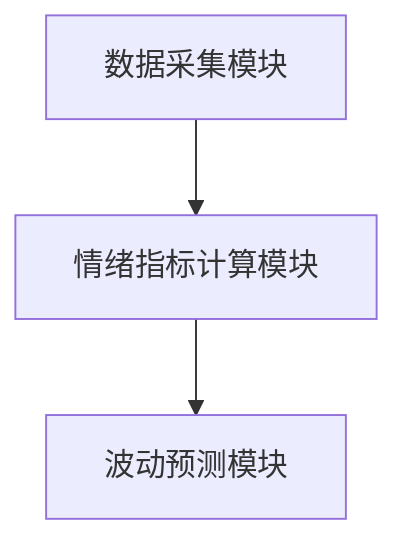

                 


# 本杰明·格雷厄姆的市场先生理论现代应用

> 关键词：市场先生理论、投资者心理、行为金融学、市场波动、算法实现、风险管理、系统设计

> 摘要：本杰明·格雷厄姆的市场先生理论是投资领域的重要理论之一，主要探讨市场波动与投资者心理之间的关系。本文从市场先生理论的背景出发，分析其核心概念，并结合现代金融理论，探讨其在行为金融学中的应用。通过算法实现、系统设计和项目实战，本文展示了市场先生理论在现代投资中的实际应用，并总结了其在风险管理、投资者决策支持等领域的价值。

---

# 第一部分: 市场先生理论的背景与核心概念

## 第1章: 本杰明·格雷厄姆市场先生理论的起源与演变

### 1.1 本杰明·格雷厄姆的生平与投资思想

#### 1.1.1 本杰明·格雷厄姆的生平简介
本杰明·格雷厄姆（Benjamin Graham）是20世纪著名的投资学家，被誉为“价值投资之父”。他出生于1894年，早年从商，后来转向金融投资领域，并在哥伦比亚大学教授投资课程。他的投资理念深刻影响了后来的投资者，包括沃伦·巴菲特。

#### 1.1.2 格雷厄姆的价值投资理念
格雷厄姆提出的价值投资理念强调以低于内在价值的价格购买优质股票。他认为市场波动主要由投资者的心理因素驱动，而非市场的真实价值。

#### 1.1.3 市场先生理论的提出背景
市场先生理论是格雷厄姆在《聪明的投资者》一书中提出的重要概念。他将市场比作一个情绪波动的“先生”，通过分析市场先生的行为，投资者可以更好地把握市场的波动规律。

### 1.2 市场先生理论的核心观点

#### 1.2.1 市场先生的定义与特征
市场先生是一个拟人化的概念，代表市场的整体情绪和波动。他的行为特征包括情绪波动、非理性决策和市场周期性。

#### 1.2.2 市场先生与市场波动的关系
市场先生的情绪波动直接影响市场的波动。当市场先生情绪高涨时，市场会出现过热；当市场先生情绪低落时，市场会出现恐慌。

#### 1.2.3 市场先生理论的现代意义
在现代金融理论中，市场先生理论为行为金融学提供了理论基础，帮助投资者更好地理解市场波动的心理因素。

---

## 第2章: 市场先生理论的核心概念与心理分析

### 2.1 投资者心理与市场波动

#### 2.1.1 投资者心理的分类
投资者心理主要包括理性决策和非理性决策。市场先生理论强调非理性决策在市场波动中的作用。

#### 2.1.2 市场情绪对投资决策的影响
市场情绪通过影响投资者的心理状态，进而影响他们的投资决策。例如，乐观情绪可能导致过度投资，而悲观情绪可能导致过度抛售。

#### 2.1.3 市场先生理论中的投资者心理模型
市场先生理论将投资者心理分为两类：理性和非理性。非理性心理是市场波动的主要驱动力。

### 2.2 市场先生与市场心理的关系

#### 2.2.1 市场先生的双重角色
市场先生既是市场的参与者，也是市场的观察者。他通过情绪波动影响市场，同时也受到市场的反向影响。

#### 2.2.2 市场情绪的周期性分析
市场情绪具有周期性，从乐观到悲观，再从悲观到乐观。市场先生理论通过分析情绪周期，帮助投资者做出更明智的决策。

#### 2.2.3 市场先生理论对投资者行为的启示
投资者应关注市场情绪的变化，避免被非理性情绪所左右，从而做出更理性的投资决策。

---

## 第3章: 市场先生理论与现代金融理论的联系

### 3.1 现代金融理论中的市场行为分析

#### 3.1.1 理性人假设与市场先生理论的冲突
现代金融理论中的理性人假设认为市场参与者是理性的，而市场先生理论则强调情绪因素的重要性。两者在某些方面存在冲突。

#### 3.1.2 行为金融学与市场先生理论的结合
行为金融学研究投资者心理对市场的影响，与市场先生理论有很强的关联性。行为金融学进一步发展了市场先生理论的核心观点。

#### 3.1.3 市场先生理论在现代金融中的应用
市场先生理论在现代金融中的应用包括情绪指数计算、市场波动预测和风险管理模型的构建。

### 3.2 市场先生理论的数学模型与公式

#### 3.2.1 市场情绪指数的计算公式
市场情绪指数可以通过投资者情绪调查和市场数据计算得出。例如，使用归一化的方法，将市场情绪分为乐观、中性和悲观三种状态。

$$ \text{市场情绪指数} = \frac{\text{乐观投资者比例} - \text{悲观投资者比例}}{\text{总投资者比例}} $$

#### 3.2.2 市场波动预测的数学模型
市场波动预测模型可以通过时间序列分析，结合市场情绪指数和历史波动数据，进行预测。

$$ \text{波动预测} = a \times \text{市场情绪指数} + b \times \text{历史波动数据} $$

其中，$a$ 和 $b$ 是模型参数，需通过回归分析确定。

#### 3.2.3 市场先生理论中的概率分析
市场先生理论可以通过概率论分析市场情绪对投资收益的影响。例如，计算市场情绪为乐观时，投资成功的概率。

$$ P(\text{成功}) = P(\text{乐观}) \times P(\text{成功 | 乐观}) + P(\text{悲观}) \times P(\text{成功 | 悲观}) $$

---

# 第二部分: 市场先生理论的现代应用与算法实现

## 第4章: 市场先生理论的现代应用分析

### 4.1 现代市场中的投资者心理分析

#### 4.1.1 现代投资者的心理特征
现代投资者更加关注短期收益，情绪波动更加频繁。市场先生理论在现代市场中的应用更加广泛。

#### 4.1.2 市场情绪对投资决策的影响
市场情绪通过影响投资者的心理状态，进而影响他们的投资决策。例如，乐观情绪可能导致过度投资，而悲观情绪可能导致过度抛售。

#### 4.1.3 市场先生理论在现代投资中的应用
市场先生理论在现代投资中的应用包括情绪指数计算、市场波动预测和风险管理模型的构建。

### 4.2 市场先生理论与行为金融学的结合

#### 4.2.1 行为金融学的核心观点
行为金融学研究投资者心理对市场的影响，与市场先生理论有很强的关联性。行为金融学进一步发展了市场先生理论的核心观点。

#### 4.2.2 市场先生理论与行为金融学的异同
市场先生理论与行为金融学的异同包括：市场先生理论强调情绪因素，而行为金融学更加注重心理因素的复杂性。

#### 4.2.3 市场先生理论在行为金融学中的应用
市场先生理论在行为金融学中的应用包括情绪指数计算、市场波动预测和风险管理模型的构建。

---

## 第5章: 市场先生理论的算法实现与案例分析

### 5.1 市场情绪分析算法

#### 5.1.1 市场情绪分析的实现步骤
市场情绪分析的实现步骤包括数据采集、情绪指标计算和市场波动预测。

#### 5.1.2 情绪指标计算的Python代码实现
以下是情绪指标计算的Python代码：

```python
import pandas as pd
import numpy as np

# 数据采集
data = pd.read_csv('market_data.csv')
情绪指标 = data['情绪指标'].values

# 情绪指数计算
情绪指数 = np.mean(情绪指标)
```

#### 5.1.3 情绪指标计算的数学模型
情绪指标计算的数学模型如下：

$$ \text{情绪指数} = \frac{\sum_{i=1}^{n} \text{情绪指标}_i}{n} $$

其中，$n$ 是样本数量。

### 5.2 市场波动预测算法

#### 5.2.1 市场波动预测的实现步骤
市场波动预测的实现步骤包括数据采集、模型训练和预测结果输出。

#### 5.2.2 波动预测模型的Python代码实现
以下是波动预测模型的Python代码：

```python
from sklearn.linear_model import LinearRegression
import pandas as pd

# 数据采集
data = pd.read_csv('market_data.csv')
X = data[['情绪指标', '历史波动数据']]
y = data['实际波动']

# 模型训练
model = LinearRegression()
model.fit(X, y)

# 预测结果
预测波动 = model.predict(X)
```

#### 5.2.3 波动预测模型的数学模型
波动预测模型的数学模型如下：

$$ \text{预测波动} = a \times \text{情绪指标} + b \times \text{历史波动数据} $$

其中，$a$ 和 $b$ 是模型参数，需通过回归分析确定。

---

## 第6章: 市场先生理论的系统分析与设计

### 6.1 系统功能设计

#### 6.1.1 系统功能模块
系统功能模块包括数据采集模块、情绪指标计算模块和波动预测模块。

#### 6.1.2 系统功能模块的实现
以下是系统功能模块的实现：

1. 数据采集模块：采集市场数据和投资者情绪数据。
2. 情绪指标计算模块：计算市场情绪指数。
3. 波动预测模块：基于情绪指数和历史数据，预测市场波动。

### 6.2 系统架构设计

#### 6.2.1 系统架构图
以下是系统架构图：



#### 6.2.2 系统接口设计
系统接口设计包括数据输入接口和结果输出接口。

---

## 第7章: 项目实战与应用案例

### 7.1 项目实战

#### 7.1.1 项目环境安装
项目环境安装包括安装Python和相关库（如pandas、numpy、scikit-learn）。

#### 7.1.2 项目核心实现
以下是项目核心实现的Python代码：

```python
import pandas as pd
import numpy as np
from sklearn.linear_model import LinearRegression

# 数据采集
data = pd.read_csv('market_data.csv')
X = data[['情绪指标', '历史波动数据']]
y = data['实际波动']

# 情绪指标计算
情绪指数 = np.mean(X['情绪指标'])

# 波动预测
model = LinearRegression()
model.fit(X, y)
预测波动 = model.predict(X)

# 输出结果
print('情绪指数:', 情绪指数)
print('预测波动:', 预测波动)
```

---

## 第8章: 总结与展望

### 8.1 总结
市场先生理论通过分析投资者心理和市场情绪，帮助投资者更好地理解市场波动。现代金融理论和行为金融学进一步发展了市场先生理论的应用。

### 8.2 展望
未来，市场先生理论在风险管理、投资者决策支持和市场预测中的应用将更加广泛。同时，随着人工智能和大数据技术的发展，市场先生理论的算法实现将更加精准和高效。

---

# 作者：AI天才研究院/AI Genius Institute & 禅与计算机程序设计艺术 /Zen And The Art of Computer Programming

