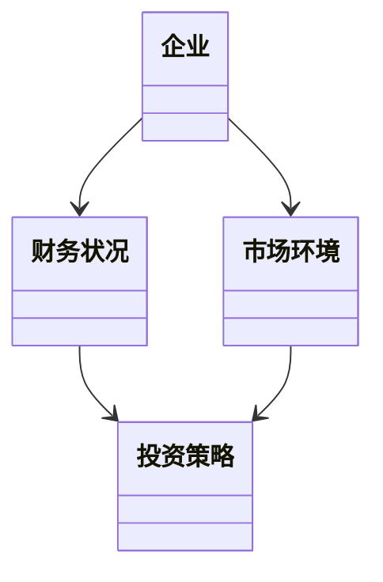

                 


# 本杰明·格雷厄姆：现代价值投资之父的投资哲学

---

## 关键词：
- 本杰明·格雷厄姆
- 价值投资
- 投资哲学
- 安全边际
- 内在价值
- 风险管理

---

## 摘要：
本杰明·格雷厄姆被誉为“现代价值投资之父”，他的投资哲学深刻影响了全球投资领域。本文将从格雷厄姆的生平与价值投资的起源入手，详细探讨他的安全边际、内在价值等核心概念，分析其投资策略与风险管理方法，并结合现代投资策略，阐述其哲学在当今的应用与挑战。通过系统化的分析与案例解读，本文旨在帮助读者全面理解格雷厄姆的投资理念，并将其应用于实际投资实践中。

---

## 第一部分: 本杰明·格雷厄姆与价值投资的背景介绍

### 第1章: 本杰明·格雷厄姆的生平与价值投资的起源

#### 1.1 本杰明·格雷厄姆的生平简介
- **早年经历**：格雷厄姆出生于伦敦，后随家人移居美国。他在哥伦比亚大学学习期间展现了对金融的浓厚兴趣。
- **职业生涯**：他曾在华尔街工作，经历了1929年的股市崩盘，这促使他深入研究价值投资。
- **学术贡献**：他与大卫·多德合著了《证券分析》，成为价值投资领域的经典著作。

#### 1.2 价值投资的起源与发展
- **定义**：价值投资是一种以低于内在价值的价格买入优质股票的投资策略。
- **与其他投资理念的对比**：与技术分析不同，价值投资注重基本面分析和长期投资。
- **现代地位**：价值投资在全球范围内被广泛采用，尤其是在机构投资中。

### 第2章: 格雷厄姆的投资哲学与核心理论

#### 2.1 格雷厄姆的价值投资理论
- **安全边际**：买入价格低于内在价值，以降低风险。
- **内在价值**：通过分析企业的财务状况和行业地位计算其真实价值。
- **市场先生**：市场情绪波动会影响股票价格，但长期来看，价格回归价值。

#### 2.2 选股原则
- **低市盈率与低市净率**：选择估值低的股票。
- **高质量企业**：具有稳定收益和良好管理的企业。
- **分散投资**：避免过度集中，降低风险。

### 第3章: 投资策略与风险管理

#### 3.1 投资策略
- **防御性投资**：注重安全边际，追求稳定收益。
- **长期投资**：忽略短期波动，关注长期价值。

#### 3.2 风险管理
- **风险定义**：市场波动可能导致投资损失。
- **安全边际的作用**：通过低价买入，减少价格波动带来的影响。
- **分散投资**：通过投资不同行业和地区的股票，降低系统性风险。

### 第4章: 格雷厄姆哲学的现代应用

#### 4.1 现代挑战
- **量化投资**：算法交易如何与价值投资结合。
- **行为金融学**：投资者心理如何影响价值投资策略。

#### 4.2 结合现代策略
- **指数基金**：通过投资指数基金，实现价值投资的分散化。
- **大数据分析**：利用技术手段筛选低估值企业。

---

## 第二部分: 格雷厄姆投资哲学的系统分析

### 第5章: 核心概念与联系

#### 5.1 核心概念
- **内在价值**：企业未来现金流的现值。
- **安全边际**：买入价格与内在价值的折扣。

#### 5.2 概念对比
- **市盈率与市净率**：低市盈率和低市净率企业更具吸引力。

### 第6章: 算法原理与数学模型

#### 6.1 内在价值计算
- **公式**：$$V = \sum_{t=1}^{n} \frac{CF_t}{(1 + r)^t}$$
  其中，\( V \) 是内在价值，\( CF_t \) 是第 \( t \) 年的现金流，\( r \) 是折现率。

#### 6.2 安全边际计算
- **公式**：$$\text{安全边际} = V - P$$
  其中，\( V \) 是内在价值，\( P \) 是当前价格。

### 第7章: 系统架构设计

#### 7.1 领域模型


#### 7.2 系统架构


---

## 第三部分: 项目实战与案例分析

### 第8章: 项目实战

#### 8.1 环境安装
- **工具**：安装Python和Pandas库，用于数据分析。

#### 8.2 核心代码实现
```python
import pandas as pd

def calculate_intrinsic_value(enterprise, market_env):
    # 示例计算内在价值
    cf = enterprise.get_future_cash_flows()
    r = market_env.get_discount_rate()
    iv = sum(cf / (1 + r)**t for t in range(len(cf)))
    return iv

enterprise = ...  # 示例企业对象
market_env = ...   # 示例市场环境对象
iv = calculate_intrinsic_value(enterprise, market_env)
print(f"内在价值: {iv}")
```

### 第9章: 案例分析

#### 9.1 案例选择
- **企业**：假设某企业的未来现金流预测为 [100, 120, 140]，折现率为10%。

#### 9.2 计算过程
- 内在价值计算：
  $$V = \frac{100}{1.1} + \frac{120}{1.1^2} + \frac{140}{1.1^3}$$
  计算结果约为 246.3。

#### 9.3 结论
- 若当前价格为200，安全边际为46.3，值得投资。

---

## 第四部分: 总结与启示

### 第10章: 总结与启示

#### 10.1 核心要点回顾
- **内在价值**：准确评估企业价值。
- **安全边际**：降低投资风险。
- **长期投资**：忽略短期波动。

#### 10.2 投资建议
- **分散投资**：降低风险。
- **持续学习**：更新投资理念。

---

## 作者：
AI天才研究院/AI Genius Institute & 禅与计算机程序设计艺术/Zen And The Art of Computer Programming

---

通过以上结构，文章详细阐述了格雷厄姆的投资哲学，从理论到实践，从传统到现代，为读者提供了全面的视角。

