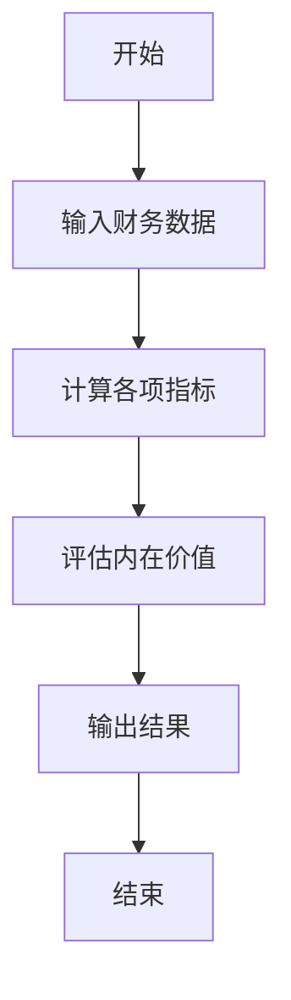

                 


# 《本杰明格雷厄姆的财务分析方法》

> 关键词：本杰明格雷厄姆，财务分析，投资，价值评估，内在价值，安全边际

> 摘要：本杰明格雷厄姆是价值投资的鼻祖，他的财务分析方法为投资者提供了独特的视角来评估股票的内在价值。本文将深入探讨格雷厄姆的价值评估模型、财务报表分析方法、防御性投资策略以及安全边际的概念，并通过实际案例展示其应用。

---

# 第一部分: 本杰明格雷厄姆财务分析方法概述

# 第1章: 本杰明格雷厄姆财务分析方法概述

## 1.1 本杰明格雷厄姆及其投资理念

### 1.1.1 本杰明格雷厄姆的生平简介
本杰明·格雷厄姆（Benjamin Graham）是20世纪最伟大的投资思想家之一，被誉为“价值投资之父”。他出生于1894年，去世于1976年。格雷厄姆的职业生涯始于1920年代，他在金融界的地位主要建立在他在哥伦比亚大学教授证券分析的基础上。他的投资理念影响了无数投资者，包括沃伦·巴菲特、彼得·林奇等。

### 1.1.2 格雷厄姆的价值投资理念
格雷厄姆的投资理念以“安全边际”为核心，主张以低于股票内在价值的价格买入股票。他认为市场是不可预测的，但可以通过基本面分析找到那些被市场低估的股票。他的投资哲学强调长期稳健的投资，而不是短期的市场波动。

### 1.1.3 格雷厄姆投资方法的核心要素
格雷厄姆的投资方法包括以下几个核心要素：
1. **内在价值评估**：通过分析公司的财务报表，计算出股票的内在价值。
2. **安全边际**：买入价格低于内在价值，以降低投资风险。
3. **防御性投资策略**：选择那些财务稳健、利润稳定的公司。
4. **分散投资**：通过投资于多个不同的股票来降低风险。

## 1.2 财务分析方法的背景与意义

### 1.2.1 财务分析方法的定义
财务分析是一种通过对公司财务报表（资产负债表、利润表、现金流量表）进行分析，评估公司财务状况、经营成果和现金流量的过程。它是价值投资的重要工具，帮助投资者找到那些被市场低估的股票。

### 1.2.2 格雷厄姆财务分析方法的背景
格雷厄姆在20世纪初开始研究股票市场，当时市场波动剧烈，投资者往往被短期市场波动所迷惑。他意识到，通过基本面分析找到股票的内在价值，可以帮助投资者做出更理性的投资决策。

### 1.2.3 财务分析方法在投资中的作用
财务分析方法在投资中的作用包括：
1. **评估公司财务状况**：通过分析资产负债表，了解公司的资产、负债和所有者权益。
2. **评估公司盈利能力**：通过分析利润表，了解公司的收入和利润情况。
3. **评估公司现金流**：通过分析现金流量表，了解公司的现金流状况。

## 1.3 格雷厄姆财务分析方法的核心要素

### 1.3.1 股票的内在价值
股票的内在价值是指公司未来现金流的现值。格雷厄姆认为，股票的价格应该基于公司的内在价值来确定。如果股票的价格低于内在价值，就是投资的好机会。

### 1.3.2 财务报表分析的重要性
格雷厄姆强调，财务报表分析是评估公司内在价值的核心工具。他特别关注公司的盈利能力、成长性和财务稳定性。

### 1.3.3 安全边际的概念
安全边际是指股票的市场价格低于其内在价值的部分。格雷厄姆认为，通过买入价格低于内在价值的股票，可以降低投资风险。

## 1.4 格雷厄姆方法与其他财务分析方法的对比

### 1.4.1 传统财务分析方法的优缺点
传统财务分析方法的优点是简单易懂，适用于大多数投资者。缺点是忽视了市场波动和公司未来发展的不确定性。

### 1.4.2 格雷厄姆方法的独特性
格雷厄姆方法的独特性在于它结合了安全边际和内在价值的概念，强调在市场价格低于内在价值时买入股票。

### 1.4.3 格雷厄姆方法的适用场景
格雷厄姆方法适用于那些希望长期稳健投资的投资者，特别是那些愿意花时间进行基本面分析的投资者。

## 1.5 本章小结
本章介绍了本杰明格雷厄姆的投资理念和财务分析方法的核心要素，包括内在价值评估、安全边际和防御性投资策略。格雷厄姆的方法为投资者提供了一种系统化的方式来评估股票的价值，并帮助他们在市场波动中保持稳健。

---

# 第2章: 格雷厄姆价值评估模型

## 2.1 格雷厄姆价值评估模型的基本原理

### 2.1.1 模型的定义与目标
格雷厄姆价值评估模型的目标是通过分析公司的财务报表，计算出股票的内在价值。该模型基于以下假设：
- 公司的未来现金流可以被合理预测。
- 股票的价值等于公司未来现金流的现值。

### 2.1.2 模型的核心假设
格雷厄姆模型的核心假设包括：
- 公司的盈利能力是稳定的。
- 股票的市场价格与内在价值之间存在一定的差距。

### 2.1.3 模型的输入变量与输出结果
格雷厄姆模型的输入变量包括：
- 净利润
- 股东权益
- 加权平均资本成本

模型的输出结果是股票的内在价值。

## 2.2 格雷厄姆价值评估模型的数学公式

### 2.2.1 模型的公式推导
格雷厄姆模型的公式可以表示为：
$$ V = \frac{E}{1 + r} $$
其中，\( V \) 是股票的内在价值，\( E \) 是公司的净利润，\( r \) 是加权平均资本成本。

### 2.2.2 公式的变量解释
- \( V \)：股票的内在价值
- \( E \)：公司的净利润
- \( r \)：加权平均资本成本

### 2.2.3 公式的应用场景
格雷厄姆模型适用于那些净利润稳定、财务状况良好的公司。

## 2.3 格雷厄姆价值评估模型的算法实现

### 2.3.1 算法流程图


### 2.3.2 算法的Python实现
```python
def graham_value_estimation(net_profit, wacc):
    intrinsic_value = net_profit / (1 + wacc)
    return intrinsic_value

# 示例数据
net_profit = 1000000
wacc = 0.1

intrinsic_value = graham_value_estimation(net_profit, wacc)
print(f"股票的内在价值为：{intrinsic_value}")
```

## 2.4 本章小结
本章详细介绍了格雷厄姆价值评估模型的基本原理、数学公式和算法实现。通过模型，投资者可以估算出股票的内在价值，从而做出更明智的投资决策。

---

# 第3章: 财务报表分析与股票估值

## 3.1 财务报表分析的重要性

### 3.1.1 资产负债表分析
资产负债表反映了公司的资产、负债和所有者权益。通过分析资产负债表，可以了解公司的财务状况和偿债能力。

### 3.1.2 利润表分析
利润表反映了公司的收入和利润情况。通过分析利润表，可以了解公司的盈利能力。

### 3.1.3 现金流量表分析
现金流量表反映了公司的现金流情况。通过分析现金流量表，可以了解公司的现金流入和流出情况。

## 3.2 股票估值的关键指标

### 3.2.1 市盈率（P/E比率）
市盈率是股票价格与每股收益的比率。公式为：
$$ P/E = \frac{P}{E} $$
其中，\( P \) 是股票价格，\( E \) 是每股收益。

### 3.2.2 市净率（P/B比率）
市净率是股票价格与每股净资产的比率。公式为：
$$ P/B = \frac{P}{B} $$
其中，\( P \) 是股票价格，\( B \) 是每股净资产。

## 3.3 财务报表分析的实战案例

### 3.3.1 案例背景介绍
假设我们有一个公司A，其财务报表如下：
- 净利润：100万元
- 股东权益：500万元
- 加权平均资本成本：10%

### 3.3.2 财务报表分析步骤
1. 计算股票的内在价值：
$$ V = \frac{100}{1 + 0.1} = 90.91万元 $$

2. 比较市场价格与内在价值：
- 如果市场价格低于90.91万元，股票被低估。
- 如果市场价格高于90.91万元，股票被高估。

## 3.4 本章小结
本章通过分析财务报表，介绍了股票估值的关键指标，并通过实际案例展示了如何利用格雷厄姆模型进行股票估值。

---

# 第4章: 防御性投资策略

## 4.1 防御性投资策略的核心要素

### 4.1.1 稳健性原则
稳健性原则要求投资者选择那些财务状况稳健、利润稳定的公司。

### 4.1.2 分散投资
分散投资是通过投资于多个不同的股票来降低风险。

## 4.2 防御性投资策略的实施步骤

### 4.2.1 确定投资目标
投资者需要明确自己的投资目标和风险承受能力。

### 4.2.2 选择优质公司
选择那些财务状况稳健、利润稳定的公司。

### 4.2.3 分散投资
通过投资于多个不同的股票来降低风险。

## 4.3 防御性投资策略的实战案例

### 4.3.1 案例背景介绍
假设我们有100万元的资金，计划投资于3只股票。

### 4.3.2 投资组合构建
1. 选择3家财务状况稳健的公司。
2. 每只股票投资30万元。

## 4.4 本章小结
本章介绍了防御性投资策略的核心要素和实施步骤，并通过实际案例展示了如何构建投资组合。

---

# 第5章: 市场波动与投资者心理

## 5.1 市场波动的定义与影响

### 5.1.1 市场波动的定义
市场波动是指股票价格的短期波动，通常由市场情绪和投资者心理驱动。

### 5.1.2 市场波动的影响
市场波动会影响投资者的决策，但格雷厄姆认为市场波动是投资的机会。

## 5.2 投资者心理与行为

### 5.2.1 投资者心理的定义
投资者心理是指投资者在面对市场波动时的心理状态和行为。

### 5.2.2 投资者行为的分类
投资者行为可以分为理性行为和非理性行为。

## 5.3 市场波动与投资者心理的关系

### 5.3.1 市场波动如何影响投资者心理
市场波动会导致投资者情绪波动，从而影响他们的投资决策。

### 5.3.2 投资者心理如何影响市场波动
投资者的心理状态会影响市场波动，例如，恐慌情绪会导致市场下跌。

## 5.4 本章小结
本章分析了市场波动与投资者心理的关系，并强调了在市场波动中保持冷静的重要性。

---

# 第6章: 安全边际的应用

## 6.1 安全边际的定义与作用

### 6.1.1 安全边际的定义
安全边际是指股票的市场价格低于其内在价值的部分。

### 6.1.2 安全边际的作用
安全边际可以降低投资风险，提高投资的安全性。

## 6.2 安全边际的计算方法

### 6.2.1 安全边际的计算公式
安全边际的计算公式为：
$$ \text{安全边际} = V - P $$
其中，\( V \) 是股票的内在价值，\( P \) 是股票的市场价格。

## 6.3 安全边际的实战应用

### 6.3.1 案例背景介绍
假设股票A的内在价值为100元，市场价格为90元。

### 6.3.2 安全边际计算
$$ \text{安全边际} = 100 - 90 = 10元 $$

### 6.3.3 投资决策
由于安全边际为10元，股票A被低估，可以考虑买入。

## 6.4 本章小结
本章介绍了安全边际的定义、作用和计算方法，并通过实际案例展示了如何应用安全边际进行投资决策。

---

# 第7章: 实际案例分析

## 7.1 案例背景介绍
假设我们有一个公司B，其财务报表如下：
- 净利润：200万元
- 股东权益：1000万元
- 加权平均资本成本：8%

## 7.2 格雷厄姆模型的应用

### 7.2.1 内在价值计算
$$ V = \frac{200}{1 + 0.08} = 185.19万元 $$

### 7.2.2 安全边际计算
假设市场价格为150万元，则安全边际为：
$$ \text{安全边际} = 185.19 - 150 = 35.19万元 $$

## 7.3 投资决策
由于安全边际为35.19万元，股票B被低估，可以考虑买入。

## 7.4 本章小结
本章通过实际案例展示了格雷厄姆模型的应用，并强调了安全边际在投资决策中的重要性。

---

# 第8章: 总结与展望

## 8.1 本章总结
本章总结了本杰明格雷厄姆财务分析方法的核心内容，包括内在价值评估、财务报表分析、防御性投资策略和安全边际的应用。

## 8.2 未来展望
未来，投资者需要继续学习和实践，以应对不断变化的市场环境。格雷厄姆的方法仍然是价值投资的重要工具。

## 8.3 最佳实践 Tips
- **持续学习**：市场环境不断变化，投资者需要不断学习新的知识和技能。
- **分散投资**：通过分散投资降低风险。
- **长期投资**：坚持长期投资，避免短期市场的波动影响决策。

## 8.4 本章小结
本章总结了全文，并提出了未来的学习和实践方向。

---

# 作者：AI天才研究院/AI Genius Institute & 禅与计算机程序设计艺术 /Zen And The Art of Computer Programming

---

这篇文章通过详细介绍本杰明格雷厄姆的财务分析方法，帮助投资者更好地理解和应用这些方法。从基本原理到实际案例，文章内容全面，结构清晰，适合广大投资者阅读和学习。

