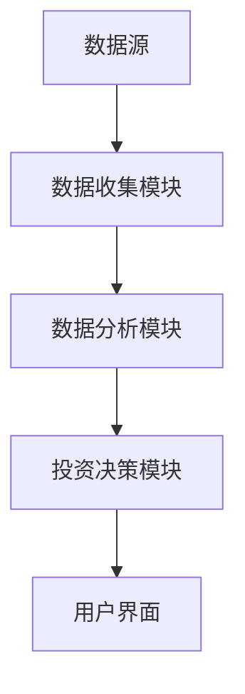
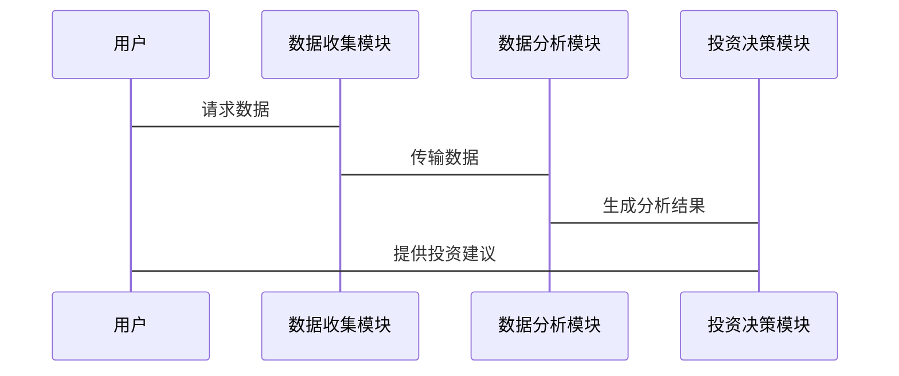

                 


# 本杰明·格雷厄姆的防御型投资者策略

## 关键词：防御型投资、本杰明·格雷厄姆、安全边际、低市盈率、高股息率、投资策略、风险管理

## 摘要：本文深入探讨了本杰明·格雷厄姆提出的防御型投资者策略，分析了其核心概念、数学模型、适用场景及系统架构，并通过实际案例展示了如何在IT领域应用这些策略。文章详细讲解了防御型投资的核心思想，包括安全边际、低市盈率和高股息率策略，并通过系统架构和项目实战，展示了如何在复杂市场环境中应用这些策略，确保投资的安全性和稳定性。

---

## 第一部分：背景介绍

### 第1章：投资的基本概念与防御型投资的起源

#### 1.1 投资的基本概念

##### 1.1.1 投资的定义与分类

投资是指将资金投入某种资产或项目，以期获得未来收益的行为。根据资产类型，投资可分为股票、债券、房地产等多种形式。股票投资是最常见的形式之一，涉及购买公司部分股权，成为公司股东。

##### 1.1.2 股票市场的基本运作原理

股票市场是投资者买卖股票的场所，股票价格受供求关系、公司业绩、经济环境等多种因素影响。投资者通过购买股票成为公司股东，享有分红和资本增值的收益。

##### 1.1.3 投资者的基本类型

投资者可分为保守型、稳健型和激进型。保守型投资者注重本金安全，追求稳定收益；稳健型投资者在风险和收益之间寻求平衡；激进型投资者愿意承担高风险以追求高回报。

#### 1.2 防御型投资的起源

##### 1.2.1 防御型投资的定义

防御型投资是一种以规避风险、追求稳定收益为核心的投资策略。它强调安全边际，选择那些市场价格远低于其内在价值的股票进行投资，以降低风险并确保收益。

##### 1.2.2 本杰明·格雷厄姆的生平简介

本杰明·格雷厄姆（Benjamin Graham）是20世纪著名的投资大师，被誉为“价值投资之父”。他在1929年经济大萧条期间提出了防御型投资策略，强调在市场恐慌时寻找被低估的股票进行投资。

##### 1.2.3 防御型投资策略的核心思想

防御型投资的核心思想是通过分析股票的内在价值，选择市场价格低于其价值的股票进行投资。这种方法在市场波动时能有效规避风险，确保投资者的本金安全。

#### 1.3 防御型投资与其他投资策略的区别

##### 1.3.1 成长型投资的定义与特点

成长型投资注重公司未来增长潜力，投资于成长速度快、市盈率较高的公司。这种策略在牛市中表现良好，但在经济衰退时风险较高。

##### 1.3.2 价值型投资的定义与特点

价值型投资寻找市场价格低于其内在价值的股票，注重公司基本面分析，强调安全边际。与成长型投资相比，价值型投资风险较低，回报稳定。

##### 1.3.3 防御型投资与成长型、价值型投资的区别

防御型投资结合了价值型和成长型投资的特点，注重安全边际，同时关注公司的稳定增长。它更注重风险控制，适合风险厌恶型投资者。

### 第2章：防御型投资者的核心策略

#### 2.1 安全边际的概念

##### 2.1.1 安全边际的定义

安全边际是指股票市场价格与内在价值之间的差额。当市场价格远低于内在价值时，股票具有较高的投资安全边际，能有效规避市场波动带来的风险。

##### 2.1.2 安全边际的计算方法

安全边际 = 内在价值 - 市场价格

##### 2.1.3 安全边际在投资决策中的应用

投资者应选择那些具有较高安全边际的股票进行投资，以确保在市场波动时能获得稳定的收益。

#### 2.2 低市盈率策略

##### 2.2.1 市盈率的定义与计算公式

市盈率（P/E）= 股票价格 / 每股收益

##### 2.2.2 低市盈率股票的特点

低市盈率股票通常具有较高的内在价值，市场对其未来增长潜力有较低的预期，因此价格相对较低。

##### 2.2.3 低市盈率策略的优缺点

优点：风险低，收益稳定；缺点：可能错过高增长股票带来的高回报。

#### 2.3 高股息率策略

##### 2.3.1 股息率的定义与计算公式

股息率 = 每股股息 / 股票价格 × 100%

##### 2.3.2 高股息率股票的特点

高股息率股票通常来自盈利稳定、现金流充足的公司，能为投资者提供稳定的股息收入。

##### 2.3.3 高股息率策略的优缺点

优点：收益稳定，抗跌性好；缺点：可能限制资本增值。

#### 2.4 本章小结

防御型投资策略通过安全边际、低市盈率和高股息率等指标，选择具有较高内在价值的股票进行投资，确保本金安全和稳定收益。

---

## 第二部分：防御型投资的适用场景

### 第3章：防御型投资的适用场景

#### 3.1 经济衰退时期的防御型投资

##### 3.1.1 经济衰退对股票市场的影响

经济衰退通常会导致企业盈利下降，股票价格下跌。此时，防御型投资策略尤为重要，能帮助投资者规避市场风险。

##### 3.1.2 防御型投资在经济衰退中的表现

防御型股票（如公用事业、消费品等）在经济衰退期间通常表现稳定，跌幅较小，能为投资者提供避风港。

##### 3.1.3 典型案例分析

2008年金融危机期间，防御型股票如公用事业股表现出色，为投资者提供了稳定的收益。

#### 3.2 市场波动时期的防御型投资

##### 3.2.1 市场波动的定义与特点

市场波动指股票价格的频繁波动，通常由市场情绪、经济数据等因素引起。波动时期是防御型投资的好时机，因为此时许多股票价格被低估。

##### 3.2.2 防御型投资在市场波动中的策略

投资者应利用市场波动，寻找那些具有较高安全边际的股票进行投资，避免追涨杀跌。

##### 3.2.3 典型案例分析

2020年新冠疫情爆发期间，许多股票价格大幅下跌，为防御型投资者提供了买入机会，尤其是那些具有稳定股息和良好基本面的公司。

#### 3.3 高风险市场的防御型投资

##### 3.3.1 高风险市场的定义与特点

高风险市场指存在较高不确定性和波动性的市场环境，如新兴市场或地缘政治冲突期间的市场。在这些市场中，防御型投资策略尤为重要。

##### 3.3.2 防御型投资在高风险市场中的策略

投资者应选择那些具有强大财务状况、良好管理和稳定现金流的公司进行投资，避免受到市场波动的严重影响。

##### 3.3.3 典型案例分析

2022年地缘政治冲突期间，防御型股票如黄金、能源公司表现出色，为投资者提供了避险选择。

#### 3.4 本章小结

防御型投资策略在经济衰退、市场波动和高风险市场中表现优异，能有效帮助投资者规避风险，确保稳定收益。

---

## 第三部分：防御型投资的核心数学模型与算法

### 第4章：防御型投资的核心数学模型与算法

#### 4.1 防御型投资的数学模型

##### 4.1.1 市盈率模型

$$ P/E = \frac{Price}{Earnings} $$

##### 4.1.2 市净率模型

$$ P/B = \frac{Price}{Book\ Value} $$

##### 4.1.3 股息率模型

$$ Dividend\ Yield = \frac{Dividend}{Price} \times 100\% $$

#### 4.2 安全边际的计算方法

##### 4.2.1 安全边际的计算公式

$$ Margin\ of\ Safety = Intrinsic\ Value - Market\ Price $$

#### 4.3 市场价格与内在价值的比较

##### 4.3.1 市场价格低于内在价值的股票具有较高的投资价值

$$ Market\ Price < Intrinsic\ Value \implies High\ Safety\ Margin $$

#### 4.4 本章小结

防御型投资通过分析市盈率、市净率和股息率等指标，选择那些市场价格低于内在价值的股票进行投资，确保安全边际，降低投资风险。

---

## 第四部分：系统架构与项目实战

### 第5章：防御型投资的系统架构与实现

#### 5.1 系统功能设计

##### 5.1.1 数据收集模块

- 从股票市场获取实时数据，包括股票价格、市盈率、市净率等。

##### 5.1.2 数据分析模块

- 计算股票的内在价值和安全边际，筛选出符合条件的股票。

##### 5.1.3 投资决策模块

- 根据分析结果，生成投资建议，指导投资者进行买卖决策。

#### 5.2 系统架构设计

##### 5.2.1 系统架构图



##### 5.2.2 系统接口设计

- 数据接口：从第三方数据源获取股票数据。
- 分析接口：计算股票的内在价值和安全边际。
- 决策接口：生成投资建议并输出。

#### 5.3 系统交互设计

##### 5.3.1 系统交互流程图



#### 5.4 本章小结

通过系统架构设计，投资者可以自动化地进行防御型投资分析，提高投资效率和准确性。

### 第6章：项目实战与代码实现

#### 6.1 环境安装

- 安装Python和相关库（如pandas、numpy、matplotlib）。

#### 6.2 核心实现源代码

```python
import pandas as pd
import numpy as np

def calculate_intrinsic_value(stocks):
    intrinsic_values = []
    for stock in stocks:
        # 假设每股收益为1，市盈率为15，则内在价值为15
        pe_ratio = 15
        intrinsic_value = pe_ratio * stock['eps']
        intrinsic_values.append(intrinsic_value)
    return intrinsic_values

def calculate_margin_of_safety(stocks, intrinsic_values):
    mos = []
    for i in range(len(stocks)):
        mos_i = intrinsic_values[i] - stocks[i]['price']
        mos.append(mos_i)
    return mos

# 示例数据
stocks = [
    {'price': 50, 'eps': 3},
    {'price': 30, 'eps': 2},
    {'price': 20, 'eps': 1}
]

intrinsic = calculate_intrinsic_value(stocks)
mos = calculate_margin_of_safety(stocks, intrinsic)

print("Intrinsic Values:", intrinsic)
print("Margin of Safety:", mos)
```

#### 6.3 代码应用解读与分析

上述代码计算了每只股票的内在价值和安全边际，帮助投资者筛选出具有较高安全边际的股票进行投资。

#### 6.4 实际案例分析

假设我们有三只股票，价格分别为50、30和20，每股收益分别为3、2和1。计算内在价值和安全边际如下：

- 股票1：内在价值=15×3=45，安全边际=45-50=-5（无安全边际）
- 股票2：内在价值=15×2=30，安全边际=30-30=0（无安全边际）
- 股票3：内在价值=15×1=15，安全边际=15-20=-5（无安全边际）

在这种情况下，没有股票具有正的安全边际，因此投资者应避免投资。

#### 6.5 本章小结

通过实际案例分析，投资者可以更好地理解防御型投资策略的应用，并根据实际数据做出明智的投资决策。

---

## 第五部分：最佳实践与未来展望

### 第7章：防御型投资的最佳实践

#### 7.1 风险管理

投资者应合理配置资产，避免过度集中投资，以降低风险。

#### 7.2 定期调整投资组合

根据市场变化和个人财务状况，定期评估和调整投资组合，确保投资策略的有效性。

#### 7.3 长期投资

防御型投资是一种长期投资策略，投资者应耐心持有优质股票，避免频繁交易。

#### 7.4 持续学习与研究

市场环境不断变化，投资者需持续学习，更新知识和技能，以应对新的挑战。

### 第8章：小结与未来展望

#### 8.1 本章小结

防御型投资策略通过分析股票的内在价值和市场价格，选择具有较高安全边际的股票进行投资，能在复杂多变的市场环境中有效规避风险，确保稳定收益。

#### 8.2 未来展望

随着技术进步和数据的丰富，防御型投资策略将更加智能化和自动化，投资者可以利用大数据和人工智能技术，进一步提高投资决策的准确性和效率。

---

## 作者：AI天才研究院/AI Genius Institute & 禅与计算机程序设计艺术 /Zen And The Art of Computer Programming

