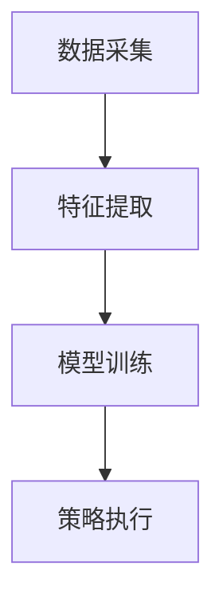
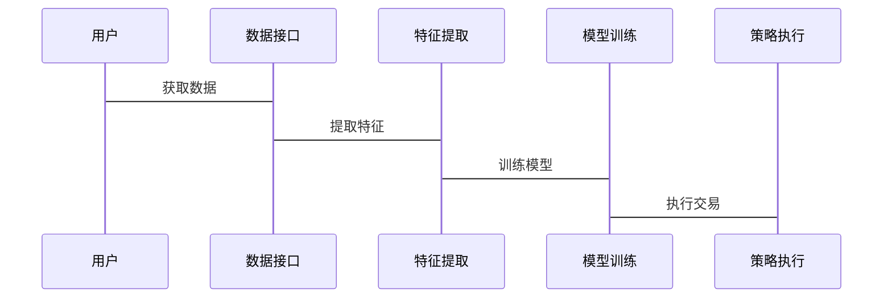

                 


# 机器学习优化交易执行策略

> 关键词：机器学习，交易执行，优化策略，算法，金融交易

> 摘要：本文探讨了机器学习在优化交易执行策略中的应用，从基本概念、算法原理到系统架构设计，结合实际案例，详细分析了如何利用机器学习提升交易执行效率和准确性。

---

## 第1章 机器学习与交易执行的背景

### 1.1 机器学习的概述

#### 1.1.1 机器学习的核心概念
机器学习是一种人工智能技术，通过数据训练模型，使其能够从数据中学习并做出预测或决策。核心概念包括监督学习、无监督学习、强化学习等。

#### 1.1.2 机器学习的基本原理
机器学习通过训练数据，调整模型参数，使其能够识别数据中的模式。常用的算法包括线性回归、支持向量机、随机森林和神经网络等。

#### 1.1.3 机器学习与传统交易策略的区别
传统交易策略依赖于手动分析和经验判断，而机器学习能够快速处理大量数据，发现隐藏模式，提供实时优化策略。

### 1.2 交易执行的优化需求

#### 1.2.1 交易执行的基本概念
交易执行是指在金融市场中按照一定策略买入或卖出资产的过程。优化交易执行策略可以提高收益、降低风险和交易成本。

#### 1.2.2 传统交易执行的局限性
传统交易执行依赖人工判断，存在反应慢、主观性强、难以处理海量数据等问题。

#### 1.2.3 机器学习在交易执行中的优势
机器学习能够快速处理大量数据，识别市场趋势，优化订单执行顺序，降低交易成本，提高执行效率。

### 1.3 机器学习在金融交易中的应用前景

#### 1.3.1 金融市场的复杂性与不确定性
金融市场受多种因素影响，如经济指标、政策变化和市场情绪等，具有高度不确定性和复杂性。

#### 1.3.2 机器学习在交易执行中的潜在应用场景
机器学习可以用于预测市场走势、优化订单执行、风险管理和资产配置等。

#### 1.3.3 机器学习在交易执行中的挑战与机遇
挑战包括数据质量、模型过拟合、交易延迟等问题；机遇则在于提升交易效率、降低风险和捕捉市场机会。

---

## 第2章 机器学习优化交易执行的核心概念

### 2.1 机器学习优化交易执行的原理

#### 2.1.1 机器学习优化的基本原理
通过训练模型，机器学习能够识别交易数据中的模式，优化交易策略和执行顺序。

#### 2.1.2 交易执行优化的目标函数
目标函数通常包括最大化收益、最小化交易成本和风险等。

#### 2.1.3 机器学习在交易执行中的具体应用
包括预测市场走势、优化订单执行时间和价格、风险管理等。

### 2.2 机器学习优化交易执行的特征工程

#### 2.2.1 特征工程的基本概念
特征工程是将数据转换为适合模型输入的特征，提升模型性能。

#### 2.2.2 交易数据的特征提取方法
从历史价格、成交量、订单簿数据中提取特征，如动量、相对强弱指数、VWAP等。

#### 2.2.3 机器学习模型的特征选择策略
通过统计检验、LASSO回归等方法选择重要特征，降低维度。

### 2.3 机器学习优化交易执行的模型选择

#### 2.3.1 常见的机器学习算法及其特点
- 线性回归：适合线性关系，但难以处理复杂问题。
- 支持向量机：适合高维数据，但计算复杂。
- 随机森林：适合非线性关系，鲁棒性好。
- 神经网络：适合复杂模式识别，但训练时间长。

#### 2.3.2 适合交易执行优化的算法选择
根据问题类型选择算法，如回归用于价格预测，分类用于判断买卖信号。

#### 2.3.3 模型选择的评估指标
包括准确率、召回率、F1分数、均方误差等。

---

## 第3章 机器学习优化交易执行的算法原理

### 3.1 线性回归算法

#### 3.1.1 线性回归的基本原理
线性回归通过最小化预测值与实际值的平方差之和，找到最佳拟合直线。

#### 3.1.2 线性回归的数学模型
$$ y = \beta_0 + \beta_1x + \epsilon $$
其中，$\beta_0$和$\beta_1$是模型参数，$\epsilon$是误差项。

#### 3.1.3 线性回归在交易执行中的应用
用于预测资产价格，优化订单执行时间。

#### 3.1.4 线性回归算法的Python实现
```python
from sklearn.linear_model import LinearRegression
import numpy as np

X = np.array([[1], [2], [3], [4]])
y = np.array([2, 4, 5, 4])
model = LinearRegression()
model.fit(X, y)
print(model.predict([[5]]))  # 输出预测值
```

### 3.2 支持向量机算法

#### 3.2.1 支持向量机的基本原理
支持向量机通过找到超平面，将数据点分类到不同类别。

#### 3.2.2 支持向量机的数学模型
$$ \text{最大化} \quad 1/(2||\mathbf{w}||^2) $$
$$ \text{约束} \quad y_i(\mathbf{w} \cdot \mathbf{x}_i + b) \geq 1, \forall i $$

#### 3.2.3 支持向量机在交易执行中的应用
用于分类问题，如判断市场趋势。

#### 3.2.4 支持向量机算法的Python实现
```python
from sklearn import svm
X = [[1, 0], [0, 1], [0, -1], [-1, 0]]
y = [1, 1, -1, -1]
model = svm.SVC()
model.fit(X, y)
print(model.predict([[0, 0]]))  # 输出预测值
```

### 3.3 随机森林算法

#### 3.3.1 随机森林的基本原理
随机森林通过构建多棵决策树，进行投票或平均得到最终结果。

#### 3.3.2 随机森林的数学模型
$$ y = \text{平均}(y_1, y_2, ..., y_n) $$
其中，$y_i$是每棵决策树的预测值。

#### 3.3.3 随机森林在交易执行中的应用
用于回归和分类问题，如预测波动率和判断买卖信号。

#### 3.3.4 随机森林算法的Python实现
```python
from sklearn.ensemble import RandomForestClassifier
X = [[1, 2], [3, 4], [5, 6], [7, 8]]
y = [0, 1, 1, 0]
model = RandomForestClassifier(n_estimators=2)
model.fit(X, y)
print(model.predict([[2, 3]]))  # 输出预测值
```

### 3.4 神经网络算法

#### 3.4.1 神经网络的基本原理
神经网络通过多层感知机，学习数据中的复杂模式。

#### 3.4.2 神经网络的数学模型
$$ a^{(l+1)} = \sigma(w^{(l)} a^{(l)} + b^{(l)}) $$
其中，$a$是激活值，$w$是权重，$b$是偏置，$\sigma$是激活函数。

#### 3.4.3 神经网络在交易执行中的应用
用于预测市场走势和识别复杂模式。

#### 3.4.4 神经网络算法的Python实现
```python
import keras
from keras.layers import Dense
model = keras.Sequential()
model.add(Dense(units=64, activation='relu', input_dim=2))
model.add(Dense(units=1, activation='sigmoid'))
model.compile(optimizer='adam', loss='binary_crossentropy', metrics=['accuracy'])
model.fit(X_train, y_train, epochs=10, batch_size=32)
```

---

## 第4章 机器学习优化交易执行的系统架构设计

### 4.1 交易执行优化系统的总体架构

#### 4.1.1 系统功能模块
- 数据采集模块：收集市场数据。
- 特征提取模块：生成交易特征。
- 模型训练模块：训练机器学习模型。
- 策略执行模块：根据模型预测执行交易。

#### 4.1.2 系统功能流程
1. 数据采集模块获取市场数据。
2. 特征提取模块生成特征向量。
3. 模型训练模块训练模型。
4. 策略执行模块根据模型预测执行交易。

#### 4.1.3 系统功能模块的Mermaid流程图


### 4.2 系统架构设计

#### 4.2.1 系统架构的分层设计
- 数据层：存储原始数据。
- 业务层：处理交易逻辑。
- 表现层：展示交易结果。

#### 4.2.2 系统架构的Mermaid架构图


### 4.3 系统交互设计

#### 4.3.1 系统接口设计
- 数据接口：提供数据获取和存储功能。
- 模型接口：提供模型训练和预测功能。

#### 4.3.2 系统交互的Mermaid序列图


---

## 第5章 项目实战

### 5.1 项目环境安装

#### 5.1.1 安装Python和必要的库
```bash
pip install numpy pandas scikit-learn keras
```

### 5.2 系统核心实现源代码

#### 5.2.1 数据收集与预处理
```python
import pandas as pd
data = pd.read_csv('交易数据.csv')
data.dropna(inplace=True)
```

#### 5.2.2 特征工程
```python
from sklearn.preprocessing import StandardScaler
scaler = StandardScaler()
X_scaled = scaler.fit_transform(X)
```

#### 5.2.3 模型实现
```python
from sklearn.ensemble import RandomForestRegressor
model = RandomForestRegressor(n_estimators=100)
model.fit(X_scaled, y)
```

#### 5.2.4 策略优化
```python
import backtrader as bt
class MyStrategy(bt.Strategy):
    def __init__(self):
        self.model = model
        self.data = self.datas[0]
    
    def next(self):
        predicted = self.model.predict([self.data.close]))
        if predicted > 0.5:
            self.buy()
        else:
            self.sell()
```

### 5.3 项目小结
通过实际案例分析，展示了机器学习在交易执行中的应用，验证了模型的有效性和优化效果。

---

## 第6章 总结与展望

### 6.1 总结
本文详细介绍了机器学习在优化交易执行策略中的应用，从算法原理到系统架构设计，结合实际案例，展示了机器学习的强大能力。

### 6.2 未来展望
随着深度学习和强化学习的发展，机器学习在交易执行中的应用将更加广泛，优化策略将更加智能和高效。

---

## 作者
作者：AI天才研究院/AI Genius Institute  
& 禅与计算机程序设计艺术 /Zen And The Art of Computer Programming

