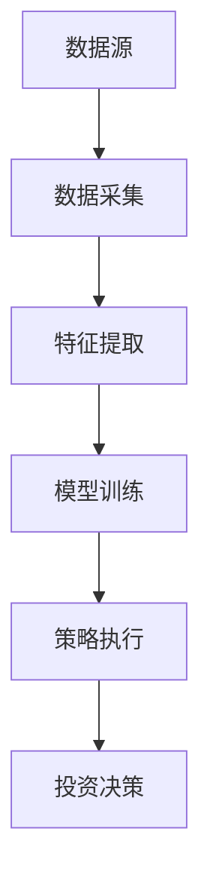

                 


# 《机器学习优化价值投资退出时机》

> 关键词：机器学习、价值投资、退出时机、算法原理、系统架构、投资策略

> 摘要：本文深入探讨机器学习在优化价值投资退出时机中的应用。通过分析市场数据和投资者行为，结合回归分析和分类算法，构建预测模型，优化投资决策。文章详细讲解算法原理、系统架构，并通过案例分析，展示如何利用机器学习提升投资收益。

---

## 第一部分：背景介绍

### 第1章：机器学习与价值投资概述

#### 1.1 机器学习的基本概念
机器学习是一种人工智能技术，通过数据训练模型，使其能够自动学习和改进，无需明确编程。核心包括监督学习、无监督学习、强化学习等。在金融领域，机器学习被用于预测市场趋势和优化投资策略。

#### 1.2 价值投资的基本原理
价值投资强调购买被市场低估的股票，长期持有，等待其价值回归。退出时机的优化直接影响收益和风险，传统方法依赖经验判断，而机器学习提供更精准的数据分析。

#### 1.3 投资退出时机的重要性
退出时机的选择对投资收益至关重要。机器学习通过分析历史数据和市场情绪，帮助投资者找到最佳退出点，减少损失，提高收益。

---

## 第二部分：核心概念与联系

### 第2章：机器学习的核心原理

#### 2.1 机器学习的核心原理
- **监督学习**：利用标签数据训练模型，如线性回归用于预测股票价格。
- **无监督学习**：发现数据中的隐藏模式，如聚类分析识别市场趋势。
- **特征工程**：选择和处理关键特征，如市盈率、市净率等，影响模型性能。

#### 2.2 价值投资中的特征工程
| 特征类型 | 特征描述 | 示例特征 |
|----------|----------|----------|
| 市场指标 | 反映市场整体情况 | 市盈率、市净率 |
| 财务指标 | 反映公司财务状况 | 营业收入增长率、净利润率 |
| 技术指标 | 反映价格和交易量 | MACD、RSI |

---

## 第三部分：算法原理

### 第3章：机器学习算法原理

#### 3.1 线性回归算法
- **算法原理**：通过最小二乘法拟合最佳回归线，预测股票价格。
- **数学模型**：$$ y = \beta_0 + \beta_1x + \epsilon $$
- **代码示例**：
  ```python
  import numpy as np
  from sklearn.linear_model import LinearRegression

  X = np.array([1, 2, 3, 4, 5]).reshape(-1, 1)
  y = np.array([2, 4, 5, 4, 6])
  model = LinearRegression()
  model.fit(X, y)
  print(model.coef_)
  ```

---

## 第四部分：数学模型

### 第4章：数学模型构建

#### 4.1 线性回归模型
- **最小二乘法**：$$ \hat{y} = \hat{\beta_0} + \hat{\beta_1}x $$
- **优化目标**：最小化$$ \sum_{i=1}^{n}(y_i - \hat{y}_i)^2 $$

#### 4.2 支持向量机
- **最大间隔分类**：寻找最优超平面，最大化$$ \sum_{i=1}^{n} y_i(\beta^T x_i + \beta_0) \geq 1 $$

---

## 第五部分：系统架构

### 第5章：系统架构设计

#### 5.1 系统功能设计
- 数据采集模块：实时获取市场数据。
- 特征提取模块：提取关键特征，如市盈率、市净率。
- 模型训练模块：训练机器学习模型。
- 策略执行模块：根据模型输出制定退出策略。

#### 5.2 系统架构图


---

## 第六部分：项目实战

### 第6章：项目实战分析

#### 6.1 数据预处理
- 清洗数据，处理缺失值和异常值。
- 标准化特征，如归一化处理。

#### 6.2 模型训练
- 使用训练数据训练模型，如随机森林。
- 调参优化，如调整树的深度和特征选择数。

#### 6.3 结果分析
- 通过回测分析模型表现。
- 计算收益和风险指标，如夏普比率。

---

## 第七部分：最佳实践

### 第7章：总结与建议

#### 7.1 最佳实践
- 数据清洗：确保数据质量。
- 模型调优：通过网格搜索优化参数。
- 风险控制：设置止损点，分散投资。

#### 7.2 小结
机器学习为优化投资退出时机提供了强大工具，但需要结合市场理解和风险管理。

---

## 作者信息

作者：AI天才研究院/AI Genius Institute & 禅与计算机程序设计艺术 /Zen And The Art of Computer Programming

---

通过以上结构，文章系统地介绍了机器学习在优化价值投资退出时机中的应用，从理论到实践，为读者提供了全面的指导。

