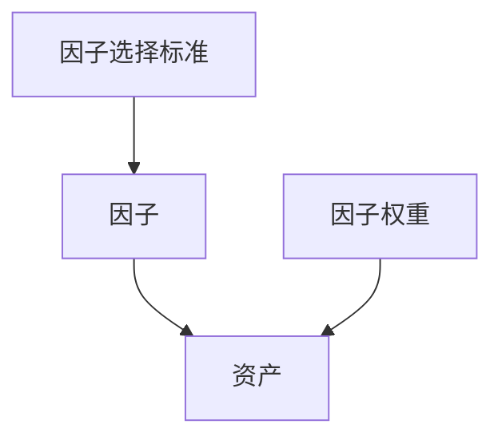
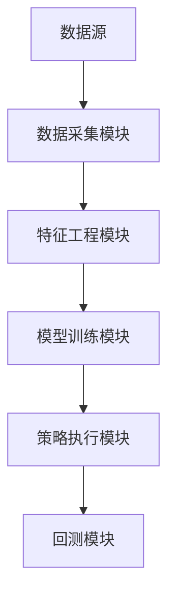

                 


# 机器学习优化多因子选股模型

> 关键词：机器学习，多因子选股，量化投资，因子模型，金融算法

> 摘要：本文探讨如何利用机器学习算法优化传统的多因子选股模型，通过结合金融数据与先进的人工智能技术，提升投资决策的效率和准确性。文章从基础概念入手，详细分析多因子模型与机器学习的结合方式，并通过实际案例展示如何构建和优化模型，为量化投资提供新的思路。

---

# 第1章: 机器学习与多因子选股模型概述

## 1.1 机器学习的基本概念

### 1.1.1 机器学习的定义与核心概念

机器学习是一种人工智能技术，通过数据训练模型，使其能够从数据中学习并做出预测或决策。核心概念包括监督学习、无监督学习、半监督学习和强化学习。监督学习通过标记数据训练模型，如线性回归和随机森林；无监督学习在无标签数据中发现模式，如聚类和降维；半监督学习结合两者；强化学习通过奖励机制优化决策。

### 1.1.2 机器学习的分类与应用场景

机器学习分为监督学习、无监督学习、半监督学习和强化学习。监督学习适用于回归和分类问题，如预测股票价格；无监督学习用于聚类和降维，如客户细分；强化学习用于策略优化，如游戏AI。

### 1.1.3 机器学习在金融领域的应用潜力

在金融领域，机器学习用于量化投资、风险管理、信用评分等。量化投资中，机器学习帮助发现市场规律，优化交易策略，提高收益。

## 1.2 多因子选股模型的基本概念

### 1.2.1 多因子模型的定义与特点

多因子模型通过多个因子（如市值、收益波动率）来解释资产回报。与单因子模型相比，多因子模型更全面，能捕捉更多市场信息。

### 1.2.2 多因子模型的分类与选择

多因子模型分为Fama-French三因子模型、APT模型等。选择因子时需考虑因子的解释力、相关性和可交易性。

### 1.2.3 多因子模型在投资决策中的作用

多因子模型帮助投资者构建组合，分散风险，捕捉超额收益。

## 1.3 机器学习与多因子选股的结合

### 1.3.1 机器学习在因子筛选中的优势

机器学习能处理非线性关系，发现传统方法难以捕捉的模式。如随机森林和梯度提升树能自动筛选重要因子。

### 1.3.2 多因子选股模型的优化方向

利用机器学习优化因子选择、权重分配和模型预测，提升选股效果。

### 1.3.3 机器学习与传统因子模型的对比

机器学习模型更灵活，但传统模型解释性更强。结合两者，可优势互补。

## 1.4 本章小结

---

# 第2章: 多因子选股模型的核心概念与联系

## 2.1 多因子模型的核心要素

### 2.1.1 市场因子（Market Factor）

市场因子代表市场整体风险，如大盘走势。Fama-French三因子模型中的市场因子通过市值加权指数计算。

### 2.1.2 因子选择的标准与方法

因子选择需满足解释力、相关性和可交易性。常用方法包括回归分析和信息准则（如AIC、BIC）。

### 2.1.3 因子权重的确定与调整

因子权重反映其重要性，可通过回归系数或模型性能优化确定。权重调整需考虑因子的相关性和市场变化。

## 2.2 机器学习算法与多因子模型的关系

### 2.2.1 机器学习算法的分类与适用场景

监督学习适用于因子筛选，无监督学习用于发现因子间的关系，强化学习用于动态调整因子权重。

### 2.2.2 机器学习在因子筛选中的应用

如使用LASSO回归进行因子筛选，减少因子数量，降低过拟合风险。

### 2.2.3 机器学习与传统因子模型的融合

结合两者，利用机器学习优化传统模型，提升预测能力。例如，使用随机森林改进因子权重。

## 2.3 多因子模型的ER实体关系图



## 2.4 本章小结

---

# 第3章: 机器学习优化多因子选股模型的算法原理

## 3.1 机器学习算法在多因子选股中的应用

### 3.1.1 线性回归模型

线性回归用于预测资产收益，形式为：

$$ y = \beta_0 + \beta_1x_1 + \beta_2x_2 + \cdots + \beta_nx_n + \epsilon $$

其中，$y$为收益，$x_i$为因子，$\beta_i$为回归系数。

### 3.1.2 支持向量机（SVM）

SVM用于分类问题，如将股票分为上涨和下跌两类。通过核函数处理非线性关系，提升分类准确率。

### 3.1.3 随机森林与梯度提升树（GBDT）

随机森林通过集成决策树提升性能，避免过拟合；GBDT通过梯度提升优化预测，适合处理复杂关系。

## 3.2 基于机器学习的多因子选股算法流程

### 3.2.1 数据预处理与特征工程

- 数据清洗：处理缺失值、异常值。
- 特征选择：使用LASSO回归筛选重要因子。
- 数据标准化：归一化处理。

### 3.2.2 模型训练与优化

- 划分训练集和测试集。
- 调参：使用网格搜索优化模型参数。
- 交叉验证：评估模型泛化能力。

### 3.2.3 模型评估与验证

- 准确率、召回率、F1分数：评估分类模型性能。
- 均方误差（MSE）、R²：评估回归模型性能。

## 3.3 机器学习算法的数学模型与公式

### 3.3.1 线性回归模型公式

$$ y = \beta_0 + \beta_1x_1 + \beta_2x_2 + \cdots + \beta_nx_n + \epsilon $$

### 3.3.2 随机森林算法的决策树构建过程

随机森林通过构建多个决策树，投票或平均结果进行预测，减少过拟合。

### 3.3.3 GBDT算法的梯度提升过程

GBDT通过多次迭代，每次优化前一阶段的误差，逐步提升模型性能。

## 3.4 本章小结

---

# 第4章: 多因子选股模型的系统分析与架构设计

## 4.1 系统功能设计

### 4.1.1 数据采集模块

从数据库或API获取股票数据，清洗并预处理。

### 4.1.2 特征工程模块

提取因子，如市值、收益波动率，进行标准化处理。

### 4.1.3 模型训练与优化模块

选择算法，训练模型，调整参数，优化性能。

### 4.1.4 策略执行与回测模块

基于模型预测结果，制定交易策略，并回测验证。

## 4.2 系统架构设计

### 4.2.1 分层架构设计

- 数据层：存储和管理数据。
- 业务逻辑层：处理数据，执行算法。
- 表现层：展示结果，提供交互界面。

### 4.2.2 模块之间的交互关系

数据采集模块向特征工程模块传递数据，特征工程模块处理后传递给模型训练模块，模型训练模块生成策略传递给回测模块。

### 4.2.3 系统架构的mermaid图



## 4.3 系统接口设计

### 4.3.1 数据接口

API接口用于获取股票数据，如通过Yahoo Finance API。

### 4.3.2 模型接口

模型训练模块提供API，供其他模块调用。

## 4.4 系统交互设计

### 4.4.1 交互流程

用户输入参数，系统执行数据处理、模型训练、策略生成和回测，最后展示结果。

## 4.5 本章小结

---

# 第5章: 机器学习优化多因子选股模型的项目实战

## 5.1 环境安装与配置

### 5.1.1 安装Python环境

安装Anaconda，配置虚拟环境，安装必要库如pandas、scikit-learn、xgboost。

### 5.1.2 数据源获取

从Yahoo Finance获取历史数据，清洗并存储。

## 5.2 系统核心实现源代码

### 5.2.1 数据预处理代码

```python
import pandas as pd
import numpy as np

# 读取数据
data = pd.read_csv('stock_data.csv')

# 删除缺失值
data.dropna(inplace=True)

# 标准化处理
from sklearn.preprocessing import StandardScaler
scaler = StandardScaler()
scaled_data = scaler.fit_transform(data[['factor1', 'factor2', 'factor3']])
```

### 5.2.2 模型训练代码

```python
from sklearn.ensemble import RandomForestClassifier
from sklearn.metrics import accuracy_score

# 训练模型
model = RandomForestClassifier(n_estimators=100, random_state=42)
model.fit(scaled_data, data['target'])

# 预测
predicted = model.predict(scaled_data)
print("Accuracy:", accuracy_score(data['target'], predicted))
```

## 5.3 代码应用解读与分析

### 5.3.1 数据预处理

清洗数据，标准化处理，确保模型输入一致。

### 5.3.2 模型训练

使用随机森林进行分类，预测股票涨跌，评估准确率。

## 5.4 实际案例分析

### 5.4.1 数据来源与处理

以某段时间内的股票数据为例，提取因子，清洗数据，标准化处理。

### 5.4.2 模型训练与优化

训练随机森林模型，调整参数，如n_estimators和max_depth，优化准确率。

### 5.4.3 策略回测

基于模型预测结果，制定交易策略，回测其表现，评估收益和风险。

## 5.5 项目小结

---

# 第6章: 机器学习优化多因子选股模型的优化与提升

## 6.1 模型优化策略

### 6.1.1 特征选择优化

使用LASSO回归筛选重要因子，减少维度。

### 6.1.2 超参数调优

使用网格搜索或随机搜索优化模型参数，提升性能。

## 6.2 系统性能优化

### 6.2.1 并行计算

利用并行处理加速数据处理和模型训练。

### 6.2.2 模型压缩

简化模型结构，减少计算资源消耗。

## 6.3 最佳实践 tips

### 6.3.1 数据处理建议

确保数据质量，合理处理缺失值和异常值。

### 6.3.2 模型选择建议

根据问题类型选择合适的算法，如分类问题用随机森林，回归问题用线性回归。

### 6.3.3 回测策略建议

制定合理的交易规则，控制风险，避免过度交易。

## 6.4 本章小结

---

# 第7章: 机器学习优化多因子选股模型的未来展望

## 7.1 人工智能技术的最新进展

深度学习在自然语言处理和图像识别中的突破，未来可能应用于金融时间序列分析。

## 7.2 量化投资的未来趋势

智能投顾、算法交易、风险管理将更加依赖机器学习技术。

## 7.3 机器学习优化多因子选股模型的未来研究方向

探索新的因子，结合NLP技术分析文本数据，动态调整模型。

## 7.4 本章小结

---

# 作者：AI天才研究院/AI Genius Institute & 禅与计算机程序设计艺术 /Zen And The Art of Computer Programming

