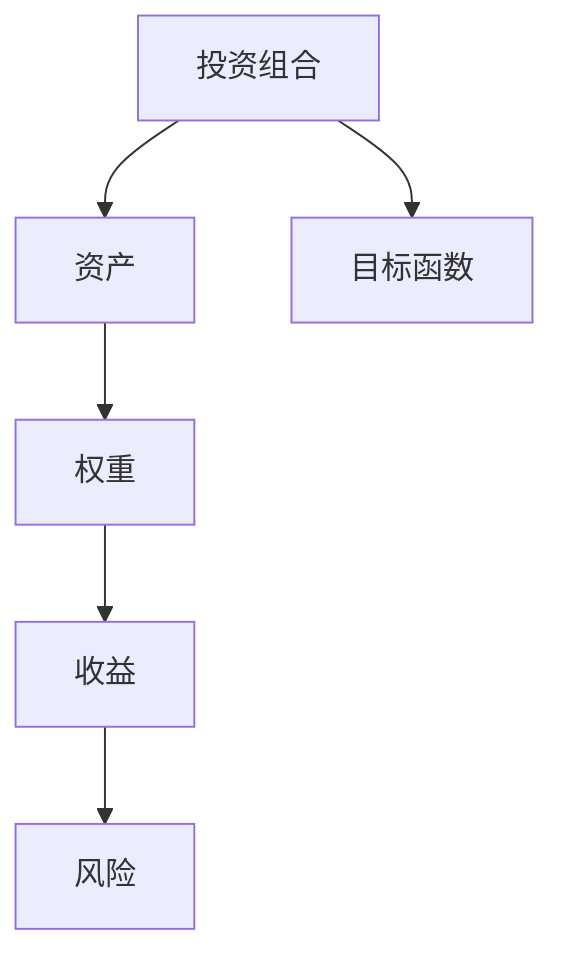
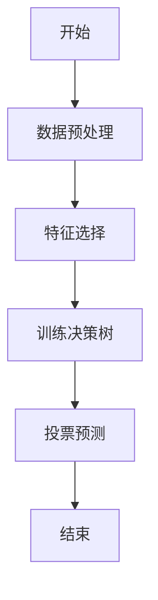
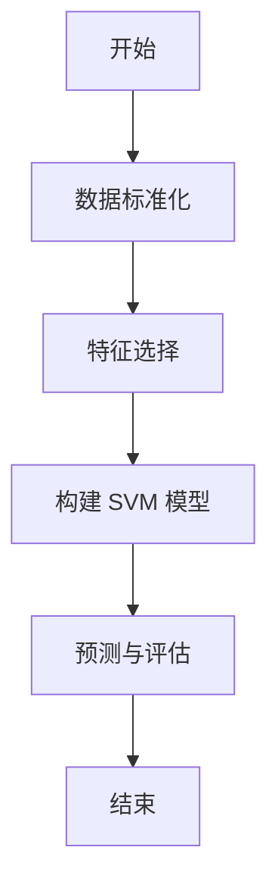
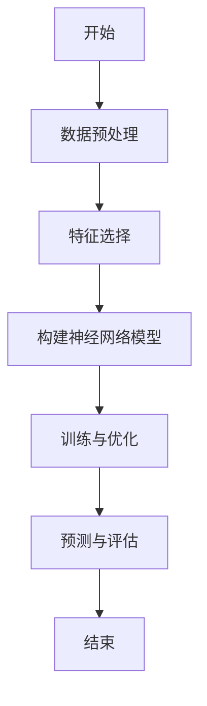
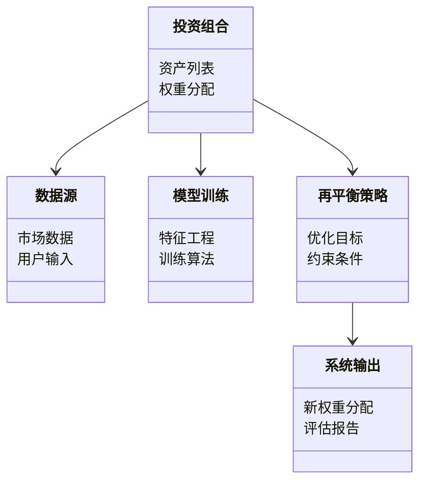
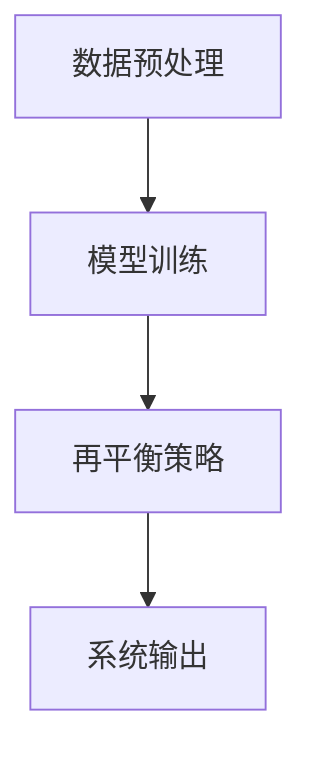
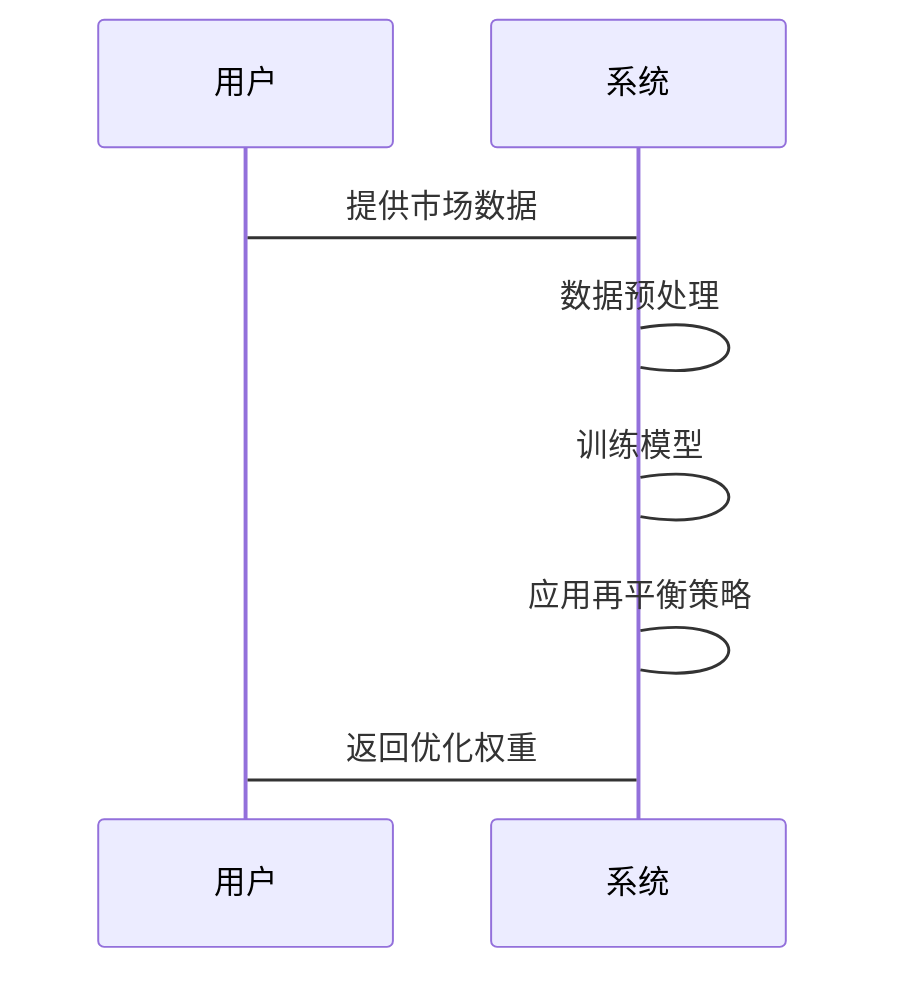

                 


# 机器学习优化投资组合再平衡策略

> 关键词：机器学习、投资组合优化、再平衡策略、金融算法、风险管理、收益最大化、资产配置

> 摘要：本文深入探讨了机器学习在投资组合再平衡策略中的应用，分析了传统方法的局限性，并提出了一种基于机器学习的优化方法。通过结合具体算法和系统设计，展示了如何利用机器学习提升投资组合的收益和风险管理能力，为金融从业者和研究人员提供了新的视角和实践指南。

---

## 第一部分：背景介绍

### 第1章：机器学习与投资组合优化基础

#### 1.1 机器学习基础

##### 1.1.1 机器学习的定义与核心概念
机器学习是一种人工智能技术，通过数据和经验来训练模型，使其能够进行预测或决策。核心概念包括监督学习、无监督学习、强化学习和半监督学习。

##### 1.1.2 机器学习的分类与应用场景
- **监督学习**：用于分类和回归问题，如股票价格预测。
- **无监督学习**：用于聚类和降维，如客户细分。
- **强化学习**：用于策略优化，如游戏AI。

##### 1.1.3 机器学习在金融领域的应用潜力
机器学习在金融中的应用包括算法交易、信用评分和风险管理。其优势在于处理高维数据和非线性关系的能力。

#### 1.2 投资组合优化基础

##### 1.2.1 投资组合优化的定义与目标
投资组合优化是通过调整资产配置，以实现收益最大化或风险最小化。其核心目标是在不同资产之间找到最优配置。

##### 1.2.2 投资组合再平衡的必要性与策略
再平衡是为了应对市场变化和实现长期目标，常见的策略包括定期再平衡和动态再平衡。

##### 1.2.3 传统投资组合优化方法的局限性
传统方法依赖于均值-方差模型，假设资产收益符合正态分布，但在实际中可能面临数据不足和非线性问题。

#### 1.3 机器学习在投资组合再平衡中的应用

##### 1.3.1 机器学习的优势与挑战
- 优势：非线性建模、处理复杂数据、动态调整。
- 挑战：过拟合、数据稀疏性、解释性。

##### 1.3.2 机器学习在投资组合优化中的具体应用
机器学习用于预测资产收益、识别市场模式和优化配置。

##### 1.3.3 当前研究现状与未来方向
当前研究主要集中在算法选择和特征工程，未来将更多关注实时优化和多目标优化。

---

## 第二部分：核心概念与联系

### 第2章：核心概念与联系

#### 2.1 核心概念原理

##### 2.1.1 投资组合优化的目标函数与约束条件
目标函数：最大化收益或最小化风险。约束条件包括资产权重和交易成本。

##### 2.1.2 机器学习算法在优化中的应用
- 随机森林用于特征选择。
- 神经网络用于非线性关系建模。

##### 2.1.3 风险-收益平衡
通过夏普比率等指标衡量风险调整后收益。

#### 2.2 核心概念属性特征对比表格

| 概念       | 特性1 | 特性2 | 特性3 |
|------------|-------|-------|-------|
| 传统优化   | 线性   | 稳定性 | 低复杂度 |
| 机器学习优化 | 非线性 | 高适应性 | 高复杂度 |

#### 2.3 ER实体关系图



---

## 第三部分：算法原理讲解

### 第3章：机器学习算法在投资组合优化中的应用

#### 3.1 算法原理

##### 3.1.1 随机森林

###### 3.1.1.1 算法流程



###### 3.1.1.2 代码实现

```python
from sklearn.ensemble import RandomForestRegressor
import numpy as np

# 示例数据
X = np.random.rand(100, 5)
y = np.random.rand(100)

# 训练模型
model = RandomForestRegressor(n_estimators=100)
model.fit(X, y)

# 预测
print(model.predict(X))
```

##### 3.1.2 支持向量机

###### 3.1.2.1 算法流程



###### 3.1.2.2 代码实现

```python
from sklearn.svm import SVC
import numpy as np

# 示例数据
X = np.random.rand(100, 5)
y = np.random.randint(0, 2, 100)

# 训练模型
model = SVC()
model.fit(X, y)

# 预测
print(model.predict(X))
```

##### 3.1.3 神经网络

###### 3.1.3.1 算法流程



###### 3.1.3.2 代码实现

```python
import tensorflow as tf
import numpy as np

# 示例数据
X = np.random.rand(100, 5)
y = np.random.rand(100)

# 构建模型
model = tf.keras.Sequential([
    tf.keras.layers.Dense(64, activation='relu'),
    tf.keras.layers.Dense(1, activation='sigmoid')
])
model.compile(optimizer='adam', loss='binary_crossentropy')
model.fit(X, y, epochs=10)
```

---

## 第四部分：系统分析与架构设计方案

### 第4章：系统架构设计

#### 4.1 问题场景介绍

- **投资组合优化系统**：实现动态再平衡，提高收益和风险管理能力。

#### 4.2 系统功能设计

##### 4.2.1 领域模型



#### 4.3 系统架构设计



#### 4.4 系统接口设计

- **输入接口**：接收市场数据和用户输入。
- **输出接口**：提供优化后的权重和评估报告。

#### 4.5 系统交互设计



---

## 第五部分：项目实战

### 第5章：机器学习优化投资组合再平衡策略实现

#### 5.1 环境安装

- **Python 3.8+**
- **库**：numpy, pandas, scikit-learn, tensorflow

#### 5.2 核心实现代码

##### 5.2.1 数据预处理

```python
import pandas as pd
import numpy as np

# 示例数据
data = pd.DataFrame(np.random.rand(100, 5), columns=['资产1', '资产2', '资产3', '资产4', '资产5'])
```

##### 5.2.2 特征选择

```python
from sklearn.feature_selection import SelectKBest, f_regression

selector = SelectKBest(score_func=f_regression, k=2)
selector.fit_transform(data, target)
```

##### 5.2.3 模型训练与评估

```python
from sklearn.ensemble import RandomForestRegressor
from sklearn.metrics import mean_squared_error

model = RandomForestRegressor(n_estimators=100)
model.fit(X_train, y_train)
y_pred = model.predict(X_test)
print(mean_squared_error(y_test, y_pred))
```

##### 5.2.4 再平衡策略应用

```python
# 示例再平衡逻辑
current_weights = [0.2, 0.3, 0.5]
target_weights = [0.25, 0.25, 0.5]

# 计算调整量
adjustments = [0.05, -0.05, 0]
```

#### 5.3 案例分析

##### 5.3.1 数据预处理与特征工程

```python
# 数据标准化
from sklearn.preprocessing import StandardScaler

scaler = StandardScaler()
data_scaled = scaler.fit_transform(data)
```

##### 5.3.2 模型选择与训练

```python
# 选择随机森林模型
model = RandomForestRegressor(n_estimators=100, random_state=42)
model.fit(X_train, y_train)
```

##### 5.3.3 结果分析

- **准确率**：评估模型预测的准确性。
- **收益-风险比**：比较传统方法与机器学习方法的绩效。

---

## 第六部分：总结与展望

### 第6章：总结与展望

#### 6.1 总结

机器学习为投资组合优化提供了强大的工具，能够处理复杂的数据和非线性关系，显著提升了再平衡策略的效果。

#### 6.2 未来研究方向

- **实时优化**：开发实时调整的模型。
- **多目标优化**：结合多个优化目标。
- **模型解释性**：提升模型的透明度和可解释性。

#### 6.3 最佳实践 tips

- **数据质量**：确保数据的准确性和完整性。
- **模型选择**：根据具体情况选择合适的算法。
- **风险控制**：定期监控和调整模型。

#### 6.4 拓展阅读

推荐书籍和论文，深入理解机器学习与金融结合的知识。

---

# 作者：AI天才研究院 & 禅与计算机程序设计艺术

---

通过以上结构，文章详细阐述了机器学习在投资组合优化中的应用，从基础概念到系统设计，再到项目实战，为读者提供了全面的知识和实践指南。

