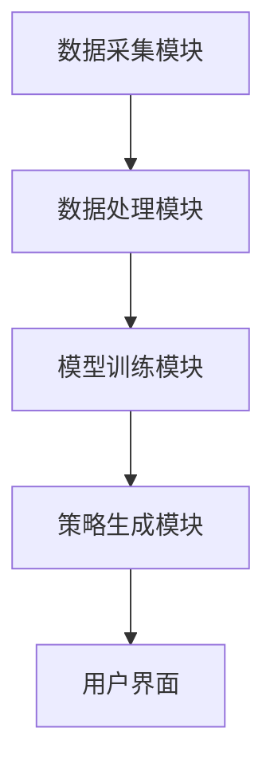

                 


# 机器学习优化税收效率投资策略

**关键词**：机器学习，税收效率，投资策略，优化算法，数据驱动

**摘要**：  
本文探讨了机器学习在优化税收效率和投资策略中的应用，通过分析机器学习算法如何帮助提升税收预测和投资决策的准确性，提出了基于机器学习的优化方法。文章从背景概念、算法原理、系统设计到项目实战，详细阐述了如何利用机器学习技术优化税收效率，并将其应用于投资策略优化中，最终提出了系统的实现方案和实际应用案例。

---

## 第1章: 机器学习优化税收效率投资策略的背景与概念

### 1.1 问题背景与问题描述
#### 1.1.1 税收效率优化的必要性
税收是国家财政收入的重要来源，优化税收效率能够减少征纳双方的成本，提高税款征收的及时性和准确性。然而，传统的税收征管方式依赖人工操作，存在效率低、误差大、风险高等问题。

#### 1.1.2 投资策略优化的挑战
在金融市场中，投资者面临复杂的市场环境和多样化的投资选择，如何制定最优的投资策略以实现收益最大化是一个复杂的优化问题。传统的投资策略依赖于经验和市场分析，存在主观性较强、风险控制不足等问题。

#### 1.1.3 机器学习在税收与投资中的应用前景
机器学习作为一种数据驱动的自动化分析工具，能够从海量数据中提取规律，帮助优化税收征收和投资决策。通过机器学习算法，可以实现税收预测、风险评估、投资组合优化等功能，为税收管理和投资决策提供科学依据。

---

### 1.2 核心概念与联系
#### 1.2.1 机器学习的基本原理
机器学习是一种通过数据训练模型，使其能够从数据中学习并做出预测或决策的技术。它可以分为监督学习、无监督学习、强化学习等多种类型，广泛应用于分类、回归、聚类等任务。

#### 1.2.2 税收效率与投资策略的关系
税收效率的优化直接影响政府财政收入和企业的经营成本，而投资策略的优化则影响企业的收益和风险。通过机器学习技术，可以将税收效率的优化与投资策略的优化结合起来，实现资源的最优配置。

#### 1.2.3 数据驱动的优化方法
数据驱动的优化方法通过收集和分析大量数据，利用机器学习算法构建数学模型，帮助决策者制定更科学、更高效的策略。这种方法能够显著提高决策的准确性和效率。

---

### 1.3 本章小结
本章从背景和概念两个方面介绍了机器学习在优化税收效率和投资策略中的应用。通过分析传统方法的不足和机器学习的优势，提出了利用机器学习技术优化税收效率和投资策略的可行性。

---

## 第2章: 机器学习优化税收效率的核心概念

### 2.1 机器学习算法与税收效率的关系
#### 2.1.1 监督学习在税收预测中的应用
监督学习是一种基于 labeled 数据训练模型的机器学习方法，常用于税收预测。通过收集历史税收数据和相关经济指标，可以训练一个回归模型，预测未来的税收收入。

#### 2.1.2 非监督学习在税务风险评估中的应用
非监督学习适用于无 labeled 数据的情况，常用于税务风险评估。通过聚类分析，可以识别出税收风险较高的企业或行业，帮助税务部门提前采取措施。

#### 2.1.3 强化学习在投资策略优化中的作用
强化学习通过与环境的交互学习策略，适用于动态变化的金融市场。通过训练一个强化学习模型，可以优化投资组合，实现收益与风险的平衡。

---

### 2.2 税收效率优化的数学模型
#### 2.2.1 税收预测模型的构建
税收预测模型可以通过线性回归、随机森林等算法构建。例如，使用线性回归模型预测税收收入：
$$ \text{Tax} = \beta_0 + \beta_1 \cdot GDP + \beta_2 \cdot Inflation + \epsilon $$
其中，$\beta_0$、$\beta_1$、$\beta_2$是回归系数，$\epsilon$是误差项。

#### 2.2.2 投资收益最大化模型的建立
投资收益最大化模型可以通过强化学习算法构建。例如，使用Q-learning算法优化投资组合，最大化投资收益：
$$ Q(s, a) = r + \gamma \cdot \max Q(s', a') $$
其中，$s$是当前状态，$a$是动作，$r$是奖励，$\gamma$是折扣因子。

#### 2.2.3 模型评价与优化方法
模型评价可以通过均方误差（MSE）、准确率、召回率等指标进行。模型优化可以通过调整超参数、增加特征工程等方式实现。

---

### 2.3 投资策略优化的算法选择
#### 2.3.1 常见优化算法的比较
常用的投资策略优化算法包括遗传算法、模拟退火、粒子群优化等。这些算法各有优缺点，选择合适的算法需要根据具体问题和数据特点。

#### 2.3.2 算法选择的依据与原则
算法选择应考虑数据规模、计算复杂度、问题类型等因素。例如，对于小规模数据，可以选择遗传算法；对于大规模数据，可以选择分布式优化算法。

#### 2.3.3 算法优化的实现路径
算法优化可以通过参数调优、算法融合、分布式计算等方式实现。例如，可以将强化学习与遗传算法结合，提高优化效果。

---

### 2.4 本章小结
本章详细介绍了机器学习算法在税收效率优化中的应用，重点分析了监督学习、非监督学习和强化学习在不同场景中的作用，并讨论了投资策略优化的算法选择和优化方法。

---

## 第3章: 机器学习优化税收效率的数学模型与算法原理

### 3.1 线性回归模型
#### 3.1.1 线性回归的数学公式
线性回归是一种简单而有效的回归算法，其数学公式为：
$$ y = \beta_0 + \beta_1x + \epsilon $$
其中，$y$是目标变量，$x$是自变量，$\beta_0$和$\beta_1$是回归系数，$\epsilon$是误差项。

#### 3.1.2 算法实现步骤
1. 数据预处理：收集和整理数据，处理缺失值和异常值。
2. 模型训练：使用最小二乘法估计回归系数。
3. 模型评估：计算R²值、残差等指标评估模型性能。
4. 模型优化：通过特征选择、正则化等方法优化模型。

#### 3.1.3 线性回归在税收预测中的应用案例
假设我们有GDP、通货膨胀率等经济指标，可以使用线性回归模型预测未来税收收入：
$$ \text{Tax} = 100 + 0.8 \cdot GDP - 0.5 \cdot Inflation $$

---

### 3.2 支持向量机（SVM）
#### 3.2.1 SVM的数学原理
支持向量机是一种强大的分类算法，其数学原理基于最大化间隔的超平面。对于线性可分的数据，SVM的目标是最化间隔：
$$ \text{minimize} \quad \frac{1}{2}\|w\|^2 $$
其中，$w$是法向量，用于确定超平面。

#### 3.2.2 核函数的选择与实现
对于非线性数据，SVM可以通过核函数映射到高维空间。常用的核函数包括线性核、多项式核、高斯核等。

#### 3.2.3 SVM在税务风险评估中的应用
例如，可以使用SVM算法对企业的税务风险进行分类：
1. 收集企业的财务数据和税务历史。
2. 使用SVM模型训练分类器。
3. 预测企业是否为高风险纳税人。

---

### 3.3 随机森林
#### 3.3.1 随机森林的算法原理
随机森林是一种基于决策树的集成算法，通过随机采样和特征选择构建多个决策树，最终通过投票或平均的方式得出结果。

#### 3.3.2 随机森林在投资策略优化中的应用
例如，可以使用随机森林算法分析市场的多因素关系，优化投资组合：
1. 收集市场数据，包括股票价格、宏观经济指标等。
2. 使用随机森林模型分析各因素的重要性。
3. 根据模型结果优化投资组合。

#### 3.3.3 模型调参与优化
随机森林的超参数包括树的数量、树的深度、特征选择方式等。可以通过网格搜索或随机搜索调优模型。

---

### 3.4 本章小结
本章详细介绍了几种常用的机器学习算法，包括线性回归、支持向量机和随机森林，并分析了它们在税收预测和投资策略优化中的具体应用。

---

## 第4章: 投资策略优化的机器学习系统架构设计

### 4.1 系统功能设计
#### 4.1.1 数据采集模块
数据采集模块负责从多种数据源（如税务部门、金融市场）获取数据，包括税收数据、经济指标、市场数据等。

#### 4.1.2 模型训练模块
模型训练模块负责对数据进行预处理、特征工程和模型训练，输出优化后的模型。

#### 4.1.3 策略生成模块
策略生成模块根据模型结果生成优化的投资策略，包括资产配置、交易信号等。

---

### 4.2 系统架构设计
#### 4.2.1 分层架构设计
系统架构可以采用分层设计，包括数据层、算法层、策略层和用户层。

#### 4.2.2 微服务架构设计
为了提高系统的扩展性和可维护性，可以采用微服务架构，将系统划分为多个独立的服务模块。

#### 4.2.3 系统交互流程图
使用Mermaid绘制系统交互流程图，展示系统各部分之间的交互关系。



---

### 4.3 系统接口设计
#### 4.3.1 数据接口规范
定义数据接口的输入输出格式，例如使用JSON格式传输数据。

#### 4.3.2 API调用流程
描述API的调用流程，包括身份认证、参数传递、响应处理等。

#### 4.3.3 接口测试与优化
通过自动化测试工具对API进行测试，优化接口的性能和稳定性。

---

### 4.4 本章小结
本章从系统设计的角度，详细介绍了投资策略优化系统的功能设计、架构设计和接口设计，为系统的实现提供了理论基础。

---

## 第5章: 机器学习优化税收效率投资策略

### 5.1 项目实战
#### 5.1.1 环境安装
安装必要的开发环境和库，例如Python、NumPy、Scikit-learn、XGBoost等。

#### 5.1.2 核心代码实现
以下是使用随机森林算法优化投资策略的示例代码：

```python
import pandas as pd
from sklearn.ensemble import RandomForestRegressor
from sklearn.metrics import mean_squared_error

# 数据加载
data = pd.read_csv('investment_data.csv')

# 特征与目标分离
X = data.drop('return', axis=1)
y = data['return']

# 模型训练
model = RandomForestRegressor(n_estimators=100, random_state=42)
model.fit(X, y)

# 预测与评估
y_pred = model.predict(X)
print('均方误差:', mean_squared_error(y, y_pred))
```

#### 5.1.3 案例分析与解读
通过实际案例分析，展示如何利用机器学习算法优化税收效率和投资策略。例如，使用线性回归模型预测税收收入，使用随机森林模型优化投资组合。

#### 5.1.4 项目小结
总结项目的主要成果和经验教训，提出改进建议。

---

### 5.2 最佳实践
#### 5.2.1 小结
总结机器学习优化税收效率投资策略的核心思想和实现步骤。

#### 5.2.2 注意事项
提醒读者在实际应用中需要注意的问题，例如数据质量、模型解释性、算法选择等。

#### 5.2.3 拓展阅读
推荐相关领域的书籍和论文，供读者深入学习。

---

## 作者：AI天才研究院/AI Genius Institute & 禅与计算机程序设计艺术 /Zen And The Art of Computer Programming

---

这篇博客文章详细介绍了机器学习在优化税收效率和投资策略中的应用，从理论到实践，为读者提供了全面的指导。通过实际案例和代码示例，帮助读者理解如何利用机器学习技术提升税收管理和投资决策的效率和准确性。

