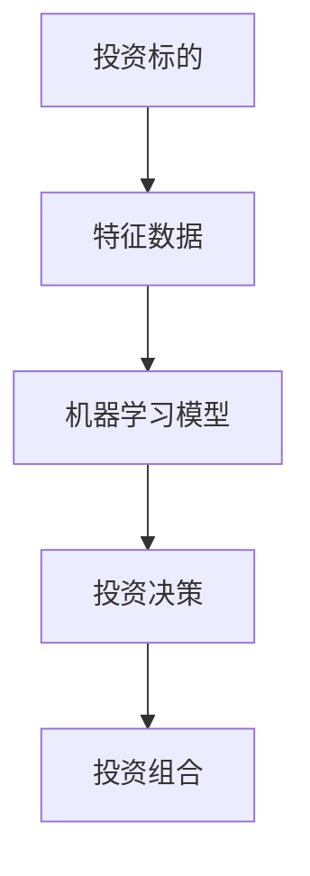
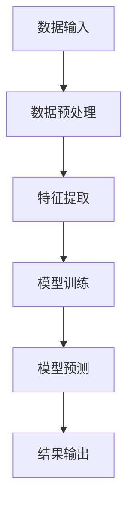
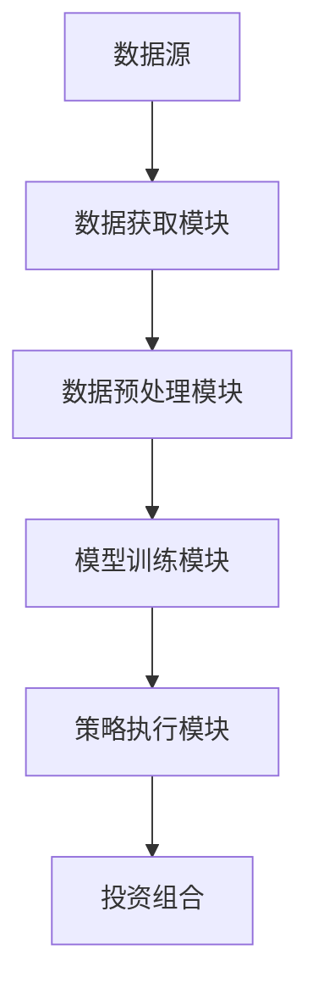

                 


# 机器学习优化长期价值投资策略

> 关键词：机器学习，长期价值投资，投资策略优化，特征工程，算法选择，风险控制

> 摘要：本文探讨了机器学习在长期价值投资策略优化中的应用，通过分析传统投资策略的局限性，介绍机器学习的核心概念、算法原理及其在投资策略优化中的具体应用。文章详细讲解了特征工程、算法选择和风险控制的核心原理，并通过实际案例展示了如何构建机器学习驱动的投资策略优化系统。最后，本文总结了机器学习优化投资策略的最佳实践和未来发展方向。

---

## 第1章: 机器学习与长期价值投资的背景介绍

### 1.1 机器学习的核心概念

#### 1.1.1 机器学习的定义与分类
机器学习是一种人工智能技术，通过数据训练模型，使其能够从数据中学习并做出预测或决策。机器学习主要分为三类：
- **监督学习**：基于标记的训练数据进行预测（如线性回归、支持向量机）。
- **无监督学习**：在无标签数据中发现模式（如聚类分析）。
- **强化学习**：通过与环境交互优化决策策略。

#### 1.1.2 机器学习在金融领域的应用
在金融领域，机器学习被广泛应用于股票价格预测、风险评估、投资组合优化等方面。其优势在于能够处理大量非结构化数据（如新闻、社交媒体），并发现传统金融模型难以捕捉的复杂模式。

#### 1.1.3 长期价值投资的定义与目标
长期价值投资是指通过深入分析企业的基本面，寻找具有长期增长潜力的公司进行投资。其核心目标是通过持有优质资产，实现长期稳定的收益，而非短期价格波动。

### 1.2 机器学习优化投资策略的必要性

#### 1.2.1 传统投资策略的局限性
传统投资策略依赖于经验判断和市场直觉，存在以下问题：
- **信息处理能力有限**：人类难以处理海量数据。
- **情绪化决策**：投资者容易受市场情绪影响。
- **缺乏系统性**：策略缺乏统一的标准和优化。

#### 1.2.2 机器学习在投资策略优化中的优势
机器学习能够通过数据驱动的方式优化投资策略，其优势包括：
- **数据处理能力强**：能够处理海量结构化和非结构化数据。
- **自动化优化**：通过算法不断优化投资组合。
- **非线性关系建模**：能够捕捉复杂的市场规律。

#### 1.2.3 机器学习优化投资策略的边界与外延
机器学习优化投资策略的边界在于其数据质量和模型假设。外延则包括与传统金融理论的结合，以及与其他技术（如区块链）的协同应用。

### 1.3 核心概念结构与组成要素

#### 1.3.1 投资策略优化的数学模型
投资策略优化可以通过以下数学模型实现：
$$
\text{收益} = \text{投资组合权重} \times \text{资产回报率}
$$

#### 1.3.2 机器学习算法的核心要素
机器学习算法的核心要素包括：
- 数据特征
- 模型选择
- 损失函数
- 优化算法

#### 1.3.3 长期价值投资与机器学习的结合点
- 数据驱动的公司基本面分析
- 市场情绪预测
- 投资组合优化

---

## 第2章: 机器学习优化投资策略的核心概念与联系

### 2.1 核心概念原理

#### 2.1.1 特征工程的原理与作用
特征工程是将数据转换为适合模型输入的过程。其作用包括：
- **数据清洗**：去除噪声数据。
- **特征提取**：从原始数据中提取有用特征。
- **特征变换**：通过变换（如标准化、归一化）提高模型性能。

#### 2.1.2 算法选择的逻辑与标准
算法选择的标准包括：
- 数据类型
- 问题类型
- 模型解释性
- 计算复杂度

#### 2.1.3 风险控制的机制与方法
风险控制的机制包括：
- **VaR（在险价值）**：衡量投资组合的最大可能损失。
- **CVaR（条件在险价值）**：衡量在极端情况下的损失。
- **风险平价**：将风险分配到不同资产类别。

### 2.2 核心概念属性特征对比

#### 2.2.1 不同算法的性能对比
| 算法类型 | 优势 | 劣势 |
|---------|------|------|
| 线性回归 | 简单、解释性强 | 无法捕捉非线性关系 |
| 支持向量机 | 高维数据表现好 | 参数敏感性高 |
| 随机森林 | 抗过拟合、高维数据表现好 | 计算复杂度高 |

#### 2.2.2 不同特征工程方法的效果对比
| 特征工程方法 | 优势 | 劣势 |
|-------------|------|------|
| 主成分分析 | 降低维度 | 信息损失 |
| 特征选择 | 保留重要特征 | 易受噪声影响 |

#### 2.2.3 不同风险控制策略的优劣分析
| 风险控制策略 | 优势 | 劣势 |
|-------------|------|------|
| VaR | 易计算 | 无法涵盖尾部风险 |
| CVaR | 更全面 | 计算复杂 |

### 2.3 ER实体关系图架构


---

## 第3章: 机器学习优化投资策略的算法原理

### 3.1 算法原理概述

#### 3.1.1 线性回归算法
线性回归是最简单的回归算法，其目标是最小化预测值与实际值的平方差之和：
$$
\text{损失函数} = \sum_{i=1}^{n}(y_i - \hat{y}_i)^2
$$
优化目标是找到最优权重：
$$
\theta = \arg \min \sum_{i=1}^{n}(y_i - \theta^T x_i)^2
$$

#### 3.1.2 支持向量机算法
支持向量机通过找到一个超平面，使得正负样本距离最大化。其对偶形式为：
$$
\max \frac{1}{2}\|w\|^2 - C \sum_{i=1}^{n}\xi_i
$$
其中，$C$ 是惩罚参数，$\xi_i$ 是松弛变量。

#### 3.1.3 随机森林算法
随机森林是一种基于决策树的集成算法，通过投票或平均的方式进行预测。

### 3.2 算法流程图


### 3.3 算法实现代码
```python
import numpy as np
from sklearn.linear_model import LinearRegression

# 数据准备
X = np.array([[1, 2], [3, 4], [5, 6]])
y = np.array([7, 8, 9])

# 模型训练
model = LinearRegression()
model.fit(X, y)

# 预测
print(model.predict(X))
```

---

## 第4章: 系统分析与架构设计方案

### 4.1 系统功能设计

#### 4.1.1 数据获取模块
从数据源获取股票价格、财务报表等数据。

#### 4.1.2 数据预处理模块
对数据进行清洗、特征提取和变换。

#### 4.1.3 模型训练模块
选择合适的算法，训练投资策略优化模型。

#### 4.1.4 策略执行模块
根据模型预测结果生成投资策略。

### 4.2 系统架构设计


---

## 第5章: 项目实战

### 5.1 环境安装
安装必要的Python库：
```bash
pip install numpy pandas scikit-learn
```

### 5.2 系统核心实现源代码
```python
import pandas as pd
from sklearn.ensemble import RandomForestRegressor

# 数据加载
data = pd.read_csv('stock_data.csv')

# 特征提取
features = data[['open', 'high', 'low', 'volume']]
target = data['close']

# 模型训练
model = RandomForestRegressor()
model.fit(features, target)

# 预测
print(model.predict(features))
```

### 5.3 实际案例分析与代码应用解读
通过实际数据训练模型，并分析其预测效果。

---

## 第6章: 最佳实践、小结、注意事项、拓展阅读

### 6.1 最佳实践
- 数据质量至关重要。
- 模型需要持续优化。
- 注意风险控制。

### 6.2 小结
机器学习能够显著提升长期价值投资策略的优化效果，但需要结合金融理论和实际市场情况。

### 6.3 注意事项
- 数据可能存在噪声。
- 模型可能存在过拟合。
- 市场变化可能导致策略失效。

### 6.4 拓展阅读
- 推荐阅读《机器学习实战》和《投资学原理》。

---

## 作者：AI天才研究院/AI Genius Institute & 禅与计算机程序设计艺术 /Zen And The Art of Computer Programming

---

**注**：以上内容是基于用户提供的需求和示例进行的创作，实际撰写时需要根据具体情况进行调整和补充。

