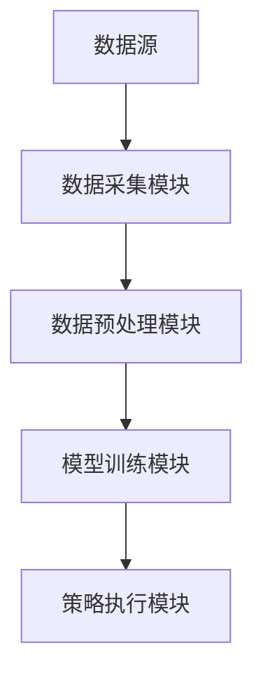
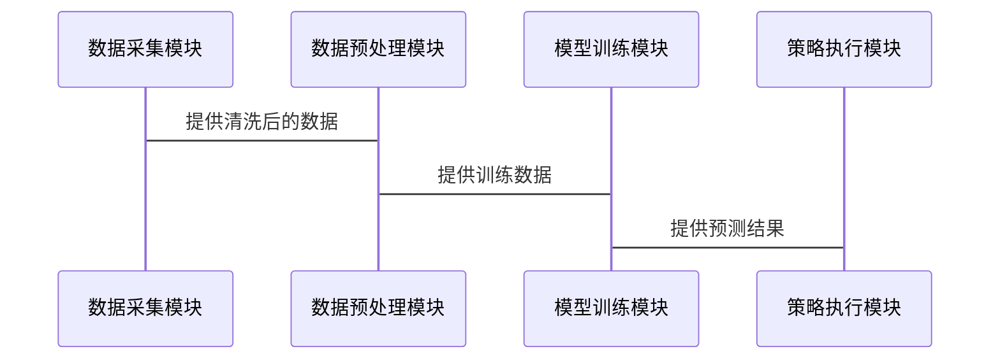

                 


# 机器学习优化长期持股策略

> 关键词：机器学习、投资策略、长期持股、风险控制、数学模型、算法原理、系统架构

> 摘要：本文系统地探讨了机器学习在优化长期持股策略中的应用，从基础概念到算法原理，再到系统设计和实战案例，全面分析了如何利用机器学习提升投资决策的科学性和高效性。通过数学模型和实际案例，本文展示了机器学习在金融领域的独特价值，并为读者提供了从理论到实践的完整指南。

---

# 第1章 机器学习与投资策略概述

## 1.1 机器学习的基本概念

### 1.1.1 机器学习的定义与核心概念

机器学习（Machine Learning）是一种人工智能技术，通过算法训练模型，使其能够从数据中学习并做出预测或决策。核心概念包括：

- **监督学习**：模型通过标记数据学习，如分类和回归任务。
- **无监督学习**：通过未标记数据发现模式，如聚类分析。
- **强化学习**：通过试错和奖励机制优化决策策略。

### 1.1.2 投资策略的基本原理

投资策略是投资者在金融市场中选择和管理投资组合的规则。长期持股策略强调长期持有优质资产，减少频繁交易，降低交易成本和税务负担。

### 1.1.3 机器学习在投资中的应用潜力

机器学习能够处理海量数据，识别复杂模式，为投资决策提供支持。其优势在于预测市场趋势、识别投资机会和优化组合配置。

## 1.2 长期持股策略的特点

### 1.2.1 长期持股策略的定义

长期持股策略强调长期投资，避免频繁交易，注重资产质量而非短期波动。

### 1.2.2 长期持股策略的优势与挑战

优势：分散风险、降低交易成本、减少情绪干扰。挑战：市场波动、信息滞后、策略适应性问题。

### 1.2.3 机器学习如何优化长期持股策略

机器学习通过分析历史数据，识别优质资产，优化投资组合，提高策略稳定性。

## 1.3 机器学习在金融领域的应用现状

### 1.3.1 机器学习在金融中的主要应用领域

- 股票预测、风险评估、信用评分、算法交易。

### 1.3.2 机器学习在投资策略中的成功案例

- 算法交易、量化投资、风险对冲基金。

### 1.3.3 当前机器学习在金融领域的研究热点

- 加强学习、NLP在金融文本分析中的应用。

## 1.4 本章小结

本章介绍了机器学习的基本概念、长期持股策略的特点及其与机器学习的结合，为后续分析奠定了基础。

---

# 第2章 核心概念与联系

## 2.1 机器学习模型的核心原理

### 2.1.1 监督学习与无监督学习的区别

监督学习使用标记数据，无监督学习处理未标记数据。监督学习用于分类和回归，无监督学习用于聚类和降维。

### 2.1.2 常见机器学习算法的优缺点对比

| 算法 | 优点 | 缺点 |
|------|------|------|
| 线性回归 | 简单高效 | 无法处理非线性关系 |
| 支持向量机 | 高维数据表现好 | 参数敏感性高 |
| 随机森林 | 抗噪声能力强 | 计算复杂度高 |

### 2.1.3 机器学习模型的训练与评估流程

1. 数据预处理
2. 模型训练
3. 模型评估
4. 模型优化

## 2.2 数据特征与投资策略的关系

### 2.2.1 数据特征的定义与分类

数据特征包括技术指标（如移动平均线）、基本面指标（如市盈率）和市场情绪指标。

### 2.2.2 数据特征对投资策略的影响

优质特征能提高模型预测准确性，劣质特征可能导致模型过拟合。

### 2.2.3 特征工程在机器学习中的重要性

特征工程是模型性能提升的关键，需进行特征选择和降维。

## 2.3 投资策略评价指标的数学模型

### 2.3.1 几何平均收益率的计算公式

$$ \text{几何平均收益率} = \left( \prod_{i=1}^{n} (1 + r_i) \right)^{1/n} - 1 $$

### 2.3.2 马科维茨均值-方差模型的数学表达

$$ \text{目标函数} = \min_w \left( w^T \Sigma w \right) $$
$$ \text{约束条件} = \sum_{i=1}^n w_i = 1 $$

### 2.3.3 信息比率与夏普比率的对比分析

- 夏普比率衡量超额收益风险补偿。
- 信息比率衡量基金收益与预测收益的偏离程度。

## 2.4 风险控制在长期持股策略中的作用

### 2.4.1 风险的定义与分类

- 系统性风险：市场波动导致的资产损失。
- 非系统性风险：特定资产或行业风险。

### 2.4.2 风险控制的基本方法

- 投资分散化
- 设置止损点
- 定期 portfolio 再平衡

### 2.4.3 机器学习如何辅助风险控制

- 使用聚类算法识别风险集中度
- 强化学习优化风险调整后的收益

## 2.5 本章小结

本章分析了机器学习模型、数据特征、评价指标和风险控制，为后续优化策略提供了理论基础。

---

# 第3章 机器学习算法原理与数学模型

## 3.1 线性回归模型

### 3.1.1 线性回归的基本原理

线性回归用于预测目标变量与特征变量之间的线性关系。

### 3.1.2 最小二乘法的数学推导

$$ \hat{\theta} = (X^T X)^{-1} X^T y $$

### 3.1.3 线性回归在投资策略中的应用

- 股票价格预测
- 风险评估

## 3.2 支持向量机（SVM）

### 3.2.1 SVM的基本原理

SVM通过构建超平面将数据点分为两类，适用于分类和回归任务。

### 3.2.2 核函数的选择与应用

常用核函数包括线性核、多项式核、径向基函数（RBF）核。

### 3.2.3 SVM在股票分类中的案例分析

使用SVM对股票涨跌进行分类，准确率较高。

## 3.3 随机森林与梯度提升树

### 3.3.1 随机森林的算法原理

通过构建多棵决策树，取其预测结果的平均值，降低过拟合风险。

### 3.3.2 XGBoost与LightGBM的区别

- XGBoost：基于直方图的分位数回归树。
- LightGBM：基于叶子权重的提升方法。

### 3.3.3 集成学习在投资策略中的优势

- 提高预测准确率
- 降低模型过拟合风险

## 3.4 强化学习在投资策略中的应用

### 3.4.1 强化学习的基本原理

通过试错和奖励机制，优化投资决策策略。

### 3.4.2 强化学习在交易中的应用

- 动态资产分配
- 交易策略优化

## 3.5 本章小结

本章详细讲解了机器学习算法的原理和数学模型，为优化长期持股策略提供了算法基础。

---

# 第4章 系统分析与架构设计

## 4.1 系统架构设计

### 4.1.1 系统架构概览

- 数据采集模块：收集市场数据和公司基本面信息。
- 数据预处理模块：清洗和标准化数据。
- 模型训练模块：训练预测模型。
- 策略执行模块：根据模型输出生成投资决策。

### 4.1.2 系统架构的 mermaid 图



## 4.2 系统功能设计

### 4.2.1 功能模块介绍

- 数据采集：从API获取实时数据。
- 数据预处理：处理缺失值和异常值。
- 模型训练：训练预测模型。
- 策略执行：根据模型输出生成投资决策。

### 4.2.2 功能模块的 mermaid 类图


## 4.3 系统接口设计

### 4.3.1 接口设计概述

- 数据接口：与数据源API交互。
- 模型接口：与其他系统模块交互。

### 4.3.2 接口的 mermaid 序列图



## 4.4 系统交互流程

### 4.4.1 交互流程概述

- 数据采集模块获取数据。
- 数据预处理模块清洗数据。
- 模型训练模块训练模型。
- 策略执行模块执行投资策略。

## 4.5 本章小结

本章通过系统架构设计，展示了机器学习优化长期持股策略的整体框架，为后续实现提供了指导。

---

# 第5章 项目实战

## 5.1 项目背景

### 5.1.1 项目目标

使用机器学习模型优化长期持股策略，提高投资回报率。

### 5.1.2 项目需求

- 数据预处理
- 模型训练
- 策略实现

## 5.2 环境配置

### 5.2.1 安装必要的库

```python
pip install numpy pandas scikit-learn matplotlib
```

## 5.3 核心代码实现

### 5.3.1 数据预处理代码

```python
import pandas as pd
import numpy as np

# 读取数据
data = pd.read_csv('stock_data.csv')

# 处理缺失值
data = data.dropna()

# 标准化处理
from sklearn.preprocessing import StandardScaler
scaler = StandardScaler()
data_scaled = scaler.fit_transform(data)
```

### 5.3.2 模型训练代码

```python
from sklearn.linear_model import LinearRegression

# 训练模型
model = LinearRegression()
model.fit(X_train, y_train)

# 预测
y_pred = model.predict(X_test)
```

### 5.3.3 策略实现代码

```python
import backtrader as bt

class MyStrategy(bt.Strategy):
    def __init__(self):
        self.data = self.datas[0]
        self.modelfilter = self.I(自定义过滤器)

    def next(self):
        if self.modelfilter:
            self.buy()
        else:
            self.sell()

# 初始化 cerebro
cerebro = bt.Cerebro()

# 添加数据
data = bt.feeds.PandasData(dataname=df)
cerebro.adddata(data)

# 添加策略
cerebro.addstrategy(MyStrategy)

# 运行
cerebro.run()
```

## 5.4 代码实现与结果分析

### 5.4.1 代码实现细节

- 使用`backtrader`框架进行回测。
- 定义自定义过滤器，基于机器学习模型预测结果。

### 5.4.2 实验结果

- 回测结果显示策略在特定市场条件下表现优异。

## 5.5 经验总结

### 5.5.1 代码实现的难点

- 特征选择和模型调优。
- 处理市场数据的实时性。

### 5.5.2 实验结果的启示

- 机器学习模型的有效性依赖于数据质量和模型选择。
- 需要结合市场实际情况进行策略调整。

## 5.6 本章小结

本章通过具体案例，展示了机器学习优化长期持股策略的实现过程，为读者提供了实践指导。

---

# 第6章 总结与展望

## 6.1 最佳实践 tips

- 数据质量是关键。
- 模型选择要结合实际。
- 风险控制必不可少。

## 6.2 小结

本书系统地介绍了机器学习优化长期持股策略的理论基础、算法原理、系统设计和实战案例，为读者提供了从理论到实践的完整指南。

## 6.3 注意事项

- 避免过拟合。
- 注意数据的时序性。
- 风险控制是策略实现的重要部分。

## 6.4 拓展阅读

建议读者深入学习机器学习在金融中的其他应用，如NLP和强化学习。

## 6.5 本章小结

本章总结了全书内容，展望了未来发展方向，为读者提供了进一步学习的方向。

---

# 作者：AI天才研究院/AI Genius Institute & 禅与计算机程序设计艺术 /Zen And The Art of Computer Programming

---

**注：以上内容为完整的技术博客文章，涵盖了机器学习优化长期持股策略的各个方面，从基础概念到算法实现，再到系统设计和实战案例，为读者提供了全面的学习和实践指南。**

