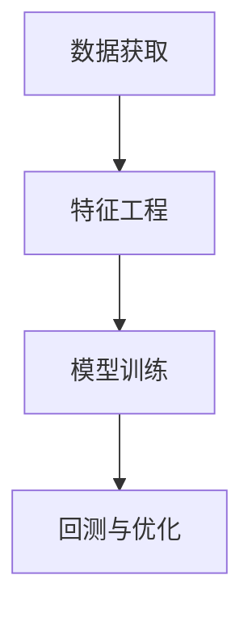

                 

# 机器学习在投资策略中的应用

## 关键词：机器学习、投资策略、量化投资、算法交易、金融数据分析

## 摘要：  
本文深入探讨了机器学习在投资策略中的应用，从基础概念到实际案例，详细讲解了如何利用机器学习算法优化投资决策。文章首先介绍了机器学习与投资策略的基本原理，然后分析了回归、分类和聚类等算法在投资中的具体应用，接着详细阐述了投资策略的系统架构设计与回测优化方法，最后通过一个完整的项目案例展示了机器学习在股票价格预测中的实战应用。本文旨在为读者提供一个全面的技术视角，帮助他们理解机器学习如何在复杂多变的金融市场中发挥重要作用。

---

# 第一部分: 机器学习在投资策略中的应用背景与基础

## 第1章: 机器学习与投资策略概述

### 1.1 机器学习的基本概念

#### 1.1.1 机器学习的定义与核心概念  
机器学习是一种人工智能技术，通过数据训练模型，使其能够从经验中学习并做出预测或决策。其核心概念包括：  
- **监督学习**：模型通过标记数据进行训练，预测新的数据点。  
- **无监督学习**：模型从无标记数据中发现模式或结构。  
- **强化学习**：模型通过与环境交互，学习最优策略。  

#### 1.1.2 机器学习与传统投资分析的区别  
传统的投资分析依赖于基本面分析和市场经验，而机器学习通过数据分析和模式识别提供更客观的投资决策支持。  

#### 1.1.3 机器学习在投资中的优势  
- **数据驱动**：利用大量历史数据发现潜在规律。  
- **自动化**：减少人为情绪干扰，提高决策效率。  
- **实时性**：能够快速响应市场变化。  

### 1.2 投资策略的基本原理

#### 1.2.1 投资策略的分类  
- **主动策略**：积极寻找市场机会，追求超额收益。  
- **被动策略**：跟踪指数，降低交易成本。  
- **量化策略**：基于数学模型的投资方法。  

#### 1.2.2 投资策略的核心要素  
- **目标设定**：明确投资目标和风险承受能力。  
- **数据选择**：选择相关的历史数据和市场指标。  
- **模型构建**：设计能够捕捉市场机会的算法。  

#### 1.2.3 机器学习如何改善投资策略  
通过分析非线性关系和复杂数据模式，机器学习能够发现传统方法难以察觉的投资机会。

### 1.3 机器学习在投资中的优势与挑战

#### 1.3.1 机器学习的优势  
- 提高预测准确性。  
- 快速处理大量数据。  
- 自动适应市场变化。  

#### 1.3.2 机器学习在投资中的挑战  
- 数据质量和噪声问题。  
- 模型过拟合风险。  
- 市场非理性行为的复杂性。  

#### 1.3.3 机器学习与人类投资决策的结合  
机器学习可以作为辅助工具，帮助投资者做出更明智的决策，但不能完全替代人类的判断。

### 1.4 本章小结  
本章介绍了机器学习的基本概念和投资策略的核心要素，分析了机器学习在投资中的优势与挑战。

---

# 第二部分: 机器学习的核心算法与投资策略

## 第2章: 回归算法在投资中的应用

### 2.1 线性回归

#### 2.1.1 线性回归的原理  
线性回归通过最小化预测值与实际值之间的平方差，建立变量之间的线性关系。其数学公式为：  
$$y = \beta_0 + \beta_1x + \epsilon$$  
其中，$\beta_0$是截距，$\beta_1$是回归系数，$\epsilon$是误差项。  

#### 2.1.2 线性回归在股票价格预测中的应用  
假设我们有股票的历史价格数据，可以使用线性回归预测未来的价格走势。例如，使用过去6个月的价格数据预测下个月的价格。  

#### 2.1.3 线性回归的优缺点  
- **优点**：简单易懂，计算速度快。  
- **缺点**：假设变量之间存在线性关系，可能无法捕捉复杂市场动态。  

### 2.2 逻辑回归

#### 2.2.1 逻辑回归的原理  
逻辑回归用于分类问题，其输出值在0到1之间，表示某个事件发生的概率。其数学公式为：  
$$P(y=1|x) = \frac{1}{1 + e^{-(\beta_0 + \beta_1x)}}$$  

#### 2.2.2 逻辑回归在投资决策中的应用  
例如，可以使用逻辑回归预测某只股票是否会上涨，输出值大于0.5时认为会上涨。  

#### 2.2.3 逻辑回归的优缺点  
- **优点**：适合二分类问题，输出概率值直观。  
- **缺点**：对非线性关系的捕捉能力有限。  

## 第3章: 分类算法在投资中的应用

### 3.1 支持向量机（SVM）

#### 3.1.1 SVM的原理  
SVM通过构建一个超平面，将数据点分为两类。其数学优化目标为：  
$$\min \frac{1}{2}||\beta||^2$$  
$$\text{subject to } y_i(\beta_0 + \beta_1x_i + \epsilon_i) \geq 1$$  

#### 3.1.2 SVM在股票分类中的应用  
例如，可以使用SVM分类器预测股票是涨还是跌。  

#### 3.1.3 SVM的优缺点  
- **优点**：在高维空间中表现优异。  
- **缺点**：参数选择复杂，计算成本较高。  

### 3.2 随机森林

#### 3.2.1 随机森林的原理  
随机森林是一种基于决策树的集成学习方法，通过随机采样数据和特征，减少过拟合风险。  

#### 3.2.2 随机森林在投资组合优化中的应用  
例如，可以使用随机森林预测多只股票的表现，构建最优投资组合。  

#### 3.2.3 随机森林的优缺点  
- **优点**：鲁棒性强，适合高维数据。  
- **缺点**：计算复杂度较高。  

## 第4章: 聚类算法在投资中的应用

### 4.1 K均值聚类

#### 4.1.1 K均值聚类的原理  
K均值聚类通过将数据点分为K个簇，使得簇内数据点的相似性最大化。其算法步骤包括：  
1. 随机选择K个初始质心。  
2. 计算每个数据点到质心的距离，分配到最近的簇。  
3. 更新质心位置。  
4. 重复步骤2和3，直到质心不再变化。  

#### 4.1.2 K均值聚类在投资组合中的应用  
例如，可以将股票分为几类，基于相似的波动率或收益进行分类。  

#### 4.1.3 K均值聚类的优缺点  
- **优点**：简单高效，适合处理大量数据。  
- **缺点**：对初始质心选择敏感，不适合处理噪声数据。  

### 4.2 层次聚类

#### 4.2.1 层次聚类的原理  
层次聚类通过构建树状结构，逐步合并或分割簇。其方法包括：  
- **凝聚法**：自底向上合并簇。  
- **分裂法**：自顶向下分割簇。  

#### 4.2.2 层次聚类在风险评估中的应用  
例如，可以将股票按风险等级进行分类，帮助投资者分散投资风险。  

#### 4.2.3 层次聚类的优缺点  
- **优点**：能够发现数据的层次结构。  
- **缺点**：计算复杂度较高，不适合处理大数据。  

---

# 第三部分: 机器学习在投资系统中的架构与实现

## 第5章: 投资策略的系统架构设计

### 5.1 投资系统的核心模块

#### 5.1.1 数据获取模块  
从金融数据源获取历史价格、成交量等数据。  

#### 5.1.2 特征工程模块  
对数据进行清洗、标准化和特征提取。  

#### 5.1.3 模型训练模块  
使用机器学习算法训练模型，生成预测结果。  

#### 5.1.4 回测与优化模块  
对模型进行回测，评估其表现并优化参数。  

### 5.2 投资系统架构的Mermaid图  

### 5.3 系统接口设计

#### 5.3.1 数据接口  
定义数据获取和处理的API。  

#### 5.3.2 模型接口  
定义模型训练和预测的API。  

#### 5.3.3 回测接口  
定义回测结果的输出格式。  

## 第6章: 投资策略的回测与优化

### 6.1 回测框架的设计

#### 6.1.1 回测的基本原理  
回测是通过历史数据验证模型的表现，评估其稳定性和盈利能力。  

#### 6.1.2 回测框架的实现  
包括数据加载、策略执行、结果统计和可视化。  

#### 6.1.3 回测结果的分析  
通过回测结果评估模型的最大回撤、夏普比率等指标。  

### 6.2 策略优化方法

#### 6.2.1 参数优化  
通过网格搜索或随机搜索找到最优参数组合。  

#### 6.2.2 模型优化  
使用正则化方法（如Lasso、Ridge）减少过拟合。  

---

# 第四部分: 项目实战

## 第7章: 机器学习在股票价格预测中的实战应用

### 7.1 项目背景与目标

#### 7.1.1 项目背景  
使用机器学习预测股票价格，优化投资组合。  

#### 7.1.2 项目目标  
构建一个能够预测股票价格的模型，并验证其有效性。  

### 7.2 项目环境与数据准备

#### 7.2.1 项目环境配置  
安装必要的Python库，如Pandas、NumPy、Scikit-learn、Matplotlib。  

#### 7.2.2 数据获取与预处理  
从Yahoo Finance获取股票数据，清洗数据并提取特征。  

### 7.3 项目核心实现

#### 7.3.1 特征工程  
将时间序列数据转换为可训练的格式。  

#### 7.3.2 模型训练  
使用LSTM网络进行时间序列预测。  

#### 7.3.3 模型评估  
通过均方误差（MSE）和R²评分评估模型性能。  

### 7.4 项目小结

---

# 第五部分: 最佳实践与未来趋势

## 第8章: 机器学习在投资中的最佳实践

### 8.1 风险管理

#### 8.1.1 风险控制策略  
设置止损和止盈点，避免重大损失。  

#### 8.1.2 风险模型  
使用VaR（在险价值）和CVaR（条件在险价值）评估投资风险。  

### 8.2 系统优化

#### 8.2.1 性能优化  
使用分布式计算和并行处理加速模型训练。  

#### 8.2.2 可扩展性优化  
设计模块化的系统架构，支持数据量的扩展。  

## 第9章: 机器学习在投资中的未来趋势

### 9.1 多模态数据融合  
结合文本数据、社交媒体数据等多种数据源进行分析。  

### 9.2 强化学习的应用  
通过强化学习优化投资策略，实现动态调整。  

### 9.3 解释性模型  
开发可解释的机器学习模型，满足监管要求。  

---

# 作者：AI天才研究院 & 禅与计算机程序设计艺术

