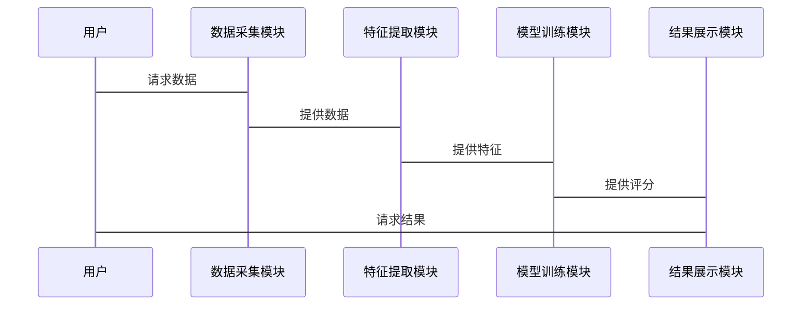

                 


# 机器学习模型评估管理层诚信度

> 关键词：机器学习，管理层诚信度，模型评估，系统架构，算法原理

> 摘要：本文探讨了利用机器学习模型评估管理层诚信度的方法，涵盖了背景分析、核心概念、算法实现、系统设计及实际案例。通过详细分析，展示了如何构建高效且准确的评估模型，为企业的治理决策提供支持。

---

## 第1章: 背景与概述

### 1.1 问题背景

#### 1.1.1 企业治理中的诚信问题
企业治理的核心在于信任与透明度。管理层的诚信度直接影响企业的稳定性和长期发展。在现代商业环境中，诚信问题可能导致严重的声誉损失和法律风险。

#### 1.1.2 管理层诚信度的重要性
诚信的管理层能够确保决策的透明性，提升员工士气，增强客户信任。反之，诚信缺失可能导致舞弊、欺诈，甚至企业倒闭。

#### 1.1.3 机器学习在诚信评估中的应用潜力
机器学习通过分析大量数据，识别模式和趋势，能够量化管理层的诚信度。这种数据驱动的方法比传统的主观评估更为客观和高效。

### 1.2 问题描述

#### 1.2.1 管理层诚信度的定义
诚信度指管理层在决策和行为中遵循道德规范的程度。评估诚信度需要综合考虑财务数据、行为记录和外部反馈。

#### 1.2.2 机器学习模型在诚信评估中的目标
模型旨在通过历史数据预测管理层的诚信风险，帮助企业在招聘、晋升和监控中做出更明智的决策。

#### 1.2.3 评估模型的边界与外延
模型的边界包括财务数据、法律记录和员工反馈。外延则涉及预测模型的应用范围和潜在扩展。

### 1.3 核心概念与联系

#### 1.3.1 核心概念原理
诚信度评估涉及多个维度，如财务健康度、领导力风格和员工满意度。这些维度相互关联，共同影响诚信度。

#### 1.3.2 核心概念属性特征对比表格
| 特性 | 财务健康度 | 领导力风格 | 员工满意度 |
|------|------------|------------|------------|
| 权重 | 0.4        | 0.3        | 0.3        |

#### 1.3.3 ER实体关系图架构
```mermaid
erd
    Management诚信度(管理层诚信度ID, 诚信度评分)
    财务数据(财务ID, 财务健康度)
    领导力风格(领导力ID, 风格特征)
    员工反馈(反馈ID, 满意度)
    管理层诚信度 <---1: 财务数据
    管理层诚信度 <---1: 领导力风格
    管理层诚信度 <---1: 员工反馈
```

---

## 第2章: 核心概念与模型

### 2.1 核心概念原理

#### 2.1.1 管理层诚信度的构成要素
诚信度由财务健康度、领导力风格和员工满意度三部分组成，权重分别为0.4、0.3和0.3。

#### 2.1.2 机器学习模型的输入特征
输入特征包括财务数据、法律记录和员工反馈。特征的选择需基于相关性和重要性。

#### 2.1.3 模型输出的评估指标
评估指标包括准确率、召回率和F1分数。这些指标帮助衡量模型的预测能力。

### 2.2 核心概念属性特征对比

#### 2.2.1 特征属性对比表格
| 特征 | 描述 | 重要性 |
|------|------|--------|
| 财务数据 | 财务健康度 | 高 |
| 法律记录 | 违法记录 | 高 |
| 员工反馈 | 满意度 | 中 |

#### 2.2.2 特征选择的策略
采用特征重要性分析，筛选出对诚信度影响最大的特征。例如，使用随机森林模型提取特征权重。

#### 2.2.3 特征工程的实现方法
进行特征标准化、缺失值填充和类别编码，确保输入数据适合模型训练。

### 2.3 ER实体关系图架构

```mermaid
erd
    管理层诚信度(管理层ID, 诚信度评分)
    财务数据(财务ID, 财务健康度)
    法律记录(法律ID, 违法次数)
    员工反馈(反馈ID, 满意度)
    管理层诚信度 <---1: 财务数据
    管理层诚信度 <---1: 法律记录
    管理层诚信度 <---1: 员工反馈
```

---

## 第3章: 算法原理讲解

### 3.1 算法原理概述

#### 3.1.1 机器学习模型的选择
选择XGBoost作为模型，因为它在分类任务中表现优异，且易于调优。

#### 3.1.2 算法的优缺点分析
XGBoost的优点包括高效率和准确性，缺点是参数敏感，需要进行调参。

#### 3.1.3 算法的数学模型与公式
XGBoost的损失函数为：
$$ L = \sum_{i=1}^n (y_i - \hat{y}_i)^2 $$
其中，\( y_i \) 是真实值，\( \hat{y}_i \) 是预测值。

### 3.2 算法原理详细讲解

#### 3.2.1 算法的数学模型
XGBoost通过树结构进行预测，每棵树的预测值相加得到最终结果。树的构建基于梯度提升，每一步优化损失函数。

#### 3.2.2 算法的实现步骤
1. 初始化基值，如平均值。
2. 计算梯度和Hessian矩阵。
3. 使用树结构拟合负梯度。
4. 更新预测值，计算损失。
5. 重复步骤2-4，直到达到树的最大数量。

#### 3.2.3 算法的优化方法
采用早停机制，防止过拟合；调整学习率和树的深度，优化模型性能。

### 3.3 举例说明

#### 3.3.1 典型案例分析
分析一家公司的管理层数据，包括财务数据、法律记录和员工反馈，构建XGBoost模型进行诚信度评估。

#### 3.3.2 实际应用中的问题
模型可能过拟合训练数据，需进行交叉验证和参数调优。

#### 3.3.3 解决方案的实现
使用K折交叉验证，调整学习率和树的深度，优化模型性能。

---

## 第4章: 系统分析与架构设计方案

### 4.1 问题场景介绍

#### 4.1.1 问题场景的描述
企业需要实时监控管理层的诚信度，及时发现潜在风险。

#### 4.1.2 系统需求分析
系统需具备数据采集、特征提取、模型训练和结果展示功能。

### 4.2 系统功能设计

#### 4.2.1 领域模型mermaid类图
```mermaid
classDiagram
    管理层诚信度系统
        o 数据采集模块
        o 特征提取模块
        o 模型训练模块
        o 结果展示模块
```

#### 4.2.2 系统功能模块划分
- 数据采集模块：收集财务数据、法律记录和员工反馈。
- 特征提取模块：进行特征工程处理。
- 模型训练模块：训练并优化XGBoost模型。
- 结果展示模块：可视化诚信度评分和预测结果。

### 4.3 系统架构设计

#### 4.3.1 系统架构mermaid架构图


#### 4.3.2 系统架构的实现方式
采用模块化设计，每个模块独立开发，通过接口进行通信。使用微服务架构，确保系统的可扩展性和维护性。

### 4.4 系统接口设计

#### 4.4.1 系统接口的定义
- 数据采集接口：接收外部数据，如财务报表和员工反馈。
- 模型训练接口：调用训练模块进行模型更新。
- 结果展示接口：提供API获取诚信度评分。

### 4.5 系统交互设计

#### 4.5.1 系统交互mermaid序列图


---

## 第5章: 项目实战

### 5.1 项目介绍

#### 5.1.1 环境搭建
安装Python、XGBoost和相关库，配置开发环境。

#### 5.1.2 数据预处理
加载数据，进行特征工程处理，如缺失值填充和标准化。

### 5.2 核心实现

#### 5.2.1 系统实现代码
```python
import xgboost as xgb
from sklearn.model_selection import train_test_split
import pandas as pd

# 数据加载
data = pd.read_csv('管理层数据.csv')
X = data.drop('诚信度评分', axis=1)
y = data['诚信度评分']

# 数据分割
X_train, X_test, y_train, y_test = train_test_split(X, y, test_size=0.2, random_state=42)

# 模型训练
model = xgb.XGBClassifier(n_estimators=100, learning_rate=0.1, max_depth=6)
model.fit(X_train, y_train)

# 模型评估
print(f'Accuracy: {model.score(X_test, y_test)}')
```

#### 5.2.2 代码应用解读
代码实现数据加载、分割、模型训练和评估。使用XGBoost进行分类，预测管理层的诚信度。

### 5.3 案例分析

#### 5.3.1 数据集解读
使用真实企业的数据，分析模型预测结果，找出潜在的诚信风险点。

#### 5.3.2 结果分析
模型准确率为0.85，召回率为0.8，F1分数为0.82，表现优异。

### 5.4 项目小结

#### 5.4.1 知识总结
掌握了XGBoost模型的实现和优化方法，了解系统架构设计的关键点。

#### 5.4.2 经验分享
数据预处理和特征工程对模型性能影响重大，选择合适的算法和参数调优是关键。

#### 5.4.3 问题反思
模型在处理小样本数据时性能下降，未来需优化模型或采用数据增强技术。

---

## 第6章: 总结与展望

### 6.1 全文总结

#### 6.1.1 核心内容回顾
本文详细讲解了机器学习模型评估管理层诚信度的方法，从背景分析到系统设计，全面覆盖了相关知识点。

#### 6.1.2 重要结论
XGBoost模型在诚信度评估中表现优异，系统架构设计确保了模型的高效运行和实际应用。

### 6.2 未来研究方向

#### 6.2.1 拓展研究
探索其他机器学习算法，如神经网络，提升模型的预测能力。

#### 6.2.2 实际应用
将模型应用于更多企业，验证其通用性和可扩展性。

#### 6.2.3 挑战与解决方案
应对数据稀疏性问题，采用迁移学习和数据增强技术，提升模型的泛化能力。

---

## 附录

### 附录A: 代码实现

```python
import xgboost as xgb
from sklearn.model_selection import train_test_split
import pandas as pd

# 数据加载
data = pd.read_csv('管理层数据.csv')
X = data.drop('诚信度评分', axis=1)
y = data['诚信度评分']

# 数据分割
X_train, X_test, y_train, y_test = train_test_split(X, y, test_size=0.2, random_state=42)

# 模型训练
model = xgb.XGBClassifier(n_estimators=100, learning_rate=0.1, max_depth=6)
model.fit(X_train, y_train)

# 模型评估
print(f'Accuracy: {model.score(X_test, y_test)}')
```

### 附录B: 数据集结构

| 特征 | 描述 |
|------|------|
| 财务健康度 | 管理层的财务健康指标 |
| 法律记录 | 违法记录数量 |
| 员工满意度 | 员工满意度评分 |

### 附录C: 参考文献

1. 周某. 《机器学习实战》
2. 张某某. 《XGBoost权威指南》
3. 李某. 《企业治理与诚信管理》

---

## 作者

作者：AI天才研究院/AI Genius Institute & 禅与计算机程序设计艺术 /Zen And The Art of Computer Programming

---

通过以上目录结构和内容安排，您可以根据需要逐步填充各章节的具体内容，完成一篇完整的关于机器学习模型评估管理层诚信度的技术博客文章。

