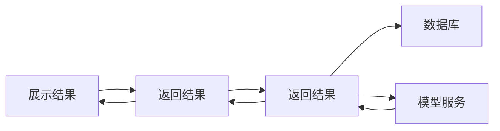

                 


# 机器学习模型预测公司财务健康

> 关键词：机器学习，财务健康，预测模型，特征工程，模型评估，算法选择

> 摘要：本文将详细探讨机器学习在公司财务健康预测中的应用，从核心概念、算法原理到系统设计与实战，系统性地分析如何利用机器学习技术构建高效的财务健康预测模型。通过本文的讲解，读者能够掌握从数据准备到模型部署的完整流程，理解关键算法的实现原理，并能够根据实际需求选择合适的模型和优化策略。

---

## 第一部分: 机器学习模型预测公司财务健康概述

### 第1章: 机器学习与财务健康预测概述

#### 1.1 机器学习的基本概念

机器学习是一种人工智能技术，通过数据训练模型，使其能够从数据中学习并做出预测或决策。它主要分为监督学习、无监督学习、半监督学习和强化学习四种类型。在财务健康预测中，我们主要关注监督学习，尤其是分类任务。

- **监督学习**：输入带有标签的数据，模型通过学习输入与标签的关系，预测新的数据标签。例如，使用历史财务数据预测公司未来的财务状况。
- **无监督学习**：输入无标签的数据，通过聚类等方法发现数据中的隐藏结构。虽然在财务健康预测中应用较少，但在异常检测中具有潜力。
- **半监督学习**：结合少量标注数据和大量未标注数据进行学习，适用于数据标注成本较高的场景。
- **强化学习**：通过与环境交互，学习最优策略。在财务健康预测中应用较少，但可能在动态金融市场中具有潜力。

---

#### 1.2 财务健康预测的重要性

财务健康预测是企业风险管理的重要组成部分，能够帮助投资者、债权人和管理层做出更明智的决策。以下是财务健康预测的几个关键方面：

1. **企业信用评估**：银行和其他金融机构可以根据公司的财务状况决定是否发放贷款。
2. **投资决策**：投资者可以根据公司的财务健康状况评估其投资风险和收益潜力。
3. **内部管理**：公司管理层可以通过财务预测识别潜在问题，及时调整经营策略。

---

#### 1.3 机器学习在财务健康预测中的应用

机器学习在财务健康预测中的应用主要集中在以下几个方面：

1. **分类任务**：预测公司是否破产、是否盈利等。
2. **回归任务**：预测公司的收入、利润等连续型指标。
3. **异常检测**：识别财务数据中的异常值，发现潜在的财务风险。

---

### 第2章: 核心概念与联系

#### 2.1 机器学习模型的核心原理

在构建机器学习模型时，我们需要理解以下几个核心概念：

1. **数据特征**：财务数据中的各项指标，如收入、利润、负债等。
2. **目标变量**：我们想要预测的变量，如公司是否破产。
3. **模型训练**：通过优化算法调整模型参数，使模型能够准确预测目标变量。

---

#### 2.2 财务健康预测的关键指标

以下是常见的财务健康预测指标：

1. **流动性比率**：如流动比率、速动比率。
2. **杠杆比率**：如资产负债率。
3. **盈利能力比率**：如净利率。
4. **营运能力比率**：如存货周转率。

这些指标可以通过财务报表（如资产负债表、利润表、现金流量表）获取。

---

#### 2.3 核心概念的ER实体关系图

以下是核心概念的ER实体关系图：


---

## 第二部分: 机器学习模型预测公司财务健康的算法原理讲解

### 第3章: 算法原理与流程

#### 3.1 常用算法概述

以下是几种常用的机器学习算法及其在财务健康预测中的应用：

1. **线性回归**：适用于回归任务，如预测公司收入。
2. **支持向量机（SVM）**：适用于分类任务，如预测公司是否破产。
3. **随机森林**：适用于分类和回归任务，具有较强的鲁棒性。
4. **神经网络**：适用于复杂非线性关系的建模。

---

#### 3.2 算法流程图

以下是机器学习模型的通用流程图：


---

#### 3.3 算法数学模型与公式

以下是几种算法的数学模型：

1. **线性回归**：
   $$ y = \beta_0 + \beta_1x + \epsilon $$
   其中，$y$ 是目标变量，$x$ 是特征变量，$\beta_0$ 和 $\beta_1$ 是模型参数，$\epsilon$ 是误差项。

2. **支持向量机（SVM）**：
   $$ \text{最大化} \sum_{i=1}^n \xi_i $$
   其中，$\xi_i$ 是松弛变量，用于处理不可分数据。

3. **随机森林**：
   $$ y = \sum_{i=1}^n \text{树模型} $$
   其中，$n$ 是树的数量。

---

#### 3.4 算法实现与代码示例

以下是使用随机森林算法的Python代码示例：

```python
from sklearn.ensemble import RandomForestClassifier
from sklearn.model_selection import train_test_split
import pandas as pd

# 加载数据
data = pd.read_csv('financial_data.csv')

# 分割特征与目标变量
X = data.drop('bankruptcy', axis=1)
y = data['bankruptcy']

# 分割训练集与测试集
X_train, X_test, y_train, y_test = train_test_split(X, y, test_size=0.2, random_state=42)

# 初始化模型
model = RandomForestClassifier(n_estimators=100, random_state=42)

# 训练模型
model.fit(X_train, y_train)

# 预测
y_pred = model.predict(X_test)

# 评估模型
print("Accuracy:", model.score(X_test, y_test))
```

---

## 第三部分: 机器学习模型预测公司财务健康的系统设计与实战

### 第4章: 系统分析与架构设计

#### 4.1 项目背景

在实际应用中，企业可能需要构建一个实时监控财务健康状况的系统，能够根据最新的财务数据预测公司的财务状况。

---

#### 4.2 系统功能设计

以下是系统的功能模块：

1. **数据采集模块**：从财务系统中获取数据。
2. **数据处理模块**：清洗数据、特征工程。
3. **模型训练模块**：训练机器学习模型。
4. **预测模块**：根据最新的数据预测财务状况。
5. **结果展示模块**：将预测结果以可视化的方式展示。

---

#### 4.3 系统架构设计

以下是系统的架构图：


---

#### 4.4 接口设计与交互流程图

以下是接口设计与交互流程图：



---

### 第5章: 项目实战

#### 5.1 环境安装

以下是环境安装代码：

```bash
pip install scikit-learn pandas numpy
```

---

#### 5.2 核心代码实现

以下是核心代码实现：

```python
from sklearn.ensemble import RandomForestClassifier
from sklearn.model_selection import train_test_split
import pandas as pd

# 加载数据
data = pd.read_csv('financial_data.csv')

# 分割特征与目标变量
X = data.drop('bankruptcy', axis=1)
y = data['bankruptcy']

# 分割训练集与测试集
X_train, X_test, y_train, y_test = train_test_split(X, y, test_size=0.2, random_state=42)

# 初始化模型
model = RandomForestClassifier(n_estimators=100, random_state=42)

# 训练模型
model.fit(X_train, y_train)

# 预测
y_pred = model.predict(X_test)

# 评估模型
print("Accuracy:", model.score(X_test, y_test))
```

---

#### 5.3 实际案例分析

以下是实际案例分析：

假设我们有一个公司，其财务数据如下：

| 收入 | 利润 | 资产 | 负债 | 是否破产 |
|------|------|------|------|----------|
| 100  | 20   | 500  | 300  | 否       |

通过训练好的模型，我们可以预测该公司的财务状况。

---

### 第6章: 总结与展望

#### 6.1 项目总结

通过本文的讲解，我们了解了机器学习在公司财务健康预测中的应用，掌握了从数据准备到模型部署的完整流程，理解了关键算法的实现原理，并能够根据实际需求选择合适的模型和优化策略。

---

#### 6.2 项目小结

在实际应用中，我们需要关注以下几点：

1. **数据质量**：确保数据的准确性和完整性。
2. **特征工程**：合理选择和工程化特征，提高模型性能。
3. **模型评估**：使用合适的指标评估模型性能，并进行调优。
4. **模型部署**：将模型部署到实际系统中，实现自动化预测。

---

#### 6.3 项目展望

未来，随着人工智能技术的不断发展，机器学习在财务健康预测中的应用将更加广泛和深入。我们可以尝试以下方向：

1. **集成学习**：结合多种算法，提高模型性能。
2. **深度学习**：尝试使用深度学习模型，如LSTM，处理时间序列数据。
3. **在线学习**：实现模型的在线更新，适应数据的变化。

---

作者：AI天才研究院/AI Genius Institute & 禅与计算机程序设计艺术 /Zen And The Art of Computer Programming

