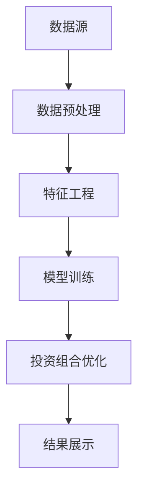

                 


# 机器学习算法优化投资组合管理

## 关键词：机器学习，投资组合管理，算法优化，金融，数据分析

## 摘要：本文深入探讨了机器学习算法在投资组合管理中的应用，分析了其核心概念、数学模型与算法原理，并通过实际案例展示了如何通过机器学习优化投资组合管理。文章结构清晰，内容涵盖背景介绍、核心概念、算法原理、系统架构、项目实战及最佳实践，帮助读者全面理解机器学习在金融投资中的潜力与应用。

---

# 第一部分: 机器学习算法优化投资组合管理概述

## 第1章: 机器学习与投资组合管理概述

### 1.1 机器学习的基本概念

#### 1.1.1 机器学习的定义与核心概念

机器学习（Machine Learning）是一种人工智能技术，通过数据训练模型，使其能够从数据中学习并做出预测或决策。其核心概念包括：

- **监督学习**：通过标记数据训练模型，使其能够预测新数据的标签。
- **无监督学习**：通过未标记数据发现数据中的隐藏结构。
- **强化学习**：通过与环境互动，学习最优决策策略。

#### 1.1.2 机器学习的分类与特点

机器学习可以分为监督学习、无监督学习和强化学习。监督学习适用于有标签的数据，如回归和分类任务；无监督学习适用于无标签的数据，如聚类和降维；强化学习适用于通过试错优化决策过程。

#### 1.1.3 机器学习在金融领域的应用

在金融领域，机器学习广泛应用于风险评估、信用评分、股票预测、投资组合优化等方面。通过分析历史数据，机器学习模型能够识别潜在的市场模式，辅助投资决策。

### 1.2 投资组合管理的基本原理

#### 1.2.1 投资组合的定义与目标

投资组合是将资金分配到不同资产（如股票、债券等）以实现特定投资目标（如最大化收益或最小化风险）的集合。其核心目标是平衡风险与收益，在市场波动中实现稳定的投资回报。

#### 1.2.2 投资组合优化的数学模型

投资组合优化的经典模型是现代投资组合理论（MPT），由Harry Markowitz提出。其数学模型为：

$$ \text{最大化} \quad \mu - \frac{1}{2}\lambda \sigma^2 $$

其中，$\mu$是预期收益，$\sigma^2$是风险（方差），$\lambda$是风险厌恶系数。

#### 1.2.3 投资组合管理的常见策略

常见的投资组合管理策略包括均值-方差优化、风险平价、因子模型等。这些策略通过不同的方法优化资产配置，降低风险，提高收益。

### 1.3 机器学习在投资组合管理中的应用前景

#### 1.3.1 机器学习的优势与挑战

机器学习的优势在于能够处理大量非结构化数据，发现传统统计方法难以捕捉的复杂模式。其挑战在于数据质量、模型解释性以及市场波动性。

#### 1.3.2 机器学习在投资组合管理中的潜在应用场景

- **市场预测**：通过分析历史数据，预测未来市场趋势。
- **风险评估**：识别投资组合中的潜在风险点，优化风险敞口。
- **资产配置**：基于市场信号动态调整资产权重，优化收益风险比。

#### 1.3.3 机器学习与传统投资组合管理方法的对比

传统方法依赖于历史数据和统计模型，而机器学习方法能够处理更多数据类型，捕捉更多市场信号，但可能面临过拟合和解释性差的问题。

### 1.4 本章小结

本章介绍了机器学习的基本概念和投资组合管理的核心原理，分析了机器学习在投资组合管理中的应用前景及其优势与挑战。下一章将探讨机器学习与投资组合管理的核心概念及其联系。

---

# 第二部分: 机器学习算法优化投资组合管理的核心概念

## 第2章: 机器学习算法与投资组合管理的联系

### 2.1 机器学习算法的核心原理

#### 2.1.1 线性回归算法

线性回归是一种简单而强大的回归算法，适用于预测连续型变量。其数学公式为：

$$ y = \beta_0 + \beta_1x + \epsilon $$

其中，$\beta_0$是截距，$\beta_1$是斜率，$\epsilon$是误差项。在线性回归中，目标是最小化预测值与实际值之间的平方差之和：

$$ \text{最小化} \sum_{i=1}^n (y_i - (\beta_0 + \beta_1x_i))^2 $$

#### 2.1.2 支持向量机（SVM）

SVM是一种监督学习算法，适用于分类和回归任务。其核心思想是通过找到一个超平面，将数据分为两类。对于非线性可分的数据，SVM可以通过核函数映射到高维空间，寻找最优分割面。

#### 2.1.3 随机森林与梯度提升树

随机森林是一种基于决策树的集成算法，通过构建多棵决策树并进行投票或平均，提高模型的准确性和鲁棒性。梯度提升树是一种通过多次迭代优化模型的算法，常用于分类和回归任务。

### 2.2 投资组合管理中的关键问题

#### 2.2.1 风险与收益的平衡

投资组合管理的核心是平衡风险与收益。过高的风险可能导致重大损失，而过低的收益可能无法实现投资目标。

#### 2.2.2 资产配置与组合优化

资产配置是根据市场情况和投资者目标，将资金分配到不同资产类别中的过程。组合优化通过调整资产权重，实现风险与收益的最佳平衡。

#### 2.2.3 市场预测与投资决策

市场预测是投资组合管理的重要环节，准确的市场预测能够帮助投资者做出更优的投资决策。

### 2.3 机器学习与投资组合管理的结合点

#### 2.3.1 数据驱动的投资决策

机器学习能够从大量数据中提取有价值的信息，帮助投资者做出更科学的投资决策。

#### 2.3.2 风险预测与组合优化

通过机器学习模型预测风险，投资者可以优化投资组合，降低整体风险水平。

#### 2.3.3 市场情绪分析与投资机会捕捉

机器学习能够分析市场情绪，捕捉投资机会，特别是在市场波动较大时，能够提供及时的信号。

### 2.4 核心概念对比分析

#### 2.4.1 机器学习算法属性对比表格

| 算法名称 | 监督/无监督 | 是否适合投资组合管理 | 优点 | 缺点 |
|----------|-------------|-----------------------|------|------|
| 线性回归  | 监督          | 是                   | 简单，易于解释 | 无法捕捉非线性关系 |
| SVM       | 监督          | 是                   | 高准确性       | 参数敏感性高 |
| 随机森林  | 监督/无监督    | 是                   | 鲁棒性强       | 解释性差 |

#### 2.4.2 投资组合管理关键问题的ER实体关系图

```mermaid
er
    左侧(投资者) --> 投资组合
    投资组合 --> 资产
    资产 --> 股票
    资产 --> 债券
    资产 --> 其他资产
    投资组合 --> 风险
    风险 --> 市场风险
    风险 --> 信用风险
```

---

# 第三部分: 机器学习算法优化投资组合管理的数学模型与算法原理

## 第3章: 机器学习算法的数学模型

### 3.1 线性回归模型

#### 3.1.1 线性回归的数学公式

线性回归的目标是找到最佳拟合直线，公式为：

$$ y = \beta_0 + \beta_1x + \epsilon $$

其中，$\beta_0$和$\beta_1$是模型参数，$\epsilon$是误差项。通过最小二乘法优化目标函数：

$$ \text{最小化} \sum_{i=1}^n (y_i - (\beta_0 + \beta_1x_i))^2 $$

#### 3.1.2 线性回归的优化目标函数

目标函数为均方误差（MSE）：

$$ \text{MSE} = \frac{1}{n}\sum_{i=1}^n (y_i - (\beta_0 + \beta_1x_i))^2 $$

通过求导并令导数为零，可以得到参数的最优解：

$$ \beta_1 = \frac{\sum_{i=1}^n (x_i - \bar{x})(y_i - \bar{y})}{\sum_{i=1}^n (x_i - \bar{x})^2} $$

$$ \beta_0 = \bar{y} - \beta_1\bar{x} $$

其中，$\bar{x}$和$\bar{y}$是x和y的平均值。

### 3.2 支持向量机（SVM）

#### 3.2.1 SVM的数学公式

SVM的目标是找到一个超平面，使得正负样本被正确分类：

$$ y = \text{sign}(w \cdot x + b) $$

其中，$w$是权重向量，$b$是偏置项，$x$是输入样本，$y$是标签。

对于非线性可分的数据，SVM使用核函数将数据映射到高维空间，寻找最优分割面。常用核函数包括线性核、多项式核、径向基函数（RBF）核等。

#### 3.2.2 SVM的优化目标函数

SVM的优化目标是最化分类间隔，并最大化对偶间隙：

$$ \text{最大化} \quad \frac{1}{2}||w||^2 $$

$$ \text{约束} \quad y_i(w \cdot x_i + b) \geq 1, \quad i=1,2,...,n $$

### 3.3 随机森林与梯度提升树

#### 3.3.1 随机森林的数学模型

随机森林是一种集成算法，通过构建多棵决策树并进行投票或平均，提高模型的准确性和鲁棒性。其数学模型为：

$$ f(x) = \text{平均} \{ f_j(x) \} $$

其中，$f_j(x)$是第$j$棵决策树的预测结果。

#### 3.3.2 梯度提升树的数学模型

梯度提升树是一种通过多次迭代优化模型的算法，其数学模型为：

$$ f_0(x) + \sum_{k=1}^M \gamma_k h_k(x) $$

其中，$f_0(x)$是初始模型，$\gamma_k$是第$k$棵树的权重，$h_k(x)$是第$k$棵树的预测结果。

---

# 第四部分: 机器学习算法优化投资组合管理的系统架构与实现

## 第4章: 系统分析与架构设计方案

### 4.1 问题场景介绍

投资组合管理的核心问题是如何在风险与收益之间找到最佳平衡点。传统的投资组合管理方法依赖于统计分析和历史数据，而机器学习方法能够通过分析更多的数据类型和模式，优化投资决策。

### 4.2 系统功能设计

#### 4.2.1 数据预处理

数据预处理是机器学习模型训练的前提，包括数据清洗、特征提取和标准化。

#### 4.2.2 模型训练

通过训练机器学习模型，预测市场趋势和风险。

#### 4.2.3 投资组合优化

根据模型预测结果，优化投资组合，平衡风险与收益。

### 4.3 系统架构设计

#### 4.3.1 系统架构图



### 4.4 系统接口设计

系统接口包括数据接口、模型接口和用户接口，分别用于数据输入、模型调用和结果展示。

### 4.5 系统交互设计

系统交互流程包括数据输入、数据预处理、模型训练、投资组合优化和结果展示。

---

# 第五部分: 机器学习算法优化投资组合管理的项目实战

## 第5章: 项目实战

### 5.1 环境安装

安装必要的Python库，如NumPy、Pandas、Scikit-learn、XGBoost等。

### 5.2 系统核心实现源代码

#### 5.2.1 数据预处理代码

```python
import pandas as pd
import numpy as np

# 加载数据
data = pd.read_csv('投资组合数据.csv')

# 数据清洗
data = data.dropna()

# 特征提取
X = data[['收益', '波动率', '市场指数']]
y = data['类别']

# 数据标准化
from sklearn.preprocessing import StandardScaler
scaler = StandardScaler()
X_scaled = scaler.fit_transform(X)
```

#### 5.2.2 模型训练代码

```python
from sklearn.ensemble import RandomForestClassifier
from sklearn.metrics import accuracy_score

# 训练模型
model = RandomForestClassifier(n_estimators=100, max_depth=2, random_state=42)
model.fit(X_scaled, y)

# 模型评估
y_pred = model.predict(X_scaled)
print('准确率:', accuracy_score(y, y_pred))
```

### 5.3 实际案例分析

通过实际案例分析，展示如何通过机器学习模型优化投资组合管理，实现风险与收益的最佳平衡。

### 5.4 项目小结

总结项目实现过程中的关键点和经验教训，为后续优化提供参考。

---

# 第六部分: 机器学习算法优化投资组合管理的最佳实践

## 第6章: 最佳实践

### 6.1 最佳实践 tips

- 数据质量是模型性能的关键，确保数据的完整性和准确性。
- 模型解释性是投资决策的重要因素，选择易于解释的模型。
- 模型更新是持续优化的关键，定期更新模型以适应市场变化。

### 6.2 小结

机器学习算法在投资组合管理中的应用前景广阔，但需要结合实际场景，选择合适的算法和模型。

### 6.3 注意事项

- 数据质量：确保数据的完整性和准确性。
- 模型解释性：选择易于解释的模型，确保投资决策的透明性。
- 模型更新：定期更新模型，适应市场变化。

### 6.4 拓展阅读

推荐相关书籍和论文，帮助读者深入理解机器学习在投资组合管理中的应用。

---

# 作者：AI天才研究院/AI Genius Institute & 禅与计算机程序设计艺术/Zen And The Art of Computer Programming

---

以上是《机器学习算法优化投资组合管理》的技术博客文章的完整目录和内容。希望这篇文章能够帮助读者全面理解机器学习在投资组合管理中的应用，并能够在实际工作中应用这些算法优化投资组合管理。

