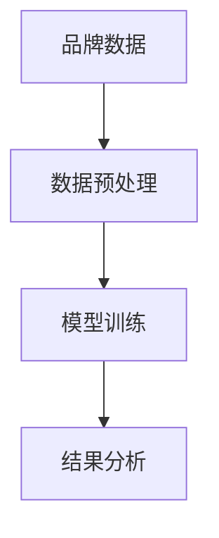
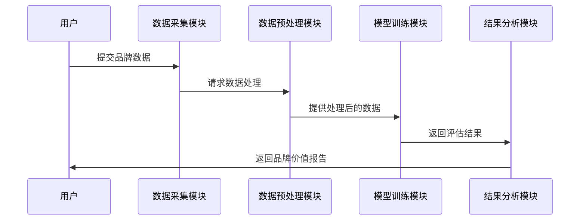

                 


# 机器学习辅助公司品牌价值量化

**关键词**：品牌价值量化、机器学习、数据分析、人工智能、量化评估、品牌价值模型

**摘要**：本文探讨了机器学习在品牌价值量化中的应用，通过详细分析品牌价值的核心要素、机器学习算法的原理，以及系统架构设计，展示了如何利用人工智能技术提升品牌价值评估的准确性和效率。文章结合实际案例，提供了从理论到实践的全面指导。

---

## 第1章：机器学习辅助品牌价值量化概述

### 1.1 品牌价值量化的重要性

品牌价值是企业核心竞争力的体现，直接影响企业的市场地位和盈利能力。传统品牌价值评估方法依赖主观判断，存在主观性高、数据支持不足的问题。随着大数据和人工智能技术的发展，机器学习为品牌价值量化提供了新的解决方案。

### 1.2 机器学习的基本原理

机器学习是一种人工智能技术，通过数据训练模型，使其能够自动学习和改进。监督学习和无监督学习是两种主要类型，分别适用于有标签和无标签的数据。

### 1.3 机器学习在品牌价值量化中的应用

通过分析品牌相关的数据，如社交媒体互动、销售数据、市场反馈等，机器学习可以帮助识别品牌的关键特征，预测品牌价值的变化趋势，并提供数据支持的决策建议。

---

## 第2章：品牌价值量化的核心概念

### 2.1 品牌价值的构成要素

品牌价值由知名度、美誉度和忠诚度构成。这些要素通过数据分析可以量化，为品牌策略提供支持。

### 2.2 机器学习在品牌价值量化中的应用

通过特征提取、模型训练和结果解释，机器学习能够将品牌价值转化为可量化的指标，帮助企业在市场竞争中占据优势。

### 2.3 品牌价值与机器学习的关系

机器学习通过数据驱动的方法，将品牌价值的评估从主观判断转变为基于数据的客观分析，提升了评估的准确性和效率。

---

## 第3章：机器学习算法原理

### 3.1 监督学习算法

#### 3.1.1 线性回归

线性回归通过最小化预测值与实际值的差的平方和，建立变量间的线性关系。公式：$$ y = \beta_0 + \beta_1x + \epsilon $$

#### 3.1.2 逻辑回归

逻辑回归用于分类问题，公式：$$ P(y=1|x) = \frac{e^{\beta_0 + \beta_1x}}{1 + e^{\beta_0 + \beta_1x}} $$

### 3.2 非监督学习算法

#### 3.2.1 K-means聚类

K-means算法通过迭代优化，将数据划分为K个簇，适用于品牌市场的细分。

#### 3.2.2 层次聚类

层次聚类通过构建树状结构，逐步合并相似的数据点，适用于品牌价值的层次分析。

---

## 第4章：系统分析与架构设计

### 4.1 系统功能设计

- **数据采集模块**：收集品牌相关数据。
- **数据预处理模块**：清洗和特征提取。
- **模型训练模块**：选择和训练机器学习模型。
- **结果分析模块**：输出品牌价值评估结果。

### 4.2 系统架构设计

使用Mermaid绘制系统架构图：



### 4.3 接口设计

- RESTful API：提供数据接口和结果查询接口。

### 4.4 交互流程

使用Mermaid绘制交互流程图：



---

## 第5章：项目实战

### 5.1 环境安装

安装必要的库，如Python的scikit-learn、pandas等。

### 5.2 代码实现

```python
from sklearn.linear_model import LinearRegression
import pandas as pd

# 加载数据
data = pd.read_csv('brand_data.csv')

# 特征和目标变量
X = data[['feature1', 'feature2']]
y = data['brand_value']

# 训练模型
model = LinearRegression()
model.fit(X, y)

# 预测
predictions = model.predict(X)
print('预测值:', predictions)
```

### 5.3 案例分析

通过实际数据训练模型，分析品牌价值的变化趋势，并解读结果以优化品牌策略。

---

## 第6章：总结与最佳实践

### 6.1 本章小结

机器学习为品牌价值量化提供了高效准确的方法，通过数据驱动的分析，帮助企业在竞争中获得优势。

### 6.2 最佳实践

- 数据质量至关重要，确保数据的完整性和准确性。
- 选择合适的算法，并进行调参优化。
- 结果解释与应用，确保模型输出能够指导实际决策。

### 6.3 注意事项

- 数据隐私和安全问题需要重视。
- 模型的可解释性是实际应用的关键。

### 6.4 拓展阅读

推荐相关书籍和论文，进一步深入学习机器学习和品牌价值评估的知识。

---

**作者：AI天才研究院/AI Genius Institute & 禅与计算机程序设计艺术 /Zen And The Art of Computer Programming**

