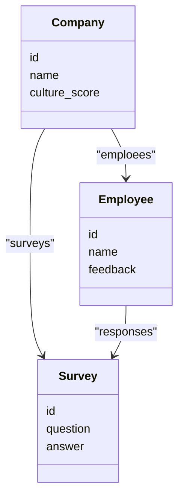
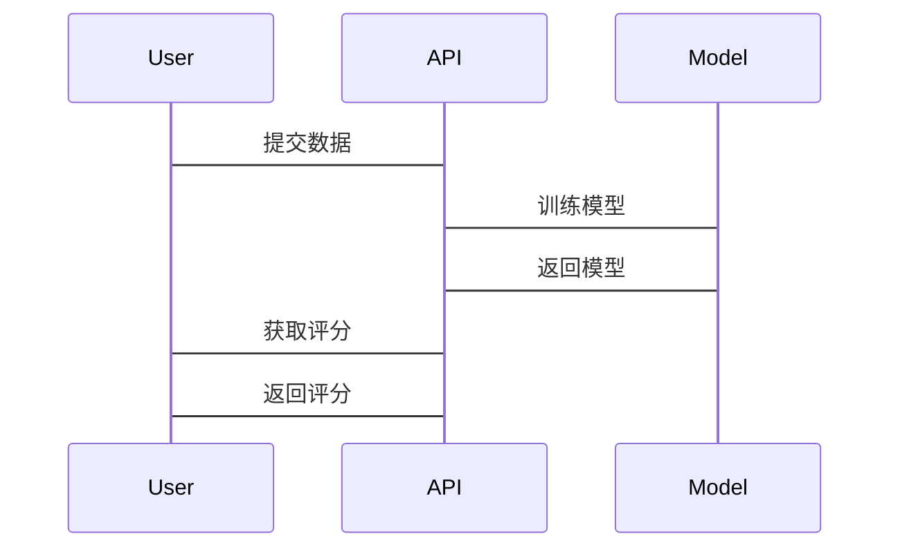

                 


# 《机器学习辅助公司文化评估》

**关键词**：机器学习，公司文化评估，企业分析，数据驱动决策，人工智能，组织行为学

**摘要**：  
本文探讨了如何利用机器学习技术辅助公司文化评估。通过分析公司文化的关键维度，结合机器学习算法，提出了一种高效、客观的文化评估方法。文章从背景、核心概念、算法原理、系统架构到实际应用，详细阐述了机器学习在公司文化评估中的潜力与实现路径。

---

## 正文

### 第1章: 机器学习与公司文化评估的背景

#### 1.1 机器学习的背景与应用
机器学习作为人工智能的核心技术，近年来在企业管理领域的应用越来越广泛。通过分析大量数据，机器学习能够帮助企业发现潜在的规律和趋势，从而优化决策流程。

**1.1.1 机器学习的核心概念**  
机器学习是一种数据驱动的算法技术，通过训练模型从数据中学习模式，并用于预测或分类。其核心在于数据、特征和模型的选择。

**1.1.2 机器学习在企业管理中的应用**  
在企业管理中，机器学习被广泛应用于员工绩效预测、客户行为分析、风险评估等领域。这些应用为企业提供了数据驱动的决策支持。

**1.1.3 公司文化评估的重要性**  
公司文化是企业成功的关键因素之一。通过评估文化，企业可以识别潜在问题，优化组织结构，提升员工满意度和生产力。

#### 1.2 公司文化评估的挑战与机遇
传统的公司文化评估方法依赖主观的问卷调查和管理者经验，存在耗时长、成本高、结果主观性强等问题。

**1.2.1 传统方法的局限性**  
传统方法通常依赖少量样本和主观判断，难以全面反映公司文化的复杂性。

**1.2.2 机器学习在文化评估中的优势**  
机器学习能够处理海量数据，提取隐含特征，提供客观、量化的评估结果，从而帮助企业更精准地优化文化管理。

#### 1.3 机器学习辅助公司文化评估的核心问题
**1.3.1 问题背景与问题描述**  
本文旨在探讨如何利用机器学习技术，从员工行为数据中提取文化特征，构建文化评估模型。

**1.3.2 问题解决的思路与方法**  
通过收集员工数据（如绩效、反馈、行为记录），结合机器学习算法，构建文化评估模型。

**1.3.3 边界与外延**  
本文仅关注基于数据的评估方法，不涉及主观判断或定性分析。

**1.3.4 核心概念与组成要素**  
文化评估的核心要素包括员工满意度、团队协作性、创新性等。

#### 1.4 本章小结
本章介绍了机器学习的基本概念，分析了传统公司文化评估的局限性，并提出了利用机器学习技术进行评估的思路。

---

### 第2章: 核心概念与联系

#### 2.1 核心概念原理
**2.1.1 机器学习的基本原理**  
机器学习通过数据训练模型，识别数据中的模式，并用于预测或分类。

**2.1.2 公司文化评估的关键维度**  
包括员工满意度、团队协作性、创新性、领导风格等。

**2.1.3 两者结合的机制**  
通过数据挖掘和特征提取，将文化维度转化为可量化的数据，利用机器学习模型进行评估。

#### 2.2 核心概念属性特征对比
**2.2.1 传统评估方法的属性特征**  
主观性强、耗时长、成本高。

**2.2.2 机器学习模型的属性特征**  
数据驱动、客观性高、效率高。

**2.2.3 对比分析与总结**  
机器学习模型在效率和客观性上具有明显优势。

#### 2.3 ER实体关系图架构
```mermaid
erDiagram
    company {
        id
        name
        culture_score
    }
    employee {
        id
        name
        feedback
    }
    survey {
        id
        question
        answer
    }
    company --|{many} employee : "employees"
    company --|{many} survey : "surveys"
    employee --|{many} survey : "responses"
```

#### 2.4 本章小结
本章通过对比分析，明确了机器学习在公司文化评估中的优势，并构建了实体关系图。

---

### 第3章: 算法原理与数学模型

#### 3.1 机器学习算法概述
**3.1.1 常见算法及其特点**  
- 线性回归：适用于线性关系。
- 支持向量机：适用于分类问题。
- 随机森林：适用于特征工程。

**3.1.2 适合公司文化评估的算法选择**  
随机森林适合处理高维数据，适合文化评估中多维度特征的分析。

#### 3.2 算法流程图


#### 3.3 数学模型与公式
**3.3.1 随机森林模型**  
随机森林通过集成多个决策树，提升模型的准确性和鲁棒性。

**3.3.2 模型评估指标**  
准确率、召回率、F1分数。

**3.3.3 示例公式**  
模型预测的文化评分为：
$$
\text{culture\_score} = \sum_{i=1}^{n} w_i \cdot x_i
$$
其中，$w_i$ 是特征权重，$x_i$ 是特征值。

---

### 第4章: 系统分析与架构设计

#### 4.1 问题场景介绍
公司希望通过机器学习技术，从员工数据中提取文化特征，构建评估模型。

#### 4.2 系统功能设计
**4.2.1 领域模型**  


**4.2.2 系统架构图**  


#### 4.3 系统接口设计
API接口定义：
- `/api/train`：训练模型。
- `/api/predict`：预测文化评分。

#### 4.4 系统交互设计


---

### 第5章: 项目实战

#### 5.1 环境安装
安装Python和相关库：
```bash
pip install scikit-learn pandas numpy
```

#### 5.2 数据预处理与特征提取
```python
import pandas as pd
data = pd.read_csv('culture_data.csv')
```

#### 5.3 模型实现
```python
from sklearn.ensemble import RandomForestClassifier
model = RandomForestClassifier()
model.fit(X_train, y_train)
```

#### 5.4 案例分析
通过实际数据，训练模型并预测文化评分，分析结果并提出改进建议。

#### 5.5 代码解读
详细解读代码实现，包括数据预处理、特征提取、模型训练和结果分析。

#### 5.6 项目小结
总结项目实现过程，提出改进建议。

---

### 第6章: 最佳实践与小结

#### 6.1 最佳实践 tips
- 数据质量是关键。
- 选择合适的算法和模型。
- 定期更新模型。

#### 6.2 小结
机器学习能够显著提升公司文化评估的效率和准确性，为企业优化文化管理提供有力支持。

#### 6.3 注意事项
- 数据隐私保护。
- 模型的可解释性。
- 定期更新和优化模型。

#### 6.4 拓展阅读
推荐相关书籍和论文，供读者深入学习。

---

**作者：AI天才研究院/AI Genius Institute & 禅与计算机程序设计艺术 /Zen And The Art of Computer Programming**

