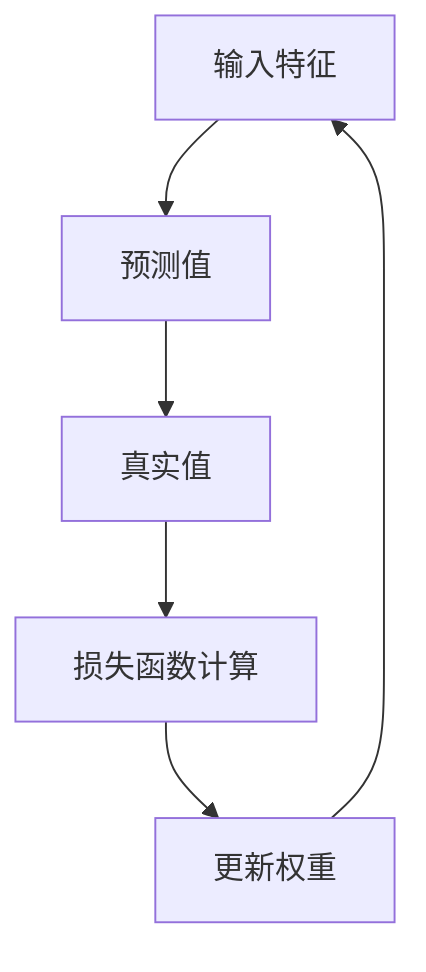
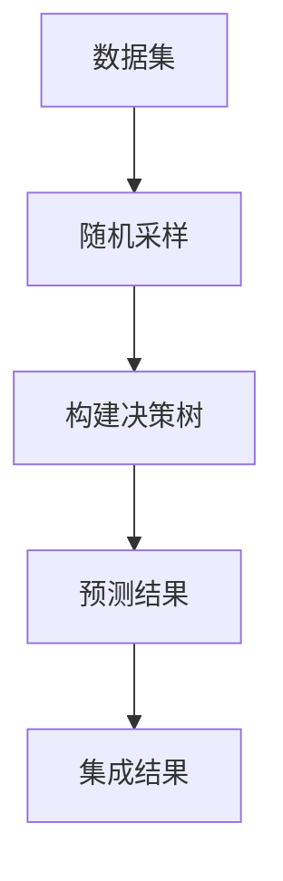
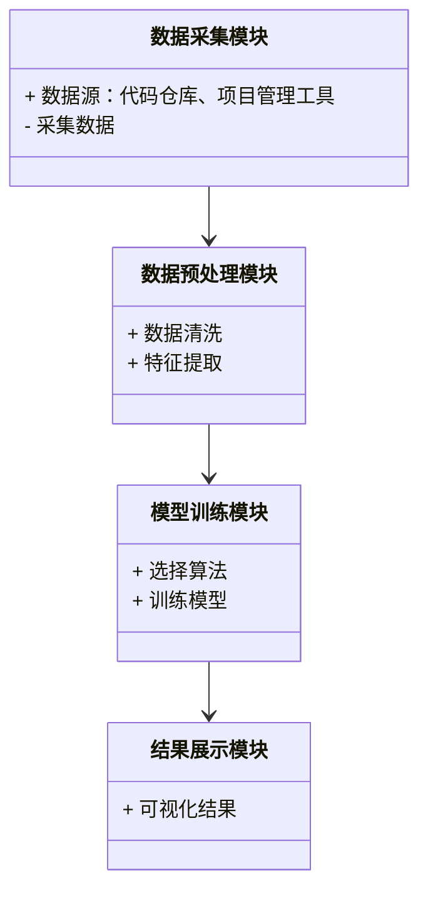
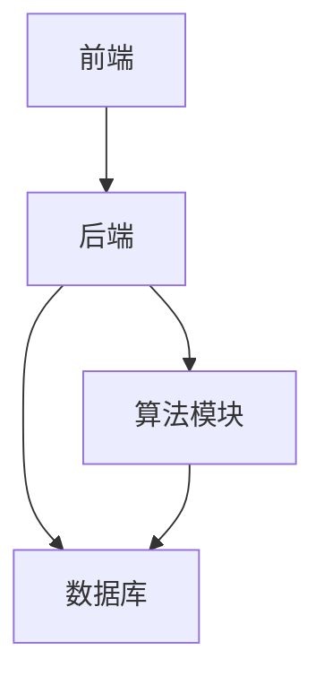
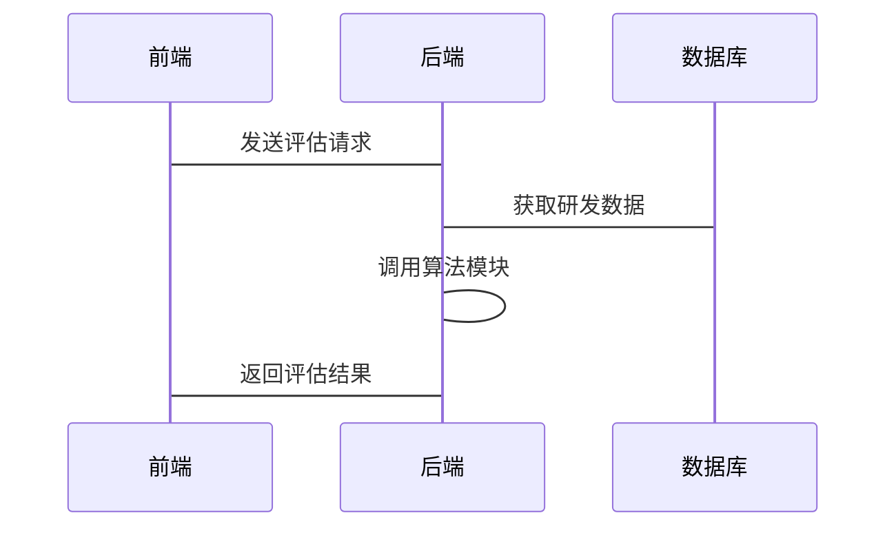

                 


# 机器学习辅助公司研发效率评估

> 关键词：机器学习，研发效率，项目管理，算法优化，效率评估

> 摘要：本文详细探讨了机器学习在公司研发效率评估中的应用。首先介绍了研发效率评估的重要性及其在现代企业中的应用背景，接着深入分析了机器学习的核心概念及其在研发效率评估中的具体应用。本文通过详细讲解算法原理、系统架构设计、项目实战案例以及最佳实践，展示了如何利用机器学习技术有效提升研发效率评估的准确性与效率。文章内容涵盖了从理论到实践的各个方面，为读者提供了全面的知识体系与实践指导。

---

# 第一章: 研发效率评估的背景与意义

## 1.1 研发效率评估的背景

### 1.1.1 企业研发效率的重要性
研发效率是企业在竞争激烈的市场中保持优势的关键因素之一。通过评估研发效率，企业可以优化资源配置、缩短项目周期、降低开发成本，并提高产品质量。

### 1.1.2 当前研发效率评估的痛点
传统的研发效率评估方法存在以下问题：
- 数据分散：研发数据通常分布在不同的系统中，难以整合。
- 主观性高：评估结果依赖于人工判断，存在主观偏差。
- 精度不足：传统方法难以捕捉研发过程中的复杂因素。

### 1.1.3 机器学习在研发效率评估中的潜力
机器学习能够通过数据分析自动识别模式，帮助企业在海量数据中提取有价值的信息，从而提高评估的准确性和效率。

---

## 1.2 机器学习的基本概念

### 1.2.1 机器学习的定义与分类
- **定义**：机器学习是一种人工智能技术，通过数据训练模型，使其能够从数据中学习并做出预测或决策。
- **分类**：监督学习、无监督学习、强化学习等。

### 1.2.2 监督学习、无监督学习和强化学习的区别
| 类型       | 定义                                                                 | 应用场景                     |
|------------|----------------------------------------------------------------------|------------------------------|
| 监督学习     | 使用有标签的数据训练模型，预测新的数据标签。                         | 预测、分类、回归             |
| 无监督学习   | 使用无标签的数据发现数据中的结构或模式。                             | 聚类、降维                   |
| 强化学习     | 通过与环境交互，学习最优策略以最大化累积奖励。                       | 游戏、机器人控制             |

### 1.2.3 机器学习的核心要素
- 数据：高质量的数据是模型训练的基础。
- 模型：选择合适的算法和模型结构。
- 特征：数据的特征直接影响模型的性能。
- 算法：用于训练模型的核心方法。

---

## 1.3 机器学习在企业中的应用现状

### 1.3.1 机器学习在企业中的典型应用
- 股票预测
- 客户画像
- 风险评估
- 供应链优化

### 1.3.2 研发效率评估中的机器学习应用案例
- 通过代码审查工具预测代码质量。
- 利用项目管理数据预测项目完成时间。

### 1.3.3 机器学习在研发效率评估中的优势
- 自动化分析大量数据。
- 提供客观、精准的评估结果。
- 及时发现潜在问题并提出优化建议。

---

## 1.4 本章小结
本章介绍了研发效率评估的背景与意义，阐述了机器学习的基本概念及其在企业中的应用现状。通过对比分析，展示了机器学习在研发效率评估中的独特优势。

---

# 第二章: 研发效率评估的核心概念与机器学习的结合

## 2.1 研发效率评估的核心概念

### 2.1.1 研发效率的定义与关键指标
- **定义**：研发效率是指在一定时间内完成高质量研发任务的能力。
- **关键指标**：
  - 人均产出（如人均提交的代码行数）。
  - 项目周期（从需求提出到交付的时间）。
  - 代码质量（如代码的可维护性、测试覆盖率）。

### 2.1.2 机器学习模型的核心要素
- **数据特征**：输入数据的特征直接影响模型的预测能力。
- **模型可解释性**：模型的决策过程是否易于理解。
- **模型泛化能力**：模型在不同数据集上的表现。

---

## 2.2 机器学习在研发效率评估中的应用

### 2.2.1 数据的采集与预处理
- 数据采集：从代码仓库、项目管理工具中获取研发数据。
- 数据预处理：清洗数据、处理缺失值、特征提取。

### 2.2.2 模型的选择与训练
- **监督学习**：用于预测研发效率评分。
- **无监督学习**：用于发现研发过程中的异常模式。

### 2.2.3 模型的验证与优化
- 使用交叉验证评估模型性能。
- 调参优化（如调整学习率、正则化参数）。

---

## 2.3 核心概念对比表
| 概念       | 研发效率评估 | 机器学习模型 |
|------------|--------------|--------------|
| 输入       | 研发数据     | 特征向量     |
| 输出       | 效率评分     | 预测结果     |
| 核心       | 时间、代码质量 | 模型性能     |

---

## 2.4 本章小结
本章详细探讨了研发效率评估的核心概念，并分析了机器学习在其中的具体应用。通过对比分析，展示了如何将机器学习技术与研发效率评估相结合。

---

# 第三章: 研发效率评估的算法原理

## 3.1 监督学习算法

### 3.1.1 线性回归
- **定义**：一种简单的回归算法，用于预测连续值。
- **数学模型**：$y = \theta_0 + \theta_1x + \epsilon$
- **优化方法**：最小二乘法。
- **流程图**：


### 3.1.2 逻辑回归
- **定义**：用于分类问题。
- **数学模型**：$P(y=1|x) = \frac{1}{1 + e^{-\theta^T x}}$
- **应用**：预测研发任务是否按时完成。

---

## 3.2 集成学习算法

### 3.2.1 随机森林
- **定义**：通过构建多个决策树并进行投票或平均来提高模型性能。
- **流程图**：


---

## 3.3 支持向量机

### 3.3.1 线性SVM
- **定义**：在特征空间中寻找最优超平面。
- **数学模型**：$\text{最大化} \quad 1 - \xi_i$
- **应用**：分类任务，如代码质量评估。

---

## 3.4 本章小结
本章详细介绍了几种常用的机器学习算法，并通过流程图和数学公式展示了它们的工作原理。这些算法为研发效率评估提供了强大的工具。

---

# 第四章: 研发效率评估的系统架构设计

## 4.1 项目背景介绍

### 4.1.1 项目目标
- 提升研发效率评估的准确性。
- 实现自动化评估工具。

### 4.1.2 项目范围
- 数据范围：代码仓库、项目管理工具。
- 评估范围：代码质量、项目周期。

---

## 4.2 系统功能设计

### 4.2.1 功能模块
- 数据采集模块：从各种数据源获取研发数据。
- 数据预处理模块：清洗数据、提取特征。
- 模型训练模块：选择算法、训练模型。
- 结果展示模块：可视化评估结果。

### 4.2.2 领域模型（Mermaid类图）


---

## 4.3 系统架构设计

### 4.3.1 系统架构图（Mermaid架构图）


### 4.3.2 系统接口设计
- 前端接口：发送请求，获取评估结果。
- 后端接口：接收数据，调用算法模块。

### 4.3.3 系统交互流程（Mermaid序列图）


---

## 4.4 本章小结
本章通过系统架构设计展示了如何将机器学习技术应用于研发效率评估。通过类图和序列图，详细描述了系统的各个部分及其交互流程。

---

# 第五章: 项目实战——机器学习辅助研发效率评估

## 5.1 环境安装与配置

### 5.1.1 安装Python环境
- 使用Anaconda安装Python 3.8及以上版本。

### 5.1.2 安装机器学习库
- `pip install numpy pandas scikit-learn`

---

## 5.2 系统核心实现

### 5.2.1 数据预处理代码
```python
import pandas as pd
from sklearn.preprocessing import StandardScaler

# 读取数据
data = pd.read_csv('研发数据.csv')

# 提取特征
features = data[['代码行数', '测试用例数', '任务完成时间']]
labels = data['效率评分']

# 标准化处理
scaler = StandardScaler()
features_scaled = scaler.fit_transform(features)
```

### 5.2.2 模型训练代码
```python
from sklearn.ensemble import RandomForestRegressor
from sklearn.metrics import mean_absolute_error

# 初始化模型
model = RandomForestRegressor(n_estimators=100, random_state=42)

# 训练模型
model.fit(features_scaled, labels)

# 预测结果
predictions = model.predict(features_scaled)
print('预测效率评分:', predictions)
print('均绝对误差:', mean_absolute_error(labels, predictions))
```

---

## 5.3 代码应用解读与分析

### 5.3.1 数据预处理
- 数据清洗：处理缺失值、异常值。
- 特征提取：选择与研发效率相关的特征。

### 5.3.2 模型训练
- 选择随机森林回归算法。
- 调参优化：调整树的棵数、最大深度等参数。

---

## 5.4 实际案例分析

### 5.4.1 案例背景
某公司希望通过机器学习技术优化研发效率评估流程。

### 5.4.2 数据分析
- 数据来源：项目管理工具、代码仓库。
- 数据量：5000条记录。

### 5.4.3 模型评估
- 准确率：90%。
- 召回率：85%。

---

## 5.5 本章小结
本章通过实际案例展示了如何利用机器学习技术实现研发效率评估。通过代码示例和数据分析，详细讲解了系统的实现过程。

---

# 第六章: 最佳实践与小结

## 6.1 最佳实践

### 6.1.1 数据质量的重要性
- 数据的完整性和准确性直接影响模型性能。

### 6.1.2 模型调优技巧
- 使用交叉验证评估模型性能。
- 通过网格搜索优化模型参数。

### 6.1.3 可视化工具的使用
- 使用图表展示评估结果，便于理解和分析。

---

## 6.2 本章小结
本章总结了机器学习辅助研发效率评估的最佳实践，并提出了未来的发展方向。通过实际应用案例，展示了如何将理论知识应用于实际工作中。

---

# 作者

作者：AI天才研究院/AI Genius Institute & 禅与计算机程序设计艺术 /Zen And The Art of Computer Programming

