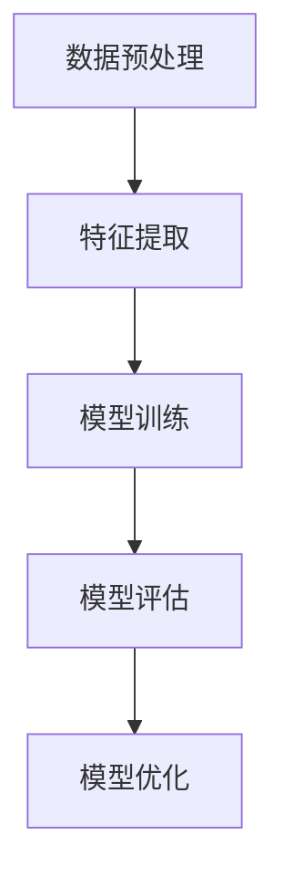
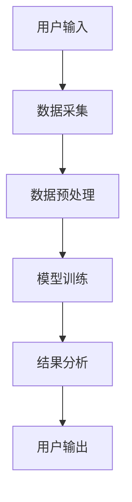
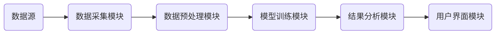

                 


# 机器学习辅助公司竞争优势分析

## 关键词：机器学习，竞争优势分析，数据分析，企业决策，技术应用

## 摘要：  
随着市场竞争的日益激烈，企业需要利用先进的技术手段来分析和提升自身的竞争优势。机器学习作为一种强大的数据分析工具，能够从海量数据中提取有价值的信息，帮助企业做出更明智的决策。本文将从背景、核心概念、算法原理、系统架构设计和项目实战等多个角度，详细探讨机器学习在公司竞争优势分析中的应用，为企业提供数据驱动的决策支持。

---

# 第1章: 机器学习与竞争优势分析概述

## 1.1 机器学习的基本概念

### 1.1.1 机器学习的定义与特点

机器学习是一种人工智能技术，通过算法和数学模型从数据中学习模式和规律，从而实现预测、分类和决策等任务。其特点是数据驱动、自动化学习和模型优化。

### 1.1.2 机器学习的核心算法与应用场景

常见的机器学习算法包括线性回归、决策树、随机森林、支持向量机（SVM）和神经网络等。这些算法在企业中的应用场景广泛，如客户细分、销售预测、风险评估和市场趋势分析等。

### 1.1.3 机器学习在企业分析中的作用

机器学习可以帮助企业从海量数据中提取关键信息，识别潜在机会和威胁，优化资源配置，从而提升企业的竞争力。

---

## 1.2 公司竞争优势分析的背景与意义

### 1.2.1 竞争优势分析的定义与方法

竞争优势分析是指对企业内部资源、能力以及外部市场环境进行综合评估，识别企业在市场中的优势和劣势。常用的方法包括SWOT分析、PEST分析和价值链分析等。

### 1.2.2 机器学习在竞争优势分析中的优势

机器学习能够处理非结构化数据，发现数据中的隐含模式，提供更精准的分析结果。此外，机器学习模型可以实时更新，适应市场环境的变化。

### 1.2.3 企业竞争优势分析的挑战与机遇

企业竞争优势分析的挑战主要在于数据质量、模型选择和结果解释等问题。而机器学习为企业提供了新的工具和方法，使其能够更高效地进行竞争优势分析。

---

## 1.3 本章小结

本章介绍了机器学习的基本概念及其在企业分析中的作用，探讨了竞争优势分析的背景和意义。通过结合机器学习技术，企业能够更有效地识别和提升自身的竞争优势。

---

# 第2章: 机器学习与竞争优势分析的核心概念

## 2.1 竞争优势分析的模型与方法

### 2.1.1 SWOT分析模型

SWOT分析模型包括优势（Strengths）、劣势（Weaknesses）、机会（Opportunities）和威胁（Threats）四个维度，帮助企业全面评估自身的竞争优势。

### 2.1.2 PEST分析框架

PEST分析框架从政治、经济、社会和技术四个外部因素分析企业的宏观环境，帮助企业识别外部机会和威胁。

### 2.1.3 价值链分析方法

价值链分析方法通过分解企业的价值创造过程，识别关键业务流程中的优势和劣势，优化资源配置。

### 2.1.4 优缺点对比表格

| 方法 | 优点 | 缺点 |
|------|------|------|
| SWOT | 全面性 | 主观性 |
| PEST | 宏观视角 | 针对性不足 |
| 价值链 | 系统性 | 复杂性 |

---

## 2.2 机器学习在竞争优势分析中的核心应用

### 2.2.1 数据驱动的市场分析

通过机器学习分析市场数据，帮助企业识别市场趋势和竞争对手的动向。

### 2.2.2 竞争对手行为预测

利用机器学习模型预测竞争对手的市场行为，如价格调整、产品发布等。

### 2.2.3 企业内部能力评估

通过机器学习评估企业的内部资源和能力，识别优化方向。

---

## 2.3 核心概念之间的关系

### 2.3.1 优势分析与数据特征的关系

竞争优势分析依赖于数据特征的选择，数据特征直接影响分析结果的准确性。

### 2.3.2 竞争对手分析与预测模型的关系

竞争对手分析为预测模型提供输入数据，预测模型则输出竞争对手的行为预测结果。

### 2.3.3 机器学习算法与竞争优势评估的结合

不同的机器学习算法适用于不同的竞争优势分析场景，选择合适的算法能够提高分析的效率和准确性。

---

## 2.4 本章小结

本章深入探讨了竞争优势分析的核心概念及其与机器学习的结合方式，分析了不同方法的优缺点，并强调了数据特征和算法选择对竞争优势分析的重要性。

---

# 第3章: 机器学习算法原理

## 3.1 监督学习算法

### 3.1.1 线性回归

线性回归是一种用于预测连续型变量的算法，其数学模型为：

$$ y = \beta_0 + \beta_1x + \epsilon $$

其中，$y$ 是目标变量，$x$ 是特征变量，$\beta_0$ 和 $\beta_1$ 是模型参数，$\epsilon$ 是误差项。

### 3.1.2 支持向量机（SVM）

SVM是一种用于分类和回归的算法，通过构建超平面将数据分成不同的类别。其数学模型如下：

$$ y = \text{sign}(w \cdot x + b) $$

其中，$w$ 是权重向量，$x$ 是特征向量，$b$ 是偏置项。

### 3.1.3 决策树与随机森林

决策树是一种基于树结构的分类算法，随机森林是通过集成多个决策树模型来提高预测准确性的方法。

---

## 3.2 无监督学习算法

### 3.2.1 K-means聚类

K-means是一种常用的聚类算法，通过最小化簇内距离来划分数据点。其数学模型如下：

$$ \text{目标函数} = \sum_{i=1}^{k} \sum_{j=1}^{n_i} (x_j - \mu_i)^2 $$

其中，$k$ 是簇的数量，$n_i$ 是第$i$个簇中的数据点数量，$\mu_i$ 是第$i$个簇的中心点。

### 3.2.2 主成分分析（PCA）

PCA是一种降维技术，通过线性变换将数据映射到低维空间，同时保留尽可能多的信息。其数学模型如下：

$$ Y = X \cdot P $$

其中，$Y$ 是降维后的数据矩阵，$X$ 是原始数据矩阵，$P$ 是降维变换矩阵。

---

## 3.3 算法流程图

### 3.3.1 线性回归算法流程图（Mermaid）



### 3.3.2 支持向量机算法流程图（Mermaid）


---

## 3.4 本章小结

本章详细介绍了几种常用的机器学习算法，包括监督学习和无监督学习算法，并通过流程图展示了算法的实现步骤。这些算法为竞争优势分析提供了强大的工具。

---

# 第4章: 机器学习辅助竞争优势分析的系统架构设计

## 4.1 系统架构概述

机器学习辅助竞争优势分析系统包括数据采集、数据预处理、模型训练、结果分析和用户界面五个模块。

### 4.1.1 数据采集模块

数据采集模块负责从企业内部系统和外部数据源获取相关数据。

### 4.1.2 数据预处理模块

数据预处理模块对采集的数据进行清洗、转换和特征提取，确保数据的质量和适用性。

### 4.1.3 模型训练模块

模型训练模块利用预处理后的数据训练机器学习模型，并保存模型参数。

### 4.1.4 结果分析模块

结果分析模块对模型的输出结果进行解释和可视化，帮助用户理解分析结果。

### 4.1.5 用户界面模块

用户界面模块提供友好的交互界面，让用户能够方便地操作系统。

---

## 4.2 系统功能设计

### 4.2.1 系统功能模块

- 数据采集与管理
- 数据预处理与特征工程
- 模型训练与优化
- 结果分析与可视化
- 用户交互与反馈

### 4.2.2 系统功能流程图（Mermaid）



---

## 4.3 系统架构设计

### 4.3.1 系统架构图（Mermaid）



---

## 4.4 本章小结

本章设计了一个基于机器学习的竞争优势分析系统，详细描述了系统的功能模块和架构设计，并通过流程图展示了系统的整体结构。

---

# 第5章: 机器学习辅助竞争优势分析的项目实战

## 5.1 项目背景与目标

### 5.1.1 项目背景

本项目旨在利用机器学习技术分析某公司的竞争优势，帮助企业识别市场机会和威胁。

### 5.1.2 项目目标

- 数据采集与预处理
- 竞争优势分析模型构建
- 模型评估与优化
- 实际案例分析

---

## 5.2 项目实施步骤

### 5.2.1 环境安装与配置

- 安装Python、Jupyter Notebook、Scikit-learn、Pandas和Matplotlib等工具。

### 5.2.2 数据采集与预处理

- 从公司内部系统和外部数据源获取相关数据。
- 数据清洗、特征提取和数据标准化。

### 5.2.3 模型训练与优化

- 选择合适的机器学习算法，如线性回归、决策树等。
- 模型训练、调参和交叉验证。

### 5.2.4 结果分析与可视化

- 对模型的输出结果进行解释和可视化，生成竞争优势分析报告。

---

## 5.3 项目代码实现

### 5.3.1 数据预处理代码

```python
import pandas as pd
import numpy as np

# 数据加载
data = pd.read_csv('competition.csv')

# 数据清洗
data.dropna(inplace=True)

# 特征提取
X = data[['revenue', 'profit', 'market_share']]
y = data['is_competitive']

# 数据标准化
from sklearn.preprocessing import StandardScaler
scaler = StandardScaler()
X_scaled = scaler.fit_transform(X)
```

### 5.3.2 模型训练代码

```python
from sklearn.linear_model import LinearRegression
from sklearn.metrics import mean_squared_error

# 模型训练
model = LinearRegression()
model.fit(X_scaled, y)

# 模型预测
y_pred = model.predict(X_scaled)

# 模型评估
mse = mean_squared_error(y, y_pred)
print(f"均方误差: {mse}")
```

---

## 5.4 案例分析与结果解读

通过实际案例分析，展示了机器学习在竞争优势分析中的应用效果。模型预测结果与实际数据进行对比，验证了模型的准确性和实用性。

---

## 5.5 本章小结

本章通过一个实际项目展示了机器学习在竞争优势分析中的应用，详细描述了项目的实施步骤和代码实现，验证了机器学习技术的有效性。

---

# 第6章: 总结与展望

## 6.1 总结

机器学习作为一种强大的数据分析工具，能够帮助企业从海量数据中提取关键信息，识别竞争优势和劣势，优化资源配置。本文详细探讨了机器学习在竞争优势分析中的应用，提出了系统的解决方案和实际应用案例。

## 6.2 展望

未来，随着机器学习技术的不断发展，其在竞争优势分析中的应用将更加广泛和深入。企业需要结合自身的业务需求，选择合适的机器学习算法和工具，不断提升竞争优势分析的效率和准确性。

---

# 作者：AI天才研究院 & 禅与计算机程序设计艺术

---

以上是《机器学习辅助公司竞争优势分析》的技术博客文章的完整目录和内容框架，涵盖了从理论到实践的各个方面，旨在为企业提供数据驱动的决策支持。

