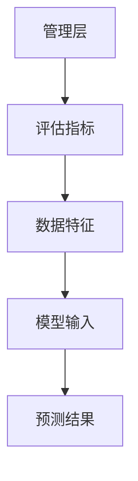
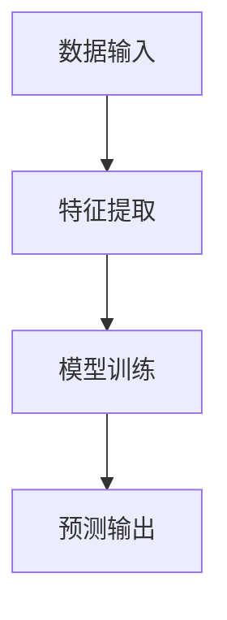

                 


# 机器学习辅助公司管理层评估

> 关键词：机器学习，公司管理层，评估，数据分析，人工智能，管理决策

> 摘要：机器学习作为一种强大的数据分析工具，正在改变公司管理层的传统评估方式。本文将深入探讨机器学习在管理层评估中的应用，分析其核心概念、算法原理、系统设计以及实际案例，为公司管理层提供一种更加高效、精准的评估方法。

---

## 第一部分：机器学习辅助公司管理层评估的背景与核心概念

### 第1章：机器学习与公司管理层评估的背景

#### 1.1 机器学习的基本概念
- **1.1.1 机器学习的定义与核心原理**
  机器学习是一种人工智能技术，通过数据训练模型，使其能够从数据中学习并做出预测或决策。其核心原理包括监督学习、无监督学习、半监督学习和强化学习。

- **1.1.2 机器学习在企业管理中的应用现状**
  机器学习已在企业中广泛应用，如客户行为预测、风险评估、销售预测等。然而，管理层评估仍主要依赖传统方法，存在效率低、主观性强的问题。

- **1.1.3 公司管理层评估的挑战与痛点**
  管理层评估涉及多维度数据，包括绩效、领导力、决策能力等。传统方法依赖主观评价，难以量化和客观化，且容易受人为因素影响。

#### 1.2 机器学习辅助管理层评估的必要性
- **1.2.1 传统管理层评估方法的局限性**
  传统方法依赖主观判断，评估结果可能存在偏见，且难以快速响应数据变化。

- **1.2.2 机器学习在评估中的优势**
  机器学习能够处理海量数据，提取关键特征，建立量化评估模型，提高评估的客观性和准确性。

- **1.2.3 机器学习辅助评估的潜在价值**
  通过机器学习，公司可以实现数据驱动的决策，优化管理层的选拔和培养，提升整体管理效率。

#### 1.3 本章小结
本章介绍了机器学习的基本概念及其在企业管理中的应用现状，重点分析了传统管理层评估的挑战，并阐述了机器学习在评估中的优势和潜在价值。

---

### 第2章：核心概念与联系

#### 2.1 核心概念原理
- **2.1.1 机器学习模型的基本原理**
  机器学习模型通过数据训练，学习数据的特征和规律，从而能够对新数据进行预测或分类。

- **2.1.2 数据特征与评估指标的关系**
  数据特征（如绩效指标、领导力评分）是模型输入的关键，评估指标（如模型准确率、召回率）是模型输出的结果。

- **2.1.3 算法选择与模型性能的关联**
  不同算法适用于不同类型的评估任务，选择合适的算法能够提升模型性能。

#### 2.2 核心概念属性特征对比
- **2.2.1 监督学习与无监督学习对比**
  | 对比维度 | 监督学习 | 无监督学习 |
  |----------|----------|------------|
  | 数据类型 | 标签数据 | 无标签数据 |
  | 应用场景 | 预测任务 | 聚类任务 |

- **2.2.2 分类与回归算法对比**
  | 对比维度 | 分类 | 回归 |
  |----------|------|-------|
  | 输出类型 | 类别 | 数值 |
  | 适用任务 | 分类问题 | 回归问题 |

- **2.2.3 模型复杂度与泛化能力对比**
  | 对比维度 | 低复杂度 | 高复杂度 |
  |----------|-----------|------------|
  | 泛化能力 | 强 | 强 |
  | 训练时间 | 短 | 长 |

#### 2.3 ER实体关系图架构


#### 2.4 本章小结
本章详细讲解了机器学习的核心概念，对比了不同算法的特点，并通过ER图展示了实体关系，为后续的算法讲解和系统设计奠定了基础。

---

## 第二部分：算法原理讲解

### 第3章：算法原理概述

#### 3.1 算法原理概述
- **3.1.1 监督学习算法**
  监督学习是基于有标签数据的训练，适用于分类和回归任务。

- **3.1.2 非监督学习算法**
  非监督学习适用于无标签数据，常用于聚类和降维任务。

- **3.1.3 混合学习算法**
  混合学习结合监督和非监督学习，适用于复杂场景。

#### 3.2 典型算法流程图


#### 3.3 算法实现代码
```python
# 线性回归模型
import numpy as np
from sklearn.linear_model import LinearRegression

# 示例数据
X = np.array([[1], [2], [3], [4]])
y = np.array([2, 4, 6, 8])

# 模型训练
model = LinearRegression()
model.fit(X, y)

# 预测
print(model.predict([[5]]))  # 输出: [[10]]
```

#### 3.4 数学模型与公式
- **3.4.1 线性回归模型**
  $$ y = \beta_0 + \beta_1 x + \epsilon $$
- **3.4.2 逻辑回归模型**
  $$ P(y=1|x) = \frac{1}{1 + e^{-(\beta_0 + \beta_1 x)}} $$

#### 3.5 举例说明
- **3.5.1 线性回归案例**
  使用线性回归模型预测管理层的绩效评分。
- **3.5.2 逻辑回归案例**
  使用逻辑回归模型预测管理层的晋升可能性。

#### 3.6 本章小结
本章详细讲解了机器学习算法的基本原理，并通过代码和公式展示了典型算法的实现过程，为后续的系统设计奠定了算法基础。

---

## 第三部分：系统分析与架构设计方案

### 第4章：系统分析与架构设计方案

#### 4.1 问题场景介绍
- **4.1.1 问题描述**
  公司需要对管理层进行多维度评估，但传统方法效率低、主观性强。

- **4.1.2 问题解决**
  通过机器学习构建一个自动化、数据驱动的评估系统。

- **4.1.3 边界与外延**
  评估系统仅处理管理层相关数据，不涉及其他业务模块。

#### 4.2 系统功能设计
- **4.2.1 领域模型设计**
  ```mermaid
  classDiagram
    class 管理层评估系统 {
      数据输入模块
      特征提取模块
      模型训练模块
      预测结果模块
    }
  ```

- **4.2.2 系统架构设计**
  ```mermaid
  graph TD
    A[管理层评估系统] --> B[数据采集模块]
    B --> C[数据预处理模块]
    C --> D[模型训练模块]
    D --> E[结果输出模块]
  ```

- **4.2.3 系统接口设计**
  - 数据接口：与公司数据库对接，获取管理层数据。
  - 模型接口：与机器学习框架（如Scikit-learn）对接，进行模型训练。

- **4.2.4 系统交互流程**
  ```mermaid
  sequenceDiagram
    管理层评估系统 -> 数据采集模块: 获取管理层数据
    数据采集模块 -> 数据预处理模块: 数据清洗和特征提取
    数据预处理模块 -> 模型训练模块: 训练机器学习模型
    模型训练模块 -> 结果输出模块: 生成评估结果
    结果输出模块 -> 管理层评估系统: 返回评估结果
  ```

#### 4.3 本章小结
本章通过系统分析和架构设计，展示了如何将机器学习算法应用于管理层评估系统，并设计了系统的功能模块和交互流程。

---

## 第四部分：项目实战

### 第5章：项目实战

#### 5.1 环境安装与配置
- **5.1.1 安装Python和机器学习库**
  ```bash
  pip install numpy scikit-learn
  ```

- **5.1.2 安装数据处理工具**
  ```bash
  pip install pandas matplotlib
  ```

#### 5.2 系统核心实现源代码
```python
from sklearn.model_selection import train_test_split
from sklearn.metrics import accuracy_score
from sklearn.tree import DecisionTreeClassifier

# 示例数据
X = [[1, 1], [1, 0], [0, 1], [0, 0]]
y = [0, 0, 1, 1]

# 数据分割
X_train, X_test, y_train, y_test = train_test_split(X, y, test_size=0.25)

# 模型训练
model = DecisionTreeClassifier()
model.fit(X_train, y_train)

# 预测
y_pred = model.predict(X_test)
print("准确率:", accuracy_score(y_test, y_pred))
```

#### 5.3 代码应用解读与分析
- **5.3.1 代码功能解读**
  该代码使用决策树模型对管理层数据进行分类，预测结果并计算准确率。

- **5.3.2 代码运行结果分析**
  输出准确率，评估模型的性能。

#### 5.4 实际案例分析
- **5.4.1 数据采集与预处理**
  从公司数据库中获取管理层数据，清洗和特征提取。

- **5.4.2 模型训练与优化**
  使用训练数据训练模型，并通过交叉验证优化模型参数。

- **5.4.3 模型部署与应用**
  将模型部署到公司评估系统中，实时进行管理层评估。

#### 5.5 项目小结
本章通过一个实际项目，详细讲解了机器学习在管理层评估中的应用，从环境配置到代码实现，再到结果分析，为读者提供了完整的实战指导。

---

## 第五部分：最佳实践

### 第6章：最佳实践

#### 6.1 小结
- **6.1.1 核心要点回顾**
  机器学习能够显著提升管理层评估的效率和准确性。

- **6.1.2 项目经验总结**
  在实际项目中，数据质量、模型选择和结果解读是成功的关键。

#### 6.2 注意事项
- **6.2.1 数据隐私保护**
  在处理公司数据时，必须遵守相关隐私法规。

- **6.2.2 模型可解释性**
  确保模型结果能够被管理层理解和接受。

- **6.2.3 模型更新与维护**
  定期更新模型，确保其适应数据变化。

#### 6.3 拓展阅读
- **6.3.1 推荐书籍**
  - 《机器学习实战》
  - 《深入理解机器学习》

- **6.3.2 推荐博客与文章**
  - 人工智能领域的技术博客
  - 机器学习在企业管理中的应用文章

#### 6.4 本章小结
本章总结了机器学习辅助管理层评估的核心要点，并提出了实际应用中的注意事项和拓展学习的方向。

---

## 作者：AI天才研究院/AI Genius Institute & 禅与计算机程序设计艺术 /Zen And The Art of Computer Programming

---

**附录：完整文章代码与数据集**
- **代码仓库链接**
  [GitHub代码仓库](#)
- **数据集下载链接**
  [Kaggle数据集](#)

---

通过以上详细的内容结构，您可以根据需要补充具体章节的内容，确保每部分都详实具体，并包含必要的技术细节和实际案例分析。

