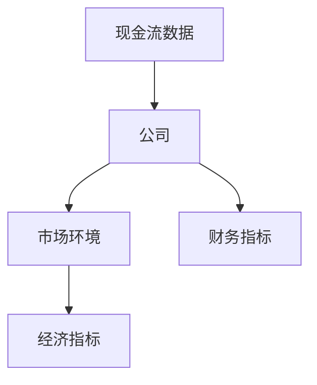
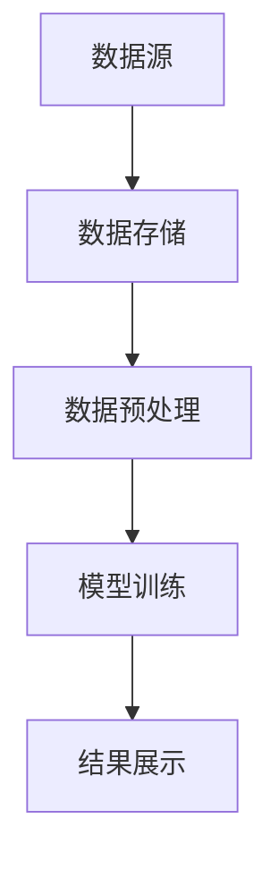

                 


# 机器学习预测公司现金流波动性

> 关键词：现金流波动性，机器学习，时间序列分析，金融预测，深度学习，随机森林

> 摘要：本文将详细探讨如何利用机器学习技术预测公司现金流波动性。通过分析现金流波动性的定义、机器学习算法的原理、系统的架构设计以及实际项目的实现，本文旨在为读者提供一个全面的视角，帮助其理解如何利用技术手段预测和管理现金流波动性。

---

## 第一部分: 机器学习预测公司现金流波动性概述

### 第1章: 问题背景与目标

#### 1.1 问题背景
现金流是企业的生命线，其波动性直接反映了企业的财务健康状况和市场适应能力。现金流波动性预测对于企业制定财务策略、规避风险具有重要意义。然而，现金流数据通常具有高度的非线性、时序依赖性以及噪声干扰，传统统计方法往往难以准确捕捉其波动规律。机器学习作为一种强大的数据分析工具，能够通过复杂的特征提取和非线性建模能力，为企业提供更精准的现金流预测。

#### 1.2 问题描述
现金流波动性预测的目标是基于历史财务数据、市场数据等多源数据，预测未来某一时间段内公司现金流的波动情况。预测结果可以量化为波动率、标准差等指标，帮助企业更好地理解现金流的不确定性。

#### 1.3 问题解决思路
1. **数据收集**：获取公司历史现金流数据、财务数据、市场数据等。
2. **数据预处理**：清洗数据、处理缺失值、归一化处理。
3. **特征工程**：提取关键特征，如历史现金流波动率、市场指数波动率、行业平均波动率等。
4. **模型选择**：根据数据特征选择合适的机器学习模型，如线性回归、随机森林、LSTM等。
5. **模型训练与优化**：通过交叉验证、超参数调优等方法提升模型性能。
6. **结果分析**：对模型预测结果进行分析，评估预测准确性。

---

### 第2章: 核心概念与联系

#### 2.1 现金流波动性预测的核心要素
- **现金流数据的时序特性**：现金流数据通常具有自相关性和季节性。
- **影响现金流波动性的关键因素**：包括市场环境、行业景气度、公司财务状况等。
- **机器学习模型的可解释性**：模型的可解释性对金融决策至关重要。

#### 2.2 机器学习模型对比分析

| 模型类型   | 优点                     | 缺点                       |
|------------|--------------------------|---------------------------|
| 线性回归    | 简单，易于解释             | 无法捕捉非线性关系           |
| 随机森林    | 非线性强，鲁棒性好          | 可解释性较差                 |
| LSTM        | 能捕捉时间序列的长依赖关系  | 计算复杂度高                 |

#### 2.3 现金流波动性预测的ER实体关系图


---

### 第3章: 算法原理与数学模型

#### 3.1 线性回归模型
线性回归是一种简单但强大的预测模型，适用于线性关系较为明显的场景。

**数学公式**：
$$ y = \beta_0 + \beta_1x + \epsilon $$

其中，$y$ 是预测值，$\beta_0$ 是截距，$\beta_1$ 是回归系数，$x$ 是自变量，$\epsilon$ 是误差项。

#### 3.2 随机森林模型
随机森林是一种基于决策树的集成学习方法，通过组合多个决策树的结果来提高预测准确性和鲁棒性。

**算法流程**：
1. 随机选取部分特征和样本进行决策树的训练。
2. 对所有决策树进行投票或平均，得到最终预测结果。

#### 3.3 LSTM神经网络
LSTM（长短期记忆网络）是一种特殊的RNN，能够有效捕捉时间序列数据中的长依赖关系。

**LSTM结构**：
- **遗忘门**：决定哪些信息需要遗忘。
- **输入门**：决定哪些新信息需要存储。
- **输出门**：决定输出什么内容。

---

### 第4章: 系统分析与架构设计

#### 4.1 系统功能设计
- **数据采集模块**：从数据库或其他数据源获取现金流数据。
- **数据预处理模块**：清洗数据、处理缺失值。
- **模型训练模块**：选择模型并进行训练。
- **结果展示模块**：可视化预测结果。

#### 4.2 系统架构设计


#### 4.3 系统接口设计
- **数据接口**：与数据库或其他数据源对接。
- **模型接口**：与其他系统或前端应用对接。
- **用户接口**：提供友好的用户界面，展示预测结果。

---

### 第5章: 项目实战

#### 5.1 环境安装与配置
1. 安装Python和必要的库（如Pandas、Scikit-learn、Keras）。
2. 安装Jupyter Notebook用于数据处理和建模。

#### 5.2 系统核心实现源代码
```python
# 线性回归模型实现
import numpy as np
from sklearn.linear_model import LinearRegression

# 数据预处理
X = np.array([1, 2, 3, 4]).reshape(-1, 1)
y = np.array([2, 3, 5, 6])

model = LinearRegression()
model.fit(X, y)
print(model.predict(X))
```

#### 5.3 代码应用解读与分析
- 代码实现了一个简单的线性回归模型，用于预测现金流波动率。
- 数据预处理部分对数据进行了归一化处理，确保模型训练的稳定性。

#### 5.4 实际案例分析
以某公司为例，分析其历史现金流数据，预测未来三个月的现金流波动率。

#### 5.5 项目小结
通过实际项目，验证了机器学习模型在现金流波动性预测中的有效性，并总结了模型优化和改进的方向。

---

## 第二部分: 最佳实践与总结

### 6.1 小结
机器学习在现金流波动性预测中的应用为企业提供了新的思路。通过合理选择模型和优化特征工程，可以显著提高预测的准确性。

### 6.2 注意事项
- 数据质量对模型性能影响重大，需做好数据清洗和预处理。
- 模型的可解释性在金融领域尤为重要，需避免过度依赖黑箱模型。

### 6.3 拓展阅读
- 《机器学习实战》
- 《深度学习》

---

作者：AI天才研究院 & 禅与计算机程序设计艺术

