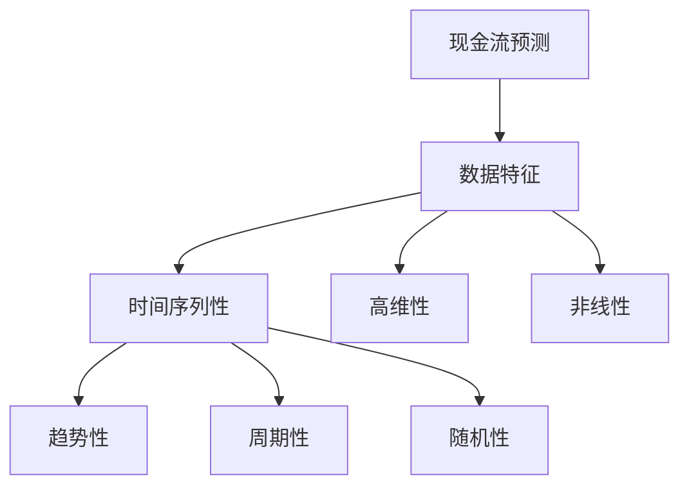
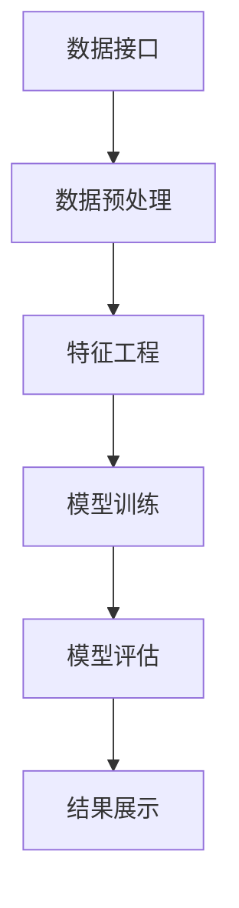
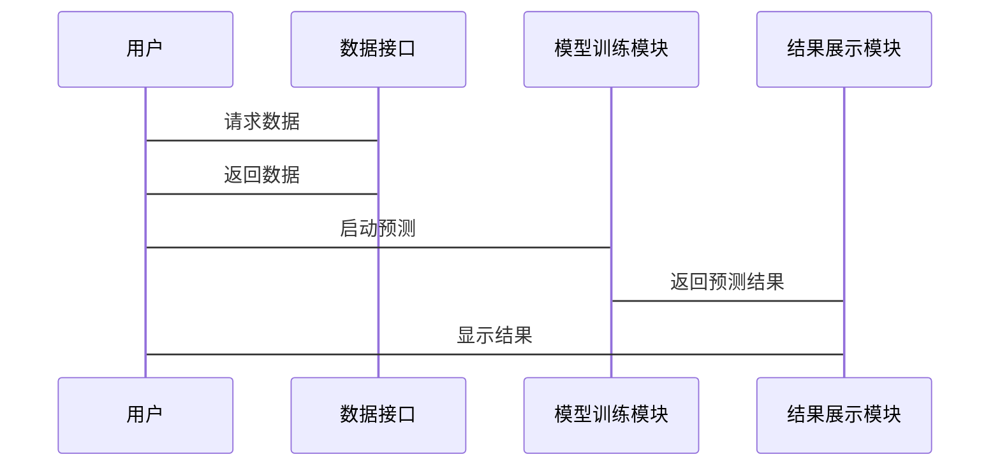

                 


# 机器学习预测公司自由现金流趋势

> 关键词：机器学习，自由现金流，时间序列分析，回归模型，随机森林，神经网络

> 摘要：本文探讨了如何利用机器学习算法预测公司自由现金流的趋势。通过分析现金流预测的重要性、机器学习在金融领域的应用，以及具体算法的实现，本文详细介绍了从数据准备、模型选择到系统设计的全过程。文章结合理论与实践，提供了一个完整的现金流预测系统设计方案，旨在帮助企业利用机器学习技术优化财务决策。

---

## 正文

### 第一部分: 机器学习预测公司自由现金流的背景与基础

#### 第1章: 自由现金流预测的背景与重要性

##### 1.1 企业自由现金流的定义与重要性
- 企业自由现金流（Free Cash Flow，FCF）是衡量企业财务健康的重要指标。
- FCF 的计算公式：FCF = 经营活动现金流 - 资本 expenditures。
- FCF 在企业估值、投资决策和财务规划中的作用。

##### 1.2 机器学习在金融预测中的应用
- 机器学习在金融领域的核心应用：股票价格预测、信用评分、风险管理。
- 机器学习在现金流预测中的优势：非线性关系建模、特征工程能力强。
- 机器学习与传统统计方法的对比：灵活性与可解释性的平衡。

##### 1.3 本书的研究内容与目标
- 本书目标：通过机器学习算法，构建一个高精度的现金流预测模型。
- 本书内容：从数据预处理到模型部署的全流程指导。
- 本书读者：金融从业者、数据科学家、企业财务人员。

---

### 第二部分: 机器学习预测现金流的核心概念与联系

#### 第2章: 机器学习预测现金流的核心概念

##### 2.1 数据特征与处理
- 时间序列数据的特征：趋势性、周期性、随机性。
- 数据预处理方法：缺失值填充、异常值处理、标准化/归一化。
- 特征工程：将财务指标（如收入增长率、净利润率）转化为模型输入。

##### 2.2 模型选择与评估指标
- 监督学习算法的选择：线性回归、随机森林、神经网络。
- 模型评估指标：均方误差（MSE）、平均绝对误差（MAE）、R²系数。
- 模型调优策略：交叉验证、超参数优化。

##### 2.3 机器学习预测现金流的流程
- 数据收集与清洗：获取公司财务报表数据，处理缺失值。
- 特征工程：提取影响现金流的关键指标。
- 模型训练与评估：选择合适的算法，验证模型性能。

#### 第3章: 核心概念与联系的Mermaid流程图

##### 3.1 核心概念原理


##### 3.2 核心概念属性特征对比表格
| 概念         | 特征1 | 特征2 | 特征3 |
|--------------|-------|-------|-------|
| 数据特征     | 时间序列性 | 高维性 | 非线性 |
| 模型选择     | 监督学习 | 时间序列模型 | 集成学习 |

---

### 第三部分: 机器学习预测现金流的算法原理

#### 第3章: 算法原理与数学模型

##### 3.1 线性回归算法
- 线性回归的数学模型：
  $$ y = \beta_0 + \beta_1 x + \epsilon $$
- 最小二乘法的优化目标：
  $$ \text{最小化} \sum (y_i - (\beta_0 + \beta_1 x_i))^2 $$
- Python实现示例：
  ```python
  import numpy as np
  from sklearn.linear_model import LinearRegression

  X = np.array([x1, x2, ..., xn]).reshape(-1, 1)
  y = np.array([y1, y2, ..., yn])
  model = LinearRegression().fit(X, y)
  print('Coefficients:', model.coef_)
  ```

##### 3.2 随机森林算法
- 随机森林的数学模型：
  - 集成多个决策树，通过投票或平均进行预测。
- Python实现示例：
  ```python
  from sklearn.ensemble import RandomForestRegressor

  model = RandomForestRegressor(n_estimators=100).fit(X, y)
  print('Feature importance:', model.feature_importances_)
  ```

##### 3.3 神经网络算法
- 神经网络的数学模型：
  - 输入层 → 隐藏层（激活函数：ReLU/Sigmoid）→ 输出层。
  - 损失函数：均方误差（MSE）。
  - 优化算法：梯度下降（Adam）。
- Python实现示例：
  ```python
  import tensorflow as tf
  from tensorflow.keras import layers

  model = tf.keras.Sequential([
      layers.Dense(64, activation='relu', input_shape=(n_features,)),
      layers.Dense(1)
  ])
  model.compile(optimizer='adam', loss='mse')
  model.fit(X, y, epochs=100, batch_size=32)
  ```

#### 第4章: 数学模型与公式

##### 4.1 线性回归模型
- 普通最小二乘法的公式：
  $$ \hat{y} = X \hat{\beta} $$
  其中，$\hat{\beta} = (X^T X)^{-1} X^T y$。

##### 4.2 随机森林模型
- 随机森林的集成学习公式：
  $$ \hat{y} = \frac{1}{N} \sum_{i=1}^{N} \hat{y}_i $$
  其中，$N$是决策树的数量。

##### 4.3 神经网络模型
- 神经网络的前向传播公式：
  $$ a^{(l+1)} = \sigma(W^{(l)} a^{(l)} + b^{(l)}) $$
  其中，$\sigma$是激活函数（如ReLU或Sigmoid）。

---

### 第四部分: 系统分析与架构设计

#### 第4章: 系统分析与架构设计方案

##### 4.1 项目背景与目标
- 项目背景：帮助企业利用机器学习技术预测现金流，优化财务决策。
- 项目目标：构建一个高效、准确的现金流预测系统。

##### 4.2 系统功能设计
- 数据接口模块：负责数据的获取与预处理。
- 模型训练模块：实现特征工程、模型训练与评估。
- 结果展示模块：可视化预测结果和模型性能指标。

##### 4.3 系统架构设计


##### 4.4 系统接口设计
- 数据接口：与数据库或API对接，获取公司财务数据。
- 模型接口：提供预测接口，返回预测结果。

##### 4.5 系统交互设计


---

### 第五部分: 项目实战

#### 第5章: 项目实战与案例分析

##### 5.1 环境安装与数据准备
- 安装依赖：
  ```bash
  pip install numpy scikit-learn tensorflow pandas
  ```

##### 5.2 系统核心实现
- 数据预处理代码：
  ```python
  import pandas as pd
  import numpy as np

  # 数据加载
  df = pd.read_csv('financial_data.csv')
  # 数据清洗
  df.dropna(inplace=True)
  # 特征提取
  X = df[['revenue', 'net_profit', 'operating_cash_flow']]
  y = df['free_cash_flow']
  ```

##### 5.3 案例分析与代码实现
- 使用随机森林模型进行预测：
  ```python
  from sklearn.ensemble import RandomForestRegressor
  from sklearn.metrics import mean_squared_error

  model = RandomForestRegressor().fit(X, y)
  y_pred = model.predict(X)
  print('MSE:', mean_squared_error(y, y_pred))
  ```

##### 5.4 项目小结
- 项目总结：机器学习在现金流预测中的优势与局限。
- 实践建议：选择合适的模型，优化特征工程。

---

### 第六部分: 总结与展望

#### 第6章: 总结与展望

##### 6.1 本文总结
- 本文系统地介绍了机器学习预测现金流的方法与流程。
- 从数据预处理到模型部署，提供了完整的解决方案。

##### 6.2 未来展望
- 研究方向：结合NLP技术，从财务文本中提取特征。
- 应用扩展：将模型应用于多步预测和异常检测。

##### 6.3 最佳实践 Tips
- 数据质量至关重要：确保数据准确性和完整性。
- 特征工程是关键：选择合适的特征组合。
- 模型调优需谨慎：避免过拟合。

---

### 作者

作者：AI天才研究院/AI Genius Institute & 禅与计算机程序设计艺术 /Zen And The Art of Computer Programming

