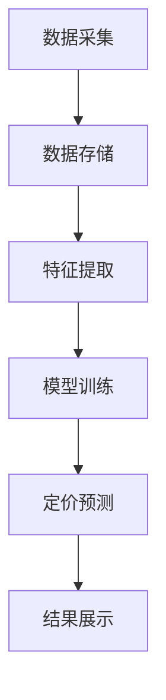
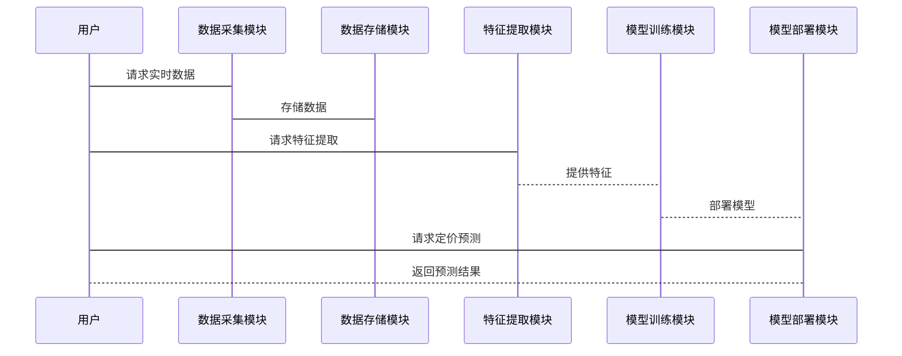

                 


# 机器学习驱动的动态资产定价模型

> 关键词：机器学习、动态资产定价、金融建模、时间序列分析、人工智能算法

> 摘要：本文深入探讨了机器学习在动态资产定价模型中的应用，从背景介绍、核心概念、算法原理、系统架构到项目实战，全面解析了如何利用机器学习技术构建高效的动态资产定价模型。文章通过具体案例分析和代码实现，展示了模型的实现过程和实际应用价值。

---

## 第一章: 动态资产定价模型的背景与意义

### 1.1 资产定价的基本概念

#### 1.1.1 资产定价的定义与核心问题
资产定价是指对金融资产（如股票、债券等）的价值进行评估和预测的过程。传统资产定价模型（如CAPM和APT）基于历史数据和假设条件，但难以捕捉市场动态变化。动态资产定价模型则通过实时数据和机器学习算法，捕捉市场波动，提高定价准确性。

#### 1.1.2 动态资产定价的背景与挑战
金融市场具有高度的不确定性和复杂性，传统模型在面对市场波动时表现有限。动态资产定价模型利用机器学习技术，能够实时更新模型参数，捕捉市场趋势，从而提高定价的动态性和准确性。

#### 1.1.3 机器学习在资产定价中的应用优势
机器学习通过非线性建模和特征提取，能够发现传统模型难以捕捉的复杂关系。动态资产定价模型结合了机器学习的优势，能够实时适应市场变化，提供更精准的定价服务。

---

### 1.2 机器学习与金融的结合

#### 1.2.1 机器学习在金融领域的应用现状
机器学习在金融领域的应用广泛，包括风险管理、信用评分、股票预测等。动态资产定价模型是机器学习在金融领域的重要应用之一。

#### 1.2.2 机器学习在资产定价中的独特价值
机器学习能够处理大量非结构化数据，发现隐藏的模式，提供更准确的定价模型。动态资产定价模型通过机器学习算法，实时更新资产价值，满足市场对动态定价的需求。

#### 1.2.3 机器学习驱动的动态资产定价模型的创新性
动态资产定价模型将机器学习与金融建模相结合，突破了传统模型的局限性。通过实时数据和算法优化，模型能够快速响应市场变化，提供更高效的定价服务。

---

## 第二章: 机器学习驱动的动态资产定价模型核心概念

### 2.1 动态资产定价模型的基本原理

#### 2.1.1 动态资产定价的定义
动态资产定价模型是一种基于机器学习算法，能够实时更新资产价格预测的模型。它通过整合实时数据和市场信息，捕捉资产价格的变化趋势。

#### 2.1.2 模型的核心要素与组成
动态资产定价模型通常包括数据采集、特征提取、模型训练、定价预测和结果分析等模块。模型的核心在于利用机器学习算法，从海量数据中提取有效特征，构建定价模型。

#### 2.1.3 模型的输入输出关系
模型的输入包括历史价格、市场指标、公司财务数据等，输出是资产的预测价格和定价建议。通过不断更新输入数据，模型能够实时调整输出结果。

---

### 2.2 机器学习在动态资产定价中的角色

#### 2.2.1 数据驱动的特征提取
机器学习通过特征工程，从原始数据中提取有用的特征，如技术指标、市场情绪等。这些特征用于构建定价模型，提高模型的预测能力。

#### 2.2.2 算法驱动的定价预测
机器学习算法（如随机森林、神经网络）用于构建定价模型，预测资产的未来价格。算法的选择和优化对模型的性能至关重要。

#### 2.2.3 模型优化与调参
通过交叉验证和超参数优化，机器学习模型能够达到最佳性能。动态资产定价模型需要不断调整参数，以适应市场变化。

---

## 第三章: 机器学习驱动的动态资产定价模型算法原理

### 3.1 常见的机器学习算法概述

#### 3.1.1 支持向量机（SVM）
支持向量机通过构建非线性决策边界，能够处理复杂的定价问题。在资产定价中，SVM常用于分类任务，如判断资产是否被高估或低估。

#### 3.1.2 随机森林（Random Forest）
随机森林是一种基于树的集成算法，具有高容错性和强健性。在资产定价中，随机森林能够处理大量特征，发现复杂的定价关系。

#### 3.1.3 神经网络（Neural Networks）
神经网络通过多层结构，能够捕捉数据中的复杂模式。在动态资产定价中，神经网络常用于时间序列预测，捕捉市场的波动性。

---

### 3.2 算法选择与优化

#### 3.2.1 算法选择的依据
算法选择需要考虑数据类型、任务目标和计算资源。对于时间序列数据，神经网络和LSTM可能更适合；对于分类任务，SVM和随机森林可能更优。

#### 3.2.2 超参数优化方法
通过网格搜索或随机搜索，优化模型的超参数，如学习率、树深度等。优化过程可以显著提升模型性能。

#### 3.2.3 模型评估与验证
使用交叉验证和ROC曲线等方法，评估模型的性能。动态资产定价模型需要在不同时间窗口上验证其预测能力。

---

## 第四章: 动态资产定价模型的数学基础

### 4.1 时间序列分析

#### 4.1.1 时间序列的基本概念
时间序列是指按时间顺序排列的数据。在资产定价中，时间序列分析用于预测未来的资产价格。

#### 4.1.2 ARIMA模型
ARIMA（自回归积分滑动平均）模型是一种常用的时间序列预测方法。它通过自回归和滑动平均部分，捕捉数据中的趋势和季节性。

#### 4.1.3 GARCH模型
GARCH（广义自回归条件异方差）模型用于捕捉资产价格的波动性。它通过动态调整波动率，预测资产的风险。

---

### 4.2 机器学习中的回归分析

#### 4.2.1 线性回归
线性回归是最简单的回归模型，用于预测资产价格的线性关系。在动态资产定价中，线性回归常用于初步分析。

#### 4.2.2 非线性回归
非线性回归能够捕捉资产价格的非线性关系。在机器学习中，非线性回归可以通过多项式回归或核方法实现。

#### 4.2.3 正则化回归
正则化回归（如Lasso和Ridge回归）通过添加惩罚项，防止模型过拟合。在资产定价中，正则化回归常用于特征选择。

---

## 第五章: 系统架构与实现方案

### 5.1 系统架构设计

#### 5.1.1 系统功能模块划分
动态资产定价系统通常包括数据采集、特征提取、模型训练、定价预测和结果展示等模块。

#### 5.1.2 系统架构图（Mermaid）


#### 5.1.3 系统接口设计
系统需要与数据源（如交易所API）对接，获取实时数据。定价结果可以通过API返回给用户或下游系统。

---

### 5.2 系统实现细节

#### 5.2.1 数据预处理流程
数据预处理包括清洗、特征工程和数据归一化。特征工程是关键，需要提取有效的特征，如技术指标和市场情绪。

#### 5.2.2 模型训练与部署
模型训练使用训练数据，通过交叉验证优化参数。训练好的模型部署到生产环境，实时处理请求。

#### 5.2.3 系统交互流程（Mermaid）


---

## 第六章: 项目实战与案例分析

### 6.1 项目环境搭建

#### 6.1.1 Python环境安装
安装Python和必要的库，如NumPy、Pandas、Scikit-learn和TensorFlow。

#### 6.1.2 依赖库安装
使用pip安装依赖库，如`pip install numpy pandas scikit-learn tensorflow`。

#### 6.1.3 数据集获取与预处理
从金融数据源获取数据，如Yahoo Finance。数据预处理包括清洗、特征工程和归一化。

---

### 6.2 核心代码实现

#### 6.2.1 数据清洗与特征工程
```python
import pandas as pd
import numpy as np

# 数据加载
df = pd.read_csv('stock_data.csv')

# 数据清洗
df.dropna(inplace=True)
df = df[~df['close'].isnull()]

# 特征工程
df['return'] = df['close'].pct_change().fillna(0)
df = df[['close', 'return', 'volume']]
```

#### 6.2.2 模型训练与优化
```python
from sklearn.model_selection import train_test_split
from sklearn.ensemble import RandomForestRegressor
from sklearn.metrics import mean_squared_error

# 数据分割
X = df[['close', 'return', 'volume']]
y = df['close']

X_train, X_test, y_train, y_test = train_test_split(X, y, test_size=0.2, random_state=42)

# 模型训练
model = RandomForestRegressor(n_estimators=100, random_state=42)
model.fit(X_train, y_train)

# 模型预测
y_pred = model.predict(X_test)

# 模型评估
mse = mean_squared_error(y_test, y_pred)
print(f"均方误差: {mse}")
```

#### 6.2.3 模型优化与部署
使用网格搜索优化模型参数，如调整n_estimators和max_depth。优化后的模型可以部署到生产环境，实时处理定价请求。

---

## 第七章: 总结与展望

### 7.1 总结
本文详细介绍了机器学习驱动的动态资产定价模型的构建过程，从理论基础到实际应用，展示了模型的高效性和准确性。通过具体案例分析，验证了模型的可行性和实际价值。

### 7.2 未来展望
未来的研究可以进一步优化模型结构，引入深度学习技术，如LSTM和Transformer，提高模型的预测能力。同时，可以探索多资产定价模型，提升模型的适用性。

---

作者：AI天才研究院 & 禅与计算机程序设计艺术

