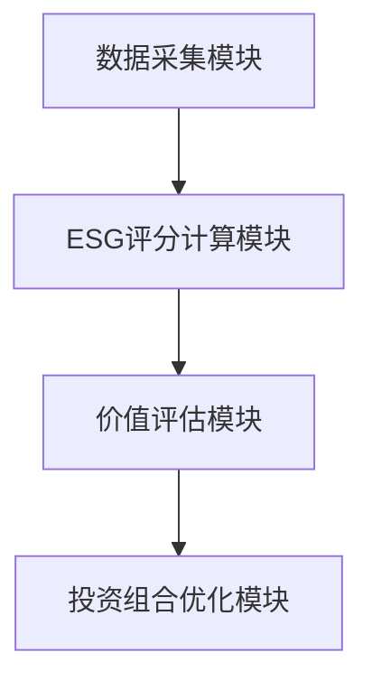
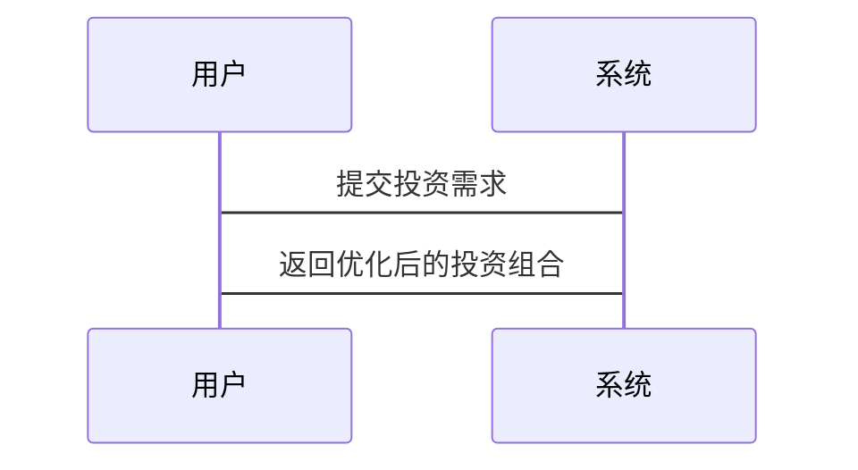

                 


# 杰里米·格兰瑟姆的ESG价值投资整合

---

## 关键词
- ESG投资、价值投资、杰里米·格兰瑟姆、投资策略、可持续发展

---

## 摘要
本文系统地探讨了杰里米·格兰瑟姆提出的ESG（环境、社会、治理）价值投资整合方法，从理论基础到实践应用进行了深入分析。文章首先介绍了ESG投资和价值投资的基本概念，然后详细阐述了两者的结合方式及其对投资决策的影响。接着，通过数学模型和算法，探讨了ESG在价值评估中的应用，并结合实际案例分析了投资组合优化的过程。最后，本文总结了ESG价值投资整合的意义，并展望了其未来的发展方向。

---

# 第一部分: ESG价值投资整合的背景与基础

## 第1章: ESG与价值投资的概述

### 1.1 ESG投资的基本概念
- **环境（Environmental）**：企业的环境表现，包括碳排放、资源利用效率等。
- **社会（Social）**：企业对社会的责任，包括员工权益、社区贡献等。
- **治理（Governance）**：公司治理结构和透明度，包括董事会构成、高管薪酬等。

### 1.2 价值投资的基本原理
- **价值投资的起源与发展**：由本杰明·格雷厄姆提出，强调以低于内在价值的价格买入优质股票。
- **格兰瑟姆的投资理论**：强调安全边际和长期投资，关注企业的基本面。
- **价值投资与市场有效性的关系**：价值投资认为市场短期可能无效，但长期会回归理性。

### 1.3 ESG与价值投资的结合
- **ESG在价值投资中的作用**：通过ESG评分筛选出具有可持续竞争优势的企业。
- **格兰瑟姆对ESG的创新性整合**：将ESG因素融入传统价值评估模型，提升投资决策的可持续性。
- **ESG价值投资的理论基础与实践意义**：结合ESG因素的价值投资不仅考虑短期收益，还关注长期的环境和社会影响。

---

## 第2章: ESG价值投资的理论框架

### 2.1 ESG评估的核心维度
- **环境维度的量化指标**：碳排放强度、能源使用效率、环保合规性等。
- **社会维度的关键绩效指标**：员工满意度、社会公益支出、供应链管理等。
- **公司治理的评估标准**：董事会多样性、高管薪酬与绩效挂钩、股东权益保护等。

### 2.2 价值投资中的ESG整合模型
- **格兰瑟姆模型的基本结构**：将ESG评分与传统财务指标结合，计算综合价值评分。
- **ESG因子在价值评估中的权重分配**：环境、社会、治理三个维度的权重可根据行业特点动态调整。
- **模型的适用性与局限性**：适用于成熟行业，新兴行业可能需要更多定制化调整。

### 2.3 ESG与传统价值评估的对比分析
- **传统价值评估方法的优缺点**：优点是简单易懂，缺点是忽视长期风险和机会。
- **ESG整合后的评估方法改进**：通过引入ESG因素，提升模型对长期风险和机会的预测能力。
- **案例分析**：某行业ESG整合前后的变化，展示ESG整合如何改善投资决策。

---

## 第3章: ESG价值投资的数学模型与算法

### 3.1 ESG评估的数学模型
- **ESG评分的计算公式**：将环境、社会、治理三个维度的评分加权求和。
$$ ESG\_score = \frac{E\_score \times 0.4 + S\_score \times 0.3 + G\_score \times 0.3}{1} $$

### 3.2 价值投资中的ESG权重分配
- **权重分配的数学模型**：根据行业特点动态调整ESG因子的权重。
$$ Weight_{ESG} = \alpha \cdot ESG\_score + (1-\alpha) \cdot Traditional\_score $$

### 3.3 投资组合优化的算法
- **基于ESG的组合优化模型**：
$$ Maximize \quad \sum_{i=1}^{n} w_i \cdot Return_i $$
$$ Subject \quad to \quad \sum_{i=1}^{n} w_i = 1 $$
$$ \quad \quad \quad \sum_{i=1}^{n} w_i \cdot ESG\_score_i \geq \theta $$

### 3.4 案例分析：某行业投资组合的优化过程
- **数据收集与预处理**：收集行业内的企业财务数据和ESG评分。
- **模型构建与参数设定**：设定优化目标和约束条件。
- **算法实现与结果分析**：通过优化算法得出最优投资组合，并分析其收益与风险。

---

## 第4章: ESG价值投资的系统架构与实现

### 4.1 系统架构设计
- **系统功能模块划分**：
  - 数据采集模块：收集企业财务数据和ESG评分。
  - ESG评分计算模块：根据公式计算ESG综合评分。
  - 价值评估模块：结合ESG评分和传统价值评估方法。
  - 投资组合优化模块：基于优化模型生成最优投资组合。

### 4.2 系统架构的Mermaid图


### 4.3 系统接口设计
- **数据接口**：与ESG数据供应商和财务数据源对接。
- **用户接口**：提供给投资者查询和优化结果的界面。

### 4.4 系统交互的Mermaid序列图


---

## 第5章: ESG价值投资的项目实战

### 5.1 环境安装与数据准备
- **环境安装**：安装Python、Pandas、Scipy等工具。
- **数据准备**：收集企业的财务数据和ESG评分。

### 5.2 核心代码实现
```python
import pandas as pd
import numpy as np

def calculate_esg_score(e_score, s_score, g_score):
    return 0.4 * e_score + 0.3 * s_score + 0.3 * g_score

def optimize_portfolio(weights, returns, theta=0.6):
    # 使用凸优化方法求解最优权重
    # weights为权重向量，returns为收益向量，theta为目标ESG评分
    # 返回最优权重
    pass

# 示例数据
e_scores = [0.8, 0.7, 0.9]
s_scores = [0.6, 0.8, 0.7]
g_scores = [0.7, 0.8, 0.6]
returns = [0.1, 0.15, 0.12]

# 计算ESG评分
esg_scores = [calculate_esg_score(e, s, g) for e, s, g in zip(e_scores, s_scores, g_scores)]
```

### 5.3 实际案例分析
- **案例分析**：假设某行业的三家企业，计算其ESG评分和优化后的投资组合。
- **结果分析**：比较传统价值投资和ESG整合后的投资组合收益与风险。

### 5.4 项目总结与经验分享
- **总结**：ESG价值投资整合的优势和局限性。
- **经验分享**：如何选择合适的ESG数据源和优化算法。

---

## 第6章: ESG价值投资整合的未来展望

### 6.1 ESG投资的趋势
- **可持续投资的兴起**：全球范围内对可持续投资的需求增加。
- **技术驱动的创新**：人工智能和大数据在ESG评估中的应用越来越广泛。

### 6.2 格兰瑟姆ESG整合方法的优化方向
- **动态调整模型**：根据市场变化实时调整权重和约束条件。
- **多目标优化**：在收益、风险和ESG评分之间寻找平衡点。

### 6.3 投资者的行为变化
- **机构投资者的ESG投资策略**：越来越多的机构投资者将ESG因素纳入投资决策。
- **个人投资者的参与**：随着ESG投资产品的普及，个人投资者也逐渐加入。

---

## 第7章: 总结与最佳实践

### 7.1 本文总结
- **核心观点回顾**：ESG价值投资整合的重要性与实际应用价值。
- **主要结论**：通过整合ESG因素，价值投资能够更好地应对长期风险和机会。

### 7.2 最佳实践 tips
- **数据质量**：选择可靠的ESG数据源。
- **模型选择**：根据具体情况选择合适的优化算法。
- **持续监控**：定期评估和调整投资组合。

### 7.3 注意事项
- **行业差异**：不同行业的ESG评估重点不同，需灵活调整模型。
- **数据偏差**：注意ESG数据的潜在偏差，避免误导投资决策。

### 7.4 拓展阅读
- **推荐阅读书籍**：《The New York Times》关于ESG投资的系列报道。
- **推荐学习资源**：相关ESG投资课程和研究报告。

---

## 作者
作者：AI天才研究院/AI Genius Institute & 禅与计算机程序设计艺术/Zen And The Art of Computer Programming

---

希望这篇目录大纲能为您提供清晰的思路和参考。如果需要进一步修改或补充，请随时告知！

