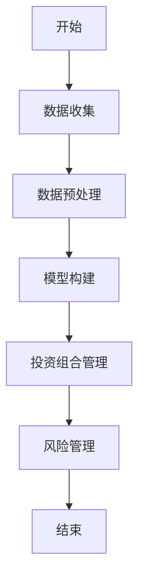
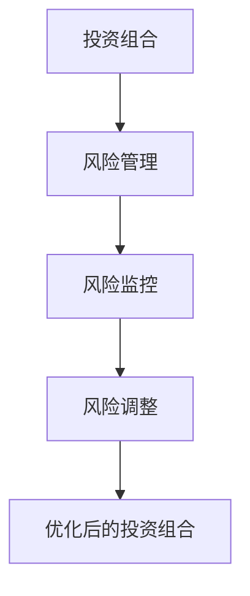

                 


# 杰里米·格兰瑟姆的价值投资新定义

**关键词：** 价值投资，新定义，杰里米·格兰瑟姆，投资策略，风险管理，系统化方法

**摘要：** 本文深入探讨杰里米·格兰瑟姆提出的价值投资新定义，结合技术分析的视角，从核心概念、系统化方法、风险管理、实际应用和未来趋势等多个维度进行详细分析。文章首先介绍传统价值投资的局限性，引出格兰瑟姆新定义的必要性，接着通过数学模型和系统架构图详细阐述新定义的特征与优势，最后通过案例分析和优化建议，总结新定义在实际投资中的应用价值和未来发展方向。

---

# 第一部分: 价值投资新定义的背景与核心概念

## 第1章: 价值投资的演变与新定义

### 1.1 价值投资的历史演变

#### 1.1.1 价值投资的起源与发展
价值投资是一种基于对公司内在价值评估的投资策略，起源于20世纪初。本杰明·格雷厄姆和戴维·多德是该领域的先驱，他们提出了“安全边际”和“内在价值”等核心概念。格兰瑟姆师承格雷厄姆，进一步发展了价值投资理论。

#### 1.1.2 格兰瑟姆对价值投资的贡献
杰里米·格兰瑟姆（Jeremy Grantham）是价值投资领域的权威，他在传统价值投资的基础上，提出了新的定义和方法。他强调通过数据分析和系统化的方法来识别市场低估的机会，并在市场周期中进行投资。

#### 1.1.3 新定义的提出背景与问题背景
传统价值投资在实践中面临一些问题，如主观判断过多、难以量化、难以应对市场变化等。格兰瑟姆的新定义旨在解决这些问题，通过系统化的方法和量化工具来优化投资决策。

### 1.2 格兰瑟姆价值投资新定义的核心要素

#### 1.2.1 核心概念的结构与组成
格兰瑟姆的新定义将价值投资重新定义为一种系统化、数据驱动的投资方法。其核心要素包括：
1. **内在价值评估**：基于公司财务数据和行业趋势，计算公司的真实价值。
2. **市场情绪分析**：通过市场数据和投资者情绪指标，判断市场是否低估或高估资产。
3. **多因子模型**：结合多个因子（如市盈率、市净率、股息率等）进行综合评估。

#### 1.2.2 新定义与传统价值投资的对比
| **维度**       | **传统价值投资**                | **格兰瑟姆新定义**              |
|-----------------|----------------------------------|---------------------------------|
| 投资策略         | 侧重于基本面分析，注重安全边际 | 系统化分析，结合数据驱动方法    |
| 投资决策         | 主观判断为主                   | 数据驱动，量化决策为主          |
| 应用场景         | 单一资产或少量资产             | 多资产、多行业综合应用            |
| 风险管理         | 侧重于资产质量                 | 强调风险控制和组合优化           |

#### 1.2.3 新定义的边界与外延
格兰瑟姆的新定义不仅适用于股票投资，还可以扩展到其他资产类别（如房地产、债券等），并且可以应用于机构投资和个人投资。

---

## 第2章: 格兰瑟姆新定义的特征与优势

### 2.1 新定义的特征分析

#### 2.1.1 核心概念的数学模型
格兰瑟姆的新定义引入了多因子模型，通过量化的方法评估资产的内在价值。其核心公式可以表示为：

$$ V = \sum_{i=1}^{n} w_i \cdot F_i $$

其中，\( V \) 是资产的内在价值，\( w_i \) 是因子 \( F_i \) 的权重。

#### 2.1.2 新定义的属性特征对比
| **属性**         | **传统价值投资**                | **格兰瑟姆新定义**              |
|-------------------|----------------------------------|---------------------------------|
| 数据驱动         | 低                             | 高                              |
| 系统化            | 低                             | 高                              |
| 风险控制         | 一般                           | 强调风险控制                    |

### 2.2 新定义的核心优势

#### 2.2.1 新定义的独特性
格兰瑟姆的新定义通过引入系统化的方法和量化工具，显著提高了投资决策的科学性和可操作性。

#### 2.2.2 新定义的适用场景
新定义适用于多种资产类别和投资策略，尤其适合机构投资者和大型基金。

---

## 第3章: 格兰瑟姆新定义的系统化方法

### 3.1 系统化框架的构建

#### 3.1.1 系统化框架的组成部分
格兰瑟姆的新定义系统化框架包括以下几个部分：
1. 数据收集与处理
2. 模型构建与优化
3. 投资组合管理
4. 风险管理与调整

#### 3.1.2 系统化框架的实现步骤
1. 数据收集：收集公司财务数据、市场数据和行业趋势。
2. 模型构建：基于多因子模型构建内在价值评估模型。
3. 投资组合管理：根据模型结果构建投资组合。
4. 风险管理：定期监控和调整投资组合。

### 3.2 核心算法的数学模型

#### 3.2.1 核心算法的 Mermaid 流程图


#### 3.2.2 核心算法的 Python 源代码
```python
def calculate_intrinsic_value(company_data):
    # 计算多因子模型
    factors = company_data[['市盈率', '市净率', '股息率']]
    weights = [0.4, 0.3, 0.3]
    intrinsic_value = sum(factors[i] * weights[i] for i in range(len(factors.columns)))
    return intrinsic_value
```

---

## 第4章: 格兰瑟姆新定义的风险管理与优化

### 4.1 风险管理的核心要素

#### 4.1.1 风险管理的定义与目标
风险管理是通过识别、评估和控制风险，以减少投资组合的波动性和潜在损失。

#### 4.1.2 风险管理的策略与方法
1. **分散投资**：通过投资多个资产降低风险。
2. **动态调整**：根据市场变化及时调整投资组合。
3. **风险指标**：使用波动率、VaR等指标监控风险。

### 4.2 优化策略的系统架构

#### 4.2.1 优化策略的系统架构设计


---

## 第5章: 格兰瑟姆新定义的实际应用与案例分析

### 5.1 实际应用的环境与工具

#### 5.1.1 实际应用的环境要求
1. 数据来源：可靠的金融数据源（如 Bloomberg、FactSet）。
2. 计算工具：Python、R 等编程语言。
3. 分析工具：Excel、Matplotlib 等可视化工具。

### 5.2 核心实现的源代码与分析

#### 5.2.1 核心算法的 Python 源代码
```python
import pandas as pd
import numpy as np

def calculate_intrinsic_value(company_data):
    # 计算多因子模型
    factors = company_data[['市盈率', '市净率', '股息率']]
    weights = [0.4, 0.3, 0.3]
    intrinsic_value = sum(factors[i] * weights[i] for i in range(len(factors.columns)))
    return intrinsic_value

# 示例数据
data = {
    '公司': ['A', 'B', 'C'],
    '市盈率': [10, 15, 20],
    '市净率': [2, 3, 4],
    '股息率': [5, 4, 3]
}
df = pd.DataFrame(data)
df['内在价值'] = df[['市盈率', '市净率', '股息率']].apply(lambda x: calculate_intrinsic_value(x), axis=1)
print(df)
```

### 5.3 案例分析与详细讲解

#### 5.3.1 典型案例的背景介绍
假设我们有三家公司（A、B、C），需要评估它们的内在价值。

#### 5.3.2 案例分析的详细步骤
1. 数据收集：收集三家公司（A、B、C）的市盈率、市净率和股息率。
2. 模型构建：使用多因子模型计算内在价值。
3. 投资组合管理：根据计算结果构建投资组合。

#### 5.3.3 案例分析的总结与启示
通过案例分析可以看出，格兰瑟姆的新定义能够有效地识别低估资产，并构建稳健的投资组合。

---

## 第6章: 格兰瑟姆新定义的未来趋势与最佳实践

### 6.1 未来趋势的展望

#### 6.1.1 未来趋势的展望
随着技术的进步，价值投资的系统化方法将更加普及，人工智能和大数据技术将进一步提升投资决策的科学性。

### 6.2 最佳实践 tips

#### 6.2.1 最佳实践 tips
1. 在实际应用中，结合市场变化和公司基本面进行动态调整。
2. 使用多种工具和技术（如机器学习、大数据分析）提升投资决策的效率和准确性。

### 6.3 小结

格兰瑟姆的新定义为价值投资领域带来了新的视角和方法。通过系统化的方法和量化工具，投资者可以更科学地进行投资决策，同时降低投资风险。

---

**作者：AI天才研究院/AI Genius Institute & 禅与计算机程序设计艺术 /Zen And The Art of Computer Programming**

---

以上是关于《杰里米·格兰瑟姆的价值投资新定义》的完整文章大纲和部分正文内容。

