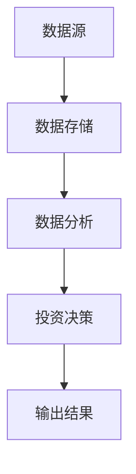
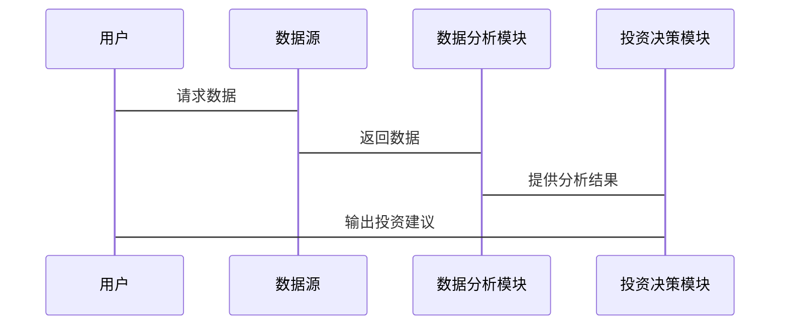

                 


# 杰里米·格兰瑟姆的价值投资新思维

> 关键词：价值投资，杰里米·格兰瑟姆，安全边际，内在价值，投资策略

> 摘要：本文深入探讨了杰里米·格兰瑟姆的价值投资理念，分析了其核心概念和新思维，包括安全边际、内在价值等，并结合实际案例展示了如何将这些理论应用于投资实践。

---

## 第一部分: 价值投资的背景与核心概念

### 第1章: 价值投资的定义与背景

#### 1.1 价值投资的起源与发展
- **价值投资的起源**：价值投资是一种以基本面分析为基础的投资策略，起源于20世纪初。本杰明·格雷厄姆是该领域的先驱，他提出了“安全边际”等核心概念。
- **格兰瑟姆对价值投资的贡献**：杰里米·格兰瑟姆继承并发展了格雷厄姆的价值投资理论，提出了更加量化和系统化的投资策略，强调低市盈率、低市净率和高股息率等指标。
- **当前价值投资的新趋势**：随着市场环境的变化，价值投资也在不断演变，更加注重长期结构性变化和企业竞争优势。

#### 1.2 投资的基本原理
- **投资的定义与分类**：投资是将资金投入特定资产以获得未来收益的行为。常见的投资类型包括股票、债券、房地产等。
- **资本市场的基本运作机制**：资本市场通过供需关系决定资产价格，投资者在市场中进行交易，期望获得资本增值或收益。
- **投资者心理与市场行为**：投资者的心理偏差（如过度自信、从众心理）会影响市场行为，导致市场波动和价格偏差。

#### 1.3 格兰瑟姆的价值投资理念
- **格兰瑟姆的投资哲学**：他认为投资的本质是寻找市场价格低于内在价值的资产，这种价格差异即为“安全边际”。
- **价值投资的核心原则**：注重基本面分析，寻找低估的股票，长期持有，避免短期市场波动的影响。
- **投资体系的框架**：格兰瑟姆提出了一套系统化的投资框架，包括数据收集、分析、评估和决策等步骤。

### 第2章: 价值投资的核心概念

#### 2.1 安全边际
- **定义**：安全边际是指股票的市场价格低于其内在价值的部分，是投资中的“缓冲区”，用以降低投资风险。
- **计算方法**：安全边际率 = (内在价值 - 市场价格) / 市场价格 × 100%
- **应用**：通过安全边际，投资者可以避免在高估市场中投资，提高投资的可靠性。

#### 2.2 内在价值
- **定义**：内在价值是指一家公司基于其基本面因素（如盈利能力、成长潜力等）所具有的真实价值。
- **计算方法**：常见的内在价值计算方法包括股利贴现模型（DDM）和 discounted cash flow model（DCF）。
- **与市场价值的关系**：内在价值与市场价值可能存在差异，当市场价格低于内在价值时，投资机会出现。

#### 2.3 市场先生
- **定义**：市场先生是格兰瑟姆提出的一个比喻，指市场情绪的变化会导致资产价格波动。
- **行为特征**：市场先生通常表现出非理性，价格波动往往与基本面因素无关。
- **与投资决策的关系**：投资者应忽略市场先生的情绪波动，专注于基本面分析。

### 第3章: 价值投资的数学模型与公式

#### 3.1 内在价值的计算公式
- **股票内在价值公式**：
$$ V = \frac{E}{k} $$
其中，\( V \) 为内在价值，\( E \) 为预期收益，\( k \) 为折现率。

#### 3.2 安全边际的计算公式
- **安全边际计算公式**：
$$ \text{安全边际} = \frac{\text{内在价值} - \text{市场价格}}{\text{市场价格}} \times 100\% $$

#### 3.3 其他相关公式
- **股息率计算公式**：
$$ \text{股息率} = \frac{\text{每股股息}}{\text{股价}} \times 100\% $$

---

## 第二部分: 价值投资的系统分析与架构设计

### 第4章: 投资系统的架构设计

#### 4.1 系统功能设计
- **数据收集模块**：负责收集股票的基本面数据，如营收、利润、股息等。
- **数据分析模块**：对收集的数据进行清洗、整理，并计算内在价值和安全边际。
- **投资决策模块**：根据分析结果生成投资建议，如买入、持有或卖出。

#### 4.2 系统架构设计


#### 4.3 系统接口设计
- **数据接口**：用于与数据源（如股票数据库）交互。
- **分析接口**：用于调用数据分析模块的功能。
- **决策接口**：用于生成投资决策并输出结果。

#### 4.4 系统交互设计


---

## 第三部分: 价值投资的项目实战

### 第5章: 项目实战

#### 5.1 环境安装
- 需要安装Python和相关库，如pandas、numpy、scipy。

#### 5.2 核心实现源代码
```python
import pandas as pd
import numpy as np

def calculate_intrinsic_value(eps, growth_rate, required_return):
    # 使用股利贴现模型计算内在价值
    terminal_growth_rate = 0.05
    gordon_growth_model = (eps * (1 + growth_rate)) / (required_return - terminal_growth_rate)
    return gordon_growth_model

def calculate_margin_of_safety(current_price, intrinsic_value):
    # 计算安全边际
    margin = (intrinsic_value - current_price) / current_price * 100
    return margin

# 示例数据
eps = 10
growth_rate = 0.1
required_return = 0.12
current_price = 50

# 计算内在价值
iv = calculate_intrinsic_value(eps, growth_rate, required_return)
# 计算安全边际
mos = calculate_margin_of_safety(current_price, iv)

print(f"内在价值: {iv:.2f}")
print(f"安全边际: {mos:.2f}%")
```

#### 5.3 案例分析
假设某股票的EPS为10，预计增长率10%，必要回报率为12%，当前股价为50元。通过上述代码计算得到：

- 内在价值：61.54元
- 安全边际：23.08%

根据计算结果，该股票的市场价格低于内在价值，安全边际较高，适合买入。

---

## 第四部分: 总结与展望

### 第6章: 总结与展望

#### 6.1 总结
- 杰里米·格兰瑟姆的价值投资理念强调安全边际和内在价值，为投资者提供了系统化的投资框架。
- 通过数学模型和系统设计，投资者可以更科学地进行投资决策。

#### 6.2 投资建议
- 投资者应持续学习价值投资理论，结合市场环境进行灵活调整。
- 在实际操作中，建议结合技术分析和基本面分析，制定合理的投资策略。

#### 6.3 注意事项
- 投资有风险，需谨慎操作，避免盲目跟风。
- 定期评估投资组合，及时调整以应对市场变化。

---

## 作者：AI天才研究院 & 禅与计算机程序设计艺术

