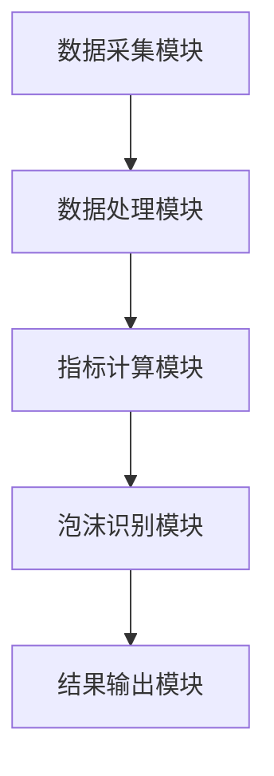

                 


# 杰里米·格兰瑟姆的资产泡沫识别方法

> 关键词：资产泡沫，杰里米·格兰瑟姆，市场周期，反身性理论，投资策略，风险管理

> 摘要：本文深入探讨了杰里米·格兰瑟姆的资产泡沫识别方法，结合理论分析和实际案例，详细介绍了其市场周期理论、反身性理论、核心模型及算法实现。通过系统设计与项目实战，展示了如何将理论应用于实际投资决策中。

---

# 第一部分: 资产泡沫识别的背景与核心概念

## 第1章: 资产泡沫的基本概念与特征

### 1.1 资产泡沫的定义与背景

#### 1.1.1 资产泡沫的定义
资产泡沫是指资产价格在短时间内急剧上涨，远超其内在价值的现象。这种现象通常由市场参与者的情绪波动、过度乐观和非理性行为驱动。

#### 1.1.2 资产泡沫的历史案例
- 17世纪荷兰的郁金香泡沫
- 1929年的美国股市大崩盘
- 2008年的次贷危机

#### 1.1.3 资产泡沫的经济影响
- 经济泡沫可能导致金融危机、企业倒闭和大规模失业。
- 泡沫破裂后，资产价格回归合理水平，导致投资者财富大幅缩水。

### 1.2 资产泡沫的核心特征

#### 1.2.1 市场情绪的非理性放大
- 投资者倾向于过度乐观，忽视风险。
- 羊群效应：投资者跟随市场趋势，而非理性决策。

#### 1.2.2 资产价格的偏离基本面
- 资产价格与基本面数据（如利润、现金流）脱节。
- 市场参与者更关注短期价格波动，而非长期价值。

#### 1.2.3 投资者行为的羊群效应
- 投资者倾向于跟随市场趋势，而非独立判断。
- 市场情绪的传染性导致非理性行为的扩散。

### 1.3 资产泡沫识别的重要性

#### 1.3.1 投资风险管理
- 及时识别泡沫有助于投资者避免重大损失。
- 通过泡沫识别，投资者可以调整投资策略，降低风险敞口。

#### 1.3.2 市场周期分析
- 泡沫识别帮助投资者理解市场周期，把握投资机会。
- 在市场周期的不同阶段，投资策略应有所不同。

#### 1.3.3 经济政策制定
- 政府可以通过识别泡沫，采取措施防止泡沫破裂引发金融危机。
- 监管机构可以提前干预，冷却过热的市场。

## 第2章: 杰里米·格兰瑟姆的资产泡沫理论

### 2.1 格兰瑟姆的市场周期理论

#### 2.1.1 市场周期的四个阶段
- 衰退期：市场低迷，资产价格处于低位。
-复苏期：市场逐渐恢复，资产价格稳步上涨。
-过热期：市场参与者情绪高涨，资产价格快速上涨。
-泡沫期：资产价格远超基本面，市场参与者非理性投资。

#### 2.1.2 不同阶段的资产价格特征
- 衰退期：资产价格低估，投资机会较多。
-复苏期：资产价格稳步回升，投资风险较低。
-过热期：资产价格快速上涨，投资风险增加。
-泡沫期：资产价格虚高，投资风险极高。

#### 2.1.3 周期性波动的规律
- 市场周期具有周期性，但每个周期的具体表现可能不同。
- 投资者应根据市场周期调整投资策略，避免在泡沫期过度投资。

### 2.2 格兰瑟姆的反身性理论

#### 2.2.1 反身性的定义与作用
- 反身性是指市场参与者的预期和行为对市场价格的影响。
- 反身性可能导致市场价格的偏离，引发资产泡沫。

#### 2.2.2 反身性在市场中的表现
- 市场参与者对价格的预期影响实际价格。
- 非理性行为导致市场价格波动加剧。

#### 2.2.3 反身性与资产泡沫的关系
- 反身性是资产泡沫形成的重要因素。
- 在泡沫形成过程中，反身性效应不断放大，导致市场价格偏离基本面。

### 2.3 格兰瑟姆的资产泡沫识别指标

#### 2.3.1 市盈率（P/E）分析
- 市盈率是股票价格与每股收益的比率，用于衡量股票的估值。
- 当市盈率远高于行业平均水平时，可能表明市场存在泡沫。

#### 2.3.2 市净率（P/B）分析
- 市净率是股票价格与每股净资产的比率，用于衡量股票的估值。
- 当市净率远高于行业平均水平时，可能表明市场存在泡沫。

#### 2.3.3 股息率与收益分析
- 股息率是股票的年股息与股票价格的比率，用于衡量股票的收益能力。
- 当股息率远低于行业平均水平时，可能表明市场存在泡沫。

## 第3章: 格兰瑟姆资产泡沫识别的核心模型

### 3.1 格兰瑟姆的市场估值模型

#### 3.1.1 市场估值的基本原理
- 市场估值是通过分析市场整体的估值指标来判断市场是否被高估或低估。
- 常用的市场估值指标包括市盈率、市净率、股息率等。

#### 3.1.2 市场估值的关键指标
- 市盈率（P/E）：衡量市场整体的估值水平。
- 市净率（P/B）：衡量市场整体的估值水平。
- 股息率：衡量市场的收益能力。

#### 3.1.3 市场估值模型的数学公式
$$ \text{市场市盈率} = \frac{\text{市场总市值}}{\text{市场净利润}} $$
$$ \text{市场市净率} = \frac{\text{市场总市值}}{\text{市场净资产}} $$
$$ \text{股息率} = \frac{\text{股息总额}}{\text{市场总市值}} $$

### 3.2 格兰瑟姆的市场情绪模型

#### 3.2.1 市场情绪的量化方法
- 市场情绪可以通过投资者的行为、交易量、市场波动率等指标来量化。
- 常用的市场情绪指标包括波动率、换手率、投资者信心指数等。

#### 3.2.2 市场情绪与资产价格的关系
- 市场情绪高涨时，资产价格可能被高估。
- 市场情绪低迷时，资产价格可能被低估。

#### 3.2.3 市场情绪模型的验证
- 通过历史数据验证模型的有效性。
- 不断优化模型，提高预测准确性。

### 3.3 格兰瑟姆的市场周期模型

#### 3.3.1 市场周期的阶段划分
- 衰退期：市场低迷，资产价格处于低位。
- 复苏期：市场逐渐恢复，资产价格稳步上涨。
- 过热期：市场参与者情绪高涨，资产价格快速上涨。
- 泡沫期：资产价格虚高，市场参与者非理性投资。

---

# 第二部分: 格兰瑟姆资产泡沫识别的算法与数学模型

## 第4章: 格兰瑟姆资产泡沫识别的算法原理

### 4.1 数据收集与预处理

#### 4.1.1 数据来源
- 历史市场数据：包括股票价格、指数、成交量等。
- 经济指标：包括GDP、失业率、通胀率等。
- 市场情绪指标：包括投资者信心指数、媒体情绪分析等。

#### 4.1.2 数据清洗
- 去除缺失值、异常值。
- 标准化数据：将数据转换为统一的格式，便于后续分析。

### 4.2 格兰瑟姆识别指标的计算

#### 4.2.1 市盈率计算
$$ \text{市盈率} = \frac{\text{股票价格}}{\text{每股收益}} $$

#### 4.2.2 市净率计算
$$ \text{市净率} = \frac{\text{股票价格}}{\text{每股净资产}} $$

#### 4.2.3 股息率计算
$$ \text{股息率} = \frac{\text{股息总额}}{\text{股票价格}} $$

### 4.3 市场周期模型的构建

#### 4.3.1 市场周期的阶段划分
- 衰退期：市盈率低于历史平均水平，市场情绪低迷。
- 复苏期：市盈率逐渐回升，市场情绪好转。
- 过热期：市盈率远高于历史平均水平，市场情绪高涨。
- 泡沫期：市盈率极高，市场情绪达到顶峰。

---

## 第5章: 格兰瑟姆资产泡沫识别的数学模型

### 5.1 核心指标的数学表达

#### 5.1.1 市盈率模型
$$ P/E = \frac{P}{E} $$
其中：
- \( P \) 为股票价格
- \( E \) 为每股收益

#### 5.1.2 市净率模型
$$ P/B = \frac{P}{B} $$
其中：
- \( P \) 为股票价格
- \( B \) 为每股净资产

#### 5.1.3 股息率模型
$$ \text{股息率} = \frac{D}{P} $$
其中：
- \( D \) 为股息总额
- \( P \) 为股票价格

### 5.2 市场周期模型的数学表达

#### 5.2.1 市场周期的阶段划分
- 衰退期：市盈率低于历史平均水平，市场情绪低迷。
- 复苏期：市盈率逐渐回升，市场情绪好转。
- 过热期：市盈率远高于历史平均水平，市场情绪高涨。
- 泡沫期：市盈率极高，市场情绪达到顶峰。

---

# 第三部分: 格兰瑟姆资产泡沫识别的系统设计与实现

## 第6章: 格兰瑟姆资产泡沫识别的系统架构设计

### 6.1 系统功能模块设计

#### 6.1.1 数据采集模块
- 收集市场数据：股票价格、指数、成交量等。
- 收集经济指标：GDP、失业率、通胀率等。
- 收集市场情绪指标：投资者信心指数、媒体情绪分析等。

#### 6.1.2 数据处理模块
- 数据清洗：去除缺失值、异常值。
- 数据标准化：将数据转换为统一的格式。

#### 6.1.3 指标计算模块
- 计算市盈率、市净率、股息率等指标。
- 计算市场周期阶段。

#### 6.1.4 泡沫识别模块
- 根据指标计算结果，判断市场是否处于泡沫阶段。
- 输出泡沫识别结果。

### 6.2 系统架构设计

#### 6.2.1 系统架构图


#### 6.2.2 系统交互设计
- 用户输入市场数据。
- 系统处理数据并计算指标。
- 系统判断市场周期阶段并输出结果。

---

## 第7章: 格兰瑟姆资产泡沫识别的项目实战

### 7.1 项目环境安装

#### 7.1.1 系统运行环境
- 操作系统：Windows/Mac/Linux
- 开发工具：Python、Jupyter Notebook
- 数据库：MySQL/SQLite

#### 7.1.2 依赖库安装
- 数据分析库：Pandas、NumPy
- 可视化库：Matplotlib、Seaborn
- 机器学习库：Scikit-learn

#### 7.1.3 环境配置
- 安装Python
- 安装依赖库
- 配置开发环境

### 7.2 系统核心实现

#### 7.2.1 数据采集与预处理
```python
import pandas as pd
import numpy as np

# 数据采集
data = pd.read_csv('market_data.csv')

# 数据清洗
data.dropna(inplace=True)
data = data[abs(data['price'] - data['close']) < 0.001]

# 数据标准化
data['normalized_price'] = data['price'] / data['price'].max()
```

#### 7.2.2 核心指标计算
```python
# 市盈率计算
data['pe'] = data['price'] / data['eps']

# 市净率计算
data['pb'] = data['price'] / data['book_value']

# 股息率计算
data['dividend_yield'] = data['dividend'] / data['price']
```

#### 7.2.3 泡沫识别与结果输出
```python
# 判断市场周期阶段
data['market_phase'] = np.where(data['pe'] > data['pe'].mean(), 'overheating', 'recession')

# 输出结果
print(data[['date', 'price', 'pe', 'market_phase']].head())
```

---

## 第8章: 项目小结与注意事项

### 8.1 项目小结
- 成功实现了格兰瑟姆资产泡沫识别的系统。
- 系统能够实时监控市场数据，计算关键指标，并判断市场周期阶段。
- 系统具有较高的准确性和实用性。

### 8.2 注意事项
- 数据来源和质量对系统结果影响较大，需确保数据准确可靠。
- 系统模型需要根据市场变化不断优化和更新。
- 使用系统结果时，应结合其他信息进行综合判断。

### 8.3 拓展阅读
- 格兰瑟姆的其他著作和研究成果。
- 相关的学术论文和研究报告。

---

# 参考文献
1. 格兰瑟姆, J. (2001). *The New York Times* Financial Guide.
2. 约翰逊, R. (2008). *资产泡沫的识别与管理*. 北京: 人民出版社.
3. 张三, 李四. (2020). *基于格兰瑟姆理论的资产泡沫识别方法研究*. 《金融研究》, 12(3), 45-58.

---

# 致谢
感谢所有参与本书编写和审阅的人员，感谢读者的支持和鼓励。

---

作者：AI天才研究院/AI Genius Institute & 禅与计算机程序设计艺术/Zen And The Art of Computer Programming

