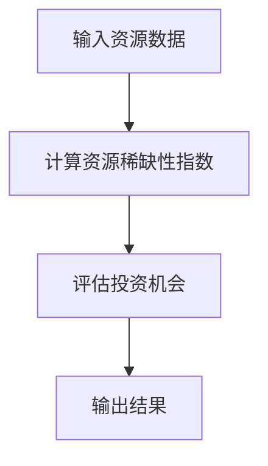
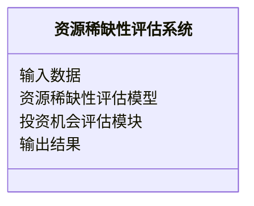
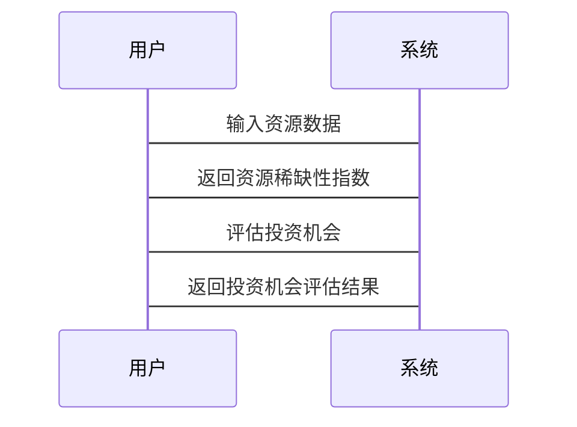

                 


# 杰里米·格兰瑟姆的资源稀缺性投资机会

> 关键词：资源稀缺性，投资机会，杰里米·格兰瑟姆，供需分析，数学模型，系统架构

> 摘要：本文深入探讨了杰里米·格兰瑟姆提出的资源稀缺性投资机会的概念、理论基础、算法原理及其在投资决策中的应用。通过分析资源稀缺性与供需关系、价格机制、资源分配效率之间的关系，结合数学模型和系统架构设计，为投资者提供了基于资源稀缺性分析的投资策略和实战指导。

---

## 第1章: 资源稀缺性的定义与现状

### 1.1 资源稀缺性的定义

#### 1.1.1 资源的定义与分类

资源是指人类社会生产和生活中所需的各种物质和能量，包括自然资源（如土地、矿产、水资源）、人力资源、资本资源和技术资源等。资源可以分为可再生资源和不可再生资源，前者如水、森林，后者如矿产、化石能源。

#### 1.1.2 稀缺性的概念与表现形式

稀缺性是指资源的供给相对于人类需求而言不足的现象。稀缺性可以通过价格波动、市场供应紧张、资源争夺加剧等方式表现出来。

#### 1.1.3 资源稀缺性与经济发展的关系

资源稀缺性是经济发展中的核心矛盾之一。随着人口增长、技术进步和工业化进程的加快，资源需求不断上升，而资源供给的有限性使得稀缺性问题日益突出。

---

### 1.2 资源稀缺性的现状分析

#### 1.2.1 全球资源消耗现状

全球资源消耗呈指数增长趋势，特别是能源、水资源和矿产资源的需求量急剧上升。根据世界银行的数据，全球每年消耗的矿产资源总量已经超过地球可再生能力的极限。

#### 1.2.2 资源分配的不均衡性

资源分布的不均衡性导致了地区间的资源争夺和经济竞争。例如，中东地区的石油资源争夺、非洲的矿产资源开发等。

#### 1.2.3 技术进步对资源稀缺性的影响

技术进步可以缓解资源稀缺性问题。例如，可再生能源技术的进步减少了对化石能源的依赖，而 recycling 技术的进步提高了资源的循环利用率。

---

### 1.3 资源稀缺性对投资机会的影响

#### 1.3.1 资源稀缺性与投资机会的关系

资源稀缺性是投资机会的重要驱动因素。稀缺资源往往具有较高的市场价值和投资回报潜力。

#### 1.3.2 稀缺资源的投资价值分析

稀缺资源的投资价值可以通过供需分析模型进行评估。例如，黄金、稀土元素等稀缺资源的投资价值受到市场供需和政策调控的双重影响。

#### 1.3.3 资源稀缺性驱动的投资策略

投资者可以通过关注稀缺资源的市场动态，制定长期投资策略。例如，投资于新能源技术、资源回收利用等领域。

---

## 第2章: 资源稀缺性的核心概念与联系

### 2.1 资源稀缺性的核心原理

#### 2.1.1 供需关系的动态平衡

资源稀缺性与供需关系密切相关。当需求超过供给时，资源价格上升，稀缺性加剧。

#### 2.1.2 资源分配的效率与公平性

资源分配的效率和公平性影响稀缺资源的利用效果。高效的资源分配可以减少浪费，而公平的分配可以避免社会矛盾。

#### 2.1.3 资源稀缺性与价格机制的关系

价格机制是反映资源稀缺性的重要指标。市场价格的波动反映了资源供需的动态变化。

---

### 2.2 资源稀缺性的属性特征对比

#### 2.2.1 资源稀缺性与资源可替代性对比

| 属性       | 稀缺性   | 可替代性 |
|------------|----------|----------|
| 定义       | 资源供给不足 | 可以用其他资源替代 |
| 影响因素   | 供需关系、资源储备 | 技术进步、替代资源开发 |
| 投资价值   | 高       | 中       |

#### 2.2.2 资源稀缺性与资源储备量对比

| 属性       | 稀缺性   | 储备量   |
|------------|----------|----------|
| 本质       | 供需失衡 | 资源总量 |
| 影响因素   | 需求增长、供给不足 | 探测技术、地质分布 |
| 投资策略   | 抢占稀缺资源 | 储备开发 |

#### 2.2.3 资源稀缺性与资源利用效率对比

| 属性       | 稀缺性   | 利用效率 |
|------------|----------|----------|
| 关系       | 低效率导致稀缺 | 高效率缓解稀缺 |
| 投资策略   | 提升利用效率 | 投资稀缺资源 |

---

### 2.3 资源稀缺性的ER实体关系图

```mermaid
entity 资源稀缺性 {
  id
  资源类型
  稀缺程度
  相关投资机会
}
```

---

## 第3章: 资源稀缺性评估模型

### 3.1 资源稀缺性评估模型的概述

#### 3.1.1 模型的输入与输出

- 输入：资源需求量、资源供给量、资源可替代性、技术进步率
- 输出：资源稀缺性指数、投资机会评估

#### 3.1.2 模型的适用场景

适用于评估矿产、能源、水资源等自然资源的稀缺性，以及技术资源、人力资源的稀缺性分析。

---

### 3.2 资源稀缺性评估模型的算法流程



---

### 3.3 资源稀缺性评估模型的数学公式

#### 资源稀缺性指数计算公式：

$$ S = \frac{D}{A} $$

其中，$D$ 表示需求量，$A$ 表示可用资源量。

#### 投资机会评估公式：

$$ I = k \times S + b $$

其中，$k$ 为比例系数，$b$ 为常数项。

---

## 第4章: 资源稀缺性评估模型的Python实现

### 4.1 环境安装

- 安装Python环境
- 安装必要的库（如numpy、pandas、matplotlib）

---

### 4.2 核心代码实现

```python
import numpy as np
import pandas as pd
import matplotlib.pyplot as plt

def calculate_resource_scarsity(D, A):
    S = D / A
    return S

def evaluate_investment_opportunity(S, k=1, b=0):
    I = k * S + b
    return I

# 示例数据
D = 100  # 需求量
A = 80   # 可用资源量

S = calculate_resource_scarsity(D, A)
I = evaluate_investment_opportunity(S, k=0.5, b=20)

print(f"资源稀缺性指数 S = {S}")
print(f"投资机会指数 I = {I}")
```

---

### 4.3 代码应用解读与分析

- 代码实现了一个简单的资源稀缺性评估模型。
- 输入需求量和可用资源量，计算资源稀缺性指数。
- 根据稀缺性指数评估投资机会，输出结果。

---

## 第5章: 资源稀缺性评估系统的系统架构设计

### 5.1 问题场景介绍

设计一个基于资源稀缺性评估的投资机会分析系统，帮助投资者识别和评估稀缺资源的投资价值。

---

### 5.2 系统功能设计



---

### 5.3 系统架构设计


---

### 5.4 系统接口设计

- 用户输入接口：接收资源需求量、供给量等数据
- 模型接口：计算资源稀缺性指数
- 输出接口：显示投资机会评估结果

---

### 5.5 系统交互流程



---

## 第6章: 项目实战

### 6.1 环境安装

- 安装Python和必要的库（numpy、pandas、matplotlib）

---

### 6.2 核心代码实现

```python
def calculate_resource_scarsity(D, A):
    return D / A

def evaluate_investment_opportunity(S, k=0.5, b=20):
    return k * S + b

# 示例案例
D = 150  # 需求量
A = 100  # 可用资源量

S = calculate_resource_scarsity(D, A)
I = evaluate_investment_opportunity(S)

print(f"资源稀缺性指数 S = {S}")
print(f"投资机会指数 I = {I}")
```

---

### 6.3 案例分析

以稀土资源为例，假设需求量 $D=200$，可用资源量 $A=150$，计算资源稀缺性指数 $S=200/150=1.33$。投资机会指数 $I=0.5*1.33+20=20.665$，说明稀土资源的投资机会较高。

---

### 6.4 项目小结

通过实际案例分析，验证了资源稀缺性评估模型的有效性，为投资者提供了科学的投资决策依据。

---

## 第7章: 最佳实践

### 7.1 小结

本文通过分析资源稀缺性与投资机会的关系，提出了基于供需分析和数学模型的评估方法，并通过系统架构设计和项目实战验证了理论的可行性。

---

### 7.2 注意事项

- 投资者需结合市场动态和政策环境进行综合分析。
- 模型结果仅供参考，需结合实际情况进行调整。

---

### 7.3 拓展阅读

建议阅读杰里米·格兰瑟姆的相关著作，深入理解资源稀缺性对经济和投资的影响。

---

## 作者信息

作者：AI天才研究院/AI Genius Institute & 禅与计算机程序设计艺术 /Zen And The Art of Computer Programming

