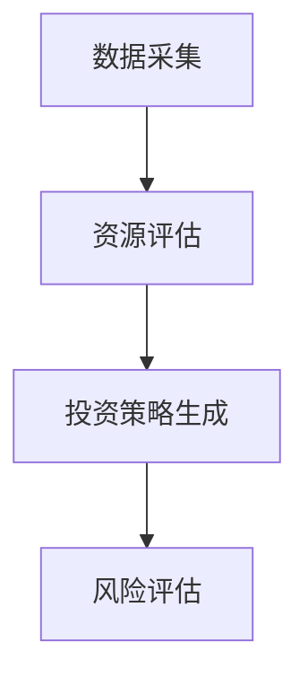
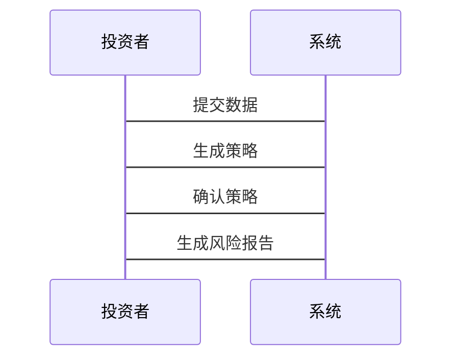

                 


# 《杰里米·格兰瑟姆的资源稀缺性投资理论》

## 关键词：
资源稀缺性, 投资理论, 经济学, 市场分析, 投资策略

## 摘要：
杰里米·格兰瑟姆的资源稀缺性投资理论是一种基于资源有限性和市场需求的投资策略，旨在帮助投资者在资源稀缺的市场环境中做出更明智的投资决策。本文将从理论背景、核心概念、数学模型、系统架构到实战应用，全面分析该理论的深刻内涵和实际操作方法。

---

## 第1章 资源稀缺性投资理论的背景与核心概念

### 1.1 资源稀缺性投资理论的定义与背景
资源稀缺性投资理论是由杰里米·格兰瑟姆提出的一种投资策略，其核心在于通过分析资源的稀缺性、市场需求和供给关系，预测资产价格的变化趋势。这一理论结合了经济学和投资学的原理，强调在资源有限的条件下，投资者应如何优化资产配置以实现收益最大化。

#### 1.1.1 资源稀缺性的定义
资源稀缺性是指某种资源的供给无法满足市场需求的状态。在投资领域，资源稀缺性可以是原材料、技术、人才等的短缺，这些因素直接影响资产的价格和市场表现。

#### 1.1.2 投资理论的背景
随着全球经济的发展，资源短缺问题日益严重，尤其是在能源、房地产和高科技领域。杰里米·格兰瑟姆的理论正是在这样的背景下提出的，旨在帮助投资者在资源稀缺的情况下做出更明智的投资决策。

### 1.2 资源稀缺性与投资策略的关系
资源稀缺性对投资策略的影响是多方面的。例如，当某种资源（如稀土）出现短缺时，相关企业的资产价值可能会大幅上涨，从而吸引投资者的关注。

#### 1.2.1 资源稀缺性对资产价格的影响
资源稀缺性直接影响资产的供给和需求关系。当某种资源稀缺时，市场需求可能超过供给，导致价格上升。

#### 1.2.2 投资者行为对资源稀缺性的反馈
投资者的行为会进一步加剧或缓解资源稀缺性的问题。例如，大量投资者涌入某个领域可能导致资源价格进一步上涨，从而吸引更多投资者。

### 1.3 资源稀缺性投资理论的核心要素
资源稀缺性投资理论的核心要素包括资源稀缺性、市场需求、供给关系和投资策略。这些要素相互关联，共同构成了理论的框架。

#### 1.3.1 资源稀缺性与市场需求的关系
资源稀缺性与市场需求密切相关。当某种资源稀缺时，市场需求可能会上升，导致价格上涨。

#### 1.3.2 资源稀缺性与供给关系的关系
资源稀缺性直接影响供给关系。当某种资源稀缺时，供给可能无法满足需求，导致价格上升。

#### 1.3.3 投资策略与资源稀缺性的关系
投资者可以根据资源稀缺性调整投资策略。例如，当某种资源稀缺时，投资者可以增加对该资源相关企业的投资。

### 1.4 本章小结
本章从理论背景、核心概念和核心要素三个方面，详细介绍了杰里米·格兰瑟姆的资源稀缺性投资理论。下一章将从数学模型的角度，进一步探讨该理论的实现原理。

---

## 第2章 资源稀缺性投资理论的数学模型与算法

### 2.1 资源稀缺性与资产定价的数学关系
资源稀缺性对资产价格的影响可以用数学公式表示。假设资源稀缺性为S，市场需求为D，供给为P，资产价格为P。根据供需原理，我们可以得到以下公式：

$$ P = f(S, D, P) $$

其中，S代表资源稀缺性，D代表市场需求，P代表供给。

#### 2.1.1 资源稀缺性对价格的影响
当资源稀缺性增加时，假设其他因素不变，资产价格将上升。

$$ \frac{dP}{dS} > 0 $$

#### 2.1.2 市场需求对价格的影响
当市场需求增加时，资产价格也将上升。

$$ \frac{dP}{dD} > 0 $$

#### 2.1.3 供给对价格的影响
当供给增加时，资产价格将下降。

$$ \frac{dP}{dP} < 0 $$

### 2.2 投资者行为对资源稀缺性的数学模型
投资者的行为会进一步影响资源稀缺性。假设投资者行为为I，资源稀缺性为S，资产价格为P。我们可以建立以下数学模型：

$$ I = f(S, P) $$

当资产价格上涨时，投资者可能会减少投资行为，从而缓解资源稀缺性。

$$ \frac{dI}{dP} < 0 $$

### 2.3 资源稀缺性与市场周期的关系
资源稀缺性与市场周期密切相关。假设市场周期为C，资源稀缺性为S，市场需求为D。我们可以得到以下公式：

$$ C = f(S, D) $$

当资源稀缺性增加时，市场周期可能会进入上升阶段。

### 2.4 算法实现
以下是基于资源稀缺性投资理论的算法实现：

```python
def calculate_price(scarcity, demand, supply):
    return scarcity * demand / supply

scarcity = 0.8  # 示例稀缺性
demand = 1.2  # 示例需求
supply = 0.6  # 示例供给

price = calculate_price(scarcity, demand, supply)
print(price)
```

### 2.5 本章小结
本章通过数学模型和算法，详细探讨了资源稀缺性对资产价格的影响。下一章将从系统架构的角度，进一步分析资源稀缺性投资理论的实现方式。

---

## 第3章 资源稀缺性投资理论的系统架构与实现

### 3.1 系统功能设计
资源稀缺性投资系统的功能模块包括数据采集、资源评估、投资策略生成和风险评估。

#### 3.1.1 数据采集模块
数据采集模块负责收集市场数据，包括资源稀缺性、市场需求和供给数据。

#### 3.1.2 资源评估模块
资源评估模块根据采集的数据，评估资源的稀缺性，并生成投资建议。

#### 3.1.3 投资策略生成模块
投资策略生成模块根据资源评估结果，生成具体的投资策略。

#### 3.1.4 风险评估模块
风险评估模块对投资策略进行风险评估，并生成风险报告。

### 3.2 系统架构设计
以下是资源稀缺性投资系统的架构图：



### 3.3 系统接口设计
资源稀缺性投资系统的接口设计包括数据输入接口、策略生成接口和风险评估接口。

#### 3.3.1 数据输入接口
数据输入接口负责接收市场数据，包括资源稀缺性、需求和供给数据。

#### 3.3.2 策略生成接口
策略生成接口根据资源评估结果，生成具体的投资策略。

#### 3.3.3 风险评估接口
风险评估接口对投资策略进行风险评估，并生成风险报告。

### 3.4 系统交互设计
以下是资源稀缺性投资系统的交互图：



### 3.5 本章小结
本章从系统架构和实现的角度，详细探讨了资源稀缺性投资理论的实现方式。下一章将从实战案例的角度，进一步分析该理论的应用。

---

## 第4章 资源稀缺性投资理论的实战应用与案例分析

### 4.1 实战环境安装
为了实现资源稀缺性投资理论，需要安装以下环境：

- Python编程语言
- 数据分析库（如Pandas、NumPy）
- 可视化库（如Matplotlib）
- 数据采集工具（如爬虫）

### 4.2 核心代码实现
以下是基于资源稀缺性投资理论的Python代码实现：

```python
import pandas as pd
import numpy as np
import matplotlib.pyplot as plt

# 数据采集
data = pd.read_csv('market_data.csv')

# 资源评估
scarcity = data['scaracity'].values
demand = data['demand'].values
supply = data['supply'].values

# 计算价格
price = scarcity * demand / supply

# 可视化
plt.plot(price)
plt.xlabel('Time')
plt.ylabel('Price')
plt.title('Price Trend Based on Scarcity')
plt.show()
```

### 4.3 案例分析
以下是资源稀缺性投资理论的一个实际案例：

假设我们关注某稀土企业的资源稀缺性。根据市场数据，该企业的资源稀缺性为0.8，市场需求为1.2，供给为0.6。根据公式计算，资产价格为：

$$ P = 0.8 \times 1.2 / 0.6 = 1.6 $$

因此，该企业的资产价格将上涨。

### 4.4 本章小结
本章通过实战案例，详细探讨了资源稀缺性投资理论的应用。下一章将从最佳实践的角度，总结该理论的使用经验和注意事项。

---

## 第5章 资源稀缺性投资理论的最佳实践与总结

### 5.1 最佳实践 tips
- 定期更新数据，确保模型的准确性
- 根据市场变化调整投资策略
- 结合其他投资理论进行综合分析

### 5.2 小结
杰里米·格兰瑟姆的资源稀缺性投资理论是一种基于资源有限性和市场需求的投资策略，通过数学模型和算法，帮助投资者在资源稀缺的市场环境中做出更明智的投资决策。

### 5.3 注意事项
- 资源稀缺性投资理论只是一个参考，实际投资需结合市场实际情况
- 投资者需具备一定的经济学和投资学知识
- 投资需谨慎，切勿盲目跟风

### 5.4 拓展阅读
- 格兰瑟姆的其他投资理论
- 资源稀缺性与可持续发展
- 资源稀缺性对全球经济的影响

---

## 作者：AI天才研究院/AI Genius Institute & 禅与计算机程序设计艺术 /Zen And The Art of Computer Programming

