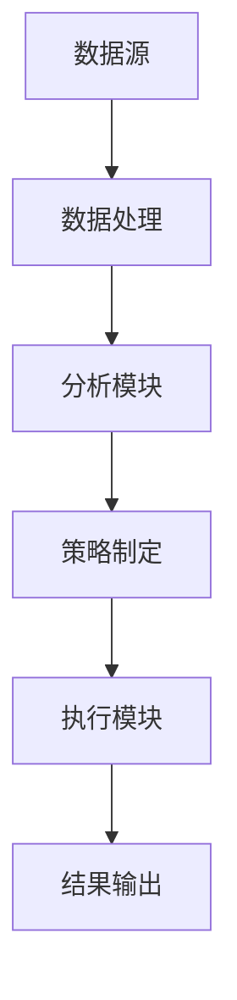

                 


# 杰里米·格兰瑟姆的长期价值投资哲学

**关键词**：长期价值投资，杰里米·格兰瑟姆，安全边际，内在价值，投资哲学，系统分析

**摘要**：  
本文深入探讨了杰里米·格兰瑟姆的长期价值投资哲学，从其核心理念、安全边际的计算方法、内在价值的评估策略，到投资组合的构建与管理，以及系统化的投资决策框架，全面解析了这一投资哲学的理论基础和实践应用。文章结合实际案例和系统架构设计，为投资者提供了从理论到实践的完整指导，帮助读者理解并掌握长期价值投资的精髓。

---

# 第一部分: 长期价值投资的哲学基础

## 第1章: 长期价值投资的概述

### 1.1 长期价值投资的定义与背景

#### 1.1.1 投资的定义与分类
投资是通过将资金投入特定资产或项目，以期在未来获得收益或资本增值的行为。根据投资期限和策略的不同，投资可以分为短期投资、中期投资和长期投资。长期投资强调持有资产的时间跨度较长，通常在数年以上，注重资产的内在价值和长期收益潜力。

#### 1.1.2 长期价值投资的核心理念
长期价值投资是一种以基本面分析为基础的投资策略，强调以低于资产内在价值的价格买入并长期持有优质资产。杰里米·格兰瑟姆的投资哲学核心在于寻找具有持续竞争优势、良好财务状况和合理估值的企业，注重安全边际和长期收益。

#### 1.1.3 格兰瑟姆投资哲学的起源与发展
杰里米·格兰瑟姆是投资界的重要人物，他的投资哲学起源于对价值投资的深入研究和实践。格兰瑟姆强调安全边际和内在价值，认为市场先生的情绪波动为投资者提供了长期获利的机会。

### 1.2 格兰瑟姆投资哲学的核心要素

#### 1.2.1 安全边际的概念
安全边际是指买入价格与资产内在价值之间的差距。通过买入低于内在价值的资产，投资者能够在市场波动中获得超额收益。

#### 1.2.2 市场先生与投资者的关系
格兰瑟姆将市场波动比作“市场先生”，认为市场的短期波动是由投资者情绪驱动的，而长期价值则由资产的内在基本面决定。投资者应利用市场的短期波动，寻找低估资产。

#### 1.2.3 长期价值投资的三个关键要素
1. **安全边际**：买入价格低于内在价值。
2. **内在价值**：资产的长期盈利能力。
3. **竞争优势**：企业具备持续竞争优势。

### 1.3 长期价值投资与其他投资策略的对比

#### 1.3.1 价值投资与成长投资的区别
- **价值投资**：注重资产的低估价格和安全边际。
- **成长投资**：注重企业的高增长潜力和未来收益。

#### 1.3.2 技术分析与基本面分析的对比
- **技术分析**：通过价格和成交量的走势预测市场短期波动。
- **基本面分析**：通过企业的财务数据和行业地位评估内在价值。

#### 1.3.3 长期投资与短线交易的差异
- **长期投资**：注重资产的长期价值，持有时间长，波动影响小。
- **短线交易**：注重短期价格波动，交易频率高，风险较大。

### 1.4 长期价值投资的适用场景与局限性

#### 1.4.1 长期价值投资的适用场景
- 稳定的市场环境。
- 投资者具备长期持有的耐心。
- 市场存在低估资产的机会。

#### 1.4.2 长期价值投资的局限性
- 短期市场波动可能影响投资收益。
- 市场过度波动可能导致资产长期被低估。
- 需要具备较高的基本面分析能力。

#### 1.4.3 不同市场环境下的策略调整
在牛市中，投资者应注重安全边际，避免高价买入；在熊市中，投资者应抓住低估资产的机会，增加长期收益潜力。

---

# 第二部分: 长期价值投资的核心原理

## 第2章: 安全边际与内在价值

### 2.1 安全边际的定义与计算

#### 2.1.1 安全边际的定义
安全边际是买入价格与资产内在价值之间的差距，确保在市场波动中获得超额收益。

#### 2.1.2 安全边际的计算方法
安全边际 = 内在价值 - 市场价格。

#### 2.1.3 安全边际与投资风险的关系
安全边际越高，投资风险越小，收益潜力越大。

### 2.2 内在价值的评估方法

#### 2.2.1 内在价值的定义
内在价值是资产在未来产生的现金流的现值，反映了资产的长期盈利能力。

#### 2.2.2 内在价值的评估模型
- **股利折现模型（DDM）**：通过股利的未来现金流折现计算内在价值。
- **贴现现金流模型（DCF）**：通过企业未来现金流折现计算内在价值。

#### 2.2.3 不同行业内在价值的评估差异
不同行业的资产具有不同的现金流特征，内在价值的评估需要结合行业特点。

### 2.3 格兰瑟姆对安全边际的强调

#### 2.3.1 安全边际在投资决策中的作用
安全边际是长期价值投资的核心，确保在市场波动中获得超额收益。

#### 2.3.2 格兰瑟姆对安全边际的量化标准
格兰瑟姆建议买入价格低于内在价值的 20%，即安全边际不低于 20%。

#### 2.3.3 安全边际与市场波动的关系
市场波动为投资者提供了寻找低估资产的机会，安全边际在市场波动中尤为重要。

### 2.4 本章小结
安全边际是长期价值投资的核心，内在价值是投资决策的基础，两者共同确保了投资的长期收益和风险控制。

---

## 第3章: 投资组合的构建与管理

### 3.1 投资组合的构建原则

#### 3.1.1 投资目标的设定
明确投资目标，包括收益目标和风险承受能力。

#### 3.1.2 资产配置的基本原则
根据投资目标和风险承受能力，合理配置不同资产的比例。

#### 3.1.3 风险与收益的平衡
在投资组合中，风险与收益需要平衡，避免过度集中。

### 3.2 投资组合的管理策略

#### 3.2.1 定期复盘与调整
定期复盘投资组合的表现，根据市场变化进行调整。

#### 3.2.2 个股与行业的分散配置
避免过度集中，分散投资以降低风险。

#### 3.2.3 长期持有与动态优化
长期持有优质资产，定期优化投资组合。

### 3.3 格兰瑟姆的投资组合管理方法

#### 3.3.1 格兰瑟姆对投资组合的管理策略
格兰瑟姆强调分散投资，注重资产的内在价值和安全边际。

#### 3.3.2 个股选择与权重分配
根据内在价值和安全边际，选择优质资产并合理分配权重。

#### 3.3.3 风险控制与止损机制
设定止损点，控制投资组合的风险。

### 3.4 本章小结
投资组合的构建与管理是长期价值投资的重要组成部分，需要根据市场变化和投资目标进行动态调整。

---

## 第4章: 投资决策的系统化框架

### 4.1 投资决策的流程与步骤

#### 4.1.1 问题场景介绍
投资决策是一个复杂的过程，需要系统化的框架。

#### 4.1.2 系统功能设计
设计投资决策系统，包括数据收集、分析、策略制定和执行。

#### 4.1.3 系统架构设计
系统架构设计需要考虑数据源、分析模块和执行模块。

### 4.2 投资决策的系统架构图



### 4.3 投资决策的接口设计

#### 4.3.1 数据接口设计
定义数据接口，确保数据的准确性和实时性。

#### 4.3.2 交互界面设计
设计友好的交互界面，方便用户操作。

#### 4.3.3 系统功能模块化设计
将系统功能模块化，提高系统的可维护性和扩展性。

### 4.4 本章小结
系统化的投资决策框架能够提高投资效率和准确性，是长期价值投资的重要工具。

---

## 第5章: 项目实战

### 5.1 环境安装与数据准备

#### 5.1.1 环境安装
安装必要的软件和工具，如Python、数据分析库等。

#### 5.1.2 数据准备
收集和整理相关数据，包括财务数据和市场数据。

### 5.2 系统核心实现源代码

#### 5.2.1 数据分析代码
```python
import pandas as pd
import numpy as np

# 假设df是包含股票数据的DataFrame
df = pd.read_csv('stock_data.csv')
df['内在价值'] = df['净利润'] / (df['ROE'] * 0.1)
df['安全边际'] = df['内在价值'] - df['股价']
```

#### 5.2.2 策略实现代码
```python
def calculate_margin(df):
    df['安全边际'] = df['内在价值'] - df['股价']
    return df

# 应用计算安全边际的函数
df = calculate_margin(df)
```

### 5.3 代码应用解读与分析

#### 5.3.1 数据分析与处理
通过对数据进行分析和处理，计算内在价值和安全边际，筛选出具有安全边际的股票。

#### 5.3.2 投资组合构建
根据筛选出的股票，构建投资组合，进行风险和收益的评估。

### 5.4 实际案例分析与详细讲解剖析

#### 5.4.1 案例分析
以具体股票为例，分析其内在价值和安全边际，评估是否具备长期投资价值。

#### 5.4.2 详细讲解剖析
通过案例分析，详细讲解长期价值投资的策略和实际操作方法。

### 5.5 本章小结
通过项目实战，读者可以掌握长期价值投资的理论和实践方法，提升投资能力。

---

## 第六部分: 总结与展望

### 6.1 本章小结
总结长期价值投资的核心理念和实践方法，强调安全边际和内在价值的重要性。

### 6.2 注意事项与最佳实践 tips

- **注意事项**：市场波动和经济环境的变化可能影响投资收益，需保持灵活性。
- **最佳实践**：定期复盘投资组合，根据市场变化进行调整，保持长期持有的耐心。

### 6.3 拓展阅读与进一步学习
推荐相关书籍和资源，鼓励读者深入学习长期价值投资的理论和实践。

---

## 作者信息

作者：AI天才研究院/AI Genius Institute & 禅与计算机程序设计艺术 /Zen And The Art of Computer Programming

