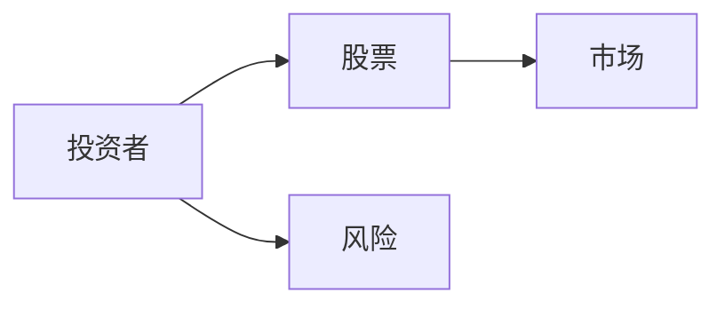
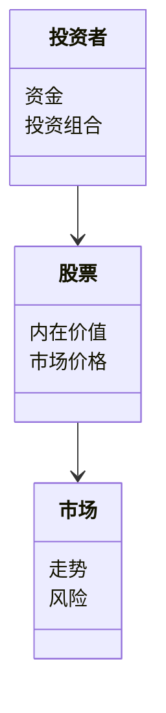
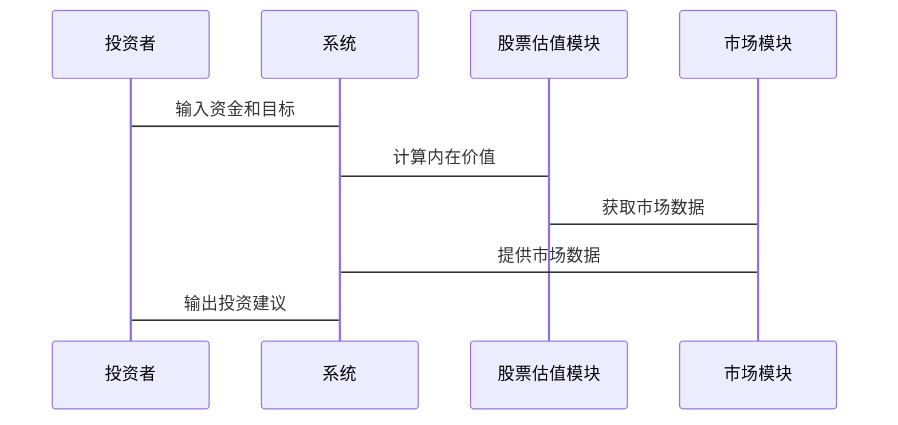

                 


# 杰里米格兰瑟姆的价值投资哲学

> 关键词：价值投资，杰里米·格兰瑟姆，投资哲学，安全边际，内在价值，风险管理

> 摘要：本文深入探讨了杰里米·格兰瑟姆的价值投资哲学，从其核心概念、系统分析到实际应用，全面解析了价值投资的理论与实践。文章通过详细的案例分析和系统设计，展示了如何运用格兰瑟姆的投资理念在实际投资中实现稳健收益。

---

## 第一部分: 价值投资的哲学基础

### 第1章: 价值投资的定义与背景

#### 1.1 价值投资的起源与发展
- **价值投资的起源**：价值投资是一种以基本面分析为基础的投资策略，起源于20世纪初。格兰瑟姆是该领域的先驱之一，他的思想深刻影响了后来的价值投资者。
- **格兰瑟姆在价值投资中的地位**：作为价值投资的鼻祖，格兰瑟姆提出了“安全边际”概念，强调在投资中考虑市场的非理性波动。
- **价值投资的核心理念**：以低于内在价值的价格买入优质资产，长期持有，等待市场的理性回归。

#### 1.2 价值投资与其他投资理念的对比
- **技术分析与基本面分析的区别**：技术分析侧重于价格走势，而价值投资关注企业的基本面。
- **价值投资与成长投资的异同**：价值投资寻找被低估的资产，而成长投资则关注高增长的公司。
- **价值投资与趋势投资的对比**：趋势投资依赖于市场趋势，而价值投资则依赖于内在价值。

### 第2章: 格兰瑟姆的投资哲学

#### 2.1 格兰瑟姆的投资策略
- **安全边际的概念与应用**：安全边际是指买入价格与内在价值之间的差距，确保在市场波动中仍能获利。
- **股价与内在价值的偏离**：市场短期可能 irrational，但长期会回归内在价值。
- **股票估值的基本方法**：通过分析企业的盈利、现金流和资产状况来评估其内在价值。

#### 2.2 格兰瑟姆的投资原则
- **分散投资的重要性**：通过分散投资降低风险，避免过度依赖单一资产。
- **长期投资的优势**：长期持有优质资产，避免短期波动的干扰。
- **风险控制的策略**：通过安全边际和分散投资来管理风险。

### 第3章: 价值投资的核心概念与联系

#### 3.1 核心概念原理
- **内在价值的计算公式**：
  $$ \text{内在价值} = \frac{\text{未来现金流的现值}}{折现率} $$
- **安全边际的数学模型**：
  $$ \text{安全边际} = \text{买入价} \times (1 - \frac{\text{内在价值}}{\text{市价}}) $$
- **股票估值的关键因素**：包括盈利能力、成长性、财务状况和行业地位。

#### 3.2 概念属性特征对比表格
| 概念       | 价值投资       | 成长投资       |
|------------|----------------|----------------|
| 核心目标   | 以低于价值的价格买入 | 寻找高成长性企业 |
| 风险承受   | 较低           | 较高           |
| 投资期限   | 长期           | 中期           |

#### 3.3 ER实体关系图架构


### 第4章: 价值投资的系统分析与架构设计方案

#### 4.1 问题场景介绍
- **问题背景**：投资者需要在市场中找到被低估的资产，以实现稳健收益。
- **格兰瑟姆理论的应用场景**：适用于市场波动较大、投资者希望降低风险的情况。

#### 4.2 系统功能设计
- **领域模型Mermaid类图**


- **系统架构设计Mermaid架构图**
```mermaid
architecturalDiagram
    资产管理模块 --> 股票估值模块
    股票估值模块 --> 风险控制模块
```

- **系统接口设计**：投资者输入资金和目标，系统输出投资组合建议。
- **系统交互Mermaid序列图**


### 第5章: 价值投资的项目实战

#### 5.1 环境安装
- **投资分析工具的安装**：安装Excel或Python的Pandas库。
- **数据源的获取与处理**：从股票市场数据源获取历史数据。

#### 5.2 核心实现源代码
- **股票估值的Python代码实现**
```python
def calculate_intrinsic_value(revenue, profit_margin, discount_rate):
    return revenue * profit_margin / discount_rate
```

- **安全边际的计算代码**
```python
def calculate_margin_of_safety(current_price, intrinsic_value):
    return (intrinsic_value - current_price) / intrinsic_value
```

- **投资组合优化的代码示例**
```python
import pandas as pd

def optimize_portfolio(stocks, weights):
    returns = pd.Series(weights).values
    covariance_matrix = pd.DataFrame(stocks).cov()
    return covariance_matrix.dot(returns)
```

### 第6章: 价值投资的风险管理与案例分析

#### 6.1 风险管理策略
- **风险控制的数学模型**：通过多元化的投资组合降低风险。
- **风险分散的实现方法**：将资金分配到不同资产类别中。
- **风险评估的指标分析**：使用波动率和VaR（Value at Risk）来衡量风险。

#### 6.2 实际案例分析
- **成功投资案例的详细解读**：以某公司为例，分析其内在价值和安全边际。
- **案例中的策略应用与反思**：总结案例中的成功经验，并提出改进建议。
- **案例的总结与启示**：强调长期投资和风险管理的重要性。

### 第7章: 价值投资的未来展望与最佳实践

#### 7.1 最佳实践 tips
- **分散投资**：避免过度集中于某一只股票。
- **长期持有**：耐心等待市场的理性回归。
- **持续学习**：不断更新知识，适应市场变化。

#### 7.2 小结
价值投资不仅是一种投资策略，更是一种长期的思维方式。通过格兰瑟姆的哲学，投资者可以在复杂多变的市场中找到稳健的收益。

#### 7.3 注意事项
- 避免盲目跟风。
- 保持对市场的敏感性，及时调整策略。

#### 7.4 拓展阅读
推荐书籍：《价值投资：杰里米·格兰瑟姆的投资哲学》。

---

作者：AI天才研究院/AI Genius Institute & 禅与计算机程序设计艺术 /Zen And The Art of Computer Programming

