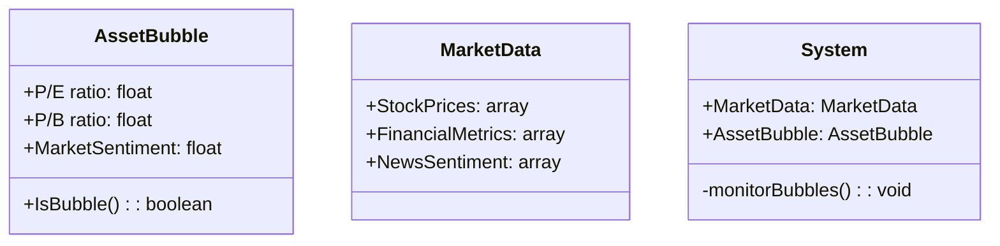
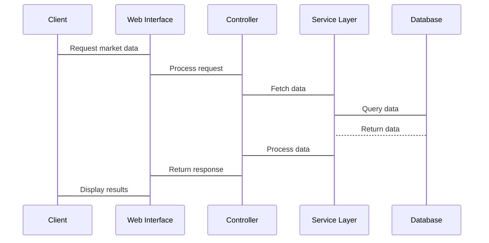

                 


# 杰里米格兰瑟姆的资产泡沫理论

> 关键词：资产泡沫，杰里米·格兰瑟姆，市场周期，泡沫识别，风险管理，投资策略

> 摘要：本文深入探讨了杰里米·格兰瑟姆的资产泡沫理论，分析了其核心概念、识别方法和风险管理策略。通过结合历史案例和数学模型，本文详细阐述了如何识别和应对资产泡沫，为投资者提供了实用的指导。

---

## 目录

### 第一部分: 资产泡沫理论的背景与核心概念

#### 第1章: 资产泡沫的基本概念与背景

##### 1.1 资产泡沫的定义与特征
###### 1.1.1 资产泡沫的定义
资产泡沫是指资产价格在短期内大幅偏离其内在价值的现象，通常由市场情绪、过度杠杆和非理性行为驱动。

###### 1.1.2 资产泡沫的主要特征
- **价格虚高**：资产价格远高于其基本面价值。
- **市场情绪化**：投资者情绪波动剧烈，从乐观到恐慌。
- **杠杆效应**：过度使用杠杆放大了价格波动。

###### 1.1.3 资产泡沫与金融危机的关系
资产泡沫的破裂往往引发金融危机，如1929年的股市崩盘和2008年的次贷危机。

##### 1.2 资产泡沫的历史案例
###### 1.2.1 荷兰郁金香泡沫
17世纪荷兰郁金香的价格暴涨暴跌，是最早的资产泡沫案例之一。

###### 1.2.2 1929年美国股市大崩盘
股票价格虚高，最终导致大萧条。

###### 1.2.3 2008年全球金融危机
次级抵押贷款市场泡沫破裂，引发全球金融危机。

##### 1.3 资产泡沫的形成机制
###### 1.3.1 市场情绪与投资者行为
投资者的非理性行为，如从众心理和过度自信，推动价格偏离基本面。

###### 1.3.2 资金流动性与杠杆效应
流动性过剩和杠杆融资放大了市场的波动性。

###### 1.3.3 市场参与者的作用
金融机构、投资者和监管机构在泡沫形成和破裂中扮演不同角色。

#### 第2章: 杰里米·格兰瑟姆的资产泡沫理论

##### 2.1 格兰瑟姆的理论背景
###### 2.1.1 格兰瑟姆的投资理念
格兰瑟姆是价值投资的倡导者，强调安全边际和长期投资。

###### 2.1.2 格兰瑟姆的学术贡献
他在市场周期、估值模型和风险管理方面有重要贡献。

###### 2.1.3 格兰瑟姆的市场周期理论
市场呈现周期性波动，泡沫和崩盘是周期的一部分。

##### 2.2 格兰瑟姆的资产泡沫模型
###### 2.2.1 泡沫形成的三阶段模型
1. **膨胀阶段**：价格快速上涨，投资者情绪乐观。
2. **疯狂阶段**：价格远超价值，市场参与者疯狂进入。
3. **破裂阶段**：价格突然下跌，市场情绪崩溃。

##### 2.3 格兰瑟姆的泡沫识别指标
###### 2.3.1 市场估值指标
- 市盈率（P/E）：股价与每股收益的比率。
- 市净率（P/B）：股价与每股净资产的比率。
- 市场资本化率：市值与GDP的比率。

###### 2.3.2 市场情绪指标
- 投资者信心指数。
- 交易量与价格的关系。

###### 2.3.3 市场参与者行为指标
- 杠杆水平。
- 投资者的风险偏好。

### 第二部分: 资产泡沫理论的核心概念与联系

#### 第3章: 核心概念与原理

##### 3.1 资产泡沫的核心概念
###### 3.1.1 市场估值与内在价值
市场价格与内在价值的偏离是泡沫形成的关键。

###### 3.1.2 市场情绪与投资者心理
情绪驱动市场波动，从乐观到恐慌。

###### 3.1.3 市场周期与泡沫破裂
市场周期性波动导致泡沫破裂。

##### 3.2 核心概念的联系
###### 3.2.1 市场估值与泡沫的关系
市场价格与估值指标（如P/E、P/B）的偏离程度决定泡沫风险。

###### 3.2.2 市场情绪与泡沫的相互作用
市场情绪推动价格波动，而价格波动又反过来影响市场情绪。

##### 3.3 核心概念的对比分析
###### 3.3.1 不同泡沫理论的对比
- 格兰瑟姆的三阶段模型。
- 其他理论的对比，如凯恩斯的流动性偏好理论。

### 第三部分: 资产泡沫理论的算法原理

#### 第4章: 资产泡沫识别的算法模型

##### 4.1 格兰瑟姆的泡沫识别指标
###### 4.1.1 市场估值指标
使用P/E、P/B等指标判断市场估值是否偏离正常水平。

##### 4.2 泡沫识别的数学模型
###### 4.2.1 市场估值模型
通过统计分析判断市场价格是否偏离基本面。

###### 4.2.2 市场情绪模型
通过投资者情绪指标预测市场波动。

### 第四部分: 系统分析与架构设计

#### 第5章: 资产泡沫监测系统

##### 5.1 问题场景介绍
构建一个实时监测资产泡沫的系统，帮助投资者及时识别风险。

##### 5.2 系统功能设计
###### 5.2.1 领域模型（mermaid 类图）


##### 5.3 系统架构设计（mermaid 架构图）


##### 5.4 系统接口设计
###### 5.4.1 API接口
- `/api/market-data`：获取市场数据。
- `/api/bubble-check`：检查是否存在泡沫。

##### 5.5 系统交互流程（mermaid 序列图）


### 第五部分: 项目实战

#### 第6章: 项目实战

##### 6.1 环境配置
- 安装Python、Pandas、NumPy、Matplotlib。

##### 6.2 核心实现
###### 6.2.1 代码实现
```python
import pandas as pd
import numpy as np

def calculate_pe(stock_prices, earnings):
    return stock_prices / earnings

def calculate_pb(stock_prices, book_value):
    return stock_prices / book_value

def is_bubble(pe, pb, market_sentiment):
    if pe > 25 or pb > 3 or market_sentiment > 0.8:
        return True
    else:
        return False

# 示例数据
stock_prices = pd.Series([100, 200, 300])
earnings = pd.Series([10, 20, 30])
book_value = pd.Series([50, 60, 70])
market_sentiment = 0.9

pe = calculate_pe(stock_prices, earnings)
pb = calculate_pb(stock_prices, book_value)
bubble = is_bubble(pe.mean(), pb.mean(), market_sentiment)

print("存在泡沫：" + str(bubble))
```

###### 6.2.2 代码解读
- `calculate_pe`：计算市盈率。
- `calculate_pb`：计算市净率。
- `is_bubble`：判断是否存在泡沫，基于PE、PB和市场情绪指标。

##### 6.3 实际案例分析
分析2008年次贷危机前的市场数据，识别是否存在泡沫。

### 第六部分: 最佳实践

#### 第7章: 最佳实践

##### 7.1 小结
格兰瑟姆的理论提供了有效的泡沫识别工具，帮助投资者避免重大损失。

##### 7.2 注意事项
- 定期更新数据，确保模型准确性。
- 结合多种指标，避免单一指标误判。

##### 7.3 拓展阅读
建议阅读格兰瑟姆的原著《The New Definitive Guide to Financial Planning》。

---

### 作者：AI天才研究院/AI Genius Institute & 禅与计算机程序设计艺术 /Zen And The Art of Computer Programming

---

**[完]**

