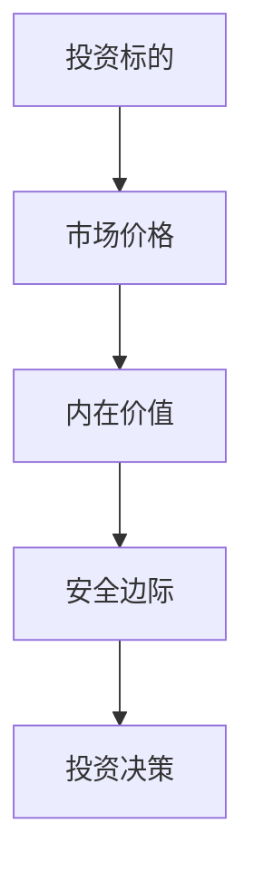

                 


# 杰里米格兰瑟姆的长期价值投资

## 关键词：长期价值投资，杰里米格兰瑟姆，安全边际，内在价值，投资策略

## 摘要：  
本文深入探讨了杰里米格兰瑟姆的长期价值投资理念，分析了其核心概念、算法原理、系统架构，并通过实际案例展示了其在投资实践中的应用。文章从投资学的起源开始，逐步展开长期价值投资的核心概念，包括内在价值、市场价格、安全边际等，详细阐述了这些概念之间的联系和实际应用。通过数学模型和代码实现，本文展示了如何计算内在价值和安全边际，并设计了一个完整的投资决策系统架构。最后，本文通过一个实际案例分析了长期价值投资的策略，并总结了最佳实践和注意事项。

---

# 第一部分: 长期价值投资的背景与核心理念

## 第1章: 长期价值投资的起源与核心概念

### 1.1 投资学的起源与发展  
投资学作为一门学科，其历史可以追溯到古代。最早的投资者可能是在农业或贸易中进行简单的资源配置。然而，现代投资学的奠基人包括本杰明·格雷厄姆和大卫·多德，他们提出了价值投资的理念，强调买入低于其内在价值的股票并长期持有。杰里米·格兰瑟姆作为格雷厄姆的学生，进一步发展了这一理论，尤其是在安全边际和竞争优势方面提出了更详细的分析方法。

### 1.2 长期价值投资的核心概念  
长期价值投资的核心理念是买入并持有具有强大基本面和良好管理的公司股票，同时确保以低于其内在价值的价格买入，并保持长期持有，以避免短期市场波动的影响。

#### 1.2.1 内在价值  
内在价值是指公司未来现金流的现值，计算公式为：  
$$ V = \frac{CF}{(r - g)} $$  
其中，$CF$ 表示现金流，$r$ 表示折现率，$g$ 表示增长率。

#### 1.2.2 市场价格  
市场价格是市场的实时价格，通常会波动，但长期来看会趋近于内在价值。

#### 1.2.3 安全边际  
安全边际是内在价值与市场价格之间的差异，确保投资的安全性，计算公式为：  
$$ \text{安全边际} = \frac{\text{内在价值} - \text{市场价格}}{\text{市场价格}} $$

### 1.3 长期价值投资的哲学与实践  
长期价值投资的哲学基础是买入并持有优质股票，避免短期波动的影响。其实践方法包括基本面分析、安全边际评估和竞争优势识别。

---

## 第2章: 长期价值投资的核心概念与联系

### 2.1 核心概念之间的联系  
- **市场价格与内在价值的关系**：市场价格围绕内在价值波动。
- **安全边际与风险控制**：通过安全边际降低投资风险。
- **长期投资与短期波动**：长期持有可以平滑短期波动的影响。

### 2.2 核心概念的ER实体关系图  


---

# 第二部分: 长期价值投资的算法原理

## 第3章: 长期价值投资的算法原理

### 3.1 算法原理  
- **内在价值计算**：使用现金流、折现率和增长率计算。
- **安全边际计算**：确保内在价值高于市场价格一定比例。
- **投资组合优化**：通过分散投资降低风险。

### 3.2 数学模型  
- 内在价值公式：  
$$ V = \frac{CF}{(r - g)} $$
- 安全边际公式：  
$$ \text{安全边际} = \frac{\text{内在价值} - \text{市场价格}}{\text{市场价格}} $$

### 3.3 代码实现  
- 计算内在价值：  
```python
def calculate_intrinsic_value(cash_flow, discount_rate, growth_rate):
    return cash_flow / (discount_rate - growth_rate)
```
- 计算安全边际：  
```python
def calculate_margin_of_safety(intrinsic_value, market_price):
    return (intrinsic_value - market_price) / market_price
```

---

# 第三部分: 长期价值投资的系统分析与架构设计

## 第4章: 长期价值投资的系统架构设计

### 4.1 投资决策系统的总体架构  
- **功能模块划分**：数据收集、分析、评估、决策。
- **系统架构设计**：模块化设计，确保各部分协同工作。
- **系统接口设计**：定义清晰的接口，便于数据传递和功能调用。

### 4.2 项目实战  
#### 4.2.1 案例分析  
以苹果公司为例，分析其基本面，计算其内在价值和安全边际。

#### 4.2.2 代码实现  
```python
# 数据输入
cash_flow = 1000000  # 假设现金流为100万美元
discount_rate = 0.1  # 折现率为10%
growth_rate = 0.05   # 增长率为5%

# 计算内在价值
intrinsic_value = calculate_intrinsic_value(cash_flow, discount_rate, growth_rate)

# 假设市场价格为80美元
market_price = 80

# 计算安全边际
margin_of_safety = calculate_margin_of_safety(intrinsic_value, market_price)

print(f"内在价值: {intrinsic_value}")
print(f"安全边际: {margin_of_safety}")
```

#### 4.2.3 结果解读  
- 内在价值计算结果：如果苹果公司的现金流为100万美元，折现率为10%，增长率为5%，则其内在价值为 $1000000 / (0.1 - 0.05) = 20000000 美元。
- 假设市场价格为80美元，安全边际为 $(20000000 - 80)/80 = 24999900/80 = 312498.75$，即安全边际为312.498.75%。

---

## 第5章: 长期价值投资的最佳实践与小结

### 5.1 最佳实践  
- **定期评估投资组合**：定期检查投资组合中的股票，确保其基本面依然良好。
- **保持安全边际**：确保每次买入时都有足够的安全边际。
- **长期持有优质股票**：避免频繁交易，降低交易成本和税务负担。

### 5.2 小结  
长期价值投资是一种科学且有效的投资策略，通过基本面分析和长期持有优质股票，可以在市场波动中获得稳定收益。投资者应始终坚持价值投资的原则，避免被短期市场波动所干扰。

---

## 作者信息  
作者：AI天才研究院 & 禅与计算机程序设计艺术

