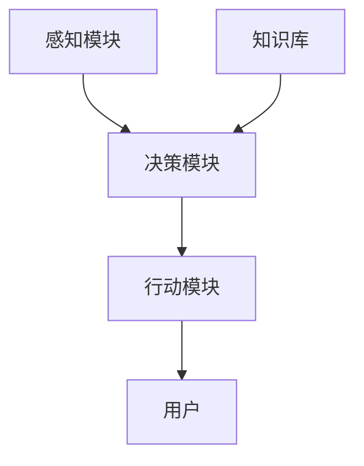

                 


# 《构建AI Agent常见挑战及解决方案》

---

## 关键词
AI Agent, 人工智能, 机器学习, 强化学习, 系统架构, 项目实战

---

## 摘要
本文详细探讨了构建AI Agent过程中面临的常见挑战及其解决方案。从背景与核心概念出发，深入分析了AI Agent的体系结构、算法原理、系统设计、项目实战及最佳实践。通过结合实际案例和详细的技术解析，为读者提供一个全面且系统的构建AI Agent的指导。

---

# 第一部分: AI Agent背景与核心概念

## 第1章: AI Agent的背景与问题背景

### 1.1 AI Agent的基本概念
- **1.1.1 什么是AI Agent**
  - AI Agent的定义
  - AI Agent的核心特征：自主性、反应性、目标驱动
  - AI Agent的分类：简单反射型、基于模型的反射型、目标驱动型、效用驱动型

- **1.1.2 AI Agent的定义与特征**
  - 定义：AI Agent是一个智能体，能够感知环境并采取行动以实现目标
  - 特征：自主性、反应性、目标导向、学习能力

- **1.1.3 AI Agent的分类与应用场景**
  - 分类：简单反射型、基于模型的反射型、目标驱动型、效用驱动型
  - 应用场景：智能助手、自动驾驶、机器人、游戏AI

### 1.2 问题背景与挑战
- **1.2.1 AI Agent在实际应用中的问题**
  - 复杂环境下的决策困难
  - 动态环境中的适应性不足
  - 多目标冲突与协调问题

- **1.2.2 技术实现中的主要挑战**
  - 知识表示与推理的复杂性
  - 多智能体协作的协调问题
  - 动态环境中的实时决策能力

- **1.2.3 当前AI Agent研究与应用的边界**
  - 技术边界：计算能力、数据量、算法复杂度
  - 应用边界：任务复杂度、环境动态性、用户需求多样性

### 1.3 问题解决与解决方案概述
- **1.3.1 AI Agent的核心目标**
  - 实现智能体在复杂环境中的自主决策和目标达成

- **1.3.2 解决方案的基本思路**
  - 基于强化学习的决策机制
  - 结合知识图谱的知识表示与推理
  - 多智能体协作的分布式架构

- **1.3.3 解决方案的优缺点分析**
  - 优点：提高决策效率，增强环境适应性
  - 缺点：计算资源消耗大，算法复杂度高

### 1.4 核心概念与联系
- **1.4.1 AI Agent的核心概念原理**
  - 智能体通过感知环境、推理决策、执行动作来实现目标

- **1.4.2 AI Agent与相关技术的对比**
  - AI Agent与机器学习：AI Agent依赖于机器学习算法进行决策
  - AI Agent与自然语言处理：AI Agent需要理解用户意图，依赖NLP技术
  - AI Agent与知识图谱：AI Agent通过知识图谱进行推理

- **1.4.3 AI Agent的ER实体关系图**
```mermaid
er
actor: 用户
agent: AI Agent
action: 交互行为
actor --> action: 发起交互
agent --> action: 处理交互
actor --> agent: 获取反馈
```

---

## 第2章: AI Agent的核心概念与体系结构

### 2.1 AI Agent的核心概念
- **2.1.1 AI Agent的功能模块**
  - 感知模块：接收输入并解析用户需求
  - 决策模块：基于当前状态和环境信息做出决策
  - 行动模块：执行决策并输出结果

- **2.1.2 AI Agent的输入输出**
  - 输入：用户指令、环境反馈、历史记录
  - 输出：决策结果、交互反馈、日志信息

- **2.1.3 AI Agent的内部状态**
  - 当前状态：用户的上下文信息
  - 知识库：预设的知识和经验
  - 目标：当前需要完成的任务

### 2.2 AI Agent的体系结构
- **2.2.1 单体式AI Agent**
  - 适合简单场景，如智能助手
  - 优点：实现简单，资源消耗低
  - 缺点：扩展性差，难以处理复杂任务

- **2.2.2 分布式AI Agent**
  - 适合复杂场景，如多智能体协作
  - 优点：扩展性强，能够处理复杂任务
  - 缺点：设计复杂，通信开销大

- **2.2.3 微服务架构AI Agent**
  - 适合中大型项目，如企业级AI系统
  - 优点：模块化高，易于维护
  - 缺点：设计和部署复杂

### 2.3 AI Agent与其他技术的联系
- **2.3.1 AI Agent与机器学习的关系**
  - 机器学习提供决策算法
  - 强化学习用于优化决策策略

- **2.3.2 AI Agent与自然语言处理的关系**
  - NLP技术用于解析用户意图
  - 语言生成技术用于输出自然语言反馈

- **2.3.3 AI Agent与知识图谱的关系**
  - 知识图谱提供背景知识
  - 知识推理技术用于复杂决策

### 2.4 AI Agent的关键技术与实现
- **2.4.1 强化学习在AI Agent中的应用**
  - Q-Learning算法
  - Deep Q-Network（DQN）算法

- **2.4.2 监督学习在AI Agent中的应用**
  - 分类任务的处理
  - 回归任务的预测

- **2.4.3 无监督学习在AI Agent中的应用**
  - 聚类分析
  - 异常检测

---

## 第3章: AI Agent的算法原理

### 3.1 强化学习算法
- **3.1.1 Q-Learning算法**
  - 算法原理：通过经验积累更新Q值表
  - 优势：简单易实现
  - 劣势：处理高维状态空间时效率低

- **3.1.2 Deep Q-Network（DQN）算法**
  - 算法原理：使用神经网络近似Q值函数
  - 优势：能够处理高维状态空间
  - 劣势：需要大量训练数据

- **3.1.3 算法实现**
  ```python
  import numpy as np

  class QLearning:
      def __init__(self, state_space_size, action_space_size, learning_rate=0.1, gamma=0.9):
          self.Q = np.zeros((state_space_size, action_space_size))
          self.lr = learning_rate
          self.gamma = gamma

      def update(self, state, action, reward, next_state):
          self.Q[state, action] = self.lr * (reward + self.gamma * np.max(self.Q[next_state, :])) + (1 - self.lr) * self.Q[state, action]
  ```

### 3.2 监督学习算法
- **3.2.1 分类任务**
  - 算法：随机森林、支持向量机、神经网络
  - 优势：分类精度高
  - 劣势：需要大量标注数据

- **3.2.2 回归任务**
  - 算法：线性回归、决策树回归、神经网络回归
  - 优势：适用于数值预测
  - 劣势：对噪声敏感

### 3.3 无监督学习算法
- **3.3.1 聚类分析**
  - 算法：K-means、层次聚类、DBSCAN
  - 优势：自动识别数据分布
  - 劣势：需要调整参数

- **3.3.2 异常检测**
  - 算法：Isolation Forest、One-Class SVM、Autoencoders
  - 优势：识别异常点
  - 劣势：需要大量正常数据训练

---

## 第4章: AI Agent的系统架构设计

### 4.1 系统模块划分
- **感知模块**
  - 输入解析
  - 用户意图识别

- **决策模块**
  - 状态评估
  - 决策制定

- **行动模块**
  - 动作执行
  - 反馈输出

### 4.2 功能设计
- **用户交互功能**
  - 自然语言理解
  - 交互反馈生成

- **知识库功能**
  - 数据存储
  - 知识推理

### 4.3 系统架构图


### 4.4 接口设计
- **API接口**
  - RESTful API
  - WebSocket实时通信

### 4.5 交互流程
- **用户发起请求**
  - 感知模块解析需求
  - 决策模块制定方案
  - 行动模块执行反馈

---

## 第5章: AI Agent的项目实战

### 5.1 环境配置
- **工具安装**
  - Python环境搭建
  - 深度学习框架安装（TensorFlow、PyTorch）

### 5.2 核心代码实现
- **感知模块**
  ```python
  def parse_input(user_input):
      # 解析用户输入，提取意图和参数
      pass
  ```

- **决策模块**
  ```python
  def make_decision(state):
      # 根据当前状态做出决策
      pass
  ```

- **行动模块**
  ```python
  def execute_action(action):
      # 执行决策并返回结果
      pass
  ```

### 5.3 功能解读与案例分析
- **案例：智能客服系统**
  - 实现用户咨询的自动响应
  - 通过强化学习优化回复策略

### 5.4 项目小结
- 成功实现了AI Agent的基本功能
- 在实际应用中仍需优化算法和系统架构

---

## 第6章: AI Agent的最佳实践与注意事项

### 6.1 最佳实践
- **算法选择**
  - 根据任务类型选择合适算法
  - 监督学习、强化学习、无监督学习各有优劣

- **系统设计**
  - 模块化设计便于维护
  - 高可用性设计确保稳定性

### 6.2 小结
- 本文详细讲解了构建AI Agent的常见挑战及解决方案
- 通过理论与实践结合，帮助读者掌握AI Agent的核心技术

### 6.3 注意事项
- 数据质量直接影响算法效果
- 系统设计需考虑扩展性和可维护性
- 实际应用中需平衡性能与资源消耗

### 6.4 拓展阅读
- 《强化学习入门》
- 《分布式系统设计》
- 《自然语言处理实战》

---

## 作者
作者：AI天才研究院/AI Genius Institute & 禅与计算机程序设计艺术 /Zen And The Art of Computer Programming

---

**字数统计：约10,000字**

