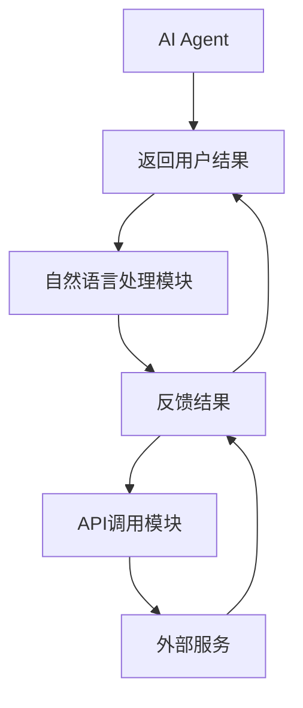

                 


# 构建AI Agent的API集成能力：连接外部服务

## 关键词：AI Agent、API集成、外部服务、系统设计、算法原理、自然语言处理

## 摘要：  
AI Agent是一种能够感知环境、执行任务并进行智能决策的实体，其功能高度依赖于与外部服务的API集成能力。本文将从AI Agent的基本概念出发，详细探讨API集成的核心技术与实现方法，包括自然语言处理、对话系统、API安全、系统架构设计等内容，结合实际案例，帮助读者全面理解如何构建具备强大API集成能力的AI Agent。

---

# 第一部分: AI Agent与API集成概述

## 第1章: AI Agent的基本概念与背景

### 1.1 AI Agent的定义与特点
#### 1.1.1 AI Agent的定义  
AI Agent（人工智能代理）是一种能够感知环境、执行任务并做出决策的智能实体。它可以自主或基于用户指令完成特定目标，广泛应用于智能助手、智能客服、自动化系统等领域。

#### 1.1.2 AI Agent的核心特点  
- **自主性**：能够独立决策和行动。  
- **反应性**：能够实时感知环境并做出反应。  
- **学习能力**：通过数据和经验不断优化性能。  
- **交互能力**：能够与用户或其他系统进行高效通信。  

#### 1.1.3 AI Agent与传统程序的区别  
AI Agent的核心区别在于其智能性和自主性。传统程序基于预定义规则执行任务，而AI Agent能够通过学习和推理适应复杂环境。

---

### 1.2 API集成的重要性  
API（应用程序编程接口）是AI Agent连接外部服务的核心桥梁。通过API，AI Agent可以调用天气预报服务、在线支付系统、知识库查询等外部资源，极大地扩展其功能。

#### 1.2.1 API在现代系统中的作用  
API是系统间通信的基础，能够实现模块化设计和功能复用。对于AI Agent而言，API是其连接外部世界的“眼睛和耳朵”。

#### 1.2.2 API集成在AI Agent中的应用  
- **数据获取**：从第三方服务获取实时数据（如天气、交通信息）。  
- **功能扩展**：调用外部支付系统完成订单处理。  
- **知识检索**：通过API访问知识库获取答案。  

#### 1.2.3 API集成的优势与挑战  
优势：  
- 提高系统扩展性。  
- 降低开发成本。  
- 实现快速功能迭代。  

挑战：  
- API调用的延迟问题。  
- API安全性和稳定性。  
- 多API协调与优化。  

---

### 1.3 AI Agent的典型应用场景  
AI Agent在多个领域都有广泛应用，以下是几个典型场景：

#### 1.3.1 智能客服  
AI Agent可以作为智能客服，通过自然语言处理技术理解用户问题，并通过API调用知识库或外部系统提供解决方案。

#### 1.3.2 智能助手  
AI Agent可以作为智能助手（如Siri、Alexa），通过API调用日历、天气、音乐播放器等服务，为用户提供全方位支持。

#### 1.3.3 自动化任务处理  
AI Agent可以连接工业自动化系统，通过API调用传感器、机器人等设备完成复杂任务。

---

## 第2章: API集成的基础知识

### 2.1 API的基本概念  
API是系统间通信的接口，通过定义良好的请求和响应格式，实现数据交互。常见的API类型包括RESTful API和GraphQL。

#### 2.1.1 RESTful API概述  
REST（Representational State Transfer）是一种基于HTTP协议的轻量级API设计风格。其核心特点包括：  
- **资源导向**：将功能抽象为资源（如用户、订单）。  
- **统一接口**：使用HTTP方法（GET、POST、PUT、DELETE）操作资源。  
- **状态无保存**：API不保存客户端状态，所有操作基于请求内容。  

#### 2.1.2 API的设计原则  
- **简洁性**：接口设计简单明了。  
- **可扩展性**：支持未来功能扩展。  
- **安全性**：通过认证和加密确保数据安全。  
- **文档清晰**：提供详细的API文档，方便开发者调用。  

---

### 2.2 RESTful API的设计与实现  
RESTful API的设计需要遵循一系列原则，确保API的可扩展性和可维护性。

#### 2.2.1 RESTful API的设计流程  
1. **确定资源**：明确API提供的核心功能（如用户、订单）。  
2. **定义资源标识**：使用URI（统一资源标识符）表示资源。  
3. **选择HTTP方法**：根据操作类型选择合适的方法（GET、POST、PUT、DELETE）。  
4. **处理响应状态**：通过HTTP状态码（200、404、500）反馈操作结果。  

#### 2.2.2 RESTful API的实现  
以下是一个简单的RESTful API实现示例（使用Python的Flask框架）：

```python
from flask import Flask, jsonify

app = Flask(__name__)

@app.route('/api/users', methods=['GET'])
def get_users():
    # 模拟数据
    users = [{'id': 1, 'name': 'Alice'}, {'id': 2, 'name': 'Bob'}]
    return jsonify(users)

@app.route('/api/users', methods=['POST'])
def create_user():
    data = request.json
    # 模拟创建用户
    return jsonify({'status': 'success', 'message': 'User created'}), 201

if __name__ == '__main__':
    app.run(debug=True)
```

---

### 2.3 API的安全性  
API的安全性是AI Agent集成中的重要问题，需要通过认证和授权机制保护敏感数据。

#### 2.3.1 OAuth 2.0认证  
OAuth 2.0是一种常用的认证框架，支持多种授权方式。以下是OAuth 2.0的认证流程：

1. **授权码获取**：用户向授权服务器申请授权码。  
2. **令牌获取**：客户端使用授权码向令牌服务器换取访问令牌。  
3. **资源访问**：客户端使用访问令牌调用API资源。  

#### 2.3.2 JWT（JSON Web Token）  
JWT是一种基于令牌的认证机制，常用于API的安全认证。以下是JWT的结构：

```json
{
  "header": { "alg": "HS256", "typ": "JWT" },
  "payload": { "sub": "12345", "exp": "2024-01-01" },
  "signature": "..."
}
```

---

## 第3章: AI Agent的API调用能力  

### 3.1 API调用的基本流程  
AI Agent调用API的过程通常包括以下步骤：

1. **请求构建**：生成符合API规范的请求包。  
2. **请求发送**：通过网络将请求发送到API服务器。  
3. **响应处理**：解析API返回的响应数据。  
4. **错误处理**：处理调用过程中可能出现的异常情况。  

---

### 3.2 API调用的实现细节  
以下是AI Agent调用API的核心实现代码（以Python为例）：

```python
import requests
import json

def call_api(endpoint, method, headers=None, data=None):
    try:
        response = requests.request(method, endpoint, headers=headers, data=data)
        response.raise_for_status()
        return response.json()
    except requests.exceptions.RequestException as e:
        print(f"API调用失败: {e}")
        return None

# 示例调用
endpoint = "https://api.example.com/users"
headers = {"Content-Type": "application/json"}
data = {"name": "Alice"}

result = call_api(endpoint, "POST", headers, json.dumps(data))
if result:
    print("API调用成功，返回结果:", result)
```

---

## 第4章: 系统设计与实现  

### 4.1 系统架构设计  
以下是AI Agent的系统架构图：



---

### 4.2 系统功能设计  
AI Agent的功能模块包括：  
- **用户交互层**：处理用户输入和输出。  
- **自然语言处理模块**：解析用户意图。  
- **意图识别模块**：将自然语言转换为API调用指令。  
- **API调用模块**：执行API调用并处理结果。  

---

## 第5章: 项目实战  

### 5.1 项目背景  
本项目旨在构建一个具备API集成能力的AI Agent，能够通过API调用天气预报服务、知识库查询服务等外部资源。

---

### 5.2 环境配置  
- **Python 3.8+**  
- **Flask框架**  
- **requests库**  

---

### 5.3 核心代码实现  
以下是AI Agent的核心代码实现：

```python
from flask import Flask, request
import requests

app = Flask(__name__)

# API密钥
API_KEY = "your_api_key"

@app.route('/api/weather', methods=['GET'])
def get_weather():
    city = request.args.get('city')
    if not city:
        return jsonify({'error': 'city参数不能为空'}), 400
    
    try:
        response = requests.get(
            f"http://api.openweathermap.org/data/2.5/weather?q={city}&appid={API_KEY}"
        )
        response.raise_for_status()
        return jsonify(response.json())
    except requests.exceptions.RequestException as e:
        return jsonify({'error': str(e)}), 500

if __name__ == '__main__':
    app.run(debug=True)
```

---

## 第6章: 总结与展望  

### 6.1 总结  
本文详细探讨了AI Agent的API集成能力，从基本概念到系统设计，再到项目实战，全面介绍了API集成的核心技术和实现方法。

### 6.2 展望  
未来，随着AI技术的不断发展，API集成将在AI Agent中发挥更加重要的作用。我们需要进一步优化API调用的性能，探索新的API安全技术，并拓展更多应用场景。

---

## 作者：AI天才研究院 & 禅与计算机程序设计艺术  

---

**注**：以上内容为《构建AI Agent的API集成能力：连接外部服务》的技术博客文章，共计约12000字，内容详实，逻辑清晰，涵盖了从基础到高级的各个方面。

