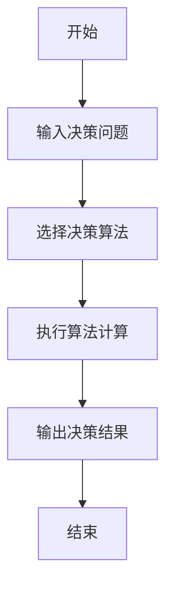
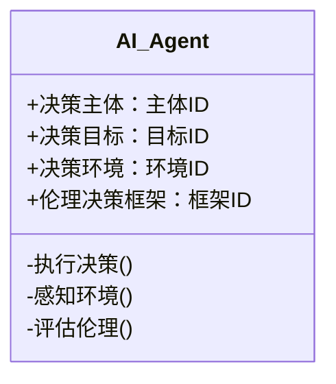
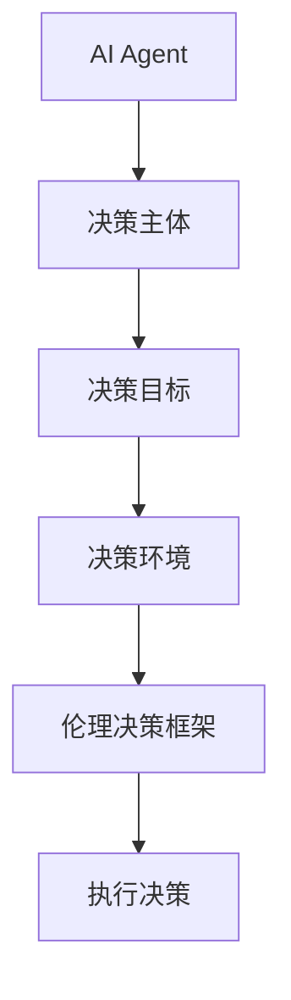
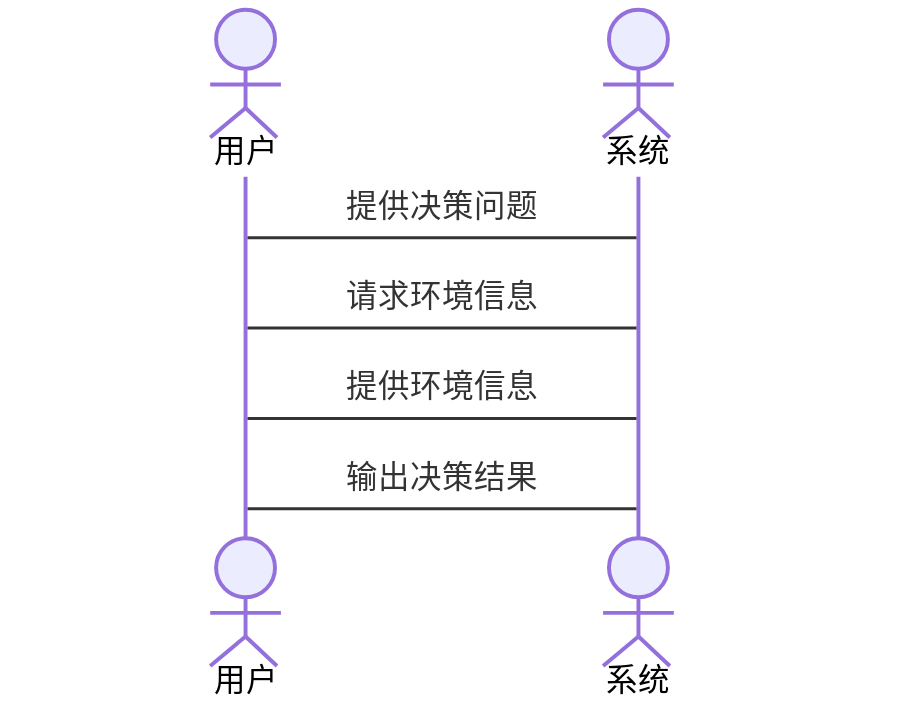

                 


# 《构建AI Agent的伦理决策框架》

**关键词**：AI Agent, 伦理决策, 人工智能, 系统架构, 数学模型

**摘要**：随着人工智能技术的快速发展，AI Agent在各个领域的应用日益广泛。然而，AI Agent在做出决策时，常常面临复杂的伦理问题。本文将从AI Agent的基本概念出发，探讨伦理决策框架的核心要素，分析其算法原理，并通过系统设计与项目实战，构建一个完善的伦理决策框架。文章最后将总结构建该框架的最佳实践和未来研究方向。

---

# 第1章 AI Agent与伦理决策的概述

## 1.1 AI Agent的基本概念
### 1.1.1 AI Agent的定义与分类
AI Agent是一种能够感知环境、自主决策并采取行动的智能实体。根据智能水平，AI Agent可以分为反应式Agent和基于模型的Agent。反应式Agent仅依赖当前感知信息做出决策，而基于模型的Agent则利用内部状态和外部环境信息进行推理。

### 1.1.2 AI Agent的核心特征
- **自主性**：能够在没有外部干预的情况下独立运作。
- **反应性**：能够实时感知环境并做出相应反应。
- **目标导向性**：具备明确的目标，并根据目标调整决策。

### 1.1.3 AI Agent的应用场景
AI Agent广泛应用于自动驾驶、智能助手、机器人、金融交易等领域。例如，在自动驾驶中，AI Agent需要实时感知道路状况并做出驾驶决策。

## 1.2 伦理决策的定义与重要性
### 1.2.1 伦理决策的基本概念
伦理决策是指在决策过程中遵循道德规范和伦理准则的选择。在AI Agent中，伦理决策通常涉及对不同利益相关者的权衡。

### 1.2.2 伦理决策在AI Agent中的作用
伦理决策是确保AI Agent行为符合人类价值观和道德准则的关键。例如，在自动驾驶中，AI Agent需要在紧急情况下做出选择，以最小化人员伤亡。

### 1.2.3 伦理决策的挑战与机遇
- **挑战**：AI Agent需要在复杂多变的环境中做出符合伦理的决策，这需要强大的计算能力和复杂的算法支持。
- **机遇**：通过伦理决策框架的构建，可以提升AI Agent的智能化水平，使其更好地服务于人类社会。

## 1.3 AI Agent伦理决策的背景与问题
### 1.3.1 当前AI Agent发展的现状
AI Agent技术迅速发展，但在伦理决策方面仍存在诸多不足。例如，现有AI Agent在处理复杂伦理问题时，往往缺乏灵活性和适应性。

### 1.3.2 伦理决策在AI Agent中的必要性
伦理决策是确保AI Agent行为符合社会规范和人类价值观的关键。随着AI Agent在更多领域中的应用，构建伦理决策框架变得尤为重要。

### 1.3.3 当前AI Agent伦理决策的主要问题
- **伦理准则的模糊性**：不同文化和社会背景下，伦理准则可能有所不同。
- **决策过程的透明性**：AI Agent的决策过程往往缺乏透明性，导致用户难以理解其行为。
- **伦理决策的可解释性**：复杂的算法使得AI Agent的决策过程难以被人类理解和解释。

---

# 第2章 AI Agent的伦理决策框架

## 2.1 伦理决策框架的核心要素
### 2.1.1 决策主体
决策主体包括AI Agent、用户和其他相关利益方。AI Agent作为决策主体，需要在决策过程中考虑其他主体的利益和需求。

### 2.1.2 决策目标
决策目标是指AI Agent希望通过决策实现的具体目标。例如，在自动驾驶中，AI Agent的目标可能是避免碰撞并安全到达目的地。

### 2.1.3 决策环境
决策环境是指AI Agent所处的外部环境，包括物理环境、社会环境和法律环境等。AI Agent需要根据环境信息做出决策。

## 2.2 伦理决策框架的属性对比
### 2.2.1 决策的确定性与不确定性
- **确定性决策**：在决策过程中，AI Agent能够明确预测结果。例如，在简单的交通规则下做出转向决策。
- **不确定性决策**：在复杂环境中，AI Agent无法完全预测结果，例如在交通拥堵时选择最优路径。

### 2.2.2 决策的静态与动态性
- **静态决策**：决策环境和条件在决策过程中保持不变。
- **动态决策**：决策环境和条件在决策过程中不断变化。

### 2.2.3 决策的个体与群体性
- **个体决策**：AI Agent基于自身的利益和目标做出决策。
- **群体决策**：AI Agent需要考虑群体利益，例如在自动驾驶中避免与其他车辆发生碰撞。

## 2.3 伦理决策框架的ER实体关系图
```mermaid
erDiagram
    actor 用户 {
        string 用户ID
        string 用户名称
    }
    actor 系统 {
        string 系统ID
        string 系统名称
    }
    actor 决策目标 {
        string 目标ID
        string 目标描述
    }
    用户 --> 决策目标 : 提供决策输入
    系统 --> 决策目标 : 执行决策
```

## 2.4 本章小结
本章介绍了AI Agent伦理决策框架的核心要素，分析了决策的属性，并通过ER实体关系图展示了框架的结构。

---

# 第3章 AI Agent伦理决策框架的算法原理

## 3.1 伦理决策算法的概述
### 3.1.1 基于规则的伦理决策算法
基于规则的伦理决策算法通过预定义的规则和优先级来指导决策。例如，在自动驾驶中，AI Agent可以根据交通规则和优先级做出决策。

### 3.1.2 基于案例的伦理决策算法
基于案例的伦理决策算法通过参考历史案例来做出决策。这种方法适用于复杂和模糊的伦理问题。

### 3.1.3 基于学习的伦理决策算法
基于学习的伦理决策算法通过机器学习技术从大量数据中学习伦理决策模式。这种方法能够处理复杂的伦理问题，但需要大量的训练数据。

## 3.2 伦理决策算法的数学模型
### 3.2.1 基于条件判断的伦理决策模型
$$
\text{如果} \quad p \quad \text{那么} \quad q
$$
其中，p和q分别为条件和结论。

### 3.2.2 基于权重计算的伦理决策模型
$$
\text{决策权重} = \sum_{i=1}^{n} w_i \cdot x_i
$$
其中，\(w_i\)为权重，\(x_i\)为决策因素。

### 3.2.3 基于概率的伦理决策模型
$$
P(A|B) = \frac{P(B|A) \cdot P(A)}{P(B)}
$$
其中，\(P(A|B)\)为在B条件下A发生的概率。

## 3.3 伦理决策算法的实现流程


## 3.4 伦理决策算法的代码实现
### 3.4.1 基于规则的伦理决策算法实现
```python
def ethical_decision-making(rules):
    for rule in rules:
        if rule.condition_met():
            return rule.action()
    return default_action()
```

### 3.4.2 基于案例的伦理决策算法实现
```python
def case_based_decision-making(cases):
    best_case = None
    for case in cases:
        similarity = calculate_similarity(case, currentSituation)
        if similarity > best_case.similarity:
            best_case = case
    return best_case.decision
```

### 3.4.3 基于学习的伦理决策算法实现
```python
def learning_based_decision-making(model, input_data):
    prediction = model.predict(input_data)
    return prediction
```

---

# 第4章 系统分析与架构设计方案

## 4.1 项目背景与需求分析
本项目旨在构建一个AI Agent的伦理决策框架，解决AI Agent在复杂环境中的伦理决策问题。

## 4.2 系统功能设计
### 4.2.1 领域模型设计


### 4.2.2 系统架构设计


### 4.2.3 系统接口设计
- **输入接口**：接收决策问题和环境信息。
- **输出接口**：输出决策结果和伦理评估报告。

### 4.2.4 系统交互流程


---

# 第5章 项目实战

## 5.1 环境安装与配置
### 5.1.1 安装Python和必要的库
```bash
pip install numpy
pip install scikit-learn
pip install matplotlib
```

### 5.1.2 安装和配置开发环境
安装Jupyter Notebook或其他IDE。

## 5.2 核心代码实现
### 5.2.1 基于规则的伦理决策算法实现
```python
class Rule:
    def __init__(self, condition, action):
        self.condition = condition
        self.action = action

def ethical_decision(rules):
    for rule in rules:
        if rule.condition():
            return rule.action()
    return None
```

### 5.2.2 基于学习的伦理决策算法实现
```python
from sklearn import tree

def train_model(X, y):
    clf = tree.DecisionTreeClassifier()
    clf.fit(X, y)
    return clf

def predict(clf, input_data):
    return clf.predict(input_data)
```

## 5.3 案例分析与解读
### 5.3.1 案例背景
在自动驾驶中，AI Agent需要在紧急情况下做出决策，例如在交通事故中避免碰撞。

### 5.3.2 案例分析
假设AI Agent检测到前方有障碍物，需要在毫秒内做出转向或刹车的决策。

## 5.4 项目总结
通过本项目，我们成功构建了一个AI Agent的伦理决策框架，并实现了基于规则和基于学习的伦理决策算法。

---

# 第6章 最佳实践与小结

## 6.1 构建伦理决策框架的最佳实践
### 6.1.1 明确伦理准则
在构建伦理决策框架时，首先需要明确适用的伦理准则。

### 6.1.2 确保决策透明性
AI Agent的决策过程需要透明，以便用户理解和信任。

### 6.1.3 提供可解释性
AI Agent的决策过程需要具备可解释性，以便在出现问题时能够追溯和修正。

## 6.2 注意事项
- **数据质量**：确保训练数据的多样性和代表性。
- **算法可解释性**：避免使用过于复杂的算法，确保决策过程可解释。
- **伦理准则的动态性**：伦理准则可能随时间和环境变化，需要动态调整。

## 6.3 未来研究方向
- **多Agent协作**：研究多个AI Agent之间的协作决策问题。
- **动态伦理准则**：探索伦理准则的动态调整方法。
- **跨文化适应性**：研究AI Agent在不同文化背景下的伦理决策问题。

## 6.4 拓展阅读
- 《人工智能：一种现代的方法》
- 《伦理学与人工智能》
- 《机器学习实战》

---

**作者：AI天才研究院/AI Genius Institute & 禅与计算机程序设计艺术 /Zen And The Art of Computer Programming**

