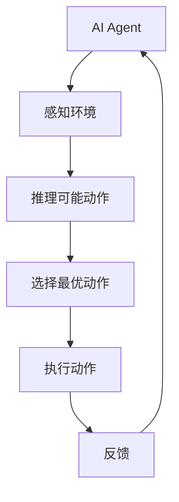
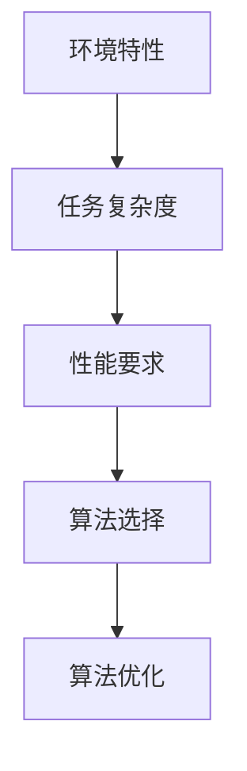

                 


# 构建AI Agent的动态任务规划与执行框架

---

## 关键词：
AI Agent、动态任务规划、任务执行框架、强化学习、多智能体协作、系统架构设计

---

## 摘要：
本文详细探讨了构建AI Agent的动态任务规划与执行框架的核心原理和实现方法。从AI Agent的基本概念出发，分析了动态任务规划的背景、挑战与解决方案，重点介绍了基于模型和无模型的规划算法，以及任务执行中的动态调整策略。通过系统架构设计、项目实战和案例分析，深入讲解了如何实现高效、可靠的动态任务规划与执行框架。本文适合AI开发人员、研究人员以及对动态任务规划感兴趣的读者阅读。

---

# 第1章: AI Agent与动态任务规划概述

## 1.1 AI Agent的基本概念
### 1.1.1 AI Agent的定义与分类
AI Agent（人工智能代理）是指能够感知环境、自主决策并执行任务的智能体。根据功能和应用场景，AI Agent可以分为以下几类：
- **简单反射型Agent**：基于当前感知直接执行预定义动作。
- **基于模型的反射型Agent**：利用内部状态和环境模型进行决策。
- **目标驱动型Agent**：根据目标生成动作序列。
- **效用驱动型Agent**：通过最大化效用函数来优化决策。

### 1.1.2 动态任务规划的定义与特点
动态任务规划是指在动态、不确定的环境中，AI Agent根据实时信息调整任务优先级和执行顺序的过程。其特点包括：
- **动态性**：环境状态和任务目标可能随时变化。
- **不确定性**：任务执行过程中可能遇到不可预知的障碍。
- **实时性**：需要快速响应环境变化并及时调整规划。

### 1.1.3 动态任务规划的应用场景
动态任务规划广泛应用于以下领域：
- **机器人控制**：如工业机器人、服务机器人。
- **自动驾驶**：车辆在复杂交通环境中的路径规划与决策。
- **智能助手**：如虚拟助手、智能客服。
- **游戏AI**：在游戏中实时调整策略以应对对手行为。

---

## 1.2 任务规划与执行的基本原理
### 1.2.1 任务建模与分解
任务建模是动态任务规划的基础，需要将任务目标分解为多个子任务，并明确每个子任务之间的依赖关系。例如，完成“送快递”的任务可以分解为“取件”、“运输”、“送达”三个子任务。

### 1.2.2 状态空间与动作空间的构建
状态空间是所有可能环境状态的集合，动作空间是AI Agent在每个状态下可以执行的动作的集合。例如，在迷宫中移动的AI Agent，状态空间可以表示为迷宫中的每个格子，动作空间可以包括“上”、“下”、“左”、“右”四个动作。

### 1.2.3 动态任务规划的核心要素
动态任务规划的核心要素包括：
- **感知能力**：通过传感器或API获取环境信息。
- **推理能力**：基于当前状态和任务目标生成可能的行动方案。
- **决策能力**：选择最优或近似最优的行动方案。
- **执行能力**：将决策结果转化为具体动作执行。

---

## 1.3 动态任务规划的挑战与解决方案
### 1.3.1 动态环境中的不确定性
动态环境中的不确定性主要来源于以下两个方面：
1. **环境变化**：如天气变化、交通拥堵等。
2. **任务目标变化**：如任务优先级调整、目标位置变化等。

### 1.3.2 多目标优化问题
在动态任务规划中，通常需要在多个目标之间进行权衡。例如，在路径规划中，可能需要在“最短路径”和“避开障碍物”之间进行权衡。

### 1.3.3 实时性与效率的平衡
动态任务规划需要在实时性与效率之间找到平衡点。实时性要求在短时间内做出决策，而效率则要求决策的准确性。

---

## 1.4 本章小结
### 1.4.1 核心概念总结
- AI Agent是动态任务规划的核心主体。
- 动态任务规划需要在不确定性和实时性中找到平衡。
- 任务建模与分解是动态任务规划的基础。

### 1.4.2 下文学习提示
接下来，我们将深入探讨动态任务规划的算法基础，包括基于模型和无模型的规划算法，以及如何在实际场景中应用这些算法。

---

## 图表：AI Agent任务规划的核心要素



---

# 第2章: 动态任务规划的算法基础

## 2.1 基于模型的规划算法
### 2.1.1 A*算法
A*算法是一种经典的路径规划算法，常用于静态环境中的最短路径问题。其基本原理如下：

1. **初始化**：设定起点和目标点。
2. **生成候选节点**：从当前节点扩展出相邻节点。
3. **计算优先级**：使用启发式函数评估候选节点的优先级。
4. **选择最优节点**：从优先队列中选择优先级最高的节点进行扩展。
5. **终止条件**：当目标节点被访问时，算法终止。

A*算法的实现代码如下：

```python
import heapq

def a_star_search(start, goal, grid):
    open_set = {start}
    came_from = {}
    g_score = {start: 0}
    f_score = {start: heuristic(start, goal)}
    
    while open_set:
        current = heapq.heappop(open_set)
        
        if current == goal:
            return reconstruct_path(came_from, start, goal)
            
        for neighbor in grid[current]:
            tentative_g_score = g_score[current] + cost(current, neighbor)
            if neighbor not in g_score or tentative_g_score < g_score[neighbor]:
                came_from[neighbor] = current
                g_score[neighbor] = tentative_g_score
                f_score[neighbor] = g_score[neighbor] + heuristic(neighbor, goal)
                heapq.heappush(open_set, (f_score[neighbor], neighbor))
    
    return None

def heuristic(a, b):
    return abs(a.x - b.x) + abs(a.y - b.y)
```

### 2.1.2 Dijkstra算法
Dijkstra算法是一种用于寻找单源最短路径的算法，适用于静态图中的最短路径问题。其基本步骤如下：

1. **初始化**：将起点的优先级设为0，其余节点的优先级设为无穷大。
2. **优先队列选择**：从优先队列中选择优先级最低的节点。
3. **更新相邻节点**：计算当前节点到相邻节点的最短路径，并更新优先队列。
4. **重复步骤2和3**，直到所有节点都被访问过。

Dijkstra算法的实现代码如下：

```python
import heapq

def dijkstra_algorithm(start, end, graph):
    distances = {node: float('infinity') for node in graph}
    distances[start] = 0
    visited = set()
    priority_queue = [(0, start)]
    
    while priority_queue:
        current_dist, current_node = heapq.heappop(priority_queue)
        
        if current_node in visited:
            continue
        visited.add(current_node)
        
        if current_node == end:
            return current_dist
        
        for neighbor, weight in graph[current_node].items():
            if distances[neighbor] > current_dist + weight:
                distances[neighbor] = current_dist + weight
                heapq.heappush(priority_queue, (distances[neighbor], neighbor))
    
    return distances[end]

# 示例图结构
graph = {
    'A': {'B': 1, 'C': 3},
    'B': {'A': 1, 'C': 2, 'D': 4},
    'C': {'A': 3, 'B': 2, 'D': 1},
    'D': {'B': 4, 'C': 1}
}
print(dijkstra_algorithm('A', 'D', graph))  # 输出：3
```

### 2.1.3 状态空间搜索的优化方法
为了提高状态空间搜索的效率，可以采用以下优化方法：
- **剪枝**：通过评估节点的优先级，跳过不可能的路径。
- **记忆化**：记录已经访问过的节点，避免重复计算。
- **启发式搜索**：利用启发式函数优先扩展更有希望的节点。

---

## 2.2 基于无模型的规划算法
### 2.2.1 强化学习在任务规划中的应用
强化学习是一种通过试错机制来优化决策的算法。在动态任务规划中，可以通过强化学习训练AI Agent在复杂环境中的决策能力。

### 2.2.2 DQN算法
DQN（Deep Q-Network）是一种基于强化学习的算法，通过深度神经网络近似Q值函数。其核心公式为：

$$ Q(s, a) = r + \gamma \max Q(s', a') $$

其中，\( s \) 是当前状态，\( a \) 是执行的动作，\( s' \) 是下一个状态，\( r \) 是奖励，\( \gamma \) 是折扣因子。

### 2.2.3 PPO算法
PPO（Proximal Policy Optimization）是一种改进的策略梯度算法，通过限制策略更新的幅度来确保稳定性。其核心公式为：

$$ \text{loss} = -\frac{1}{T}\sum_{t=1}^{T} \min\left( Q(s_t, a_t), \text{clip}(Q(s_t, a_t), Q(s_t, a'_t) - \epsilon, Q(s_t, a'_t) + \epsilon) \right) $$

---

## 2.3 混合模型的规划算法
### 2.3.1 混合模型的优势
混合模型结合了基于模型和无模型算法的优点，能够在复杂环境中实现更高效的规划。

### 2.3.2 混合模型的具体实现
混合模型通常包括以下步骤：
1. **环境建模**：构建环境的动态模型。
2. **基于模型的规划**：利用模型生成初步的规划方案。
3. **强化学习优化**：通过强化学习进一步优化规划方案。

### 2.3.3 混合模型的优缺点分析
- **优点**：结合了基于模型算法的高效性和无模型算法的灵活性。
- **缺点**：实现复杂，需要同时处理模型和数据驱动的任务。

---

## 2.4 算法选择与优化策略
### 2.4.1 算法选择的依据
- **环境特性**：静态环境适合基于模型算法，动态环境适合无模型算法。
- **任务复杂度**：复杂任务适合混合模型算法。
- **性能要求**：实时性要求高时选择基于模型算法。

### 2.4.2 算法优化的常见方法
- **剪枝优化**：减少不必要的计算。
- **并行计算**：利用多线程或分布式计算提高效率。
- **经验复用**：利用已有的经验加速学习过程。

### 2.4.3 算法性能评估指标
- **规划时间**：单位时间内完成的规划次数。
- **规划成功率**：规划方案的正确性。
- **执行效率**：任务执行的平均时间。

---

## 2.5 本章小结
### 2.5.1 算法总结
- 基于模型算法适合静态环境，无模型算法适合动态环境。
- 混合模型算法能够结合两者的优点，适合复杂任务。

### 2.5.2 下文学习提示
接下来，我们将探讨任务执行与动态调整的具体策略，包括任务执行的监控、动态调整的策略以及异常处理的方法。

---

## 图表：动态任务规划的算法选择流程



---

# 作者：AI天才研究院 & 禅与计算机程序设计艺术

