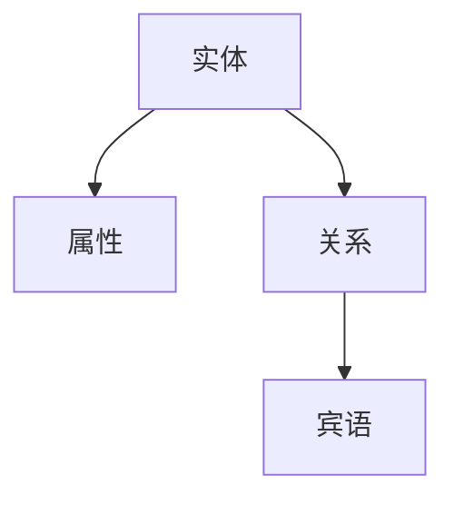
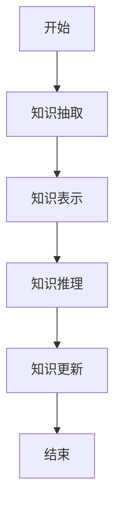
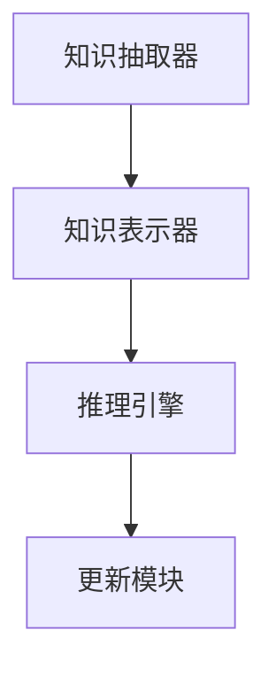
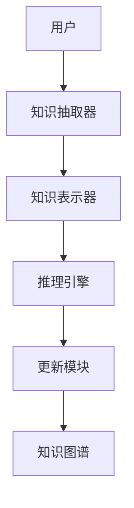

                 


# 《构建AI Agent的动态知识图谱更新系统》

---

## 关键词：
AI Agent, 动态知识图谱, 知识图谱更新, 实时推理, 系统架构

---

## 摘要：
本文详细探讨了AI Agent的动态知识图谱更新系统的构建方法。从背景与概述出发，分析了动态知识图谱的核心概念与原理，深入讲解了增量式更新、全量式更新和混合式更新等方法。通过数学模型和算法流程图，阐述了知识抽取、表示、推理和更新的具体实现步骤。结合系统架构设计与项目实战，提供了完整的代码实现和案例分析。最后，总结了动态知识图谱更新的最佳实践与未来发展方向。

---

# 第一部分: AI Agent与动态知识图谱概述

---

# 第1章: AI Agent与动态知识图谱的背景与概述

## 1.1 AI Agent的基本概念
### 1.1.1 AI Agent的定义与特点
AI Agent（智能体）是指在计算机系统中能够感知环境、自主决策并执行任务的实体。其特点包括：
- **自主性**：能够在没有外部干预的情况下独立运行。
- **反应性**：能够实时感知环境并做出响应。
- **目标导向**：具有明确的目标和任务驱动。
- **学习能力**：能够通过数据和经验不断优化自身性能。

### 1.1.2 AI Agent的核心功能与应用场景
AI Agent的核心功能包括：
- **感知环境**：通过传感器、API等方式获取环境信息。
- **推理与决策**：基于获取的信息进行分析、推理和决策。
- **执行任务**：根据决策结果执行具体操作。

AI Agent的应用场景广泛，包括智能助手、推荐系统、自动驾驶、智能客服等。

### 1.1.3 动态知识图谱的概念与特点
动态知识图谱是一种能够实时更新和维护的知识表示结构，其特点包括：
- **动态性**：能够实时更新和反映最新知识。
- **可扩展性**：能够支持大规模数据的存储和处理。
- **语义丰富性**：通过实体间的关系和属性，提供丰富的语义信息。

---

## 1.2 动态知识图谱的背景与重要性
### 1.2.1 知识图谱的定义与发展
知识图谱是一种以图结构形式表示知识的数据库，其节点表示实体或概念，边表示实体之间的关系。知识图谱的发展经历了从静态知识库到动态知识图谱的演变。

### 1.2.2 动态知识图谱的提出背景
随着AI Agent的广泛应用，知识图谱需要能够实时更新以适应快速变化的环境。动态知识图谱的提出是为了满足这一需求。

### 1.2.3 动态知识图谱在AI Agent中的作用
动态知识图谱在AI Agent中的作用主要体现在：
- **实时更新**：确保AI Agent能够基于最新知识做出决策。
- **语义推理**：支持复杂的语义推理任务。
- **知识融合**：整合多源异构数据，提供统一的知识表示。

---

## 1.3 问题背景与目标
### 1.3.1 知识图谱更新的挑战
知识图谱更新面临以下挑战：
- **数据异构性**：多源数据格式和语义差异。
- **实时性要求**：需要快速响应更新请求。
- **数据冲突**：不同数据源可能提供矛盾的信息。

### 1.3.2 动态知识图谱更新的目标
动态知识图谱更新的目标包括：
- **高效性**：快速处理更新请求。
- **准确性**：确保更新后知识的准确性。
- **一致性**：保持知识图谱的一致性。

### 1.3.3 系统边界与外延
动态知识图谱更新系统的边界包括：
- **输入**：更新请求、数据源。
- **输出**：更新后的知识图谱。
- **外部依赖**：数据源、存储系统、推理引擎。

---

## 1.4 核心概念与联系
### 1.4.1 核心概念原理
动态知识图谱更新的核心概念包括：
- **知识抽取**：从数据源中提取实体和关系。
- **知识表示**：将实体和关系表示为图结构。
- **知识推理**：基于现有知识推导新的知识。

### 1.4.2 核心概念属性特征对比表
以下是核心概念的对比表：

| **概念** | **属性** | **描述** |
|----------|----------|----------|
| 实体      | 名称      | 实体的名称，如“苹果”。 |
| 属性      | 类型      | 实体的属性类型，如“颜色”。 |
| 关系      | 主体     | 关系的主体，如“苹果”。 |
|          | 宾语     | 关系的宾语，如“红色”。 |

### 1.4.3 ER实体关系图架构
以下是实体关系图架构的Mermaid图：



---

## 1.5 本章小结
本章从AI Agent和动态知识图谱的基本概念出发，分析了动态知识图谱的背景、挑战和目标，明确了核心概念与联系。下一章将深入探讨动态知识图谱更新的原理与方法。

---

# 第2章: 动态知识图谱更新的原理与方法

## 2.1 动态知识图谱更新的核心原理
### 2.1.1 知识抽取与表示
知识抽取是将文本数据中的实体、关系和属性提取出来，并表示为图结构。常用的知识抽取方法包括：
- **基于规则的方法**：通过预定义规则提取知识。
- **基于模式的方法**：通过预定义模板匹配文本。
- **基于深度学习的方法**：使用神经网络模型提取知识。

### 2.1.2 知识融合与推理
知识融合是将多源数据中的知识进行整合，消除冲突。常用的知识融合方法包括：
- **规则驱动的方法**：通过预定义规则消除冲突。
- **概率推理的方法**：基于概率模型进行推理。
- **图嵌入的方法**：通过图嵌入模型表示知识。

### 2.1.3 动态更新机制
动态更新机制是确保知识图谱能够实时更新的关键。常用的方法包括：
- **增量式更新**：仅更新变化的部分。
- **全量式更新**：重新构建整个知识图谱。
- **混合式更新**：结合增量和全量的方法。

---

## 2.2 知识图谱更新的主要方法
### 2.2.1 增量式更新
增量式更新仅处理变化的部分，适用于更新频率高且数据量大的场景。

### 2.2.2 全量式更新
全量式更新适用于数据量小且更新频率低的场景，能够保证知识图谱的准确性。

### 2.2.3 混合式更新
混合式更新结合了增量和全量的优点，适用于复杂场景。

---

## 2.3 动态知识图谱更新的实现步骤
### 2.3.1 知识抽取与预处理
知识抽取是动态知识图谱更新的第一步，需要从数据源中提取实体、关系和属性。

### 2.3.2 更新规则的制定
更新规则是指导知识图谱更新的规则，需要根据具体场景制定。

### 2.3.3 知识推理与验证
知识推理是基于现有知识推导新的知识，并通过验证确保推理的准确性。

---

## 2.4 本章小结
本章详细介绍了动态知识图谱更新的核心原理和主要方法，明确了实现步骤。下一章将深入探讨动态知识图谱更新的算法原理。

---

# 第3章: 动态知识图谱更新的算法原理

## 3.1 算法原理概述
动态知识图谱更新的算法原理包括知识抽取、表示、推理和更新。

---

## 3.2 知识抽取算法
### 3.2.1 基于规则的抽取算法
基于规则的抽取算法通过预定义规则提取实体和关系。

### 3.2.2 基于深度学习的抽取算法
基于深度学习的抽取算法使用神经网络模型提取实体和关系。

---

## 3.3 知识表示与推理算法
### 3.3.1 知识表示算法
知识表示算法包括图嵌入、符号表示等方法。

### 3.3.2 知识推理算法
知识推理算法包括规则推理、概率推理和深度学习推理。

---

## 3.4 动态更新算法
动态更新算法包括增量式更新和全量式更新。

---

## 3.5 算法流程图
以下是算法流程图的Mermaid图：



---

## 3.6 数学模型与公式
### 3.6.1 表示学习模型
表示学习模型的公式如下：

$$
f(x) = \text{softmax}(xW)
$$

### 3.6.2 推理模型
推理模型的公式如下：

$$
p(y|x) = \text{sigmoid}(y|x)
$$

---

## 3.7 本章小结
本章详细介绍了动态知识图谱更新的算法原理，包括知识抽取、表示、推理和更新的步骤。下一章将探讨系统架构设计。

---

# 第4章: 系统分析与架构设计

## 4.1 系统架构设计
### 4.1.1 分层设计
系统架构分为数据层、计算层和应用层。

### 4.1.2 组件设计
系统组件包括知识抽取器、知识表示器、推理引擎和更新模块。

---

## 4.2 系统架构图
以下是系统架构图的Mermaid图：



---

## 4.3 系统接口设计
系统接口包括：
- **输入接口**：接收更新请求和数据源。
- **输出接口**：输出更新后的知识图谱。

---

## 4.4 系统交互流程
以下是系统交互流程的Mermaid图：



---

## 4.5 本章小结
本章详细介绍了动态知识图谱更新系统的架构设计与接口设计。下一章将通过项目实战进一步验证系统设计。

---

# 第5章: 项目实战

## 5.1 环境安装
项目实战需要以下环境：
- Python 3.8+
- TensorFlow 2.0+
- PyTorch 1.0+

---

## 5.2 核心代码实现
以下是核心代码实现：

```python
import numpy as np

class KnowledgeGraph:
    def __init__(self):
        self.nodes = {}
        self.relationships = {}

    def add_node(self, node_id, properties):
        self.nodes[node_id] = properties

    def add_relationship(self, source, target, relationship_type):
        self.relationships[(source, target)] = relationship_type

    def update(self, node_id, new_properties):
        self.nodes[node_id] = new_properties

# 示例用法
kg = KnowledgeGraph()
kg.add_node("apple", {"color": "red"})
kg.add_relationship("apple", "fruit", "is_a")
print(kg.nodes)
```

---

## 5.3 案例分析
以下是案例分析：

```python
import numpy as np

def update_knowledge_base():
    # 初始化知识图谱
    kg = KnowledgeGraph()
    kg.add_node("apple", {"color": "red"})
    kg.add_relationship("apple", "fruit", "is_a")

    # 更新知识图谱
    kg.update("apple", {"color": "green"})

    # 查询知识图谱
    print(kg.nodes)
    print(kg.relationships)

update_knowledge_base()
```

---

## 5.4 本章小结
本章通过项目实战展示了动态知识图谱更新系统的实现过程，验证了系统设计的可行性。

---

# 第6章: 最佳实践

## 6.1 小结
动态知识图谱更新系统在AI Agent中的应用前景广阔。

## 6.2 注意事项
- 确保知识图谱的实时性和准确性。
- 处理数据冲突和异构性问题。

## 6.3 拓展阅读
建议进一步研究动态知识图谱的分布式实现和高效推理算法。

---

# 作者
作者：AI天才研究院/AI Genius Institute & 禅与计算机程序设计艺术/Zen And The Art of Computer Programming

---

希望这个目录大纲能够满足您的需求。如果需要进一步补充或修改，请随时告知！

