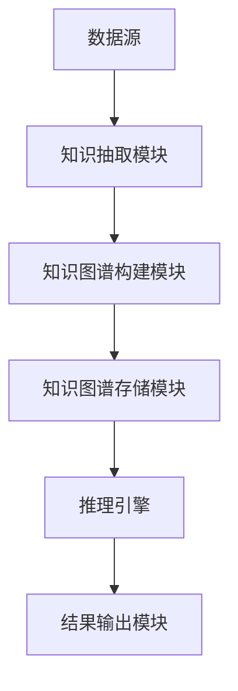

                 


# 构建AI Agent的动态知识图谱：实时更新与推理

> 关键词：知识图谱、AI Agent、动态知识图谱、实时更新、推理算法、系统架构、项目实战

> 摘要：本文详细探讨了AI Agent的动态知识图谱构建与实时更新的技术细节。从动态知识图谱的核心概念、构建算法、系统架构到项目实战，系统性地阐述了如何实现动态知识图谱的实时更新与推理。文章结合理论与实践，通过具体案例分析，深入解读了动态知识图谱在AI Agent中的应用，帮助读者全面掌握动态知识图谱的技术要点。

---

## 第一部分: 动态知识图谱与AI Agent概述

### 第1章: 动态知识图谱与AI Agent的背景介绍

#### 1.1 知识图谱的基本概念
##### 1.1.1 知识图谱的定义与特点
知识图谱是一种以图结构表示实体及其关系的语义网络，广泛应用于搜索引擎、自然语言处理和推荐系统等领域。动态知识图谱在传统知识图谱的基础上，加入了实时更新和动态推理的能力。

##### 1.1.2 动态知识图谱的定义与特点
动态知识图谱是一种能够实时感知数据变化、自动更新知识表示并支持动态推理的知识图谱。其特点包括实时性、动态性、自适应性和可扩展性。

##### 1.1.3 知识图谱与动态知识图谱的对比
| 特性 | 静态知识图谱 | 动态知识图谱 |
|------|--------------|--------------|
| 数据 | 静态、固定 | 动态、实时更新 |
| 更新 | 批量、周期性 | 实时、持续性 |
| 推理 | 静态、离线 | 动态、在线 |

#### 1.2 AI Agent的基本概念
##### 1.2.1 AI Agent的定义与特点
AI Agent（人工智能代理）是指能够感知环境、自主决策并执行任务的智能体。其特点包括自主性、反应性、目标导向性和社交能力。

##### 1.2.2 AI Agent的分类与应用场景
- 分类：基于智能水平可分为反应式Agent和认知式Agent。
- 应用场景：智能客服、自动驾驶、智能推荐系统等。

#### 1.3 动态知识图谱在AI Agent中的应用
##### 1.3.1 动态知识图谱的实时更新需求
AI Agent需要实时感知环境变化，动态知识图谱能够提供实时更新的知识支持。

##### 1.3.2 动态知识图谱的推理能力提升
通过动态知识图谱的推理能力，AI Agent可以实现实时决策和自适应行为。

##### 1.3.3 动态知识图谱在AI Agent中的核心作用
动态知识图谱为AI Agent提供了动态、实时的知识支持，使其能够更好地适应复杂环境。

---

### 第2章: 动态知识图谱的核心概念与联系

#### 2.1 动态知识图谱的核心概念
##### 2.1.1 实体与关系的动态变化
动态知识图谱中的实体和关系可以随时发生变化，例如新增实体、修改关系权重等。

##### 2.1.2 知识图谱的更新机制
动态知识图谱的更新机制包括主动更新和被动更新两种方式。

##### 2.1.3 动态知识图谱的推理模型
动态知识图谱的推理模型需要支持实时推理和动态推理。

#### 2.2 动态知识图谱的属性特征对比表
| 属性 | 静态知识图谱 | 动态知识图谱 |
|------|--------------|--------------|
| 时间性 | 静态 | 动态、实时 |
| 可更新性 | 低 | 高 |
| 实时性 | 无 | 有 |

#### 2.3 动态知识图谱的ER实体关系图
```mermaid
er
    entity 实体 {
        id: string
        name: string
        type: string
    }
    relation 关系 {
        id: string
        name: string
        startEntity: 实体
        endEntity: 实体
    }
    实体 --> 关系
```

---

### 第3章: 动态知识图谱的构建与更新算法

#### 3.1 动态知识图谱的构建算法
##### 3.1.1 基于图嵌入的构建算法
动态知识图谱的构建可以基于图嵌入技术，通过节点嵌入表示实体之间的关系。

##### 3.1.2 增量式知识图谱构建算法
增量式构建算法在已有知识图谱的基础上，逐步添加新的实体和关系。

#### 3.2 动态知识图谱的更新算法
##### 3.2.1 增量式更新算法
动态知识图谱的更新可以通过增量式算法，仅更新发生变化的部分。

##### 3.2.2 基于时间戳的更新算法
通过时间戳记录数据变化，动态知识图谱可以根据时间戳进行版本控制和更新。

---

## 第二部分: 动态知识图谱的推理与应用

### 第4章: 动态知识图谱的推理算法

#### 4.1 动态知识图谱的推理模型
##### 4.1.1 基于规则的推理
通过预定义的规则进行推理，适用于知识图谱中的简单逻辑推理。

##### 4.1.2 基于学习的推理
通过机器学习模型（如图神经网络）进行推理，适用于复杂的动态知识图谱。

#### 4.2 动态知识图谱的推理流程
##### 4.2.1 实时推理流程
动态知识图谱支持实时推理，能够快速响应环境变化。

##### 4.2.2 动态推理流程
动态知识图谱的推理过程需要考虑实体和关系的动态变化。

---

### 第5章: 动态知识图谱的系统架构

#### 5.1 系统架构设计
##### 5.1.1 系统功能设计
动态知识图谱系统需要具备数据采集、知识构建、实时更新和推理功能。

##### 5.1.2 系统架构图


---

### 第6章: 动态知识图谱的项目实战

#### 6.1 项目背景与需求分析
##### 6.1.1 项目背景
构建一个支持实时更新的动态知识图谱，应用于智能客服场景。

##### 6.1.2 项目需求
- 实时更新知识图谱
- 支持动态推理
- 提供API接口

#### 6.2 项目实现步骤
##### 6.2.1 环境安装
安装必要的Python库，如PyTorch、Neo4j等。

##### 6.2.2 数据处理
对原始数据进行清洗、抽取和转换。

##### 6.2.3 知识图谱构建
使用图嵌入算法构建初始知识图谱。

##### 6.2.4 实时更新模块
开发增量式更新算法，支持实时数据的插入和修改。

##### 6.2.5 推理引擎实现
基于动态知识图谱实现实时推理功能。

#### 6.3 项目代码示例
```python
import neo4j
from neo4j.exceptions import Neo4jError

# 连接到Neo4j数据库
driver = neo4j.Driver('bolt://localhost:7687', auth=('neo4j', 'password'))

# 增量式更新函数
def update_kg(tx, entity, relation, target):
    # 更新实体关系
    tx.run("MATCH (a {id: $entity}) "
            "MATCH (b {id: $target}) "
            "MERGE (a)-[r:$relation]->(b)",
            entity=entity, relation=relation, target=target)
```

---

## 第三部分: 总结与展望

### 第7章: 总结与展望

#### 7.1 知识图谱构建的关键技术总结
动态知识图谱的构建需要结合增量式算法和实时更新机制。

#### 7.2 动态知识图谱推理的未来趋势
未来，动态知识图谱的推理将更加依赖于深度学习和图神经网络技术。

#### 7.3 动态知识图谱的应用前景
动态知识图谱在智能客服、金融风险控制、医疗诊断等领域有广泛的应用前景。

---

## 附录

### 附录A: 工具与库
- 图数据库：Neo4j、RDF4J
- 图嵌入算法库：Node2Vec、GraphSAGE
- 推理框架：TensorFlow、PyTorch

### 附录B: 接口与API
- 数据接口：RESTful API
- 推理接口：GraphQL

---

作者：AI天才研究院/AI Genius Institute & 禅与计算机程序设计艺术 /Zen And The Art of Computer Programming

