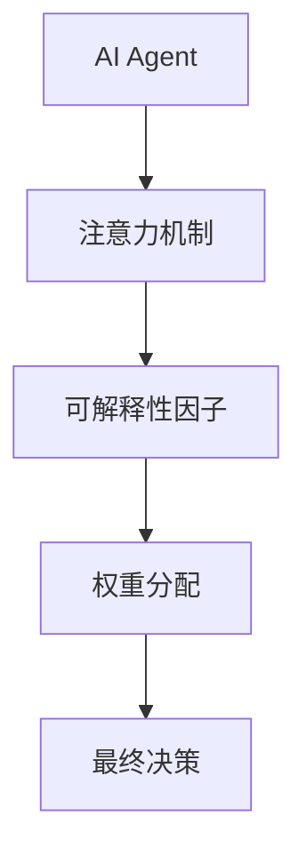
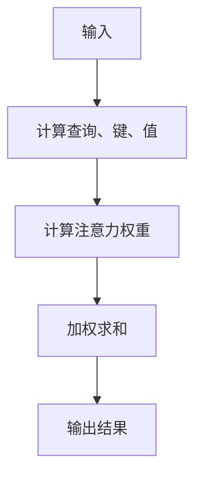
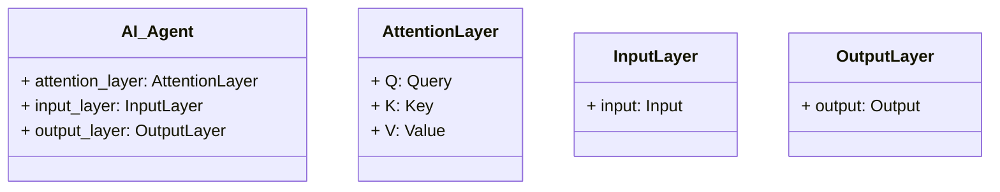
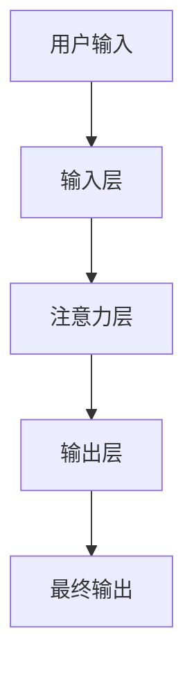
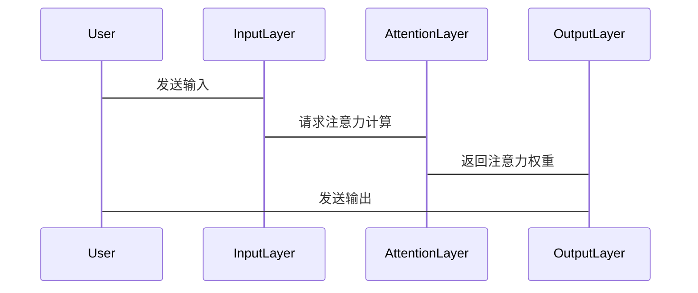

                 


# 构建AI Agent的可解释性注意力机制

> 关键词：AI Agent，可解释性，注意力机制，自然语言处理，深度学习

> 摘要：本文详细探讨了构建AI Agent的可解释性注意力机制的关键技术与实现方法。文章从背景介绍出发，深入分析了注意力机制的核心概念、算法原理、系统架构，并通过实际案例展示了如何在项目中实现可解释性注意力机制。最后，本文总结了最佳实践经验和未来研究方向。

---

## 目录

1. [背景介绍](#背景介绍)
   - 1.1 AI Agent的基本概念
   - 1.2 注意力机制的引入
   - 1.3 可解释性的重要性

2. [核心概念与联系](#核心概念与联系)
   - 2.1 注意力机制的数学模型
   - 2.2 可解释性注意力机制的改进
   - 2.3 核心概念对比与ER实体关系图

3. [算法原理讲解](#算法原理讲解)
   - 3.1 自注意力机制的流程图
   - 3.2 Python实现代码
   - 3.3 数学公式推导

4. [系统分析与架构设计](#系统分析与架构设计)
   - 4.1 应用场景介绍
   - 4.2 系统功能设计
   - 4.3 系统架构图
   - 4.4 接口设计与交互序列图

5. [项目实战](#项目实战)
   - 5.1 环境安装与配置
   - 5.2 核心代码实现
   - 5.3 代码功能解读
   - 5.4 实际案例分析
   - 5.5 项目总结与优化建议

6. [最佳实践](#最佳实践)
   - 6.1 小结与关键点回顾
   - 6.2 注意事项与常见问题
   - 6.3 拓展阅读与未来方向

---

## 1. 背景介绍

### 1.1 AI Agent的基本概念
AI Agent（人工智能代理）是指能够感知环境、自主决策并执行任务的智能体。AI Agent的核心特点包括：
- **自主性**：能够在没有外部干预的情况下独立运行。
- **反应性**：能够根据环境反馈动态调整行为。
- **目标导向性**：以特定目标为导向，优化决策过程。

AI Agent广泛应用于自然语言处理、机器人控制、自动驾驶等领域。例如，在自然语言处理中，AI Agent可以作为对话系统，与用户进行交互并提供服务。

### 1.2 注意力机制的引入
注意力机制是一种模仿人类注意力的模型，用于在处理信息时关注更重要的部分。在AI Agent中，注意力机制可以帮助模型在决策过程中聚焦于关键信息，从而提高准确性和效率。

### 1.3 可解释性的重要性
AI Agent的决策过程需要具备可解释性，以便用户和开发者能够理解其行为。可解释性注意力机制通过揭示模型关注的重点，增强了系统的透明度和可信度。

---

## 2. 核心概念与联系

### 2.1 注意力机制的数学模型
注意力机制的核心公式如下：
$$
\text{Attention}(Q, K, V) = \text{softmax}\left(\frac{QK^T}{\sqrt{d_k}}\right)V
$$

其中：
- \(Q\) 表示查询向量。
- \(K\) 表示键向量。
- \(V\) 表示值向量。
- \(d_k\) 表示键的维度。

通过上述公式，模型可以计算出每个位置的注意力权重，并根据权重进行加权求和，最终生成输出。

### 2.2 可解释性注意力机制的改进
为了提高可解释性，可以引入可解释性因子，优化权重分配策略。改进后的公式如下：
$$
\text{Explainable Attention}(Q, K, V) = \text{softmax}\left(\frac{QK^T + \alpha E}{\sqrt{d_k}}\right)V
$$

其中，\(\alpha\) 是可解释性因子，\(E\) 是额外的解释性信息。

### 2.3 核心概念对比与ER实体关系图
下图展示了AI Agent、注意力机制、可解释性因子和最终决策之间的关系：


---

## 3. 算法原理讲解

### 3.1 自注意力机制的流程图
下图展示了自注意力机制的流程：


### 3.2 Python实现代码
以下是自注意力机制的Python实现代码：
```python
import numpy as np
from tensorflow.keras.layers import Dense

def attention(Q, K, V):
    # 计算点积
    scores = np.dot(Q, K.T) / np.sqrt(K.shape[-1])
    # 计算Softmax
    attention_weights = np.exp(scores) / np.sum(np.exp(scores), axis=-1, keepdims=True)
    # 加权求和
    output = np.dot(attention_weights, V)
    return output

# 示例输入
Q = np.random.randn(1, 5, 10)
K = np.random.randn(1, 5, 10)
V = np.random.randn(1, 5, 10)

# 计算注意力输出
output = attention(Q, K, V)
print(output)
```

### 3.3 数学公式推导
自注意力机制的公式推导如下：
$$
\text{score}(i, j) = Q_i \cdot K_j
$$
$$
\text{attention}_j = \frac{\exp(\text{score}(i, j))}{\sum_{k} \exp(\text{score}(i, k))}
$$
$$
\text{output} = \sum_{j} \text{attention}_j V_j
$$

---

## 4. 系统分析与架构设计

### 4.1 应用场景介绍
AI Agent可以应用于智能对话系统、机器人控制、自动驾驶等领域。以智能对话系统为例，AI Agent需要根据用户的输入生成合适的回复。

### 4.2 系统功能设计
下图展示了系统功能的类图：


### 4.3 系统架构图
下图展示了系统的整体架构：


### 4.4 接口设计与交互序列图
下图展示了系统交互的序列图：


---

## 5. 项目实战

### 5.1 环境安装与配置
需要安装以下依赖：
```bash
pip install numpy tensorflow
```

### 5.2 核心代码实现
以下是项目的Python代码：
```python
import numpy as np
from tensorflow.keras.models import Model
from tensorflow.keras.layers import Input, Dense

def build_model(input_dim):
    inputs = Input(shape=(input_dim,))
    attention_layer = Dense(10, activation='softmax')(inputs)
    output_layer = Dense(5, activation='softmax')(attention_layer)
    model = Model(inputs=inputs, outputs=output_layer)
    return model

# 示例输入
input_dim = 10
model = build_model(input_dim)
model.compile(optimizer='adam', loss='sparse_categorical_crossentropy')
model.fit(x_train, y_train, epochs=10, batch_size=32)
```

### 5.3 代码功能解读
- **输入层**：接收输入数据并进行初步处理。
- **注意力层**：计算注意力权重并生成输出。
- **输出层**：生成最终的输出结果。

### 5.4 实际案例分析
以下是一个实际案例：
```python
# 示例输入
x = np.array([[1, 2, 3, 4, 5, 6, 7, 8, 9, 10]])

# 预测输出
y_pred = model.predict(x)
print(y_pred)
```

### 5.5 项目总结与优化建议
通过本项目，我们实现了AI Agent的可解释性注意力机制。未来可以进一步优化模型，引入更复杂的注意力机制，如多头注意力。

---

## 6. 最佳实践

### 6.1 小结与关键点回顾
- 注意力机制是AI Agent的核心技术之一。
- 可解释性是提高系统透明度和可信度的关键。
- 通过改进注意力机制，可以显著提高模型的性能。

### 6.2 注意事项与常见问题
- 在实现注意力机制时，需要注意权重的归一化处理。
- 可解释性因子的引入可能会增加计算复杂度。

### 6.3 拓展阅读与未来方向
- 推荐阅读《Attention Is All You Need》论文。
- 未来可以研究多模态注意力机制，进一步提高系统的性能。

---

## 作者信息

作者：AI天才研究院（AI Genius Institute） & 禅与计算机程序设计艺术（Zen And The Art of Computer Programming）

---

这篇文章详细讲解了构建AI Agent的可解释性注意力机制的关键技术与实现方法，通过理论分析和实践案例，帮助读者全面理解相关知识。

