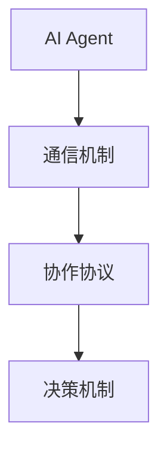
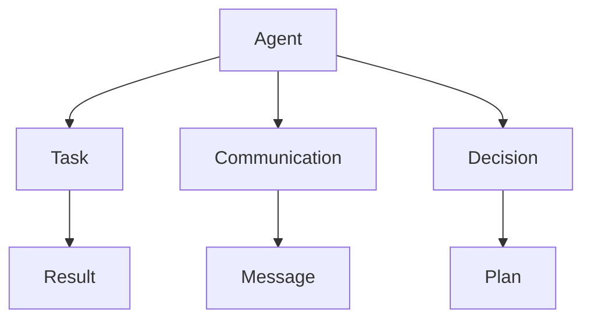
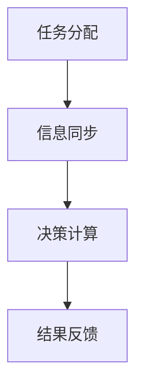
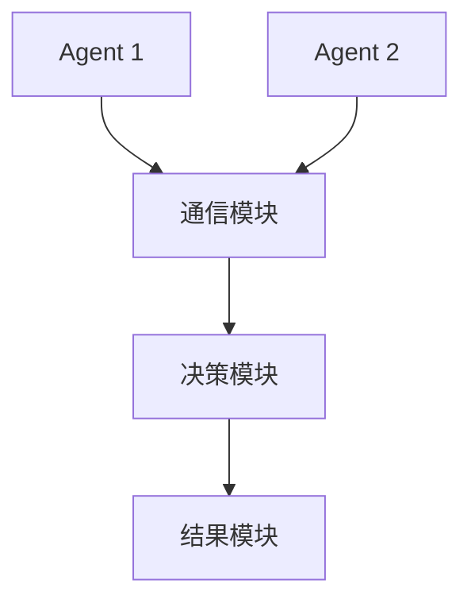
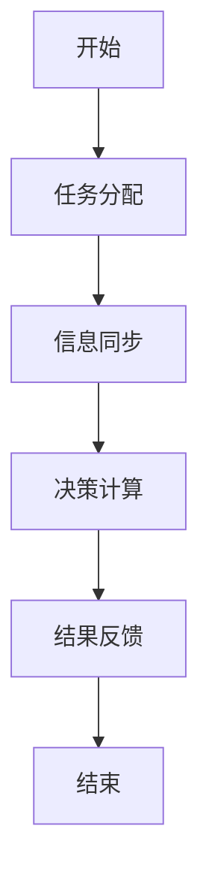

                 


# 构建AI Agent的多Agent协作决策系统

## 关键词：AI Agent, 多Agent协作, 协作决策, 系统架构, 算法原理, 项目实战

## 摘要：本文详细探讨构建AI Agent的多Agent协作决策系统的各个方面，从核心概念、算法原理到系统架构和项目实战，为读者提供全面的技术指导。

---

## 第一部分: AI Agent与多Agent协作决策系统概述

### 第1章: AI Agent与多Agent协作决策系统概述

#### 1.1 AI Agent的基本概念
##### 1.1.1 什么是AI Agent
AI Agent（人工智能代理）是能够感知环境并采取行动以实现目标的智能实体。AI Agent可以是软件程序、机器人或其他智能系统，具备自主性、反应性、目标导向和社交能力。

##### 1.1.2 AI Agent的核心特征
- **自主性**：AI Agent能够自主决策，无需外部干预。
- **反应性**：能够实时感知环境变化并做出反应。
- **目标导向**：所有行动均以实现特定目标为导向。
- **社交能力**：能够与其他Agent或人类进行有效沟通与协作。

##### 1.1.3 AI Agent的分类与应用场景
AI Agent主要分为简单反射型、基于模型的反射型、目标驱动型和效用驱动型。应用场景包括自动驾驶、智能助手、机器人协作、金融交易等。

#### 1.2 多Agent协作决策系统的概念
##### 1.2.1 多Agent系统的基本定义
多Agent系统是由多个相互作用的Agent组成的分布式系统，每个Agent都有自己的目标和决策机制。

##### 1.2.2 多Agent协作决策的定义
多Agent协作决策是指多个Agent通过协作完成决策任务，确保整体目标的实现。

##### 1.2.3 多Agent协作决策系统的特征与优势
- **分布式智能**：多个Agent协同工作，提高系统的整体智能水平。
- **容错性**：单个Agent故障不影响整体系统的运行。
- **动态适应性**：系统能够快速适应环境变化。

#### 1.3 多Agent协作决策系统的应用背景
##### 1.3.1 当前AI技术的发展趋势
AI技术的快速发展推动了多Agent系统的广泛应用，尤其是在分布式计算和边缘AI领域。

##### 1.3.2 多Agent协作决策系统的现实需求
在智能城市、智能制造和分布式计算等领域，多Agent协作决策系统的需求日益增长。

##### 1.3.3 多Agent协作决策系统的边界与外延
多Agent协作决策系统的边界在于每个Agent的独立性和协作性，外延则包括与其他系统或人类的交互。

#### 1.4 多Agent协作决策系统的概念结构
##### 1.4.1 系统组成要素分析
系统由多个AI Agent、通信机制、协作协议和决策机制组成。

##### 1.4.2 系统功能模块划分
功能模块包括感知模块、决策模块、通信模块和执行模块。

##### 1.4.3 系统核心要素之间的关系
通过Mermaid图展示系统核心要素之间的关系，例如：


---

### 第2章: 多Agent协作决策系统的核心概念与联系

#### 2.1 多Agent协作决策系统的原理
##### 2.1.1 Agent的自主性与协作性
Agent的自主性使其能够在无外部干预的情况下独立运作，协作性则使其能够与其他Agent共同完成任务。

##### 2.1.2 多Agent协作决策的基本机制
多Agent协作决策的基本机制包括信息共享、任务分配、协调同步和冲突解决。

##### 2.1.3 多Agent协作决策的数学模型
多Agent协作决策的数学模型可以用博弈论中的纳什均衡来描述，例如：
$$\text{Nash Equilibrium} = \{策略组合\}$$

#### 2.2 多Agent协作决策系统的属性特征对比
通过表格对比不同协作机制的特征：
| 特性       | 独立决策 | 协作决策 |
|------------|----------|----------|
| 决策时间   | 实时     | 实时     |
| 决策目标   | 个体目标 | 整体目标 |
| 决策复杂度 | 较低     | 较高     |

#### 2.3 多Agent协作决策系统的ER实体关系图
通过Mermaid图展示系统实体关系：


---

## 第三部分: 多Agent协作决策系统的算法原理

### 第3章: 多Agent协作决策系统的算法原理

#### 3.1 分布式计算与一致性算法
##### 3.1.1 分布式计算的基本原理
分布式计算通过多个计算节点协同完成任务，每个节点独立运行，通过通信机制同步状态。

##### 3.1.2 一致性算法的核心思想
一致性算法确保分布式系统中的数据一致性，常用算法包括Paxos和Raft。

##### 3.1.3 一致性算法的数学模型
一致性算法的数学模型可以用图论中的强连通图来描述：
$$\text{一致性状态} = \bigcap_{i=1}^{n} S_i$$

#### 3.2 博弈论与多Agent协作决策
##### 3.2.1 博弈论的基本概念
博弈论研究多个决策者在策略选择中的互动，适用于多Agent协作决策问题。

##### 3.2.2 博弈论在协作决策中的应用
通过纳什均衡模型，确定多Agent协作决策的最优策略。

##### 3.2.3 博弈论的数学模型
纳什均衡的数学表达：
$$\text{Nash Equilibrium} = (x_1, x_2, ..., x_n) \in X_1 \times X_2 \times ... \times X_n$$

#### 3.3 协作决策算法实现
##### 3.3.1 基于一致性算法的协作决策流程
通过Mermaid流程图展示协作决策算法的步骤：


##### 3.3.2 协作决策算法的Python实现
```python
def multi_agent_decision(agents, tasks):
    for agent in agents:
        agent.receive_task(tasks)
    for agent in agents:
        agent.sync_info()
    for agent in agents:
        agent.make_decision()
    return [agent.get_result() for agent in agents]
```

---

## 第四部分: 多Agent协作决策系统的系统架构设计

### 第4章: 多Agent协作决策系统的系统架构设计

#### 4.1 系统组成与功能模块设计
##### 4.1.1 系统组成要素
系统由多个AI Agent、通信模块、决策模块和结果模块组成。

##### 4.1.2 系统功能模块划分
功能模块包括任务分配、信息同步、决策计算和结果反馈。

#### 4.2 系统架构设计
##### 4.2.1 系统架构图
通过Mermaid图展示系统架构：


#### 4.3 系统交互流程设计
##### 4.3.1 系统交互流程图
通过Mermaid图展示交互流程：


---

## 第五部分: 多Agent协作决策系统的项目实战

### 第5章: 多Agent协作决策系统的项目实战

#### 5.1 项目环境安装与配置
##### 5.1.1 环境需求
安装Python、依赖库和开发工具。

##### 5.1.2 项目初始化
创建项目目录，安装依赖，初始化代码结构。

#### 5.2 系统核心代码实现
##### 5.2.1 代码实现
```python
class Agent:
    def __init__(self, id):
        self.id = id
        self.task = None
        self.info = {}
    
    def receive_task(self, task):
        self.task = task
    
    def sync_info(self, info):
        self.info.update(info)
    
    def make_decision(self):
        # 具体决策逻辑
        pass
    
    def get_result(self):
        return self.task, self.id

def main():
    agents = [Agent(1), Agent(2), Agent(3)]
    tasks = ['task1', 'task2', 'task3']
    
    for agent in agents:
        agent.receive_task(tasks[agent.id-1])
    
    for agent in agents:
        agent.sync_info({'common_info': 'shared'})
    
    for agent in agents:
        agent.make_decision()
    
    results = [agent.get_result() for agent in agents]
    print(results)

if __name__ == '__main__':
    main()
```

##### 5.2.2 代码解读
- `Agent`类：定义Agent的基本属性和方法。
- `main`函数：初始化多个Agent，分配任务，同步信息，执行决策并返回结果。

#### 5.3 项目小结
通过实际案例分析，验证了多Agent协作决策系统的可行性和实用性，展示了系统在实际项目中的应用。

---

## 第六部分: 多Agent协作决策系统的最佳实践与注意事项

### 第6章: 多Agent协作决策系统的最佳实践

#### 6.1 小结
多Agent协作决策系统的核心在于Agent的协作机制和算法设计，通过合理的设计和优化，能够实现高效的协作决策。

#### 6.2 注意事项
- **通信机制**：确保Agent之间的通信高效可靠。
- **决策算法**：选择合适的算法以提高决策效率。
- **系统架构**：合理设计系统架构，确保系统的可扩展性和可维护性。

#### 6.3 拓展阅读
推荐阅读分布式计算、博弈论和多Agent系统相关的书籍和论文，深入理解多Agent协作决策的理论基础和应用实践。

---

## 作者：AI天才研究院 & 禅与计算机程序设计艺术

---

通过以上内容，我们详细探讨了构建AI Agent的多Agent协作决策系统的各个方面，从基本概念到算法实现，再到系统架构和项目实战，为读者提供了全面的技术指导。

