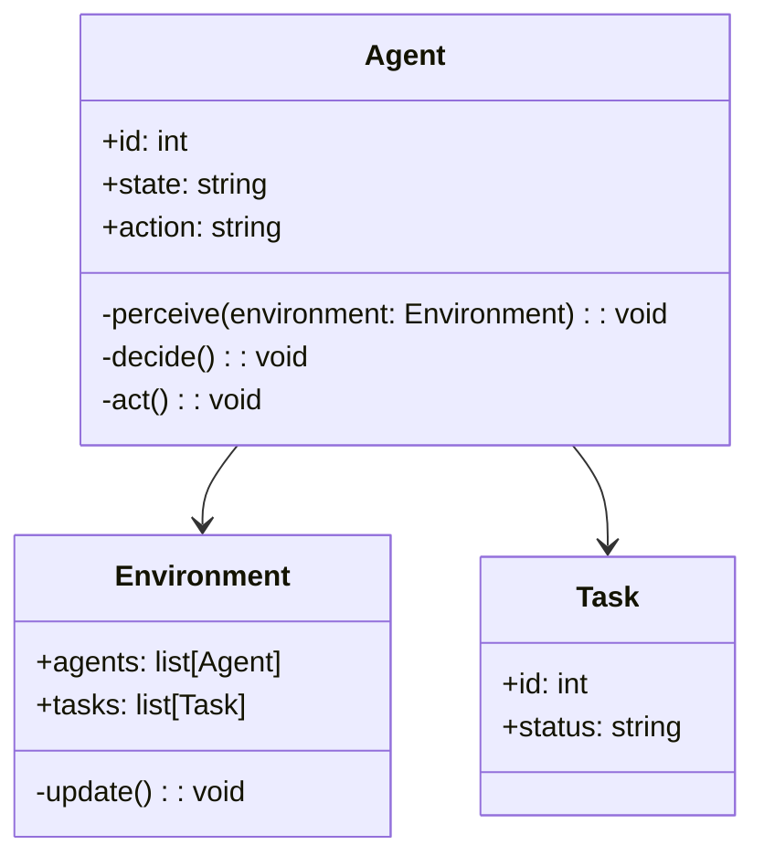
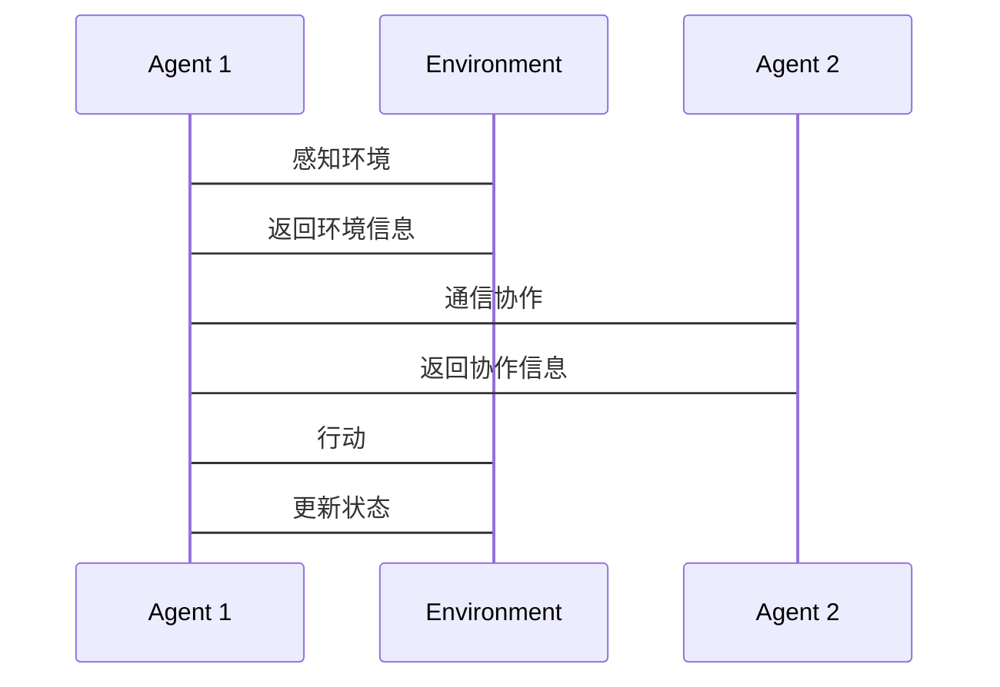

                 


# 构建AI Agent的多Agent协作学习系统

## 关键词：多智能体系统、AI Agent、协作学习、强化学习、机器学习

## 摘要：  
构建AI Agent的多Agent协作学习系统是当前人工智能领域的重要研究方向。本文将从AI Agent的基本概念出发，逐步深入探讨多Agent协作学习系统的算法原理、系统架构设计以及项目实战。通过本文的学习，读者将能够理解并掌握如何设计和实现一个多Agent协作学习系统，为实际应用场景提供理论和实践支持。

---

# 第1章: AI Agent与多Agent协作学习系统概述

## 1.1 AI Agent的基本概念

### 1.1.1 什么是AI Agent  
AI Agent（人工智能代理）是指能够感知环境、自主决策并采取行动的智能实体。它可以是一个软件程序、机器人或其他智能系统，其核心目标是通过与环境交互来实现特定任务。  

### 1.1.2 AI Agent的核心特点  
1. **自主性**：Agent能够在没有外部干预的情况下自主运行。  
2. **反应性**：Agent能够根据环境的变化实时调整行为。  
3. **社会性**：Agent能够与其他Agent或用户进行交互和协作。  
4. **学习性**：Agent能够通过经验改进自身的决策能力。  

### 1.1.3 AI Agent的分类与应用场景  
AI Agent可以分为以下几类：  
1. **简单反射Agent**：基于当前感知做出简单反应，适用于规则明确的场景。  
2. **基于模型的反射Agent**：利用内部状态模型进行决策，适用于复杂环境。  
3. **目标驱动Agent**：以明确的目标为导向，优化行为以实现目标。  
4. **效用驱动Agent**：通过最大化效用函数来优化决策。  

应用场景包括自动驾驶、智能助手、机器人协作、游戏AI等。

---

## 1.2 多Agent协作学习系统的定义

### 1.2.1 多Agent协作学习系统的概念  
多Agent协作学习系统是指多个AI Agent共同协作，通过共享信息和任务分配，共同完成复杂任务的系统。与单个Agent相比，多Agent系统能够更好地应对动态、复杂和不确定的环境。  

### 1.2.2 多Agent协作学习系统的特征  
1. **分布式智能**：系统由多个独立的Agent组成，每个Agent负责特定的任务。  
2. **协作性**：Agent之间通过通信和协作完成共同目标。  
3. **动态性**：系统能够适应环境的变化，动态调整任务分配和协作策略。  
4. **高效性**：通过任务分配和协作，系统整体效率远高于单个Agent。  

### 1.2.3 多Agent协作学习系统的优缺点  
**优点**：  
- 提高系统的整体智能性和灵活性。  
- 通过任务分配和协作，能够处理更复杂的任务。  
- 可扩展性强，适用于大规模应用场景。  

**缺点**：  
- 系统复杂性高，设计和实现难度大。  
- Agent之间的通信和协作需要额外的资源和时间。  
- 协作策略的设计需要考虑多种可能的冲突和不确定性。  

---

## 1.3 多Agent协作学习系统的背景与意义

### 1.3.1 当前AI技术的发展趋势  
随着人工智能技术的快速发展，单个Agent的能力已经难以满足复杂场景的需求。多Agent协作学习系统作为一种分布式智能系统，能够更好地应对现实中的复杂问题。  

### 1.3.2 多Agent协作学习系统的应用前景  
多Agent协作学习系统在多个领域具有广泛的应用潜力，例如：  
- **自动驾驶**：多个车辆协同行驶，避免交通事故。  
- **智能城市**：通过多Agent协作优化交通、能源和资源分配。  
- **机器人协作**：多个机器人共同完成复杂的工业或服务任务。  
- **游戏AI**：多Agent协作完成复杂的游戏任务。  

### 1.3.3 本课题的研究价值与意义  
研究多Agent协作学习系统不仅能够推动人工智能技术的发展，还能够为多个行业提供创新的解决方案。通过研究多Agent协作学习系统的核心算法和系统架构，我们可以更好地理解分布式智能系统的本质，并为实际应用提供理论和技术支持。

---

## 1.4 本章小结  
本章从AI Agent的基本概念出发，介绍了多Agent协作学习系统的定义、核心特点和应用场景。同时，分析了多Agent协作学习系统的优缺点及其研究价值和意义，为后续章节的学习奠定了基础。

---

# 第2章: 多Agent协作学习系统的核心概念与联系

## 2.1 多Agent协作学习系统的核心概念

### 2.1.1 Agent的智能性与协作性  
Agent的智能性体现在其感知、决策和行动能力上。协作性则体现在多个Agent之间的信息共享和任务分配上。  

### 2.1.2 多Agent系统的通信机制  
多Agent系统中的通信机制是实现协作的关键。Agent之间可以通过共享状态、交换消息或协同决策等方式进行通信。  

### 2.1.3 多Agent系统的协调与决策  
协调与决策是多Agent系统的核心，通过任务分配、角色分工和协作策略，确保多个Agent能够共同完成目标。

---

## 2.2 多Agent协作学习系统的ER实体关系图

```mermaid
er
actor: User
actor: Agent
actor: Task
actor: Environment
```

---

## 2.3 多Agent协作学习系统的概念属性特征对比

| 特性         | 描述                                         |
|--------------|--------------------------------------------|
| 智能性       | Agent具备自主决策能力                       |
| 协作性       | 多Agent之间能够协同完成任务                 |
| 分布性       | 系统由多个独立的Agent组成                   |
| 动态性       | 系统环境和任务可能动态变化                   |
| 社会性       | Agent之间需要通过通信和协作完成任务         |

---

## 2.4 本章小结  
本章通过对比和分析多Agent协作学习系统的概念属性，进一步明确了多Agent系统的特征和核心要素，为后续章节的算法设计和系统实现奠定了基础。

---

# 第3章: 多Agent协作学习系统的算法原理

## 3.1 多智能体强化学习算法

### 3.1.1 多智能体强化学习的定义  
多智能体强化学习是指多个智能体在共享或独立的环境中通过强化学习算法进行协作或竞争，以实现共同目标或个体目标的学习方法。

### 3.1.2 多智能体强化学习的核心算法  
多智能体强化学习的核心算法包括：  
1. **纳什均衡算法**：通过纳什均衡实现多Agent之间的策略协调。  
2. **Q-learning算法**：基于Q值的学习方法，适用于多Agent协作场景。  

### 3.1.3 多智能体强化学习的挑战与解决方案  
多智能体强化学习的挑战包括：  
- **策略冲突**：多个Agent之间的策略可能产生冲突。  
- **通信开销**：Agent之间的通信可能增加系统的复杂性和延迟。  

解决方案包括：  
- **分布式强化学习**：通过分布式计算优化多Agent的协作策略。  
- **任务分配算法**：通过任务分配算法减少策略冲突，提高协作效率。  

---

## 3.2 基于纳什均衡的协作学习算法

### 3.2.1 纳什均衡的定义与性质  
纳什均衡是指在多智能体系统中，所有Agent都采取最优策略，使得任何单个Agent单方面改变策略都不会带来收益增加的状态。  

### 3.2.2 纳什均衡在多Agent协作中的应用  
纳什均衡可以用于多Agent协作中的任务分配和策略协调。通过纳什均衡，多个Agent可以在不改变策略的情况下实现协作目标。

### 3.2.3 纳什均衡算法的实现步骤  
1. 初始化：为每个Agent分配初始策略。  
2. 迭代：计算每个Agent的收益，并调整策略以实现纳什均衡。  
3. 终止：当所有Agent的策略达到纳什均衡时，停止迭代。  

---

## 3.3 多Agent协作学习的数学模型

### 3.3.1 多Agent协作学习的基本模型  
$$ V_i(a_i) = \sum_{j \neq i} V_j(a_j) $$  

其中，$V_i(a_i)$ 表示第i个Agent采取策略$a_i$时的总收益，$V_j(a_j)$ 表示其他Agent采取策略$a_j$时的收益。

### 3.3.2 多Agent协作学习的数学公式  
在多Agent协作学习中，多个Agent的收益函数可以表示为：  
$$ R = \sum_{i=1}^{n} R_i(a_i) $$  

其中，$R_i(a_i)$ 表示第i个Agent采取策略$a_i$时的收益，$n$是Agent的数量。

---

## 3.4 本章小结  
本章详细介绍了多Agent协作学习系统的算法原理，包括多智能体强化学习算法和纳什均衡算法。通过数学模型和公式，进一步明确了多Agent协作学习的核心思想和实现方法。

---

## 4. 系统分析与架构设计方案

### 4.1 问题场景介绍  
我们假设一个典型的多Agent协作学习场景：多个AI Agent需要在动态变化的环境中协作完成任务。例如，自动驾驶汽车需要在交通环境中协作行驶。

### 4.2 系统功能设计  
系统功能包括：  
1. Agent感知与决策：通过传感器感知环境，并根据感知结果做出决策。  
2. Agent通信与协作：通过通信机制与其他Agent共享信息并协调任务。  
3. 任务分配与优化：根据环境变化动态调整任务分配策略。  

### 4.3 系统架构设计  
#### 4.3.1 领域模型（mermaid 类图）



#### 4.3.2 系统架构图（mermaid架构图）

```mermaid
archi
    多Agent协作学习系统
    ├── Agent 1
    |   └── 感知环境
    |   └── 决策
    |   └── 行动
    ├── Agent 2
    |   └── 感知环境
    |   └── 决策
    |   └── 行动
    └── 环境
        └── 更新状态
```

#### 4.3.3 系统交互序列图（mermaid序列图）



---

## 5. 项目实战

### 5.1 环境安装  
安装Python和必要的库（如numpy、tensorflow、scikit-learn）。  

### 5.2 系统核心实现源代码  

```python
class Agent:
    def __init__(self, id):
        self.id = id
        self.state = "idle"
        self.action = None

    def perceive(self, environment):
        # 根据环境信息做出决策
        pass

    def decide(self):
        # 根据当前状态做出决策
        pass

    def act(self):
        # 执行动作
        pass

class Environment:
    def __init__(self):
        self.agents = []
        self.tasks = []

    def update(self):
        # 更新环境状态
        pass

# 示例代码
agent1 = Agent(1)
agent1.perceive(environment)
agent1.decide()
agent1.act()
```

### 5.3 代码应用解读与分析  
上述代码定义了Agent和Environment的基本结构，展示了多Agent协作学习系统的核心功能。通过代码实现，我们可以进一步优化协作策略和算法。

### 5.4 实际案例分析  
以自动驾驶为例，多个Agent可以分别负责路径规划、障碍物检测和决策控制。通过协作，系统能够更好地应对复杂的交通环境。

---

## 6. 最佳实践

### 6.1 小结  
通过本章的学习，我们掌握了多Agent协作学习系统的算法原理和系统架构设计方法。

### 6.2 注意事项  
- 确保Agent之间的通信高效可靠。  
- 动态调整任务分配策略以适应环境变化。  
- 定期优化协作算法以提高系统效率。  

### 6.3 拓展阅读  
推荐阅读相关领域的经典论文和书籍，深入了解多Agent协作学习系统的最新研究成果。

---

## 作者：AI天才研究院/AI Genius Institute & 禅与计算机程序设计艺术 /Zen And The Art of Computer Programming

---

以上是《构建AI Agent的多Agent协作学习系统》的完整目录和内容框架，涵盖了从理论到实践的各个方面，适合技术读者深入学习和实践。

